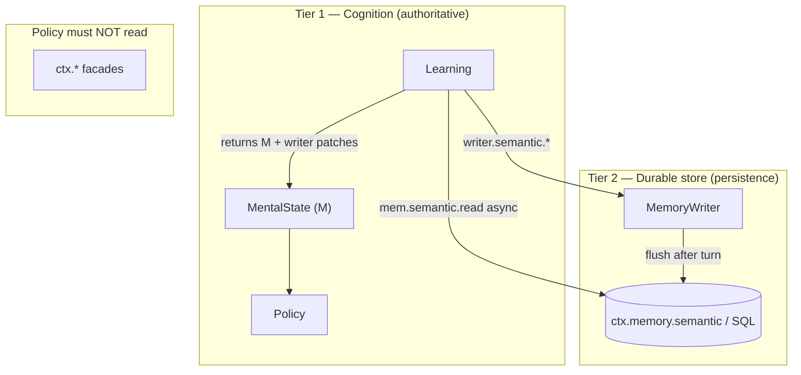
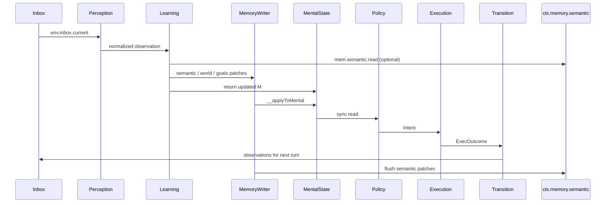

# How-to: Use Memory in APLRET

## Status

Normative reference for memory in APLRET agents.

This document defines **how memory should work** in the framework: what is authoritative,
which module may read or write it, and how in-turn cognition relates to durable storage.

It extends the memory rules in [APLRET contracts](./0-aplret_contracts.md) with concrete
shapes, APIs, and turn lifecycle detail. When this document and older draft guides
disagree, **this document wins**.

**Related:**

- [APLRET contracts](./0-aplret_contracts.md) — module boundaries and placement table
- [How-to: Use artifacts correctly](./7-how_to_use_artifacts_correctly_aplret.md) — large payloads
- [Migration: `ctx.semantic` → `ctx.memory.semantic`](./migration/done/2.6-ctx-memory-semantic-migration.md)
- [Migration: remove `ctx.vars` / read-only `ctx.world`](./migration/done/3.3.1-remove-memory-vars-migration.md)

Canonical TypeScript shapes live in:

- `packages/core/src/loop/types.ts` — `MentalState`, `MemoryReader`, `MemoryWriter`
- `packages/types/src/IMemory.ts` — durable store (`ctx.memory`)

---

## Purpose

Memory in APLRET serves two distinct jobs that must not be confused:

| Job | What it is | Who reads | Who writes |
| --- | --- | --- | --- |
| **Cognition** | The agent's current mind for this session | Policy (sync), other modules via `M` | Learning only |
| **Durable store** | Cross-turn / cross-session persistence (e.g. SQL) | Learning (async reads), Execution (action-only loads) | Learning via `MemoryWriter` flush |

Policy never reads the durable store directly. Policy reads **`MentalState` (`M`) only**.

---

## Core principles

1. **Single cognitive truth** — `MentalState` is authoritative for decisions.
2. **Single writer** — Only the Learning module updates `MentalState`.
3. **Inbox-only perception** — Perception does not write memory.
4. **Sync M-only Policy** — Policy does not read `ctx`, `env`, or the durable store.
5. **Effect → cognition path** — Execution outcomes become observations; Learning applies them next turn.
6. **No second truth in `ctx.*`** — Runtime helpers must not hold beliefs Policy should depend on.
7. **Compact cognition, durable facts** — Store summaries and derived facts in `M`; offload blobs to artifacts.

---

## Two tiers (do not mix them mentally)



### Tier 1 — `MentalState` (cognition)

Serialized in the session snapshot as `snapshot.M`. This is what Policy reads.

Learning updates it by:

- returning a new `MentalState` object (immutable update), and/or
- recording patches on `MemoryWriter`, which the runtime merges into `M` before Policy runs.

### Tier 2 — `ctx.memory` (durable store)

Async key–value and query storage (typically PostgreSQL via `@a2arium/callagent-memory-sql`).

Learning reaches it only through:

- **`MemoryReader`** — read durable facts while updating cognition (e.g. hydrate `M.memory.longTerm.semantic.concepts`).
- **`MemoryWriter`** — queue semantic upserts/deletes; the runtime **flushes** them to `ctx.memory.semantic` after the turn.

Execution may read the durable store only when data is needed **to act**, not to decide. If the
data changes what the agent *knows*, Learning must derive facts into `M` first.

---

## Canonical `MentalState` shape

The normative runtime shape (from `packages/core/src/loop/types.ts`):

```ts
type MentalState<Sensory = unknown> = {
  memory: {
    sensory: Sensory;
    thoughts?: ThoughtEntry[];
    decisions?: Record<string, DecisionEntry>;
    scratch?: unknown;
    window?: unknown;
    conversation?: ConversationProjection;
    longTerm: {
      episodic: EpisodicEvent[];
      semantic: { concepts: SemanticConcept[] };
      procedural: { skills: Skill[] };
    };
  };
  worldModel: WorldModel;
  goalState: { hierarchy: GoalHierarchy };
  plans?: PlanState;
  emotion: { valence: number; arousal: number; label?: string };
  rewardParams: { /* ... */ };
  policyParams: { /* ... */ };
};
```

Key points:

- **`memory.longTerm.semantic`** is an in-snapshot cache of reason-ready concepts (`{ id, data, tags?, ... }[]`), not the full database.
- **`goalState.hierarchy`** is the authoritative goal tree (`nodes` + `roots`), not a separate `ctx.goals` store.
- **`worldModel`** holds stable beliefs and task context used for decisions.
- **`memory.sensory`** holds the latest normalized facts Policy needs synchronously (e.g. last user message summary).
- **`scratch` / `window`** are short-lived Learning-owned staging areas.

> **Note:** The abbreviated pseudotype in [APLRET contracts](./0-aplret_contracts.md) is intentionally simplified. Implementations and tests must follow `loop/types.ts`.

---

## Where to put data

| Concern | Canonical location | Access in loop |
| --- | --- | --- |
| Latest validated user message | `memory.sensory` | Policy reads `M` |
| Latest compact tool / child summary | `memory.sensory` or `memory.window` | Policy reads `M` |
| Stable task / user facts | `worldModel` or `memory.longTerm.semantic.concepts` | Policy reads `M` |
| Active goals | `goalState.hierarchy` | Policy reads `M` |
| Active plans | `plans` | Policy reads `M` |
| Plan draft before validation | `memory.window` | Policy reads `M` |
| Intermediate extraction notes | `memory.scratch` | Policy reads `M` |
| Turn / audit history | `memory.longTerm.episodic` | Policy reads `M`; persisted in snapshot |
| Durable facts across sessions | Durable store + mirrored concepts in `M` | Learning reads store, writes `M` + `writer` |
| Durable skills / playbooks | `memory.longTerm.procedural` | Policy reads `M` |
| Pending tokens / await flags | `env.pending` / `env.control` | Not cognition |
| Large HTML / JSON / images | Artifact handle + compact derived facts in `M` | See [artifacts how-to](./7-how_to_use_artifacts_correctly_aplret.md) |
| Orchestration stage | Stage facade / control state | Not cognition |

### Anti-patterns

Do **not**:

- store pending tokens or `await_*` flags in `MentalState`
- duplicate the same fact in control state and cognition
- store unbounded chat history inline without summarization
- store raw transport wrappers when a normalized summary suffices
- call `ctx.memory.semantic.add` from Execution to change what Policy should know
- read `ctx.goals` or `ctx.decisions` in Policy (Policy reads `M` only)
- use `ctx.semantic` (removed; see [deprecated surfaces](#deprecated-and-non-canonical-surfaces))

---

## Loop module contracts

### Learning (the only writer)

```ts
learning(
  prevM: MentalState,
  prevAction: Intent | undefined,
  observation: Obs,
  mem: MemoryReader,
  writer: MemoryWriter,
  rPrev?: number
) => MentalState | Promise<MentalState>
```

Rules:

- Return a **new** `MentalState` (or equivalent immutable update).
- Use **`mem`** for async durable reads needed to build cognition (e.g. load user prefs from SQL into `M`).
- Use **`writer`** for durable semantic writes and for explicit `worldModel` / goal / plan patches the runtime should flush or merge.
- May `await` artifacts when content changes beliefs (see [artifacts how-to](./7-how_to_use_artifacts_correctly_aplret.md)).
- **No other external side effects** (no direct `ctx.memory` calls from Learning module code).

Prefer **reducer-style** updates (`reducers.ts`) over long imperative chains.

#### Example — sensory update + durable fact

```ts
export function learning(
  prev: MentalState<Sensory>,
  _prevAction: Intent | undefined,
  obs: Obs,
  mem: MemoryReader,
  writer: MemoryWriter
): MentalState<Sensory> {
  if (obs.kind === 'idle') return prev;

  const next: MentalState<Sensory> = {
    ...prev,
    memory: {
      ...prev.memory,
      sensory: { ...prev.memory.sensory, latestUserText: obs.text },
    },
  };

  if (obs.kind === 'preference_stated') {
    const concept = { id: `user:prefs`, data: obs.prefs, tags: ['prefs'] };
    const concepts = [...prev.memory.longTerm.semantic.concepts];
    const idx = concepts.findIndex(c => c.id === concept.id);
    if (idx >= 0) concepts[idx] = concept;
    else concepts.push(concept);
    next.memory.longTerm.semantic = { concepts };
    writer.semantic.add(concept);
  }

  return next;
}
```

After Learning, the runtime calls `writer.__applyToMental(next)` so Policy sees semantic concept updates in the same turn. After the turn completes, semantic patches flush to `ctx.memory.semantic`.

### Policy (read-only cognition)

```ts
policy(m: MentalState, mem: MemoryReader) => Intent
```

Policy reads **`m` only** in the recommended pattern (selectors / `readPolicyView(m)`). It must not depend on `ctx.*` or async store reads.

### Transition + Perception

Neither module writes `MentalState`. Transition emits observations; Perception normalizes inbox observations.

---

## `MemoryReader` and `MemoryWriter`

Defined in `packages/core/src/loop/types.ts`.

### `MemoryReader` (all modules may receive it; Learning uses it most)

| Namespace | Purpose |
| --- | --- |
| `mem.semantic.read` / `get` | Load durable concepts into cognition |
| `mem.episodic.range` | Load episodic history |
| `mem.procedural.list` | Load skills |
| `mem.world.get` | Read `worldModel` via async facade |
| `mem.goals.get` | Read goal hierarchy |
| `mem.plans.get` | Read plan state |

Reads from `mem.semantic` prefer the durable store when `ctx.memory` is initialized; otherwise they fall back to `M.memory.longTerm.semantic.concepts`.

### `MemoryWriter` (Learning only)

| Namespace | In-turn effect | Durable persistence |
| --- | --- | --- |
| `writer.semantic.add` / `delete` | Merged into `M` before Policy | Flushed to `ctx.memory.semantic` after turn |
| `writer.episodic.append` | Merged into `M` | Snapshot (`M`) |
| `writer.world.set` | Sets `worldModel` | Snapshot |
| `writer.goals.set` / `add` / `update` / `remove` | Updates `goalState.hierarchy` | Snapshot |
| `writer.plans.*` | Updates `plans` | Snapshot |
| `writer.procedural.set` | Updates procedural memory | Snapshot |
| `writer.policy.setParams` / `writer.reward.setParams` | Updates params | Snapshot |

**Rule:** If a fact must influence Policy in the **same turn**, write it to `M` (directly or via `writer` + `__applyToMental`). Do not rely on post-turn DB flush alone.

---

## Turn lifecycle



---

## Durable store (`ctx.memory`)

`TaskContext.memory` implements `IMemory` (`packages/types/src/IMemory.ts`).

### Agent-facing API (canonical)

Use **`ctx.memory.semantic`** — not `ctx.semantic`:

| Operation | API |
| --- | --- |
| Add / upsert | `await ctx.memory.semantic.add({ id, value, tags?, entities? })` |
| Read by id / filter | `await ctx.memory.semantic.readItems({ id?, tag?, tags?, filters?, limit? })` |
| Remove one key | `await ctx.memory.semantic.removeItem(id)` |
| Remove a query safely | `await ctx.memory.semantic.removeItems({ tag?, tags?, filters?, limit? })` |
| Low-level get/set | `get` / `set` / `delete` / `read` (adapter-level; prefer high-level API in agents) |
| Optional atomic update | `getAtomic({ backend })` → `getVersioned` / `compareAndSet` |

Advanced: `recognize`, `enrich`, entity alignment — optional SQL adapter features.

Tag queries use all-of semantics: every normalized value from `tag` and `tags` must be stored on the row. `tag` is compatibility sugar for one requirement, so `{ tag: 'ready', tags: ['site:42'] }` requires both tags. Tags are trimmed, lowercased, de-duplicated, and evaluated in the backend before ordering and limit. SQL collection results include the complete stored tag set.

Limits are finite integers from 0 through 10,000 and default to 1,000. A query accepts at most 64 raw tag inputs, 32 distinct normalized requirements, and 256 UTF-8 bytes per normalized tag. Deterministic reads default to `updatedAt DESC, key ASC`; use `random` only for sampling, never worker sweeps.

Use tag queries for candidate discovery, then parse and validate the stored value and CAS-claim it before an external action. Tags are secondary indexes, not authoritative workflow state. `removeItems` is the only predicate-rechecked, counted removal API for tag and JSON predicates. Entity-alignment predicates remain discovery-only and fail strict-removal capability preflight. The object and JavaScript-predicate overloads of `removeItem` remain deprecated compatibility paths and are not safe for claims, leases, or lifecycle transitions.

### Who may call `ctx.memory` directly

| Caller | Allowed when |
| --- | --- |
| **Learning** (via `MemoryReader` / `MemoryWriter` only) | Always — this is the canonical path |
| **Execution** | Loading data to perform an action, not to decide |
| **Handlers / tools outside the loop** | Library consumer pattern; must not bypass Learning for cognitive facts |
| **Policy** | **Never** |

### Bootstrap

Every task context that needs durable memory should be initialized with:

1. A SQL semantic adapter (`@a2arium/callagent-memory-sql` or equivalent).
2. `ctx.memory` with `backends.sql` registered (alongside any optional MLO backend).
3. `recall` / `remember` only if you explicitly need legacy MLO helpers (see [deprecated surfaces](#deprecated-and-non-canonical-surfaces)).

Top-level agents started via the streaming runner and child agents started via `ctx.sendTaskToAgent` should both end up with the same durable write capability.

### Agent-to-agent (child) durable writes

A child invoked through `ctx.sendTaskToAgent` gets its own `TaskContext`. Writes from that child reach `agent_memory_store` only when `ctx.memory.semantic.backends.sql` is present.

**Writing from child Execution** (action-only loads and durable side effects — not for Policy):

```ts
// Explicit SQL backend (registry default is often `mlo`)
await ctx.memory.semantic.set(key, record, { tags, backend: 'sql' });

// High-level API — routes to SQL when `backends.sql` exists
await ctx.memory.semantic.add({ id: key, value: record, tags });
```

Do not assume the default semantic backend is SQL. Use `backend: 'sql'` on low-level `set`/`get`, or use `add`.

### Atomic single-key updates (optional CAS)

Use compare-and-set (CAS) when multiple workers may replace the same durable semantic pointer. Discover the capability on the exact backend you intend to use:

```ts
const atomic = ctx.memory.semantic.getAtomic?.({ backend: 'sql' });
if (!atomic) {
    throw new Error('The SQL semantic backend does not support atomic writes');
}

const current = await atomic.getVersioned<{ activeBundleId: string }>('site:active');
const result = await atomic.compareAndSet(
    {
        key: 'site:active',
        expectedVersion: current?.version ?? null,
        value: { activeBundleId: 'bundle-8' },
    },
    { tags: ['site-config', 'active'] }
);

if (result.status === 'conflict') {
    // Re-read and decide whether to retry. The memory layer never retries for you.
}
```

Rules:

- `expectedVersion: null` means create only when the key is absent.
- Versions are opaque, non-contiguous decimal strings. Compare or return them; never parse, increment, or order them.
- `currentVersion` on a conflict is diagnostic and may already be stale by the time the caller receives it.
- Never fall back to `get` followed by `set`; that sequence is not atomic.
- CAS v1 supports exact JSON-domain values and tags: plain objects, dense arrays, finite numbers, strings, booleans, and `null`. Values such as `undefined`, `NaN`, functions, dates, class instances, and sparse arrays are rejected rather than silently transformed. Blob-backed values and entity-alignment options throw typed `SemanticAtomicError` codes.
- A pre-CAS facade may omit `getAtomic`; an unsupported selected backend returns `undefined` from it. Existing semantic APIs remain unconditional and unchanged.
- Direct async memory access remains forbidden in Policy. Use CAS from Execution or handlers/tools outside the loop when performing the durable side effect.

**Saving after an MCP or async tool**

Execution may call `ctx.requestTool` in two ways. Choose explicitly:

| Pattern | When to persist | Usage |
| --- | --- | --- |
| **Same turn (inline)** | Right after the tool returns, in the same `execution` call | `const result = await ctx.requestTool('mcp:server.tool', args, { awaitCompletion: true });` then `ctx.memory.semantic.set(...)` |
| **Next loop turn** | After the inbox contains `tool.completed` | Turn 1: dispatch with `requestTool` (no `awaitCompletion`). Turn 2: read the tool result from the perception/inbox observation, then persist in `execution` or Learning |

With the **next-loop** pattern, do not call persist logic immediately after turn-1 `requestTool` — that call returns before the tool finishes. The child task resumes after `await_tool`; use the same `ctx` (including memory) on the follow-up turn.

Example — inline save:

```ts
const result = await ctx.requestTool(
  'mcp:browser-use.navigate_and_extract',
  args,
  { awaitCompletion: true }
);
await ctx.memory.semantic.set(tipKey, toTipRecord(result), { tags, backend: 'sql' });
```

Example — next-turn save (sketch):

```ts
// Turn 1 — execution: dispatch only
await ctx.requestTool('mcp:browser-use.navigate_and_extract', args);

// Turn 2 — execution: observation carries tool.completed; read payload, then set
const mcpResult = /* from observation / inbox in this turn */;
await ctx.memory.semantic.set(tipKey, toTipRecord(mcpResult), { tags, backend: 'sql' });
```

---

## `ctx.*` runtime helpers

`ctx.*` namespaces exist for ergonomics and I/O. They must **not** become a second cognitive truth.

### `ctx.world` — read-only

```ts
const wm = ctx.world.read(); // frozen deep copy of M.worldModel
```

No `update` or `patch`. Learning writes `worldModel` via returned `M` or `writer.world.set`.

### `ctx.thoughts` — telemetry

Append-only trace material. Exportable in TurnTrace. **Not authoritative** for Policy.

If thoughts matter for decisions, Learning must copy the relevant summary into `M` (e.g. `memory.scratch` or `worldModel`).

### `ctx.goals` and `ctx.decisions` — not authoritative

**Normative rule:** These helpers must **not** directly mutate `MentalState`.

Allowed pattern:

1. Helper emits an **internal observation** (`internal/goal.updated`, `internal/decision.recorded`).
2. Transition places it on the inbox.
3. Learning applies it to `goalState` / `worldModel` / `memory.decisions` next turn.

Policy reads goals from **`m.goalState.hierarchy`**, not from `ctx.goals.read()`.

### `ctx.M` — read-only view

During a turn, `ctx.M` may expose the post-Learning mental state for Execution and handlers. Do not mutate it.

---

## Episodic vs semantic vs worldModel

| Store | Lifetime | Typical content | Persistence |
| --- | --- | --- | --- |
| **Episodic** | Session history | Turn summaries, `{ t, obs, act, out? }` | Snapshot |
| **Semantic (in M)** | Reason-ready cache | User prefs, entities, validated facts | Snapshot + optional DB mirror |
| **Semantic (DB)** | Cross-session | Full fact store, queryable | PostgreSQL |
| **worldModel** | Current beliefs | Task context, structured state | Snapshot |

**When to use `worldModel` vs semantic concepts:**

- **`worldModel`** — structured beliefs Policy reads every turn (task state, slot filling, derived context).
- **`memory.longTerm.semantic.concepts`** — deduplicated facts with ids/tags, especially when mirrored from DB or shared across modules.

Avoid storing the same fact in both without a clear owner.

---

## Artifacts and memory

Large payloads never go inline in `MentalState`. Pattern:

1. Observation carries an artifact handle.
2. Learning awaits the artifact if beliefs change.
3. Learning stores **derived facts** in `M` and optionally a **handle** reference.
4. Execution awaits the artifact only when needed to act.

Full guide: [How-to: Use artifacts correctly](./7-how_to_use_artifacts_correctly_aplret.md).

---

## Deprecated and non-canonical surfaces

Do not use these in new agents:

| Surface | Status | Use instead |
| --- | --- | --- |
| `ctx.semantic` | **Removed** from `TaskContext` type; may still be attached at runtime | `ctx.memory.semantic.add` / `readItems` / `removeItem` |
| `ctx.vars` / `memory.vars` | **Removed** (v3.3.1) | `worldModel`, `memory.scratch`, stage facade, `env.control` |
| `ctx.world.update` / `patch` | **Removed** (v3.3.1) | Learning + `writer.world.set` |
| `ctx.episodic.add` mutating `__mental` | **Non-canonical** | Learning + `writer.episodic.append` |
| `ctx.goals` / `ctx.decisions` writing WM SQL directly | **Non-canonical** | Internal observations → Learning → `M` |
| `ctx.recall` / `ctx.remember` (MLO) | **Legacy convenience** | `MemoryReader` / `MemoryWriter` + `ctx.memory.semantic` in loop agents |
| `ctx.cognitive.*` | **Placeholder** | Loop modules + `M` |
| MLO as default semantic backend | **Legacy** | Prefer SQL via `ctx.memory.semantic` with `backend: 'sql'` when persisting to `agent_memory_store` |

---

## Testing memory behavior

1. **Policy purity** — Policy tests use fixed `M` fixtures; no `ctx`, no async store.
2. **Learning reducers** — Unit-test observation → `M` transitions and `writer` patches.
3. **Flush** — Integration tests assert `writer.semantic.add` persists to `ctx.memory.semantic` after turn.
4. **Snapshot round-trip** — Episodic / goals / plans survive save/load via `snapshot.M`.
5. **Selectors** — Policy reads views derived from `M`, not raw nested paths scattered in Policy.
6. **Atomic writes** — Real-PostgreSQL tests race independent adapters, test create-only contention, and prove ordinary writes plus delete/recreate invalidate stale CAS tokens.

See [How-to: Test APLRET agents](./11-how_to_test_aplret_agents.md).

---

## Quick reference card

```
READ for decisions:     m.goalState, m.plans, m.worldModel, m.memory.*
WRITE cognition:        Learning module only
Durable semantic write: writer.semantic → flush → ctx.memory.semantic
Durable semantic read:  mem.semantic (Learning)
Atomic durable update:  ctx.memory.semantic.getAtomic?.({ backend: 'sql' })
Policy:                 sync, M only, no ctx, no DB
Large payloads:         artifacts → Learning derives facts → M
Deprecated:             ctx.semantic, ctx.vars, ctx.world.patch
```
