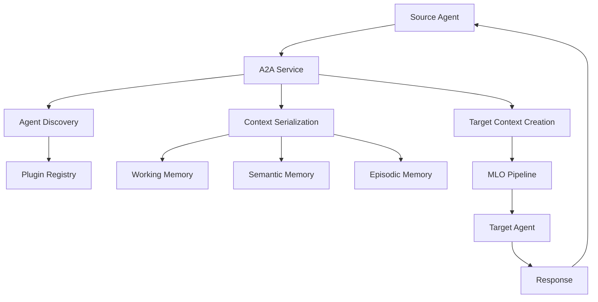

# A2A (Agent-to-Agent) Communication Architecture

## Overview

The A2A (Agent-to-Agent) communication system enables local agents to invoke other agents while preserving memory context and maintaining tenant isolation. This system is designed to be compliant with Google's A2A protocol specification and integrates seamlessly with the MLO (Memory Lifecycle Orchestrator) pipeline.

## Architecture Diagram



## Core Components

### A2A Service
**Location**: `packages/core/src/core/orchestration/A2AService.ts`

The central orchestrator for agent-to-agent communication. Handles:
- Agent discovery and validation
- Context serialization and transfer
- Target agent execution
- Error handling and recovery

### Context Serializer
**Location**: `packages/core/src/core/orchestration/ContextSerializer.ts`

Responsible for packaging and unpacking agent context:
- Working memory state (goals, thoughts, decisions, variables)
- Semantic memory context
- Episodic memory events
- Tenant and security context

### Agent Registry
**Location**: `packages/core/src/core/plugin/AgentRegistry.ts`

Manages agent discovery and registration:
- Exact name matching
- Alias resolution
- Fuzzy name matching
- Agent metadata management

## Memory Context Transfer

### Working Memory Transfer

When `inheritWorkingMemory: true` is specified:

```typescript
// Source agent context is serialized
const serializedContext = {
  workingMemory: {
    goal: await sourceCtx.getGoal(),
    thoughts: await sourceCtx.getThoughts(),
    decisions: await sourceCtx.getAllDecisions(),
    variables: { ...sourceCtx.vars }
  }
};

// Target agent receives the context
await targetCtx.setGoal(serializedContext.workingMemory.goal);
for (const thought of serializedContext.workingMemory.thoughts) {
  await targetCtx.addThought(thought.content);
}
```

### Long-Term Memory Transfer

When `inheritMemory: true` is specified, relevant memory is extracted (e.g., via `ctx.recall()`) and serialized. The `SerializedMemoryContext` uses a `memorySnapshot` field which is an array of `RecalledMemoryItem` objects. Each `RecalledMemoryItem` preserves the ID, type, data, and metadata of a recalled memory.

```typescript
// Example of RecalledMemoryItem structure
type RecalledMemoryItem = {
  id: string;
  type: 'semantic' | 'episodic' | string;
  data: unknown;
  metadata?: Record<string, unknown>;
};

// Source agent context's relevant memories are serialized into this structure
const serializedContext = {
  memoryContext: {
    memorySnapshot: [
      { id: 'fact1', type: 'semantic', data: { info: 'details' }, metadata: { score: 0.9 }},
      { id: 'eventA', type: 'episodic', data: { action: 'interacted' }}
    ]
  }
};

// Target agent receives the context and can restore memories
// For example, during deserialization:
if (serializedContext.memoryContext) {
  for (const item of serializedContext.memoryContext.memorySnapshot) {
    await targetCtx.remember(item.id, item.data, { 
      type: item.type, 
      // other options from item.metadata if applicable
    });
  }
}
```
This ensures that the structure and type of individual memory items are preserved during transfer, allowing for more accurate rehydration in the target agent's memory.

## Integration with MLO Pipeline

All memory operations in A2A communication flow through the existing MLO pipeline:

1. **Acquisition**: Context data is filtered and validated
2. **Encoding**: Memory context is processed for optimal transfer
3. **Derivation**: Insights are extracted and preserved
4. **Retrieval**: Relevant context is identified for transfer
5. **Neural Memory**: Associative patterns are maintained
6. **Utilization**: Context is optimized for target agent consumption

## Security and Isolation

### Tenant Isolation
- Each A2A call preserves tenant boundaries
- Memory context is filtered by tenant
- Target agent operates in the same tenant scope
- Cross-tenant communication is prevented

### Agent Isolation
- Each agent maintains its own working memory scope
- Agent-specific memory is not transferred unless explicitly requested
- Target agents cannot access source agent's private state

## Performance Characteristics

- **Agent Discovery**: ~1-5ms for local agents
- **Context Serialization**: ~10-50ms depending on context size
- **Memory Transfer**: ~20-100ms for typical working memory
- **Agent Execution**: Depends on target agent complexity
- **Total Overhead**: ~50-200ms for typical A2A calls

## Error Handling

### Agent Not Found
```typescript
throw new Error(`Agent '${targetAgent}' not found`);
```

### Context Serialization Failure
```typescript
throw new Error('Failed to serialize context: ${error.message}');
```

### Target Agent Execution Error
```typescript
// Original error is preserved and re-thrown
throw error;
```

### Timeout Handling
```typescript
// Future: Will support configurable timeouts
const result = await ctx.sendTaskToAgent('target', input, {
  timeout: 30000 // 30 seconds
});
```

## Future Enhancements

### Phase 2: External A2A Communication
- HTTP-based agent communication
- A2A protocol compliance for external agents
- Agent discovery via `.well-known/agent.json`

### Phase 3: Interactive Communication
- Streaming progress updates
- Input-required scenarios
- Real-time collaboration

### Phase 4: Advanced Features
- Agent chaining and workflows
- Parallel agent execution
- Resource management and quotas 