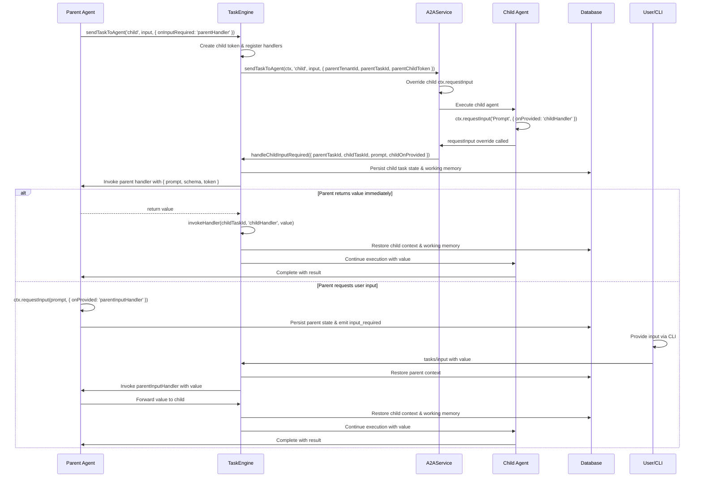

# Child Input_Required Flow and Persistence

## Overview

The child input_required flow enables child agents to request input from users through their parent agents while maintaining proper context correlation and database persistence. This document covers the technical implementation details, database persistence patterns, and troubleshooting guidance.

## Flow Architecture



## Database Persistence Patterns

### Working Memory Persistence

When an agent calls `requestInput`, the framework automatically persists:

1. **Working Memory State**:
   - Current goals (`ctx.goals.read()`)
   - Thought chain (recorded via `ctx.thoughts.add`)
   - Decision history (`ctx.decisions.read()`)
   - Working variables (`ctx.vars`)

2. **LLM Conversation State**:
   - Complete message history
   - System prompts and context
   - Model parameters and settings

3. **Task Context**:
   - Task ID and session information
   - Tenant isolation context
   - Handler registration mappings

### Context Restoration Process

When resuming from `tasks/input`:

```typescript
// 1. Load persisted working memory
const workingMemory = await workingMemoryStore.get(taskId);
await ctx.goals.add({ title: workingMemory.goal });
for (const thought of workingMemory.thoughts) {
    await ctx.thoughts.add(thought.content);
}

// 2. Restore LLM conversation state
const llmState = await conversationStore.get(taskId);
ctx.llm.restoreMessages(llmState.messages);

// 3. Restore working variables
ctx.vars = { ...workingMemory.variables };

// 4. Invoke the appropriate handler
await handlerRegistry.invokeHandler(taskId, handlerName, inputValue);
```

## Parent-Child Correlation

### Token-Based Correlation

The TaskEngine uses a token-based system to correlate parent and child contexts:

```typescript
// Parent creates child token during sendTaskToAgent
const token = crypto.randomUUID();
handlerRegistry.register(token, {
    onInputRequired: 'parentHandler',
    onCompleted: 'parentCompletedHandler'
});

// A2A Service passes parent context to child
await globalA2AService.sendTaskToAgent(ctx, targetAgent, input, {
    parentTenantId: ctx.tenantId,
    parentTaskId: ctx.task.id,
    parentChildToken: token
});
```

### Handler Registration and Invocation

```typescript
// A2A Service overrides child requestInput to capture onProvided
(targetCtx as any).requestInput = async (prompt: string, riOpts?: { onProvided?: string }) => {
    const childOnProvided = riOpts?.onProvided;
    const childTaskId = targetCtx.task.id;
    
    // Store for post-turn routing
    (targetCtx as any).__inputRequired = { 
        prompt, 
        schema: riOpts?.schema, 
        childOnProvided, 
        childTaskId 
    };
    
    // Immediate routing to parent
    await eng.handleChildInputRequired({
        tenantId: parentTenantId,
        parentTaskId,
        childToken: parentChildToken,
        childTaskId,
        prompt,
        schema: riOpts?.schema,
        childOnProvided
    });
};
```

## Implementation Details

### A2AService Child Input Override

The A2AService overrides the child agent's `requestInput` method to:

1. **Capture child handler information**: Store `onProvided` handler name and `childTaskId`
2. **Route to parent immediately**: Call `handleChildInputRequired` with parent correlation info
3. **Persist for post-turn routing**: Store in `__inputRequired` for later retrieval

```typescript
// Key fix: Ensure parent context is available in durable handler context
try {
    (ctx as any).sendTaskToAgent = async (targetAgent: string, taskInput: unknown, options?: SendTaskToAgentOptions) => {
        // Use the full TaskEngine implementation with proper token correlation
        return this.sendTaskToAgent(ctx as any, targetAgent, taskInput, options);
    };
} catch { /* noop */ }
```

### Replies vs Returns in Parent–Child Flows

- **Replies (`ctx.reply`)**: Child emits user-facing output as Artifacts. These are mirrored to the parent task stream (prefixed with child agent name) and visible to the user. They are not passed into parent handler parameters.
- **Returns (`return value`)**: Child provides structured results back to the parent. Delivered as the blocking call result or to the parent's `onCompleted` handler.

### TaskEngine Handler Invocation

The TaskEngine's `handleChildInputRequired` method:

1. **Finds parent handler**: Uses `parentChildToken` to lookup registered `onInputRequired` handler
2. **Invokes parent handler**: Passes child's prompt, schema, and token to parent
3. **Handles parent response**: If parent returns a value, immediately invokes child's `onProvided` handler
4. **Manages persistence**: Ensures child context is properly restored when needed

```typescript
async handleChildInputRequired(params: {
    tenantId: string;
    parentTaskId: string;
    childToken: string;
    childTaskId: string;
    prompt: string;
    schema?: unknown;
    childOnProvided?: string;
}) {
    // Find and invoke parent handler
    const parentHandler = this.handlerRegistry.getHandler(params.childToken, 'onInputRequired');
    const parentResult = await this.invokeHandler(params.parentTaskId, parentHandler, {
        prompt: params.prompt,
        schema: params.schema,
        token: params.childToken
    });
    
    // If parent returns a value, forward to child immediately
    if (parentResult !== undefined && params.childOnProvided) {
        await this.invokeHandler(params.childTaskId, params.childOnProvided, parentResult);
    }
}
```

## Common Issues and Troubleshooting

### Issue: Child onProvided Handler Not Invoked

**Symptoms**:
- Child agent calls `requestInput` 
- Parent handler is invoked
- Parent returns a value
- Child `onProvided` handler never executes

**Root Cause**: Missing parent context correlation in durable handler context

**Fix**: Ensure `sendTaskToAgent` in durable handler context uses the full TaskEngine implementation:

```typescript
// ❌ Wrong: Direct A2A call without token correlation
(ctx as any).sendTaskToAgent = async (targetAgent, taskInput, options) => {
    return globalA2AService.sendTaskToAgent(ctx, targetAgent, taskInput, options);
};

// ✅ Correct: Use TaskEngine implementation with token correlation
(ctx as any).sendTaskToAgent = async (targetAgent, taskInput, options) => {
    return this.sendTaskToAgent(ctx, targetAgent, taskInput, options);
};
```

### Issue: Parent Handler Not Found

**Symptoms**:
- Child calls `requestInput`
- Error: "Handler 'onInputRequired' not found for token"

**Root Cause**: Handler registration happens in main TaskEngine flow but durable context bypasses it

**Fix**: Ensure handler registration occurs before A2A dispatch:

```typescript
// Create child token and register handlers
const token = crypto.randomUUID();
this.handlerRegistry.register(token, {
    onInputRequired: options?.onInputRequired,
    onCompleted: options?.onCompleted,
    onFailed: options?.onFailed
});

// Pass token to A2A service
await globalA2AService.sendTaskToAgent(ctx, targetAgent, taskInput, {
    ...options,
    parentChildToken: token
});
```

### Issue: Context Not Restored Properly

**Symptoms**:
- Handler executes but `ctx.vars`, `ctx.goals.read()`, or LLM state is missing
- "Working memory not available" errors

**Root Cause**: Working memory not persisted or restored correctly

**Fix**: Ensure working memory is extended before handler invocation:

```typescript
// Before invoking handler, restore working memory
const restoredCtx = await this.extendContextWithWorkingMemory(ctx, taskId);
const restoredCtxWithMemory = await this.extendContextWithMemory(restoredCtx, tenantId);

// Then invoke handler with full context
return await handlerFn(restoredCtxWithMemory, eventData);
```

## Best Practices

### 1. Always Use Options-Based Handlers

```typescript
// ✅ Good: Use options for handler registration
await ctx.sendTaskToAgent('analyzer', input, {
    onInputRequired: 'onAnalyzerNeedsInput',
    onCompleted: 'onAnalyzerDone'
});

// ❌ Avoid: Manual handler management
const task = await ctx.sendTaskToAgent('analyzer', input, { streaming: true });
task.onInputRequired((prompt) => { /* manual handling */ });
```

### 2. Provide Meaningful Handler Names

```typescript
// ✅ Good: Descriptive handler names
await ctx.sendTaskToAgent('data-analyzer', input, {
    onInputRequired: 'onAnalyzerNeedsThreshold',
    onCompleted: 'onAnalysisComplete'
});

// ❌ Avoid: Generic handler names
await ctx.sendTaskToAgent('data-analyzer', input, {
    onInputRequired: 'onInput',
    onCompleted: 'onDone'
});
```

### 3. Handle Both Immediate and Deferred Input Scenarios

```typescript
export async function onAnalyzerNeedsInput(ctx: Ctx, ev: { prompt: string; schema?: unknown; token: string }) {
    // Check if we can provide the value immediately
    const threshold = ctx.vars.get('defaultThreshold');
    if (threshold !== undefined) {
        return threshold; // Child onProvided will be called immediately
    }
    
    // Otherwise, request user input
    await ctx.requestInput(ev.prompt, { 
        schema: ev.schema, 
        onProvided: 'onThresholdProvided' 
    });
    // Parent exits; user input will resume via tasks/input
}
```

### 4. Use Proper Error Handling

```typescript
export async function onAnalyzerNeedsInput(ctx: Ctx, ev: { prompt: string; token: string }) {
    try {
        // Attempt to get cached value
        const cached = await (ctx as any).semantic?.read?.({}); // facade read
        const cachedValue = Array.isArray(cached) ? cached.find((x: any) => x?.id === 'analyzer:threshold') : undefined;
        if (cachedValue) {
            return cachedValue;
        }
        
        // Request user input
        await ctx.requestInput(ev.prompt, { onProvided: 'onThresholdProvided' });
    } catch (error) {
        ctx.logger.error('Failed to handle analyzer input request', error);
        throw error;
    }
}
```

## Testing and Debugging

### Enable Debug Logging

Add these environment variables to see detailed flow information:

```bash
export LOG_LEVEL=debug
export DEBUG_A2A=true
export DEBUG_HANDLERS=true
```

### Key Log Messages to Look For

1. **Parent context propagation**:
   ```
   [A2AService] Child requestInput called: prompt='...' onProvided='...' parentTenantId=... parentTaskId=... parentChildToken=...
   ```

2. **Handler registration**:
   ```
   [TaskEngine] Registered handlers for token abc123: onInputRequired=parentHandler
   ```

3. **Parent handler invocation**:
   ```
   [TaskEngine] child input_required -> parent handler='parentHandler' token=abc123
   ```

4. **Child handler invocation**:
   ```
   [TaskEngine] Invoking child onProvided='childHandler' for childTaskId=...
   ```

### Testing Child Input Flow

Create a minimal test case:

```typescript
// Parent agent
export default createAgent({
    manifest: { name: 'test-parent', version: '1.0.0' },
    async handleTask(ctx) {
        await ctx.sendTaskToAgent('test-child', {}, {
            onInputRequired: 'onChildNeedsInput',
            onCompleted: 'onChildDone'
        });
        return;
    }
}, import.meta.url);

export async function onChildNeedsInput(ctx, ev) {
    console.log(`Parent received: ${ev.prompt}`);
    return 'test-value'; // Should immediately trigger child onProvided
}

export async function onChildDone(ctx, ev) {
    console.log(`Child completed with: ${JSON.stringify(ev.input)}`);
    ctx.complete();
}

// Child agent
export default createAgent({
    manifest: { name: 'test-child', version: '1.0.0' },
    async handleTask(ctx) {
        console.log('Child: requesting input...');
        await ctx.requestInput('Need a value:', { onProvided: 'onValueProvided' });
        return;
    }
}, import.meta.url);

export async function onValueProvided(ctx, ev) {
    console.log(`Child received: ${ev.input}`);
    return { result: `Processed: ${ev.input}` };
}
```

## Migration Guide

### From Manual Input Handling

```typescript
// ❌ Before: Manual input handling
export default createAgent({
    async handleTask(ctx) {
        const task = await ctx.sendTaskToAgent('child', input, { streaming: true });
        
        task.onInputRequired(async (prompt) => {
            const userInput = await getUserInput(prompt);
            await task.sendInput(userInput);
        });
        
        return await task.waitForCompletion();
    }
});

// ✅ After: Options-based handlers
export default createAgent({
    async handleTask(ctx) {
        await ctx.sendTaskToAgent('child', input, {
            onInputRequired: 'onChildNeedsInput',
            onCompleted: 'onChildCompleted'
        });
        return;
    }
});

export async function onChildNeedsInput(ctx, ev) {
    await ctx.requestInput(ev.prompt, { onProvided: 'onInputProvided' });
}
```

## See Also

- [A2A Usage Guide](./usage-guide.md) - High-level usage patterns
- [A2A Architecture](./architecture.md) - System architecture overview
- [Working Memory](../memory/working-memory.md) - Working memory persistence
- [Memory SQL Adapter](../memory-sql-adapter.md) - Database persistence layer
