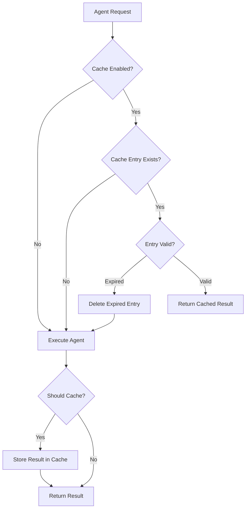

# Agent Result Caching

The CallAgent framework provides a powerful result caching system that can dramatically improve performance by storing and reusing agent execution results. This document covers the complete caching functionality, from basic configuration to advanced usage patterns.

## Overview

Agent result caching allows you to cache the results of expensive agent operations, avoiding redundant processing when identical inputs are provided. The caching system is:

- **Tenant-aware**: Complete isolation between different tenants
- **TTL-based**: Configurable expiration times for cache entries
- **Path-aware**: Intelligent exclusion of fields that shouldn't affect cache keys
- **SQL-backed**: Persistent storage using PostgreSQL via Prisma
- **Maintenance-free**: Automatic cleanup of expired entries

## Quick Start

### 1. Enable Caching in Agent Manifest

Add a `cache` configuration to your agent's manifest:

```json
{
    "name": "my-agent",
    "version": "1.0.0",
    "cache": {
        "enabled": true,
        "ttlSeconds": 300,
        "excludePaths": ["timestamp", "requestId"]
    }
}
```

### 2. Run Your Agent

```bash
# First execution - processes normally and caches result
yarn run-agent path/to/agent.js '{"operation": "expensive-task", "data": "input"}'

# Second execution - returns instantly from cache!
yarn run-agent path/to/agent.js '{"operation": "expensive-task", "data": "input"}'
```

That's it! Your agent now benefits from result caching.

## Configuration Reference

### Cache Configuration Schema

```typescript
interface CacheConfig {
    /** Enable/disable caching for this agent (default: false) */
    enabled?: boolean;
    
    /** Cache TTL in seconds (default: 300 = 5 minutes) */
    ttlSeconds?: number;
    
    /** Paths to exclude from cache key (dot notation for nested objects) */
    excludePaths?: string[];
}
```

### Configuration Examples

#### Basic Caching
```json
{
    "cache": {
        "enabled": true
    }
}
```
Uses default TTL of 5 minutes with no path exclusions.

#### Custom TTL
```json
{
    "cache": {
        "enabled": true,
        "ttlSeconds": 1800
    }
}
```
Caches results for 30 minutes.

#### Path Exclusions
```json
{
    "cache": {
        "enabled": true,
        "ttlSeconds": 60,
        "excludePaths": [
            "timestamp",
            "requestId", 
            "user.sessionId",
            "metadata.trackingId"
        ]
    }
}
```
Excludes timestamp, request IDs, and session identifiers from cache key generation.

## How Cache Keys Work

### Key Generation Process

1. **Input Processing**: The agent's input is deep-cloned
2. **Path Exclusion**: Specified paths are removed from the input
3. **Key Sorting**: Object keys are recursively sorted for consistency
4. **Hashing**: SHA-256 hash is generated from the processed input

### Path Exclusion Examples

```typescript
// Original input
const input = {
    operation: "analyze-data",
    dataset: "customers.csv",
    timestamp: "2024-01-15T10:30:00Z",
    user: {
        id: "user123",
        sessionId: "sess_abc123"
    },
    options: {
        format: "json"
    }
};

// With excludePaths: ["timestamp", "user.sessionId"]
// Effective input for cache key:
{
    operation: "analyze-data",
    dataset: "customers.csv",
    user: {
        id: "user123"
    },
    options: {
        format: "json"
    }
}
```

### Cache Key Consistency

These inputs produce **identical** cache keys:

```typescript
// Input 1 (different key order)
{
    operation: "test",
    data: "sample",
    timestamp: "2024-01-01T10:00:00Z"
}

// Input 2 (different timestamp, excluded)
{
    data: "sample", 
    operation: "test",
    timestamp: "2024-01-01T11:00:00Z"
}
```

## Cache Lifecycle

### Cache States

- **Cache Miss**: No matching entry exists, agent executes normally
- **Cache Hit**: Valid entry found, returns cached result instantly  
- **Cache Expired**: Entry exists but expired, agent executes and updates cache

### Execution Flow



## Multi-Tenant Support

### Tenant Isolation

Cache entries are completely isolated by tenant:

```bash
# Tenant A - first execution (cache miss)
yarn run-agent agent.js '{"operation": "process"}' --tenant=company-a

# Tenant B - first execution (cache miss, separate cache)
yarn run-agent agent.js '{"operation": "process"}' --tenant=company-b

# Tenant A - second execution (cache hit)
yarn run-agent agent.js '{"operation": "process"}' --tenant=company-a
```

### Tenant-Scoped Management

```bash
# Clear cache for specific tenant
yarn cache clear --tenant=company-a

# View stats by tenant (shows tenant breakdown)
yarn cache stats
```

## A2A Caching

Agent-to-agent (A2A) communication also benefits from caching:

```typescript
// In your agent
const result = await ctx.sendTaskToAgent('expensive-agent', {
    operation: 'complex-calculation',
    data: largeDataset
});
// Subsequent identical A2A calls return from cache
```

A2A caching works identically to direct agent execution, with the same configuration and behavior.

## Cache Management

### CLI Commands

#### View Statistics
```bash
yarn cache stats
```

Output:
```
📈 Cache Statistics:
  Total entries: 150
  Active entries: 142
  Expired entries: 8
  Oldest entry: 2024-01-15T09:15:30.000Z
  Newest entry: 2024-01-15T10:45:22.000Z

🤖 By Agent:
  llm-agent: 75 entries
  data-processor: 45 entries
  image-analyzer: 20 entries
  cached-agent: 10 entries
```

#### Clean Expired Entries
```bash
yarn cache cleanup
```

#### Clear Specific Caches
```bash
# Clear all entries for an agent
yarn cache clear --agent=llm-agent

# Clear all entries for a tenant  
yarn cache clear --tenant=customer-123

# Clear agent entries for specific tenant
yarn cache clear --agent=llm-agent --tenant=customer-123
```

### Programmatic Management

```typescript
import { AgentResultCache, CacheCleanupService } from '@callagent/core';
import { PrismaClient } from '@prisma/client';

const prisma = new PrismaClient();
const cache = new AgentResultCache(prisma);
const cleanup = new CacheCleanupService(prisma);

// Clear agent cache
await cache.clearAgentCache('my-agent', 'tenant-123');

// Get statistics
const stats = await cleanup.getStats();

// Manual cleanup
const removedCount = await cleanup.cleanup();
```

## Performance Considerations

### Cache Hit Performance

| Cache State | Typical Response Time | Notes |
|-------------|----------------------|-------|
| Cache Hit | 1-10ms | Near-instant response |
| Cache Miss | Agent execution time | Normal processing + cache storage |
| Cache Expired | Agent execution time | Processing + cache update |

### Storage Impact

- **Key Size**: ~64 bytes (SHA-256 hash + metadata)
- **Value Size**: Depends on agent result (JSON serialized)
- **Index Overhead**: ~100 bytes per entry for database indexes

### Memory Usage

The caching system uses minimal memory as all data is stored in PostgreSQL. Only active database connections and query results temporarily consume memory.

## Best Practices

### When to Enable Caching

✅ **Excellent candidates:**
- LLM operations with stable prompts
- Complex mathematical calculations  
- Data processing with deterministic results
- External API calls with stable responses
- Database queries with cacheable results

❌ **Avoid caching for:**
- Operations with side effects (sending emails, file modifications)
- Real-time data requirements
- User-specific personalized content
- Operations producing large results (>1MB)

### TTL Selection Guidelines

| Use Case | Recommended TTL | Reasoning |
|----------|----------------|-----------|
| LLM text generation | 5-15 minutes | Balance performance vs freshness |
| Data calculations | 30-60 minutes | Results are deterministic |
| External API calls | 2-10 minutes | Depends on API update frequency |
| Database aggregations | 5-30 minutes | Based on data change frequency |

### Path Exclusion Strategies

Always exclude fields that don't affect the result:

```json
{
    "excludePaths": [
        "timestamp",           // Request timestamp
        "requestId",          // Unique request identifier  
        "correlationId",      // Tracing identifier
        "user.sessionId",     // User session data
        "metadata.source",    // Request source tracking
        "debug.enabled"       // Debug flags
    ]
}
```

### Monitoring and Optimization

1. **Monitor Cache Hit Rates**
   ```bash
   yarn cache stats
   ```
   - High hit rate (>70%): Good cache utilization
   - Low hit rate (<30%): Consider longer TTL or better path exclusions

2. **Monitor Cache Size**
   - Large cache: Consider shorter TTL or more aggressive cleanup
   - Small cache: Consider longer TTL for better performance

3. **Monitor Agent Performance**
   - Track execution times before/after caching
   - Measure cost savings from avoided processing

## Troubleshooting

### Common Issues

#### Cache Not Working
- ✅ Verify `cache.enabled: true` in agent manifest
- ✅ Check database connectivity
- ✅ Ensure Prisma migrations are applied
- ✅ Verify agent execution logs for cache-related messages

#### Unexpected Cache Misses
- ✅ Check input consistency (object key order doesn't matter)
- ✅ Verify path exclusions are correctly specified
- ✅ Check TTL settings - entries may be expiring too quickly
- ✅ Ensure tenant ID consistency

#### Performance Issues
- ✅ Run `yarn cache cleanup` to remove expired entries
- ✅ Check database performance and indexing
- ✅ Consider shorter TTL for very large result sets
- ✅ Monitor database storage usage

### Debug Logging

Enable debug logging to troubleshoot cache behavior:

```bash
DEBUG=AgentCache,CacheCleanup yarn run-agent agent.js '{"test": true}'
```

### Database Queries

Inspect cache entries directly:

```sql
-- View active cache entries
SELECT agent_name, tenant_id, created_at, expires_at 
FROM agent_result_cache 
WHERE expires_at > NOW()
ORDER BY created_at DESC;

-- Check cache hit rates by agent
SELECT agent_name, COUNT(*) as entries,
       AVG(EXTRACT(EPOCH FROM (NOW() - created_at))) as avg_age_seconds
FROM agent_result_cache 
GROUP BY agent_name;
```

## Architecture Details

### Database Schema

```sql
CREATE TABLE agent_result_cache (
    id          TEXT PRIMARY KEY,
    tenant_id   TEXT NOT NULL,
    agent_name  TEXT NOT NULL,
    cache_key   TEXT NOT NULL,
    result      JSONB NOT NULL,
    created_at  TIMESTAMP DEFAULT NOW(),
    expires_at  TIMESTAMP NOT NULL,
    
    UNIQUE(tenant_id, agent_name, cache_key)
);

-- Indexes for performance
CREATE INDEX idx_agent_cache_tenant_agent ON agent_result_cache(tenant_id, agent_name);
CREATE INDEX idx_agent_cache_expires ON agent_result_cache(expires_at);
```

### Integration Points

The caching system integrates at two key points:

1. **Runner Integration** (`streamingRunner.ts`):
   - Cache check before agent execution
   - Result storage after successful execution
   - Error handling and graceful degradation

2. **A2A Integration** (`A2AService.ts`):
   - Cache check before target agent execution
   - Result storage for A2A communication
   - Same configuration and behavior as direct execution

### Background Services

- **Cleanup Service**: Runs every 5 minutes to remove expired entries
- **Statistics Collection**: Real-time metrics for monitoring
- **Error Recovery**: Graceful handling of database connectivity issues

## Migration Guide

### Enabling Caching for Existing Agents

1. **Update Agent Manifest**:
   ```json
   {
       "cache": {
           "enabled": true,
           "ttlSeconds": 300
       }
   }
   ```

2. **Run Database Migration**:
   ```bash
   cd packages/memory-sql
   npx prisma migrate deploy
   ```

3. **Test Caching**:
   ```bash
   # Run twice to verify caching
   yarn run-agent your-agent.js '{"test": "input"}'
   yarn run-agent your-agent.js '{"test": "input"}'
   ```

### Migrating from Custom Caching

If you have custom caching logic, you can migrate to the framework caching:

1. Remove custom cache code from your agent
2. Add cache configuration to manifest  
3. Test to ensure equivalent behavior
4. Monitor performance and adjust TTL as needed

## Related Documentation

- [Agent Dependencies](./agent-dependencies.md) - A2A communication
- [Memory System](./memory/) - Memory lifecycle and management
- [Runner Documentation](./runner.md) - Agent execution environment
- [Usage Tracking](./usage-tracking.md) - Performance monitoring

## Examples

- [Cached Agent Example](../examples/cached-agent/README.md) - Complete working example
- [A2A Local Demo](../examples/a2a-local-demo/README.md) - A2A with caching
- [LLM Agent](../examples/llm-agent/README.md) - LLM operations with caching 