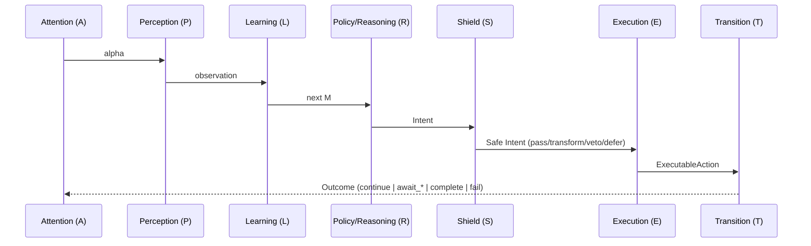

# Loop Modules: Contracts & Rules (A-P-L-R-E-T)

This page defines the **contracts, purity rules, and data responsibilities** for each loop module:

**Attention → Perception → Learning → Policy → Shield → Execution → Transition**

* **MentalState (`M`)** is the cognitive state. It’s **immutable** during a turn and **may only be updated by Learning**.
* **`ctx.vars`** holds **ephemeral control state** (stage, tokens, flags) and may be updated by Execution/Transition.
* **Policy emits typed `Intent`** (what to do), **Execution performs effects** (how to do it).
* Use the **Stage Dispatcher** (see that doc) to map `(stage, intent)` → handler, with runtime typestate checks.

---

## High-level flow



---

## Data flow

```mermaid
flowchart TD
  subgraph M[MentalState (M_t)]
    WM[worldModel]
    MEMS[memory]
    MEML[memory.longTerm]
    GOALS[goalState]
    EMO[emotion]
    REW[reward]
  end

  ENV[EnvironmentState]
  A[Attention] --> P[Perception]
  P --> L[Learning]
  L --> R[Policy]
  R --> S[Shield]
  S --> E[Execution]
  E --> T[Transition]
  M --> A
  M --> R
```

---

## Type contracts (TypeScript)

### Core types

```ts
// Observation normalized by Perception (payload shape is app-specific)
type Observation<Payload = unknown> = {
  text?: string; // legacy helper fields allowed, but prefer payload
  eventType?: 'user' | 'input' | 'tool' | 'child' | 'internal';
  payload: Payload;
  provenance?: ObservationProvenance;
  error?: { code: string; message: string };
};

type ExecResult<Data = unknown> = {
  status: 'ok' | 'error';
  data?: Data;
  error?: { code: string; message: string };
  receipts?: unknown;
  correlationId?: string;
  toolId?: string;
  ts?: number;
};

type ObservationProvenance = {
  ts: number;
  turn: number;
  id?: string;
  toolId?: string;
  correlationId?: string;
};

// WHAT to do (pure decision)
type Intent =
  | { kind: 'prompt_user' }
  | { kind: 'answer_with_llm'; query: string; context?: string }
  | { kind: 'plan_and_execute'; goal: string }
  | { kind: 'call_tool'; toolName: string; args: Record<string, unknown> }
  | { kind: 'delegate_to_child'; childAgentId: string; input: unknown }
  | { kind: 'wait' }
  | { kind: 'complete'; result?: unknown };

type ExecutableAction =
  | { kind: 'ask_user'; token: string }
  | { kind: 'tool'; token?: string }
  | { kind: 'subagent'; token?: string }
  | { kind: 'internal'; done: boolean };

type TransitionOut<ObservationPayload = unknown> =
  | { kind: 'continue'; observations: Observation<ObservationPayload>[] }
  | { kind: 'await_tool'; token: string }
  | { kind: 'await_child'; token: string }
  | { kind: 'complete'; result?: unknown }
  | { kind: 'fail'; reason: string };

Execution now returns `{ action, result }` where `result` is an `ExecResult<Data>` (you control `Data`) persisted with provenance (`ts`, optional `correlationId/toolId`). Transition consumes that payload, emits loop control, and returns normalized `Observation<Payload>` objects. The runtime appends every observation to `env.inbox.all`, stages the batch on `env.inbox.current`, and stamps each entry with the current `env.turn` so the very next turn’s Perception can drain, validate, and hand Learning a fresh observation.
```

### Generic MentalState and Modules

```ts
// Core generics 
// - MentalState<Sensory>
// - Modules<Sensory, Obs, Alpha, ExecData, ExecError, ObservationPayload>
// - oneTurn<Sensory, Obs, Alpha, ExecData, ExecError, ObservationPayload>

type Modules<
  Sensory = unknown,
  Obs = unknown,
  Alpha = AttentionSignal,
  ExecData = unknown,
  ExecError = ExecErrorPayload,
  ObservationPayload = unknown
> = {
  attention:  (prev: MentalState<Sensory>, env: EnvironmentState<ObservationPayload>, llm?: PureLLMPort) => Alpha;
  perception: (env: EnvironmentState<ObservationPayload>, alpha: Alpha, llm?: PureLLMPort) => Obs | Promise<Obs>;
  learning:   (prev: MentalState<Sensory>, prevAction: ProposedAction | undefined,
               obs: Obs, rPrev?: number, llm?: PureLLMPort) => MentalState<Sensory> | Promise<MentalState<Sensory>>;
  policy:     (m: MentalState<Sensory>, llm?: PureLLMPort) => ProposedAction;
  shield:     (m: MentalState<Sensory>, intent: ProposedAction, llm?: PureLLMPort) =>
                | { action: 'pass'; intent: ProposedAction }
                | { action: 'transform'; intent: ProposedAction }
                | { action: 'veto'; reason: string }
                | { action: 'defer'; askUser: string };
  execution:  (intent: ProposedAction, ctx: TaskContext, m: MentalState<Sensory>) => Promise<{ action: ExecutableAction; result: ExecResult<ExecData, ExecError> }>;
  transition: (env: EnvironmentState<ObservationPayload>, exec: { action: ExecutableAction; result: ExecResult<ExecData, ExecError> }, m: MentalState<Sensory>, llm?: PureLLMPort) => TransitionOut<ObservationPayload>;

  // Optional reward hooks
  extrinsicReward?: (m: MentalState<Sensory>, a: ProposedAction, exec: { action: ExecutableAction; result: ExecResult<ExecData, ExecError> }, outcome: TransitionOut<ObservationPayload>, llm?: PureLLMPort) => number;
  intrinsicReward?: (m: MentalState<Sensory>, obs: Obs, llm?: PureLLMPort) => number;
};
```

#### Per‑agent typing pattern (Mandatory)
```ts
// Always define explicit Sensory and Obs and pass them to createAgent
type Sensory = { current?: string };
type Obs = { text?: string };

createAgent<Sensory, Obs>({
  perception: (env): Obs => {
    // ... return { text }
  },
  learning: (prev: MentalState<Sensory>, _prev, obs: Obs): MentalState<Sensory> => ({
    ...prev,
    memory: { ...prev.memory, sensory: { current: obs.text } }
  }),
  policy: (m: MentalState<Sensory>): ProposedAction => {
    const q = m.memory.sensory.current?.trim();
    return q ? { kind: 'internal', intent: 'answer_with_llm', data: { query: q } }
             : { kind: 'ask_user', prompt: 'Please type your message' };
  },
  // ... shield/execution/transition
});
```

This per‑agent typing is mandatory. Do not omit the generics or leave them implicit; it keeps module contracts explicit and prevents accidental `unknown`.

### Stage management helper

Use the provided minimal helper to manage control stages consistently without reimplementing per agent:

```ts
import { createStageFacade } from '@a2arium/callagent-core';

type Stage = 'idle' | 'awaiting_input' | 'completed';
const Stage = createStageFacade<Stage>({
  initial: 'idle',
  invariants: {
    awaiting_input: { require: ['token'], forbid: ['completed.called'] },
    completed: { require: ['completed.called'] }
  },
  autoMarks: {
    completed: { 'completed.called': true }
  }
});

// set on ask
ctx.vars.set('token', token);
Stage.setStage(ctx, 'awaiting_input');

// set on complete (autoMarks will set 'completed.called')
ctx.complete(100, 'completed');
Stage.setStage(ctx, 'completed');
```
```

---

## Rules of engagement (per module)

### Attention (A)

* **Purpose:** lightweight signal that can bias Perception (e.g., focus, urgency).
* **Must not:** mutate `M` or perform effects.
* **May:** pass-through or compute tiny hints from `M` + `env`.

### Perception (P)

* **Purpose:** normalize `env` into a compact `Observation` (text, type, meta).
* **Must not:** perform effects or write to `M`.
* **May:** sanitize/validate input (respect manifest safety flags).
* **Tip:** keep `Observation` small; heavy parsing belongs in tools or Execution.

### Learning (L)

* **Purpose:** **the only place** that updates `M`. Treat prior `M` as immutable; always **return a new `M`**.
* **Must:** write cognitive facts (derived intent, entities, beliefs, reward tallies, episodic events) into appropriate cognitive sections (`worldModel`, `goalState`, `reward`, `memory.longTerm`).
* **Sensory rule:** only store raw observations (e.g., latest raw user text for this turn) under `memory.sensory`. Do not place cognitive derivations there.
* **Must not:** touch `ctx.vars` or do side effects.
* **Pattern:** `next = { ...prev, worldModel: {...}, memory: {...}, reward: {...} }`.
* **Async:** Learning may be `async` (return `Promise<M>`) to support **lazy-loading artifacts** when content is required for state updates.

> This “pure learning, effectful execution” split mirrors the functional-core / imperative-shell approach and makes tests trivial.

### Policy / Reasoning (R)

* **Purpose:** choose **Intent** (WHAT), a pure function of `M`.
* **Must:** be deterministic given `M` (stochasticity allowed if driven by `m.policyParams`).
* **Must not:** read `env` directly or use `ctx.vars`. All inputs must reach Policy via **Perception→Learning→M**.
* **Why:** keeps reasoning predictable and testable (and aligns with exhaustive intent matching). For complex intent matching, prefer ts-pattern with `.exhaustive()` to guarantee coverage. ([GitHub][1])

### Shield (S)

* **Purpose:** enforce safety, cost, PII, and HITL. Runs **between** Policy and Execution.
* **Outcomes:** `pass` | `transform` | `veto` | `defer` (ask the user).
* **Must:** log decisions; combine multiple checks deterministically (veto > defer > transform > pass).
* **Why:** this follows “shielding” ideas in safe RL: constrain actions before execution. ([incompleteideas.net][2])

### Execution (E)

* **Purpose:** perform effects and update **control state** via `ctx.vars` (stage, tokens, flags).
* **Must:** never mutate `M` (that’s Learning’s job).
* **May:** call `ctx.llm`, `ctx.reply`, `ctx.tools`, `ctx.requestInput`, external APIs (wrap customs with `runEffect` for timeouts/retries).
* **Pattern:** use the **Stage Dispatcher** to map `(stage, intent)` → handler; keep handlers tiny and idempotent.

### Transition (T)

* **Purpose:** map `ExecutableAction` → `{continue | await_* | complete | fail}` and advance the control loop.
* **Must:** emit `await_*` with tokens for resumable effects; set completion only after terminal handler runs.
* **Must:** treat `ctx.vars` as the source of truth for control-flow flags (e.g., `completeCalled`).

---

## LLM in pure modules (optional `llm` parameter)

All modules receive an optional `llm?: PureLLMPort` parameter as their **last parameter**. This enables LLM-powered normalization, reasoning, or validation while maintaining architectural purity.

### What is `PureLLMPort`?

A **sealed interface** that provides ONLY `call()` and `stream()` methods—no tools, no message manipulation, no direct memory writes. It's automatically extracted from `ctx.llm` by the framework and passed to each module.

```typescript
type PureLLMPort = {
    call<T = unknown>(message: string, options?: {
        temperature?: number;
        schema?: Record<string, unknown>;
        seed?: number;
        [key: string]: unknown;
    }): Promise<UniversalChatResponse<T>[]>;
    stream?<T = unknown>(message: string, options?: Record<string, unknown>): AsyncIterable<UniversalStreamResponse<T>>;
};
```

### Why this design?

* **Architectural purity:** Pure modules (Perception, Policy, Shield, etc.) shouldn't have full `ctx` access, but they sometimes need LLM inference.
* **Sealed capability:** The port prevents capability leakage—you can't call tools, manipulate conversation history, or access memory through it.
* **Observability without side effects:** Usage tracking happens automatically but doesn't violate purity—costs are logged for monitoring.
* **Determinism (best-effort):** Use `temperature: 0` and `seed` for reproducible outputs where possible.

### When to use `llm` in modules

| Module | Use Case | Example |
|--------|----------|---------|
| **Perception** | Extract structured data from messy user input | Parse intent + entities with JSON schema validation |
| **Shield** | Check for PII, offensive content, or safety violations | LLM-based content moderation before execution |
| **Policy** | LLM-assisted reasoning for complex decision-making | Rarely needed; prefer deterministic policy when possible |
| **Learning** | Derive cognitive facts from observations | Extract beliefs/sentiments before writing to M |
| **Attention** | Compute sophisticated attention signals | Usually not needed; keep simple |
| **Transition** | Complex state transition logic | Usually not needed; keep deterministic |

### Best practices

1. **Always provide fallback logic** - LLM calls can fail; have a simple regex/rule-based fallback.
2. **Use temperature=0** for best-effort determinism.
3. **Validate outputs with JSON Schema** - use Ajv to ensure LLM responses match your schema.
4. **Keep prompts simple** - pure modules should do simple transforms, not complex multi-turn reasoning.
5. **Make modules async** when using LLM - `perception: async (env, alpha, llm?) => { ... }`.
6. **Usage tracking is automatic** - costs are recorded via the port; you don't need manual `ctx.recordUsage()`.

### Example: LLM-powered Perception

```typescript
import Ajv from 'ajv';
const ajv = new Ajv();

type Obs = { text?: string; intent?: 'question' | 'command' | 'other' };

const obsSchema = {
    type: 'object',
    properties: {
        text: { type: 'string' },
        intent: { type: 'string', enum: ['question', 'command', 'other'] }
    }
};
const validateObs = ajv.compile(obsSchema);

createAgent<Sensory, Obs>({
    perception: async (env: EnvironmentState, alpha: AttentionSignal, llm?: PureLLMPort): Promise<Obs> => {
        const latest = env.inbox.current.find(o => o.source === 'user');
        const { text } = ((latest?.payload as { value?: { text?: string } })?.value) || {};
        if (!text) return {};

        // Try LLM extraction if available
        if (llm) {
            try {
                const prompt = `Extract structured info. Return JSON: ${JSON.stringify(obsSchema)}\n\nInput: "${text}"`;
                const responses = await llm.call<Obs>(prompt, { temperature: 0, schema: obsSchema });
                const candidate = responses[0]?.content;
                
                if (validateObs(candidate)) {
                    return candidate as Obs;
                }
                console.warn('[perception] LLM output failed validation');
            } catch (error) {
                console.warn('[perception] LLM call failed:', error);
            }
        }

        // Fallback: simple rule-based extraction
        return { text, intent: text.includes('?') ? 'question' : 'other' };
    },
    // ... other modules
});
```

### Important notes

* **Execution has full `ctx` access** - it doesn't need the separate `llm` parameter since it can use `ctx.llm` directly.
* **The parameter is always optional** - modules can ignore it and use simple rule-based logic.
* **Perception can be async** - return `Obs | Promise<Obs>` when using LLM.
* **Don't abuse it** - not every module needs LLM. Prefer deterministic logic when possible.

---

## Immutability & state separation

| Concern                       | Store in…                        | Who writes           | Lifetime   |
| ----------------------------- | -------------------------------- | -------------------- | ---------- |
| Raw user text (snapshot)      | `M.memory.sensory`               | Learning             | Persistent |
| User intent/sentiment/beliefs | `M.worldModel`                   | Learning             | Persistent |
| Episodic events & rewards     | `M.memory.longTerm` / `M.reward` | Learning             | Persistent |
| Current stage, tokens, flags  | `ctx.vars`                       | Execution/Transition | Ephemeral  |
| Plans / temporary steps       | `ctx.vars`                       | Execution            | Ephemeral  |

**Golden rule:** **Only Learning writes `M`**. Everything else reads `M` and, if needed, writes `ctx.vars`.

---

## Defaults & delegation

If the framework exposes defaults (e.g., `ctx.defaults.execution`), you may **override minimally** and delegate back for common cases. Keep overrides thin and observable (log inputs/outputs, respect budgets).

---

## Resume contract (await_*)

* `Execution` returns `ask_user/tool/subagent` with a `token`.
* `Transition` converts that into `await_input/await_tool/await_child`.
* The engine persists `M` + durable control state, and on resume, Perception normalizes the resume event; Learning records it; then Policy decides next **Intent** purely from `M`.

---

## Rewards (optional)

* `intrinsicReward(M, obs)` and `extrinsicReward(M, exec, outcome)` return scalars.
* Learning appends/rolls them up on the next write (e.g., attach `rew` to last episodic event).
* Keep shaping sparse and interpretable; don’t bake business logic into rewards.

---

## Examples (minimal)

### Perception (resume-aware)

```ts
perception: (env) => {
  const latest = env.inbox.current.at(-1);
  const i = latest?.payload;
  if (!i) return {};
  if (typeof i === 'string') return { text: i, eventType: 'user' };

  // Resume events
  if (typeof i === 'object' && 'kind' in i) {
    const k = (i as any).kind;
    return {
      text: k === 'input' ? (i as any).value : undefined,
      eventType: k,
      meta: i
    };
  }
  return {};
}
```

### Learning (pure, immutable)

```ts
learning: (prev, _prevExec, obs) => {
  if (!obs || (!obs.text && !obs.eventType)) return prev;

  const next: MentalState = {
    ...prev,
    worldModel: {
      ...prev.worldModel,
      lastEventType: obs.eventType ?? prev.worldModel?.lastEventType
    },
    memory: {
      ...prev.memory,
      sensory: { current: obs.text ?? prev.memory?.sensory?.current },
      longTerm: {
        ...prev.memory.longTerm,
        episodic: [
          ...(prev.memory.longTerm.episodic ?? []),
          { t: Date.now(), obs }
        ]
      }
    }
  };
  return next;
}
```

### Policy (pure Intent)

```ts
policy: (m) => {
  const t = m.memory?.sensory?.current;
  if (!t) return { kind: 'prompt_user' };
  if (t.includes('?')) return { kind: 'answer_with_llm', query: t };
  return { kind: 'plan_and_execute', goal: t };
}
```

> For complex branching, prefer exhaustive pattern matching; libraries like **ts-pattern** provide compile-time guarantees via `.exhaustive()`. ([GitHub][1])

### Shield (budget/PII/HITL sketch)

```ts
shield: (m, intent) => {
  // budget check, pii detection, hitl level...
  // order: if any veto → veto; else if any defer → defer; else if any transforms → apply; else pass
  return { action: 'pass', intent };
}
```

### Execution + Transition (dispatcher hooks)

* Execution uses **handlers per stage** and updates `ctx.vars` (e.g., `token`, `completeCalled`).
* Transition maps `ask_user/tool/subagent` → `await_*` and ends with `complete` when `completed` stage is reached.
* For complex flows, consider statecharts (e.g., **XState**) to model timers/parallelism/guards when the dispatcher becomes unwieldy. ([incompleteideas.net][3])

---

## Testing checklist

* **Unit tests:** Learning (immutability), Policy (pure mapping M→Intent), Shield decisions.
* **Integration:** prompt → await_input → respond → complete (golden path).
* **Typestate:** assert `(intent, stage)` pairs are allowed; fail fast on invalid combos.
* **Idempotency:** re-running Execution after a crash should be safe (use idempotency keys on critical effects).

---

## Compatibility note (legacy ProposedAction)

If you have legacy code where **Policy emits `ProposedAction`** (an already-executable shape), migrate in two steps:

1. **Introduce `Intent`** and map **Intent→ProposedAction** in Execution behind the dispatcher.
2. Replace direct `ProposedAction` emissions with `Intent` emissions, and remove the mapper.

This restores the clean separation (WHAT vs. HOW) and enables **exhaustive Intent handling** and **typestate** checks with minimal churn. ([GitHub][1])

---

## Why this aligns

* **Purity & immutability:** Only Learning writes `M`; Policy is pure; Execution is effectful & uses `ctx.vars`.
* **Dispatcher-first Execution:** `(stage, intent)` routing stays explicit, visible, and testable.
* **Safety before effects:** Shield mediates all Intents pre-Execution, consistent with safe RL “shielding.” ([incompleteideas.net][2])
* **Scalable branching:** Prefer exhaustive match for small/medium complexity; move to statecharts when concurrency/timeout/parallel states appear. ([incompleteideas.net][3])

---

### Pointers

* **ts-pattern** for exhaustive, type-safe pattern matching in TypeScript. ([GitHub][1])
* **XState** for statecharts when flows outgrow the dispatcher. ([incompleteideas.net][3])
* **Shielding in RL** for the conceptual grounding of pre-execution safety constraints. ([incompleteideas.net][2])

