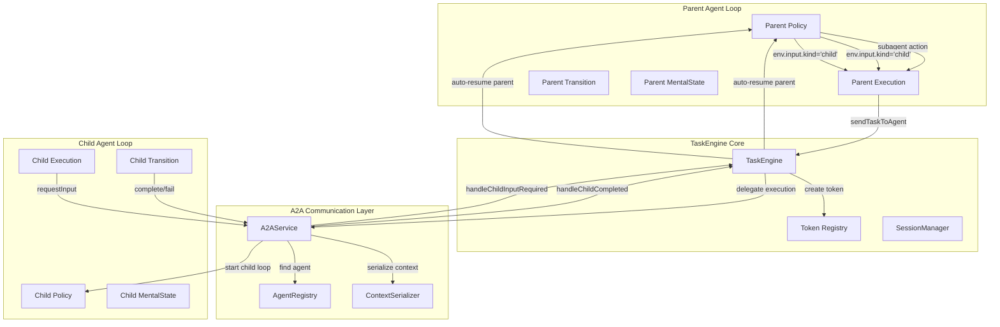

# TaskEngine and A2AService Integration

> Status: design draft.
> API shapes here may evolve; verify stable contracts in `apps/docs/0-aplret_contracts.md`.

## Overview

The TaskEngine and A2AService work together to provide seamless agent-to-agent communication with proper parent-child correlation, handler registration, and context management. This document covers the technical architecture, integration patterns, and implementation details of how these systems coordinate.

## Auto-Resume A2A Architecture



## Component Responsibilities

### TaskEngine
- **Token Management**: Creates and tracks tokens for async operations
- **Auto-Resume**: Automatically resumes parent loops after child events
- **MentalState Persistence**: Saves and restores agent state across turns
- **Parent-Child Correlation**: Maintains relationships between parent and child tasks
- **Event Payload Injection**: Provides child results via `env.input` for parent processing

### A2AService
- **Agent Discovery**: Locates target agents via AgentRegistry
- **Context Serialization**: Packages source context for transfer
- **Child Context Creation**: Creates isolated context for target agent
- **Input Override**: Intercepts child `requestInput` calls for parent routing
- **Event Routing**: Routes child completion/input events back to parent TaskEngine

### Token Registry
- **Token Tracking**: Associates unique tokens with parent task IDs
- **Event Type Mapping**: Maps tokens to event types (input, child, tool, external)
- **Expiration Management**: Cleans up expired token registrations

## Auto-Resume Integration Flow

### 1. Parent Agent Initiates Child Task

```typescript
// Parent Policy module returns subagent action
policy: (M, env) => {
    if (env.input?.kind === 'child') {
        return { kind: 'language', content: `Child result: ${JSON.stringify(env.input.output)}` };
    }
    return { kind: 'subagent', target: 'analyzer', input: { data: 'sample' } };
}

// Parent Execution calls sendTaskToAgent
execution: async (action, ctx, M) => {
    if (action.kind === 'subagent') {
        const handle = await ctx.sendTaskToAgent(action.target, action.input);
        return { kind: 'subagent', token: handle.token };
    }
    // ...
}
```

**TaskEngine Processing**:
```typescript
async sendTaskToAgent(ctx, targetAgent, taskInput) {
    // 1. Create unique correlation token
    const token = crypto.randomUUID();
    
    // 2. Register token for auto-resume
    await this.durableHandlerRegistry.registerChild(token, ctx.task.id, ctx.tenantId, targetAgent);
    
    // 3. Delegate to A2AService
    const childResult = await this.a2aService.executeChildTask(targetAgent, taskInput, ctx);
    
    return { token };
}

// Parent Transition returns await_child
transition: (env, exec, m, mem) => {
    if (exec.action.kind === 'subagent' && exec.action.token) {
        return { kind: 'await_child', token: exec.action.token };
    }
    // ...
}
```

### 2. Child Completion Auto-Resume

When the child agent completes, A2AService triggers auto-resume:

```typescript
// In A2AService.handleChildCompleted
async handleChildCompleted(childTaskId: string, result: unknown) {
    const token = await this.getTokenForChildTask(childTaskId);
    const parentTaskId = await this.getParentTaskId(token);
    
    // Auto-resume parent with child result
    await this.taskEngine.handleChildCompleted({
        tenantId: parentTenantId,
        taskId: parentTaskId,
        token,
        output: result
    });
}

// TaskEngine automatically runs one loop turn with:
// env.input = { kind: 'child', token, output: result }
```
    
    // 4. Delegate to A2A Service
    return await globalA2AService.sendTaskToAgent(ctx, targetAgent, taskInput, {
        ...options,
        parentTenantId: ctx.tenantId,
        parentTaskId: ctx.task.id,
        parentChildToken: token
    });
}
```

### 2. A2A Service Creates Child Context

```typescript
async sendTaskToAgent(sourceCtx, targetAgent, taskInput, options) {
    // 1. Discover target agent
    const agentModule = await this.agentRegistry.findAgent(targetAgent);
    
    // 2. Serialize source context (if inheritance enabled)
    const serializedContext = await this.contextSerializer.serialize(sourceCtx, {
        inheritWorkingMemory: options.inheritWorkingMemory,
        inheritMemory: options.inheritMemory
    });
    
    // 3. Create isolated child context
    const childCtx = await this.createChildContext(serializedContext, options);
    
    // 4. Override child's requestInput method
    this.overrideChildRequestInput(childCtx, options);
    
    // 5. Execute child agent
    return await agentModule.handleTask(childCtx);
}
```

### 3. Child Agent Requests Input

```typescript
// Child agent calls requestInput
await ctx.requestInput('Provide threshold (0-100):', { 
    onProvided: 'onThresholdProvided' 
});
```

**A2A Service Override**:
```typescript
(targetCtx as any).requestInput = async (prompt, riOpts) => {
    const childOnProvided = riOpts?.onProvided;
    const childTaskId = targetCtx.task.id;
    
    // Store for post-turn routing
    (targetCtx as any).__inputRequired = { 
        prompt, 
        schema: riOpts?.schema, 
        childOnProvided, 
        childTaskId 
    };
    
    // Immediate routing to parent
    await eng.handleChildInputRequired({
        tenantId: parentTenantId,
        parentTaskId,
        childToken: parentChildToken,
        childTaskId,
        prompt,
        schema: riOpts?.schema,
        childOnProvided
    });
};
```

### 4. TaskEngine Routes to Parent Handler

```typescript
async handleChildInputRequired(params) {
    // 1. Find parent handler using token
    const parentHandler = this.handlerRegistry.getHandler(
        params.childToken, 
        'onInputRequired'
    );
    
    if (!parentHandler) {
        throw new Error(`Parent handler 'onInputRequired' not found for token ${params.childToken}`);
    }
    
    // 2. Invoke parent handler
    const parentResult = await this.invokeHandler(params.parentTaskId, parentHandler, {
        prompt: params.prompt,
        schema: params.schema,
        token: params.childToken
    });
    
    // 3. If parent returns value, forward to child immediately
    if (parentResult !== undefined && params.childOnProvided) {
        await this.invokeHandler(params.childTaskId, params.childOnProvided, parentResult);
    }
}
```

## Token-Based Correlation System

### Token Generation and Registration

```typescript
class TaskEngine {
    async sendTaskToAgent(ctx, targetAgent, taskInput, options) {
        // Generate unique correlation token
        const token = crypto.randomUUID();
        
        // Register handlers with expiration
        this.handlerRegistry.register(token, {
            onInputRequired: options?.onInputRequired,
            onCompleted: options?.onCompleted,
            onFailed: options?.onFailed,
            onTimeout: options?.onTimeout
        }, {
            expiresAt: Date.now() + (options?.timeout || 300000), // 5 minutes default
            taskId: ctx.task.id,
            tenantId: ctx.tenantId
        });
        
        return token;
    }
}
```

### Token Lifecycle Management

```typescript
class HandlerRegistry {
    register(token: string, handlers: HandlerMap, metadata: TokenMetadata) {
        this.tokens.set(token, {
            handlers,
            metadata,
            createdAt: Date.now()
        });
        
        // Schedule cleanup
        setTimeout(() => {
            this.cleanup(token);
        }, metadata.expiresAt - Date.now());
    }
    
    getHandler(token: string, eventType: string): string | undefined {
        const tokenData = this.tokens.get(token);
        if (!tokenData) {
            throw new Error(`Token ${token} not found or expired`);
        }
        
        return tokenData.handlers[eventType];
    }
    
    cleanup(token: string) {
        this.tokens.delete(token);
    }
}
```

## Context Extension and Restoration

### Durable Handler Context Extension

The TaskEngine ensures durable handlers have access to the full context:

```typescript
async invokeHandler(taskId: string, handlerName: string, eventData: any) {
    // 1. Load basic task context
    let ctx = await this.loadTaskContext(taskId);
    
    // 2. Extend with working memory
    ctx = await this.extendContextWithWorkingMemory(ctx, taskId);
    
    // 3. Extend with memory systems
    ctx = await this.extendContextWithMemory(ctx, ctx.tenantId);
    
    // 4. Extend with A2A capabilities (CRITICAL FIX)
    ctx = await this.extendContextWithA2A(ctx);
    
    // 5. Load and invoke handler
    const handlerFn = await this.loadHandler(handlerName);
    return await handlerFn(ctx, eventData);
}

async extendContextWithA2A(ctx) {
    // CRITICAL: Use full TaskEngine implementation, not simplified wrapper
    (ctx as any).sendTaskToAgent = async (targetAgent, taskInput, options) => {
        return this.sendTaskToAgent(ctx, targetAgent, taskInput, options);
    };
    
    return ctx;
}
```

### Context Serialization for Child Agents

```typescript
class ContextSerializer {
    async serialize(sourceCtx, options) {
        const serialized: SerializedContext = {
            tenantId: sourceCtx.tenantId,
            taskId: crypto.randomUUID(), // New task ID for child
        };
        
        if (options.inheritWorkingMemory) {
            serialized.workingMemory = {
                goals: await (sourceCtx as any).goals.read?.({}),
                decisions: await (sourceCtx as any).decisions.read?.(),
                variables: { ...sourceCtx.vars }
            };
        }
        
        if (options.inheritMemory) {
            // Recall relevant memories for transfer
            const memories = await sourceCtx.recall('*', { limit: 100 });
            serialized.memoryContext = {
                memorySnapshot: memories.map(m => ({
                    id: m.id,
                    type: m.type,
                    data: m.data,
                    metadata: m.metadata
                }))
            };
        }
        
        return serialized;
    }
    
    async deserialize(serializedContext, targetCtx) {
        if (serializedContext.workingMemory) {
            const wm = serializedContext.workingMemory;
            await (targetCtx as any).goals.add?.({ title: wm.goal });
            
            for (const thought of wm.thoughts) {
                await (targetCtx as any).thoughts.add?.(thought.content);
            }
            
            for (const [key, decision] of Object.entries(wm.decisions)) {
                await (targetCtx as any).thoughts.add?.(`Decision: ${key} ${decision.decision} (${decision.reasoning || ''})`);
            }
            
            targetCtx.vars = { ...wm.variables };
        }
        
        if (serializedContext.memoryContext) {
            for (const memory of serializedContext.memoryContext.memorySnapshot) {
                await targetCtx.remember(memory.id, memory.data, {
                    type: memory.type,
                    ...memory.metadata
                });
            }
        }
    }
}
```

## Error Handling and Recovery

### Handler Not Found Recovery

```typescript
async handleChildInputRequired(params) {
    try {
        const parentHandler = this.handlerRegistry.getHandler(
            params.childToken, 
            'onInputRequired'
        );
        
        return await this.invokeHandler(params.parentTaskId, parentHandler, {
            prompt: params.prompt,
            schema: params.schema,
            token: params.childToken
        });
        
    } catch (error) {
        if (error.message.includes('not found')) {
            // Handler not found - emit to external system
            await this.emitInputRequired({
                taskId: params.parentTaskId,
                prompt: params.prompt,
                schema: params.schema,
                token: params.childToken
            });
            return;
        }
        throw error;
    }
}
```

### Context Restoration Failures

```typescript
async invokeHandler(taskId: string, handlerName: string, eventData: any) {
    try {
        const ctx = await this.restoreFullContext(taskId);
        const handlerFn = await this.loadHandler(handlerName);
        return await handlerFn(ctx, eventData);
        
    } catch (error) {
        if (error.message.includes('working memory')) {
            // Working memory restoration failed - use minimal context
            const minimalCtx = await this.loadTaskContext(taskId);
            const handlerFn = await this.loadHandler(handlerName);
            return await handlerFn(minimalCtx, eventData);
        }
        throw error;
    }
}
```

### Token Expiration Handling

```typescript
class HandlerRegistry {
    getHandler(token: string, eventType: string): string | undefined {
        const tokenData = this.tokens.get(token);
        
        if (!tokenData) {
            throw new Error(`Handler token ${token} not found`);
        }
        
        if (Date.now() > tokenData.metadata.expiresAt) {
            this.cleanup(token);
            throw new Error(`Handler token ${token} has expired`);
        }
        
        return tokenData.handlers[eventType];
    }
}
```

## Performance Optimizations

### Handler Registry Caching

```typescript
class HandlerRegistry {
    private handlerCache = new Map<string, Function>();
    
    async loadHandler(handlerName: string): Promise<Function> {
        if (this.handlerCache.has(handlerName)) {
            return this.handlerCache.get(handlerName)!;
        }
        
        const handlerFn = await this.dynamicImport(handlerName);
        this.handlerCache.set(handlerName, handlerFn);
        return handlerFn;
    }
}
```

### Context Restoration Caching

```typescript
class TaskEngine {
    private contextCache = new Map<string, any>();
    
    async restoreFullContext(taskId: string) {
        const cacheKey = `${taskId}:${Date.now() - Date.now() % 60000}`; // 1-minute cache
        
        if (this.contextCache.has(cacheKey)) {
            return this.contextCache.get(cacheKey);
        }
        
        const ctx = await this.performFullContextRestoration(taskId);
        this.contextCache.set(cacheKey, ctx);
        
        // Clean up cache after 5 minutes
        setTimeout(() => {
            this.contextCache.delete(cacheKey);
        }, 300000);
        
        return ctx;
    }
}
```

### Batch Handler Registration

```typescript
class TaskEngine {
    async sendMultipleTasksToAgents(ctx, tasks: TaskSpec[]) {
        const tokens = tasks.map(() => crypto.randomUUID());
        
        // Batch register all handlers
        const registrations = tasks.map((task, index) => ({
            token: tokens[index],
            handlers: {
                onInputRequired: task.onInputRequired,
                onCompleted: task.onCompleted,
                onFailed: task.onFailed
            }
        }));
        
        await this.handlerRegistry.batchRegister(registrations);
        
        // Execute tasks in parallel
        return await Promise.all(
            tasks.map((task, index) =>
                globalA2AService.sendTaskToAgent(ctx, task.agent, task.input, {
                    ...task.options,
                    parentChildToken: tokens[index]
                })
            )
        );
    }
}
```

## Debugging and Monitoring

### Debug Logging Configuration

```typescript
// Environment variables for debugging
export DEBUG_TASK_ENGINE=true
export DEBUG_A2A_SERVICE=true
export DEBUG_HANDLER_REGISTRY=true
export DEBUG_CONTEXT_RESTORATION=true
```

### Key Debug Log Messages

```typescript
// TaskEngine logs
console.log(`[TaskEngine] sendTaskToAgent: agent='${targetAgent}' token='${token}'`);
console.log(`[TaskEngine] Handler registered: token='${token}' handlers=${JSON.stringify(handlers)}`);
console.log(`[TaskEngine] Child input_required: parentTaskId='${parentTaskId}' childTaskId='${childTaskId}'`);
console.log(`[TaskEngine] Invoking handler: taskId='${taskId}' handler='${handlerName}'`);

// A2A Service logs
console.log(`[A2AService] Child requestInput called: prompt='${prompt}' onProvided='${onProvided}'`);
console.log(`[A2AService] Parent context: tenantId='${parentTenantId}' taskId='${parentTaskId}'`);
console.log(`[A2AService] Context serialization: inheritWorkingMemory=${inheritWorkingMemory} inheritMemory=${inheritMemory}`);

// Handler Registry logs
console.log(`[HandlerRegistry] Token registered: ${token} expires=${new Date(expiresAt)}`);
console.log(`[HandlerRegistry] Handler lookup: token='${token}' eventType='${eventType}' found='${!!handler}'`);
console.log(`[HandlerRegistry] Token cleanup: ${token} (${this.tokens.size} remaining)`);
```

### Monitoring Metrics

```typescript
class TaskEngineMetrics {
    private metrics = {
        handlerInvocations: 0,
        contextRestorations: 0,
        tokenRegistrations: 0,
        a2aCalls: 0,
        averageRestorationTime: 0
    };
    
    recordHandlerInvocation(handlerName: string, duration: number) {
        this.metrics.handlerInvocations++;
        // ... record metrics
    }
    
    recordContextRestoration(taskId: string, duration: number) {
        this.metrics.contextRestorations++;
        this.metrics.averageRestorationTime = 
            (this.metrics.averageRestorationTime + duration) / 2;
    }
    
    getMetrics() {
        return { ...this.metrics };
    }
}
```

## Testing Strategies

### Unit Testing TaskEngine Integration

```typescript
describe('TaskEngine A2A Integration', () => {
    let taskEngine: TaskEngine;
    let a2aService: A2AService;
    let handlerRegistry: HandlerRegistry;
    
    beforeEach(() => {
        taskEngine = new TaskEngine();
        a2aService = new A2AService();
        handlerRegistry = new HandlerRegistry();
    });
    
    test('should register handlers and correlate parent-child', async () => {
        const ctx = createMockContext();
        
        const token = await taskEngine.sendTaskToAgent(ctx, 'test-agent', {}, {
            onInputRequired: 'testHandler',
            onCompleted: 'completeHandler'
        });
        
        expect(handlerRegistry.getHandler(token, 'onInputRequired')).toBe('testHandler');
        expect(handlerRegistry.getHandler(token, 'onCompleted')).toBe('completeHandler');
    });
    
    test('should handle child input_required flow', async () => {
        const parentCtx = createMockContext();
        const childCtx = createMockContext();
        
        // Setup parent handler
        const parentHandler = jest.fn().mockResolvedValue('parent-response');
        
        // Simulate child requestInput
        await taskEngine.handleChildInputRequired({
            tenantId: 'test',
            parentTaskId: 'parent-123',
            childToken: 'token-456',
            childTaskId: 'child-789',
            prompt: 'Test prompt',
            childOnProvided: 'childHandler'
        });
        
        expect(parentHandler).toHaveBeenCalledWith(
            expect.any(Object),
            { prompt: 'Test prompt', token: 'token-456' }
        );
    });
});
```

### Integration Testing

```typescript
describe('End-to-End A2A Flow', () => {
    test('should complete full parent-child input flow', async () => {
        // Create parent agent that delegates to child
        const parentAgent = createTestAgent({
            async handleTask(ctx) {
                await ctx.sendTaskToAgent('child-agent', {}, {
                    onInputRequired: 'onChildNeedsInput',
                    onCompleted: 'onChildDone'
                });
            }
        });
        
        // Create child agent that requests input
        const childAgent = createTestAgent({
            async handleTask(ctx) {
                await ctx.requestInput('Need input:', { 
                    onProvided: 'onInputProvided' 
                });
            }
        });
        
        // Execute and verify flow
        const result = await runAgentTest(parentAgent, {});
        
        // Should emit input_required
        expect(result.status).toBe('waiting_input');
        
        // Provide input and verify completion
        const finalResult = await provideInput(result.token, 'test-value');
        expect(finalResult.status).toBe('completed');
    });
});
```

## Migration and Upgrade Guide

### From Manual Handler Management

```typescript
// ❌ Before: Manual token and handler management
class MyAgent {
    private handlers = new Map();
    
    async delegateToChild() {
        const token = crypto.randomUUID();
        this.handlers.set(token, 'myHandler');
        
        await a2aService.sendTask('child', {}, { token });
    }
}

// ✅ After: TaskEngine managed
export default createAgent({
    async handleTask(ctx) {
        await ctx.sendTaskToAgent('child', {}, {
            onInputRequired: 'onChildNeedsInput',
            onCompleted: 'onChildDone'
        });
    }
});
```

### From Direct A2A Calls

```typescript
// ❌ Before: Direct A2A service usage
const result = await globalA2AService.sendTaskToAgent(ctx, 'target', input);

// ✅ After: TaskEngine orchestrated
const result = await ctx.sendTaskToAgent('target', input, {
    onCompleted: 'handleResult'
});
```