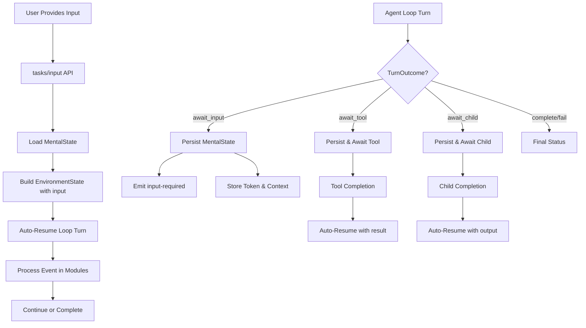

# Loop-First Agent Persistence and Auto-Resume

## Overview

The loop-first agent architecture eliminates the need for explicit durable handlers through an "always-auto-resume" model. When agents await events (user input, tool completion, child agent completion), the engine automatically resumes execution by running one additional loop turn after appending an observation to `env.inbox`. (For legacy agents the payload is still mirrored on `env.input`, but new code should read from `env.inbox.current`.) This document covers the technical implementation of auto-resume, MentalState persistence, and event-driven continuation.

## Auto-Resume Architecture



## MentalState Persistence

### 1. Unified State Model

The engine persists a single `MentalState` object (`snapshot.M`) containing all agent-specific state:

```typescript
// State is automatically managed through loop modules:
// Policy module sets goals, makes decisions
const action = { kind: 'ask_user', prompt: 'Which option do you prefer?' };

// Execution module calls ctx.requestInput (no onProvided needed)
const result = await ctx.requestInput(action.prompt);

// Transition module returns await_input outcome
return { kind: 'await_input', token: result.token };
// → Engine persists MentalState and exits
```

**MentalState Components (snapshot.M):**
- `memory.sensory` (typed per agent via `MentalState<Sensory>`, e.g., `{ current?: string }`)
- `memory.vars` (exposed as `ctx.vars` proxy)
- `memory.thoughts` and `memory.decisions`
- `memory.longTerm` (episodic/semantic/procedural)
- `goalState` (hierarchical goals with priorities, statuses)
- `policyParams` (stochastic sampling, ReAct planner config)

### 2. Auto-Resume Event Processing

When events occur (input provided, tool completed, child completed), the engine automatically resumes with the event payload:

```typescript
// Loop turn 1: Policy decides to ask user
policy: (M, env) => {
    if (!env.input) return { kind: 'ask_user', prompt: 'What should I recommend?' };
    // Turn 2+ will have env.input with user's response
    return { kind: 'language', content: `You chose: ${env.input.value}` };
}

// Execution calls ctx.requestInput, Transition returns await_input
// → Engine persists M and exits with input-required status

// When user provides input → Engine auto-resumes with:
// env.input = { kind: 'input', token: '...', value: 'user response' }
// → Policy processes the input and continues
```

### 3. Event Types and Payloads

Auto-resume supports different event types through `env.input`:

```typescript
// Input events
env.input = { kind: 'input', token: 'abc123', value: 'user response' }

// Tool completion events  
env.input = { kind: 'tool', token: 'def456', result: { success: true, data: {...} } }

// Child agent completion events
env.input = { kind: 'child', token: 'ghi789', output: { status: 'completed', result: {...} } }

// External events (custom)
env.input = { kind: 'external', token: 'jkl012', payload: { type: 'notification', data: {...} } }
```

## Auto-Resume Implementation

### Database Storage Schema

```sql
-- Unified MentalState Storage
CREATE TABLE task_snapshots (
    task_id VARCHAR PRIMARY KEY,
    tenant_id VARCHAR NOT NULL,
    snapshot JSONB NOT NULL,  -- Contains snapshot.M (MentalState)
    created_at TIMESTAMP,
    updated_at TIMESTAMP
);

-- Token-based Event Tracking
CREATE TABLE pending_tokens (
    token VARCHAR PRIMARY KEY,
    task_id VARCHAR NOT NULL,
    tenant_id VARCHAR NOT NULL,
    event_type VARCHAR NOT NULL,  -- 'input', 'tool', 'child', 'external'
    created_at TIMESTAMP,
    expires_at TIMESTAMP
);
```

### Auto-Resume Flow

When events occur, the TaskEngine performs auto-resume:

```typescript
async function autoResumeAfterEvent(taskId: string, eventPayload: any) {
    // 1. Load MentalState from snapshot
    const snapshot = await this.sessionManager.load(tenantId, taskId);
    const M: MentalState = snapshot?.M || initialM(ctx);
    
    // 2. Build EnvironmentState with event payload
    const env: EnvironmentState = {
        time: new Date().toISOString(),
        input: eventPayload,  // { kind: 'input'|'tool'|'child'|'external', ... }
        pending: await this.loadPendingTokens(taskId),
        lastExec: snapshot?.meta?.lastExec,
        externalEvents: undefined
    };
    
    // 3. Get agent's loop module overrides
    const plugin = PluginManager.findAgent(agentId);
    const overrides = plugin?.loop?.modules || {};
    
    // 4. Run one loop turn with event payload
    const { M: mNext, outcome, metrics } = await runLoop(ctx, M, env, overrides, loopOpts);
    
    // 5. Persist updated MentalState and process outcome
    await this.sessionManager.save(tenantId, taskId, { M: mNext, meta: {...} });
    await this.processOutcome(outcome, mNext, metrics);
}
```

## Loop Module Integration

### MentalState Persistence Triggers

MentalState is persisted when loop turns produce await outcomes:

1. **Transition returns `await_input`**:
   ```typescript
   transition: (env, exec, M) => {
       if (exec.kind === 'ask_user') {
           return { kind: 'await_input', token: exec.token };
       }
       // → Engine persists M and exits
   }
   ```

2. **Transition returns `await_tool` or `await_child`**:
   ```typescript
   transition: (env, exec, M) => {
       if (exec.kind === 'tool' && exec.token) {
           return { kind: 'await_tool', token: exec.token };
       }
       // → Engine persists M and waits for tool completion
   }
   ```

### MentalState Restoration in Modules

When auto-resumed, modules have access to full MentalState:

```typescript
// Policy module processes resumed input
policy: (M, env) => {
    if (env.input?.kind === 'input') {
        // Access previous state
        const previousGoals = M.goalState?.hierarchy?.roots || [];
        const thoughts = M.memory.thoughts || [];
        const vars = M.memory.vars || {};
        
        // Process the input event
        return { kind: 'language', content: `Received: ${env.input.value}` };
    }
    return { kind: 'ask_user', prompt: 'What should I do?' };
}

// Learning module updates episodic memory
learning: (prev, prevAction, obs) => {
    const episodic = (prev.memory.longTerm.episodic || []) as any[];
    episodic.push({ t: Date.now(), obs, act: prevAction });
    return { ...prev, memory: { ...prev.memory, longTerm: { ...prev.memory.longTerm, episodic } } };
}
```

## Loop-First Agent Definition

### Agent with Loop Modules

Loop-first agents declare their modules directly in `createAgent`:

```typescript
export default createAgent({
    manifest: { 
        name: 'my-agent', 
        version: '1.0.0', 
        runMode: 'loop',
        hitl: 'consent' 
    },
    loop: {
        modules: {
            policy: (M, env) => {
                // Process auto-resumed events
                if (env.input?.kind === 'input') {
                    return { kind: 'language', content: `Received: ${env.input.value}` };
                }
                if (env.input?.kind === 'tool') {
                    return { kind: 'language', content: `Tool result: ${JSON.stringify(env.input.result)}` };
                }
                
                // Initial turn logic
                return { kind: 'ask_user', prompt: 'What would you like to do?' };
            },
            
            execution: async (action, ctx, M) => {
                if (action.kind === 'ask_user') {
                    const handle = await ctx.requestInput(action.prompt);
                    return { kind: 'ask_user', token: handle.token };
                }
                if (action.kind === 'language') {
                    await ctx.reply(action.content);
                    return { kind: 'language', echoed: true };
                }
                return { kind: 'internal', done: true };
            },
            
            transition: (env, exec, M) => {
                if (exec.kind === 'ask_user') {
                    return { kind: 'await_input', token: exec.token };
                }
                if (exec.kind === 'language') {
                    return { kind: 'complete' };
                }
                return { kind: 'continue' };
            }
        }
    },
    
    async handleTask(ctx) {
        // Loop-first: modules drive execution, handleTask is minimal
        return;
    }
}, import.meta.url);
```

### Context and MentalState Integration

The TaskEngine provides a unified context with MentalState integration:

```typescript
// Context creation for loop turns
async function createLoopContext(taskId: string, tenantId: string, M: MentalState) {
    const ctx = await this.createBaseContext(taskId, tenantId);
    
    // Integrate MentalState with context
    ctx.vars = new Proxy(M.memory.vars || {}, {
        set: (target, key, value) => {
            target[key] = value;
            // vars changes are reflected in MentalState immediately
            return true;
        }
    });
    
    // Context methods access/modify MentalState
    ctx.requestInput = async (prompt) => {
        const token = generateToken();
        await this.durableHandlerRegistry.registerInput(token, taskId, tenantId);
        return { token };
    };
    
    ctx.sendTaskToAgent = async (agentId, input) => {
        const token = generateToken();
        await this.durableHandlerRegistry.registerChild(token, taskId, tenantId, agentId);
        // Start child task...
        return { token };
    };
    
    return ctx;
}
```

## Advanced Patterns

### Multi-Step Workflows

Loop modules can implement complex multi-step flows through state tracking:

```typescript
export default createAgent({
    manifest: { name: 'workflow-agent', runMode: 'loop' },
    loop: {
        modules: {
            policy: (M, env) => {
                const step = M.memory.vars?.step || 'category';
                
                // Process resumed input
                if (env.input?.kind === 'input') {
                    switch (step) {
                        case 'category':
                            M.memory.vars = { ...M.memory.vars, category: env.input.value, step: 'subcategory' };
                            return { kind: 'ask_user', prompt: 'Step 2: Choose subcategory' };
                        case 'subcategory':
                            M.memory.vars = { ...M.memory.vars, subcategory: env.input.value, step: 'processing' };
                            return { kind: 'subagent', target: 'processor', input: { 
                                category: M.memory.vars.category, 
                                subcategory: env.input.value 
                            }};
                    }
                }
                
                // Process child completion
                if (env.input?.kind === 'child') {
                    return { kind: 'language', content: `Workflow completed: ${JSON.stringify(env.input.output)}` };
                }
                
                // Initial step
                return { kind: 'ask_user', prompt: 'Step 1: Choose category' };
            },
            
            transition: (env, exec, M) => {
                if (exec.kind === 'ask_user') return { kind: 'await_input', token: exec.token };
                if (exec.kind === 'subagent' && exec.token) return { kind: 'await_child', token: exec.token };
                if (exec.kind === 'language') return { kind: 'complete' };
                return { kind: 'continue' };
            }
        }
    },
    async handleTask(ctx) { return; }
}, import.meta.url);
```

### Error Recovery and Retry Logic

Loop modules can implement error recovery through state management:

```typescript
policy: (M, env) => {
    const retryCount = M.memory.vars?.retryCount || 0;
    
    if (env.input?.kind === 'tool' && env.input.result?.error) {
        if (retryCount < 3) {
            M.memory.vars = { ...M.memory.vars, retryCount: retryCount + 1 };
            return { kind: 'ask_user', prompt: `Processing failed (attempt ${retryCount + 1}). Retry? (yes/no)` };
        }
        return { kind: 'language', content: 'Maximum retries exceeded. Operation failed.' };
    }
    
    if (env.input?.kind === 'input' && env.input.value.toLowerCase() === 'yes') {
        return { kind: 'tool', name: 'processor', args: M.memory.vars?.lastArgs || {} };
    }
    
    return { kind: 'tool', name: 'processor', args: { data: 'initial' } };
}
```

## Performance Considerations

### Auto-Resume Costs

| Component | Typical Cost | Size Impact |
|-----------|--------------|-------------|
| MentalState Load | 5-20ms | ~1-50KB |
| Loop Turn Execution | 10-100ms | Variable |
| MentalState Save | 5-15ms | ~1-50KB |
| **Total per Resume** | **20-135ms** | **~3-150KB** |

### Optimization Strategies

1. **MentalState Pruning**:
   ```typescript
   // Automatic pruning in Learning module
   learning: (prev, prevAction, obs) => {
       const episodic = (prev.memory.longTerm.episodic || []) as any[];
       // Keep only last 100 episodes
       if (episodic.length > 100) episodic.splice(0, episodic.length - 100);
       return { ...prev, memory: { ...prev.memory, longTerm: { ...prev.memory.longTerm, episodic } } };
   }
   ```

2. **Efficient State Updates**:
   ```typescript
   // Minimize MentalState mutations
   policy: (M, env) => {
       // Read-only access preferred, mutations only when necessary
       const currentVars = M.memory.vars || {};
       return { kind: 'language', content: `Current step: ${currentVars.step}` };
   }
   ```

## Debugging and Troubleshooting

### Common Issues

#### 1. Auto-Resume Not Triggering
```bash
Agent stuck after await_input, no resumed turn
```

**Cause**: Token not found or event payload malformed.

**Debug**: Check token registration and event structure:
```typescript
// In execution module
console.log('Registered token:', token, 'for task:', ctx.task.id);

// In auto-resume flow
console.log('Event payload:', env.input);
```

#### 2. MentalState Not Persisted
```bash
Error: MentalState lost after resume
```

**Cause**: MentalState not properly saved before await exit.

**Debug**: Check MentalState before/after persistence:
```typescript
transition: (env, exec, M) => {
    console.log('MentalState before await:', JSON.stringify(M, null, 2));
    if (exec.kind === 'ask_user') return { kind: 'await_input', token: exec.token };
}
```

#### 3. Infinite Loop on Resume
```bash
Agent keeps asking same question after input provided
```

**Cause**: Policy module not handling env.input correctly.

**Debug**: Check input processing logic:
```typescript
policy: (M, env) => {
    console.log('Policy input:', env.input);
    if (env.input?.kind === 'input') {
        console.log('Processing input:', env.input.value);
        // Ensure different action than initial turn
    }
}
```

### Debug Logging

Enable loop debugging:

```bash
export LOG_LEVEL=debug
export DEBUG_LOOP=true
export DEBUG_MENTAL_STATE=true
export DEBUG_AUTO_RESUME=true
```

Key log messages:
```
[LoopRunner] Starting turn with env.input: {...}
[TaskEngine] Auto-resuming task abc123 with payload: {...}
[TaskEngine] MentalState persisted: {...}
[TaskEngine] Loop outcome: await_input, token: xyz789
```

## Migration Guide

### From Handler-Based to Loop-First

```typescript
// ❌ Before: Handler-based with onProvided
export default createAgent({
    async handleTask(ctx) {
        await ctx.requestInput("Choose option:", { onProvided: 'handleChoice' });
    }
});

export async function handleChoice(ctx: Ctx, ev: { input: string }) {
    await ctx.reply(`You chose: ${ev.input}`);
    ctx.complete();
}

// ✅ After: Loop-first with auto-resume
export default createAgent({
    manifest: { name: 'my-agent', runMode: 'loop' },
    loop: {
        modules: {
            policy: (M, env) => {
                if (env.input?.kind === 'input') {
                    return { kind: 'language', content: `You chose: ${env.input.value}` };
                }
                return { kind: 'ask_user', prompt: 'Choose option:' };
            },
            transition: (env, exec, M) => {
                if (exec.kind === 'ask_user') return { kind: 'await_input', token: exec.token };
                if (exec.kind === 'language') return { kind: 'complete' };
                return { kind: 'continue' };
            }
        }
    },
    async handleTask(ctx) { return; }
});
```

## See Also

- [Loop Modules](./loop/modules.md) - Loop module contracts and examples
- [Loop Overview](./loop/overview.md) - High-level loop architecture
- [A2A Integration](./task-engine-a2a-integration.md) - Child agent auto-resume
- [Memory Systems](./memory/working-memory.md) - MentalState components
