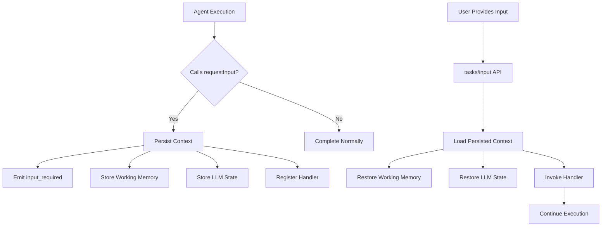

# Durable Handlers and Context Persistence

## Overview

Durable handlers enable agents to maintain state across multiple execution turns, allowing for complex workflows that involve user input, long-running operations, and multi-step processes. This document covers the technical implementation of durable handlers, context persistence patterns, and working memory restoration.

## Durable Handler Architecture



## Context Persistence Layers

### 1. Working Memory Persistence

The engine persists MentalState when an agent calls `requestInput` (await-exit flush):

```typescript
// Automatically persisted:
await ctx.setGoal("Process user request");
await ctx.addThought("Analyzing user input");
await ctx.makeDecision("approach", "interactive", "Need user clarification");
ctx.vars.processingStage = "awaiting_input";

// Triggers persistence:
await ctx.requestInput("Which option do you prefer?", { 
    onProvided: 'handleUserChoice' 
});
// Agent execution ends, context is persisted
```

**Persisted MentalState Components (snapshot.M):**
- `memory.sensory` (LLM state, last observation)
- `memory.shortTerm.vars` (exposed as `ctx.vars`)
- `memory.shortTerm.thoughts` and `memory.shortTerm.decisions`
- `memory.longTerm` (episodic/semantic/procedural)
- `goalState` (normalized hierarchy with priorities 0..1; statuses include failed)

### 2. LLM Conversation State

LLM state is stored under `M.memory.sensory.llmState`:

```typescript
// Before requestInput - conversation is active
await ctx.llm.call("What should I recommend?");
const messages = ctx.llm.getMessages();
// messages: [{ role: 'user', content: '...' }, { role: 'assistant', content: '...' }]

await ctx.requestInput("Need your preference", { onProvided: 'handleChoice' });

// After restoration - conversation continues seamlessly
export async function handleChoice(ctx: Ctx, ev: { input: string }) {
    // LLM state is fully restored
    const previousMessages = ctx.llm.getMessages();
    await ctx.llm.call(`User chose: ${ev.input}. How should I proceed?`);
}
```

### 3. Handler Registration

Handler mappings are persisted and restored:

```typescript
// Handler registration is durable
await ctx.sendTaskToAgent('analyzer', input, {
    onInputRequired: 'onAnalyzerNeedsInput',    // Persisted
    onCompleted: 'onAnalyzerCompleted'          // Persisted
});

// Even after agent restart, handlers are available
export async function onAnalyzerNeedsInput(ctx: Ctx, ev: any) {
    // This handler will be found and invoked correctly
}
```

## Context Restoration Process

### Database Storage Schema

```sql
-- Working Memory Storage (simplified)
CREATE TABLE working_memory_sessions (
    task_id VARCHAR PRIMARY KEY,
    tenant_id VARCHAR NOT NULL,
    goal TEXT,
    thoughts JSONB,
    decisions JSONB,
    variables JSONB,
    created_at TIMESTAMP,
    updated_at TIMESTAMP
);

-- LLM Conversation Storage
CREATE TABLE llm_conversations (
    task_id VARCHAR PRIMARY KEY,
    tenant_id VARCHAR NOT NULL,
    messages JSONB,
    model_config JSONB,
    created_at TIMESTAMP,
    updated_at TIMESTAMP
);

-- Handler Registration Storage
CREATE TABLE handler_registrations (
    token VARCHAR PRIMARY KEY,
    task_id VARCHAR NOT NULL,
    tenant_id VARCHAR NOT NULL,
    handlers JSONB,
    created_at TIMESTAMP,
    expires_at TIMESTAMP
);
```

### Restoration Flow

When `tasks/input` is called, the TaskEngine performs these steps (simplified):

```typescript
async function restoreContextForHandler(taskId: string, handlerName: string) {
    // 1. Load basic task context
    const taskContext = await this.loadTaskContext(taskId);
    
    // 2. Restore working memory
    const workingMemory = await this.workingMemoryStore.get(taskId);
    const ctxWithWorkingMemory = await this.extendContextWithWorkingMemory(
        taskContext, 
        workingMemory
    );
    
    // 3. Restore LLM conversation state
    const llmState = await this.conversationStore.get(taskId);
    ctxWithWorkingMemory.llm.restoreMessages(llmState.messages);
    ctxWithWorkingMemory.llm.restoreConfig(llmState.config);
    
    // 4. Restore semantic/episodic memory context
    const ctxWithMemory = await this.extendContextWithMemory(
        ctxWithWorkingMemory, 
        taskContext.tenantId
    );
    
    // 5. Restore agent-specific capabilities (sendTaskToAgent, etc.)
    const fullContext = await this.extendContextWithCapabilities(ctxWithMemory);
    
    return fullContext;
}
```

## Working Memory Integration

### Turn-level flush and await exits

MentalState is persisted:

1. **`requestInput()` is called (await exit)**:
   ```typescript
   await ctx.requestInput("Choose option:", { onProvided: 'handleChoice' });
   // → Triggers working memory persistence
   ```

2. **`sendTaskToAgent()` with handlers (await exit if non-blocking)**:
   ```typescript
   await ctx.sendTaskToAgent('child', input, { 
       onCompleted: 'onChildDone' 
   });
   // → Triggers working memory persistence for parent context
   ```

3. **Turn completion**: when the handler completes without awaiting.

### Working Memory Restoration

When a handler is invoked, MentalState is fully restored and `ctx.vars` is rehydrated from `M.memory.shortTerm.vars`:

```typescript
export async function handleUserInput(ctx: Ctx, ev: { input: string }) {
    // All working memory is available:
    
    const currentGoal = await ctx.getGoal();
    // → Returns the goal set before requestInput
    
    const thoughts = await ctx.getThoughts();
    // → Returns complete thought chain
    
    const previousDecision = await ctx.getDecision('approach');
    // → Returns decisions made before requestInput
    
    const processingStage = ctx.vars.processingStage;
    // → Returns variables set before requestInput
    
    // Continue processing with full context
    await ctx.addThought(`User provided: ${ev.input}`);
    await ctx.makeDecision('user_choice', ev.input, 'User selected option');
}
```

## Handler Context Extension

### Core Context Methods Available

All durable handlers receive a fully-extended context with:

```typescript
export async function myDurableHandler(ctx: Ctx, eventData: any) {
    // Working Memory API
    await ctx.setGoal("Updated goal");
    await ctx.addThought("Handler executing");
    await ctx.makeDecision("next_step", "continue", "Handler logic");
    ctx.vars.handlerExecuted = true;
    
    // LLM API (with restored conversation)
    await ctx.llm.call("Continue the conversation");
    const messages = ctx.llm.getMessages(); // Full history available
    
    // Memory API
    await ctx.memory.semantic.set('key', 'value');
    const memories = await ctx.recall('previous interactions');
    
    // A2A API (with proper parent-child correlation)
    await ctx.sendTaskToAgent('child', input, { 
        onCompleted: 'onChildComplete' 
    });
    
    // Input API
    await ctx.requestInput('Follow-up question?', { 
        onProvided: 'handleFollowUp' 
    });
    
    // Response API
    await ctx.reply([{ type: 'text', text: 'Handler response' }]);
    ctx.complete();
}
```

### Context Extension Implementation

The TaskEngine extends contexts through multiple layers:

```typescript
// Base context (minimal task info)
let ctx = await this.createBaseContext(taskId, tenantId);

// Layer 1: Working Memory
ctx = await this.extendContextWithWorkingMemory(ctx, taskId);
// Adds: setGoal, getGoal, addThought, getThoughts, makeDecision, etc.

// Layer 2: Memory Systems  
ctx = await this.extendContextWithMemory(ctx, tenantId);
// Adds: ctx.memory.semantic, ctx.memory.episodic, ctx.recall, ctx.remember

// Layer 3: LLM Capabilities
ctx = await this.extendContextWithLLM(ctx);
// Adds: ctx.llm with restored conversation state

// Layer 4: A2A Capabilities
ctx = await this.extendContextWithA2A(ctx);
// Adds: ctx.sendTaskToAgent with proper parent-child correlation

// Layer 5: Input/Output Capabilities
ctx = await this.extendContextWithIO(ctx);
// Adds: ctx.requestInput, ctx.reply, ctx.complete, ctx.fail
```

## Advanced Patterns

### Nested Handler Chains

Durable handlers can create complex nested flows:

```typescript
export default createAgent({
    async handleTask(ctx) {
        await ctx.setGoal("Complete multi-step workflow");
        await ctx.requestInput("Step 1: Choose category", { 
            onProvided: 'handleCategoryChoice' 
        });
        return;
    }
}, import.meta.url);

export async function handleCategoryChoice(ctx: Ctx, ev: { input: string }) {
    ctx.vars.category = ev.input;
    await ctx.addThought(`User selected category: ${ev.input}`);
    
    // Chain to next step
    await ctx.requestInput("Step 2: Choose subcategory", { 
        onProvided: 'handleSubcategoryChoice' 
    });
}

export async function handleSubcategoryChoice(ctx: Ctx, ev: { input: string }) {
    ctx.vars.subcategory = ev.input;
    await ctx.addThought(`User selected subcategory: ${ev.input}`);
    
    // Final processing
    const category = ctx.vars.category;
    const subcategory = ctx.vars.subcategory;
    
    await ctx.sendTaskToAgent('processor', { category, subcategory }, {
        onCompleted: 'handleProcessingComplete'
    });
}

export async function handleProcessingComplete(ctx: Ctx, ev: { input: any }) {
    await ctx.reply([{ 
        type: 'text', 
        text: `Workflow completed: ${JSON.stringify(ev.input)}` 
    }]);
    ctx.complete();
}
```

### Conditional Handler Flows

Handlers can implement branching logic:

```typescript
export async function handleUserChoice(ctx: Ctx, ev: { input: string }) {
    const choice = ev.input.toLowerCase();
    await ctx.makeDecision('user_choice', choice, `User selected: ${choice}`);
    
    switch (choice) {
        case 'analyze':
            await ctx.sendTaskToAgent('analyzer', ctx.vars.data, {
                onCompleted: 'handleAnalysisComplete'
            });
            break;
            
        case 'summarize':
            await ctx.sendTaskToAgent('summarizer', ctx.vars.data, {
                onCompleted: 'handleSummaryComplete'  
            });
            break;
            
        case 'export':
            await ctx.requestInput("Choose format (pdf/csv/json):", {
                onProvided: 'handleFormatChoice'
            });
            break;
            
        default:
            await ctx.reply([{ 
                type: 'text', 
                text: 'Invalid choice. Please try again.' 
            }]);
            await ctx.requestInput("Choose: analyze, summarize, or export", {
                onProvided: 'handleUserChoice' // Retry
            });
    }
}
```

### Error Recovery in Handlers

Implement robust error handling:

```typescript
export async function handleProcessingStep(ctx: Ctx, ev: { input: any }) {
    try {
        await ctx.addThought("Starting processing step");
        
        const result = await ctx.sendTaskToAgent('processor', ev.input);
        
        await ctx.addThought("Processing completed successfully");
        await ctx.reply([{ type: 'text', text: 'Step completed!' }]);
        
    } catch (error) {
        await ctx.addThought(`Processing failed: ${error.message}`);
        await ctx.makeDecision('error_recovery', 'retry', 'Processing failed, offering retry');
        
        await ctx.requestInput("Processing failed. Retry? (yes/no)", {
            onProvided: 'handleRetryChoice'
        });
    }
}

export async function handleRetryChoice(ctx: Ctx, ev: { input: string }) {
    if (ev.input.toLowerCase() === 'yes') {
        // Retry the original operation
        const originalInput = ctx.vars.lastProcessingInput;
        await handleProcessingStep(ctx, { input: originalInput });
    } else {
        await ctx.reply([{ type: 'text', text: 'Operation cancelled.' }]);
        ctx.complete();
    }
}
```

## Performance Considerations

### Context Restoration Costs

| Component | Typical Restoration Time | Size Impact |
|-----------|-------------------------|-------------|
| Working Memory | 5-15ms | ~1-10KB |
| LLM Conversation | 10-50ms | ~1-100KB |
| Semantic Memory | 20-100ms | ~10KB-1MB |
| Handler Registry | 1-5ms | ~1KB |
| **Total** | **35-170ms** | **~15KB-1MB** |

### Optimization Strategies

1. **Selective Context Restoration**:
   ```typescript
   // Only restore what's needed for the handler
   const ctx = await this.restoreMinimalContext(taskId, ['working_memory', 'llm']);
   ```

2. **Lazy Memory Loading**:
   ```typescript
   // Load memory on-demand
   const memories = await ctx.recall('relevant_context', { lazy: true });
   ```

3. **Context Caching**:
   ```typescript
   // Cache frequently-accessed contexts
   const cachedCtx = await this.contextCache.get(taskId);
   ```

## Debugging and Troubleshooting

### Common Issues

#### 1. Handler Not Found
```bash
Error: Handler 'myHandler' not found for task abc123
```

**Cause**: Handler not properly registered or registration expired.

**Fix**: Ensure handler is exported and registration is valid:
```typescript
// ✅ Correct: Handler properly exported
export async function myHandler(ctx: Ctx, ev: any) { ... }

// ❌ Wrong: Handler not exported
async function myHandler(ctx: Ctx, ev: any) { ... }
```

#### 2. Context Not Restored
```bash
Error: Cannot read property 'vars' of undefined
```

**Cause**: Working memory not properly restored.

**Debug**: Check working memory persistence:
```typescript
export async function myHandler(ctx: Ctx, ev: any) {
    console.log('Context available:', {
        hasVars: !!ctx.vars,
        hasGoal: typeof ctx.getGoal === 'function',
        hasThoughts: typeof ctx.getThoughts === 'function'
    });
}
```

#### 3. LLM State Lost
```bash
Error: No conversation history available
```

**Cause**: LLM conversation not persisted or restored.

**Debug**: Check LLM state:
```typescript
export async function myHandler(ctx: Ctx, ev: any) {
    const messages = ctx.llm.getMessages();
    console.log('LLM messages restored:', messages.length);
}
```

### Debug Logging

Enable detailed logging for handler debugging:

```bash
export LOG_LEVEL=debug
export DEBUG_HANDLERS=true
export DEBUG_WORKING_MEMORY=true
export DEBUG_CONTEXT_RESTORATION=true
```

Key log messages to look for:
```
[TaskEngine] Restoring context for handler 'myHandler' task 'abc123'
[WorkingMemory] Loaded working memory: goal='...', thoughts=5, decisions=3
[LLMContext] Restored conversation: 8 messages
[HandlerRegistry] Found handler 'myHandler' for token 'xyz789'
[TaskEngine] Handler 'myHandler' completed successfully
```

## Migration Guide

### From Synchronous to Durable Handlers

```typescript
// ❌ Before: Synchronous processing (blocks)
export default createAgent({
    async handleTask(ctx) {
        const userChoice = await promptUser("Choose option:");
        const result = await processChoice(userChoice);
        await ctx.reply([{ type: 'text', text: result }]);
        ctx.complete();
    }
});

// ✅ After: Durable handler pattern
export default createAgent({
    async handleTask(ctx) {
        await ctx.setGoal("Process user choice");
        await ctx.requestInput("Choose option:", { 
            onProvided: 'handleUserChoice' 
        });
        return;
    }
});

export async function handleUserChoice(ctx: Ctx, ev: { input: string }) {
    const result = await processChoice(ev.input);
    await ctx.reply([{ type: 'text', text: result }]);
    ctx.complete();
}
```

### From Manual State Management

```typescript
// ❌ Before: Manual state management
let globalState = {};

export async function myHandler(ctx: Ctx, ev: any) {
    const state = globalState[ctx.task.id] || {};
    // ... process with state
    globalState[ctx.task.id] = updatedState;
}

// ✅ After: Working memory
export async function myHandler(ctx: Ctx, ev: any) {
    // State is automatically persisted and restored
    const currentGoal = await ctx.getGoal();
    const previousThoughts = await ctx.getThoughts();
    ctx.vars.processingStep = 'handler_executed';
    
    // State persists automatically across handler calls
}
```

## See Also

- [Working Memory](./memory/working-memory.md) - Working memory API details
- [Child Input Required Flow](./a2a/child-input-required-flow.md) - Parent-child input handling
- [A2A Usage Guide](./a2a/usage-guide.md) - Agent-to-agent communication patterns
- [Memory SQL Adapter](./memory-sql-adapter.md) - Database persistence implementation
