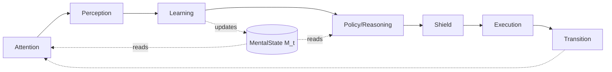
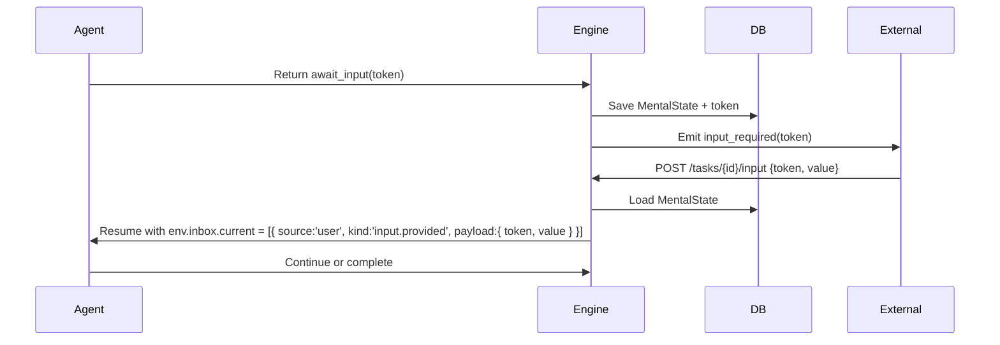

# A-P-L-R-E-T Architecture with Stage Dispatcher Pattern

**Production-Ready Agent Architecture for callagent Framework**

---

> **👥 Audience**: Agent developers using callagent  
> **🎯 Purpose**: Learn how to build production-ready agents with A-P-L-R-E-T architecture  
> **🔧 For framework maintainers**: See [Framework Changes](./framework-changes-for-aplret.md)  

---

## Overview

This document describes a **reusable, production-ready agent architecture** that combines:

1. **Brain-inspired cognitive loop** (A-P-L-R-E-T): Attention → Perception → Learning → Reasoning/Policy → Shield → Execution → Transition
2. **Typed intent system**: Policy emits discriminated unions, Dispatcher handles exhaustively
3. **Stage dispatcher pattern**: Explicit control flow using typed stages and handler maps
4. **Separation of concerns**: MentalState (M) for cognition, `ctx.vars` for control state
5. **Effect safety**: Budget-aware, timeout-protected, retryable effects
6. **Future-proof design**: Clear upgrade path to pattern matching (ts-pattern) or statecharts (XState)

### Key Benefits

- **Visibility**: Explicit stages and typed intents make control flow scannable
- **Safety**: Effect budgets, timeouts, retries, and shield checks built-in
- **Maintainability**: Adding new intents/stages = extending discriminated unions
- **Testability**: Pure functions for cognition, isolated effects with golden path tests
- **Type safety**: Exhaustive pattern matching prevents runtime errors
- **Scalability**: Clean path from simple dispatcher → exhaustive matching → statecharts

### Effect → Observation Pipeline

- **Execution always returns `{ action, result }`** where `result` is an `ExecResult<Data>` (you control `Data`) containing status, typed `data`/`error`, provenance (`ts` plus any correlation metadata), and optional receipts.
- **Transition packages that `ExecResult<Data>` into one or more normalized `Observation<Payload>` objects** (you control `Payload`) and returns them via `TransitionOut.observations` together with the control signal (`continue`, `await_*`, etc.).
- **Runtime handoff:** The loop runner appends every observation to `env.inbox.all` and stages the batch on `env.inbox.current` before the next turn begins. Perception reads the staged slice; history remains in `all` for replay/debugging.
- **Environment exposes `{ world, inbox: { current, all } }`** to the next turn. `current` holds only the observations for the upcoming turn; `all` keeps the ordered log. Perception treats `current` as read-only, validates each entry, then the runtime clears it when the turn ends.
- **Turn _t+1_ – Perception: Perception validates and annotates inbox entries** (plus any ambient world state). At the start of the next turn, Perception drains the inbox (append-only queue), validates each observation, and hands Learning a structured observation payload. Learning then updates the mental state, making the effects from turn _t_ available to Policy on turn _t+1_.
- **Learning remains the single writer of MentalState (M)**; all effect outputs must flow via `Observation → Learning → M`, not through ad-hoc state writes.
- **Continue outcomes always carry `observations: Observation[]`** so downstream tooling/tests can assert what effects occurred, even when the loop stays active.

---

## Design Checklist

**Checklist** an LLM should follow when **designing and debugging** agents in  A-P-L-R-E-T framework.  

# APLRET Design & Debugging Checklist

## 0) First principles (turns + MDP thinking)

* [ ] Treat each step as a **turn**: any effect result is only available **next turn** after it flows Perception → Learning → M. Don't "see the future." 
* [ ] Keep the classic loop: **observe → update belief → choose action** (Policy is pure on M). 

## 1) Module responsibilities (use this mapping every time)

* [ ] **Attention**: pick focus/filters; no decisions, no effects.
* [ ] **Perception**: **normalize & validate** inputs (schema/units/ranges), label event type (input/tool/child); no effects. (This is the observation step.) 
* [ ] **Learning**: the **only** place to immutably update **M** (belief/world model, goals, reward). No effects. (Belief update.) 
* [ ] **Policy**: choose **typed Intent** purely from **M** (π(M) → Intent). No env/ctx reads here.
* [ ] **Shield**: enforce constraints/budgets/PII; **pass/transform/defer/veto** before acting. (Constrained MDP + shielding.) 
* [ ] **Execution**: implement **HOW** (effects only). Use timeouts/retries + **idempotency keys**. Write **control** to `ctx.vars` only. 
* [ ] **Transition**: emit `continue | await_* | complete | fail`; bookkeeping only.

## 2) State separation (never mix these)

* [ ] **Cognitive & persistent** → **M** via Learning (user intent/entities, validated tool results to be reasoned on).
* [ ] **Control & ephemeral** → **`ctx.vars`** (stage, tokens, prompted flags, step indices).
* [ ] Never write to **M** outside Learning; never persist cognition in `ctx.vars`. (Mirrors belief vs. control in POMDP/state patterns.) 

## 3) Typed safety (prevent drift at compile time)

* [ ] Keep **Intents** and **Stages** as **closed unions**; handle them **exhaustively** (ts-pattern or exhaustive switch). Build fails if a case is missing. ([GitHub][4])
* [ ] Enforce **intent → allowed stages** mapping (typestate) and **stage invariants** at runtime (require/forbid keys).
* [ ] For complex flows, promote to **statecharts** (guards, timeouts, parallel states, visualization). 

## 4) Turn templates (how to "think in turns")

* [ ] **Gather data via tool**

  * Turn N: Policy(Intent=fetch) → Shield → Execution(call tool, store token in `ctx.vars`) → Transition(`await_tool`).
  * Turn N+1: Perception(validates tool result) → Learning(write to M) → Policy(decide next).
* [ ] **User input**

  * Turn N: Execution(`requestInput` with `setStage='awaiting_input'`) → Transition(`await_input`).
  * Turn N+1: Perception(validate input) → Learning(update M) → Policy(next Intent).
    (Enforces observe→update→decide rhythm.) 

## 5) Effect safety & budgets

* [ ] Wrap external calls with **timeouts + bounded retries**; attach **idempotency keys** to get exactly-once semantics across resumes. 
* [ ] Always pass intents through **Shield** before external effects; allow **transform/defer/veto** when over budget/unsafe. (Shielding in safe RL.)  
* [ ] Record usage/cost per effect; include estimate in Shield checks (constrained MDP mindset). 

## 6) Logging & observability (make debugging easy)

* [ ] Log **{turn, stage, intent, token, shield_action, effect_cost, latency}** every turn.
* [ ] On invariant/typestate failures, include **required/forbidden keys** and current `ctx.vars` diff.
* [ ] For each effect, log **idempotency key** and retry count.

## 7) Debugging playbook (quick triage → deep fix)

**A. Fast checks**

* [ ] Did Policy read env/ctx instead of M? If yes, fix: route via Perception→Learning first. 
* [ ] Did a handler violate **stage invariants** (e.g., awaiting_input without token)? Add invariant asserts.
* [ ] Missing handler case? Turn on **exhaustive matching** (ts-pattern or exhaustive switch). 

**B. Resume errors**

* [ ] After `await_*`, is the resume event first validated in **Perception** and stored to **M** in **Learning**? If not, fix.
* [ ] Double calls on resume? Ensure **idempotency keys** are used and checked. 

**C. Safety issues**

* [ ] Did Shield run and log a decision for the intent? If not, treat as a bug.  
* [ ] Are cost/budget constraints encoded as Shield guards (defer/veto) rather than ad-hoc checks? (Constrained MDP.) 

**D. Control vs cognition mix-ups**

* [ ] Cognitive facts in `ctx.vars`? Move to **M** via Learning.
* [ ] Control flags in M? Move to **`ctx.vars`**.

**E. Complex branching**

* [ ] If the dispatcher is growing brittle, migrate the flow to **statecharts** with **guards** and **timeouts** to clarify transitions and avoid if-pyramids. 

**F. Security/supply-chain sanity (bonus)**

* [ ] When generating tool/package names or commands, add a **validation step** (Perception) to avoid "package hallucination/slopsquatting" hazards. 

## 8) Test strategy (must-haves)

* [ ] **Golden path** E2E: prompt → await → respond → complete (assert stages, tokens, Policy purity).
* [ ] **Resume paths**: tool and child completion; ensure data only appears **after** resume via P→L→M.
* [ ] **Failure paths**: Shield veto/defer, timeouts, retries, idempotency collisions.
* [ ] **Exhaustiveness**: add a compile-time test (ts-pattern `.exhaustive()` or never-type trick in switch). 


---

## Hard rules to follow

You are an A-P-L-R-E-T agent operating in discrete TURNS. Follow these hard rules:

1) TURN DISCIPLINE (POMDP mindset)
- You NEVER read "future" data. Any effect result is only available on the NEXT turn.
- Route all environment or resume events through Perception → Learning → MentalState (M) before Policy reasons on them.
- Policy is a PURE function of M. Policy must NOT read env, ctx, or perform side effects.

2) MODULE RESPONSIBILITIES
* **Attention (A) — what to look at**
  * **Purpose:** Prioritize/focus inputs so downstream work is cheaper and more relevant.
  * **Focus on:** simple, explainable filters (e.g., "only tool events", "DOM region X").
  * **Inputs → Output:** (M_{t-1}, s_t) → **α_t** (focus mask/priority list).
  * **Do:** cut noise; save tokens/compute.
  * **Don't:** infer intent, call tools, or modify state.

* **Perception (P) — make inputs usable**
  * **Purpose:** Normalize and validate raw inputs into a clean **observation**.
  * **Focus on:** types, ranges, schemas, units, timestamps, provenance; **structured errors**.
  * **Inputs → Output:** (s_t, α_t) (+ inbox events) → **o_t** with `source` (user/tool/child/env) and `kind` (taxonomy label).
  * **Do:** annotate provenance; emit `o_t.error` instead of throwing.
  * **Don't:** write memory, guess goals/intent, or perform effects.

* **Learning (L) — update the mind (only writer of M)**
  * **Purpose:** Turn the new observation into a better **mental state (M_t)**.
  * **Focus on:** immutable update (return a new M), provenance, safe online changes.
  * **Inputs → Output:** (M_{t-1}, a_{t-1}, o_t) (opt. (r_{t-1})) → **M_t**.
  * **Do:** write episodic/semantic/procedural memory; refine world model; adjust goals, reward weights, and affect.
  * **Don't:** choose external actions.

* **Policy / Reasoning (R) — what to do next**
  * **Purpose:** Decide **WHAT** to do based on the current mind.
  * **Focus on:** clear, typed intentions (and short plans when needed).
  * **Inputs → Output:** (M_t) → **Intent** *(or small Plan)*.
  * **Do:** stick to simple intent types: AskUser, UseTool, Navigate, Reflect, Delegate.
  * **Don't:** perform effects or mutate M.

* **Shield (S) — safety, compliance, budgets**
  * **Purpose:** Enforce constraints before anything runs.
  * **Focus on:** explicit outcomes: **pass / transform / defer / veto**.
  * **Inputs → Output:** Intent/Plan, (M_t) → guarded Intent/Plan or block.
  * **Do:**
    * **transform** (edit to safe form) with a short note,
    * **defer** (state what approval/info is needed),
    * **veto** (clear human-friendly reason).
  * **Don't:** run effects or change M.

* **Execution (E) — how to do it (effects happen here)**
  * **Purpose:** Ground the intent into real actions (APIs/tools/robotics) with retries/timeouts.
  * **Focus on:** idempotency keys, correlation IDs, timeouts, clean receipts/results.
  * **Inputs → Output:** Intent/Plan → **exec result** (data/status/receipts).
  * **Do:** update only **control state** (ids, retries, timers); feed outputs back as observations.
  * **Don't:** stash semantic knowledge (Learning will write M).

* **Transition (T) — advance the loop**
  * **Purpose:** Apply effects to the environment model and steer control flow.
  * **Focus on:** produce next env state, extrinsic reward, and post-action signals.
  * **Inputs → Output:** env_t + exec result → **next env**, **r_ext**, **observations**, **control**.
  * **Control signals:** `continue | await_input | await_tool | await_child | complete | fail`.
  * **Don't:** modify M or intents.

* **Design rules**
  * **Single-writer:** Only **Learning** updates (M).
  * **Effect boundary:** Only **Execution** causes side effects.
  * **Typed intentions:** Policy emits clear intent types (or a short plan).
  * **Graceful errors:** Perception emits structured error observations; no cross-module throws.
  * **Provenance everywhere:** timestamps, ids, sources on observations and memory writes.
  * **Short feedback loop:** keep online updates small/safe; do heavy optimization offline.

* **What to measure**
  * **Attention:** token/compute saved w/o hurting success.
  * **Perception:** schema error rate, latency.
  * **Learning:** memory hit@k, world-model prediction error.
  * **Policy:** chain success rate, think time.
  * **Shield:** block/transform rates, reasons.
  * **Execution:** exec success %, retries, cost.
  * **Transition:** time in await states, completion rate.

3) STATE SEPARATION
- Put mechanical/control state in ctx.vars (stage, token, flags, subtask indices).
- Put cognitive facts in M via Learning (user intent, belief/estimates, tool results to reason about).
- Never write to M outside Learning. Never persist cognition in ctx.vars.

4) STAGE & TYPE SAFETY
- Always maintain the current stage and obey stage invariants.
- Enforce intent→allowed-stages typestate; error if an Intent is not valid for the current stage.
- Handle Intents EXHAUSTIVELY. If a new Intent or Stage appears, add explicit handling.

5) EFFECT SAFETY
- Wrap external calls with timeouts and bounded retries; attach idempotency keys for exactly-once semantics across resumes.
- Call Shield BEFORE executing external tools/requests. Abort or defer if over budget or violating constraints.
- Log {turn, stage, intent, token, shield_action, effect_cost, latency} for traceability.

6) HOW TO THINK (TURN TEMPLATES)
- If you need data from a tool/API:
  Turn N: Policy→Intent(fetch), Shield, Execution→invoke tool, store token in ctx.vars, Transition→await_tool(token).
  Turn N+1: Perception validates tool result; Learning writes validated result to M; Policy chooses next Intent (e.g., fetch more if invalid/incomplete; otherwise proceed).
- For user input:
  Turn N: prompt + requestInput(setStage='awaiting_input') → await_input(token).
  Turn N+1: Perception validates input; Learning updates M; Policy decides next step.
- For sub-agent delegation:
  Turn N: Execution→sendTaskToAgent(agent, input, {setStage, awaitCompletion:false}) → await_child(token). Token stored at ctx.vars.child.token automatically.
  Turn N+1: Perception validates child observation from env.inbox.current; Learning writes result to M; Policy decides next Intent.
  (With awaitCompletion:true, result arrives immediately in same turn—use for tool-like blocking calls.)

7) I/O CONTRACTS (examples)
- Perception must produce normalized observation objects (e.g., {text, eventType, resumeToken?, meta?}).
- Learning must return a NEW M (immutable update) that includes everything Policy will need next turn.
- Execution returns either ask_user/tool/subagent/internal and may set ctx.vars.*. Execution never mutates M.

8) WHEN IN DOUBT
- Prefer gathering/validating in a FUTURE TURN rather than mixing steps.
- Prefer explicit failure with actionable messages over silent assumption.

9) OUTPUT STYLE
- Be explicit about which module is doing what (e.g., "Perception validated …", "Learning updated M …", "Policy emitted Intent …").
- If stage/typestate would be violated, refuse and explain.

Follow this minimal recipe every turn:
A) Attention: pick focus flags.
B) Perception: normalize+validate env input → observation {…}.
C) Learning: M' = f(M, observation) (immutable).
D) Policy: Intent = π(M').
E) Shield: gate = pass/transform/defer/veto. If not pass, stop.
F) Execution: handle Intent respecting current stage; update ctx.vars only; produce outcome.
G) Transition: emit await_* or complete or continue.

Your single source of truth for cognition is M. Your single source of truth for control is ctx.vars. Effects are only in Execution. Data needed later must flow Perception→Learning→M first.


---

## Quick Start

**New to A-P-L-R-E-T?** Start here with a minimal but production-ready agent:

```typescript
import { createAgent } from '@a2arium/callagent-core';
import type {
  TaskContext,
  MentalState,
  ExecutableAction,
  EnvironmentState,
  AttentionSignal,
  ExecErrorPayload,
  TransitionOut
} from '@a2arium/callagent-core';

// 1. Define typed stages for explicit control flow
type Stage = 'idle' | 'awaiting_input' | 'completed';

// 2. Define typed intents (Policy decides WHAT to do)
type Intent =
  | { kind: 'prompt_user' }
  | { kind: 'answer_with_llm'; query: string };

// 3. Minimal, reusable stage helpers
import { createStageFacade } from '@a2arium/callagent-core';

const Stage = createStageFacade<Stage>({
  initial: 'idle',
  invariants: {
    awaiting_input: { require: ['token'], forbid: ['completed.called'] },
    completed: { require: ['awaiting_input.called'] }
  },
  // Optional: automatically mark flags when entering a stage
  autoMarks: {
    completed: { 'completed.called': true },
    awaiting_input: { 'awaiting_input.called': true }
  },
  onEnter: {
    executing: (ctx) => ctx.progress(50, 'running'),
    completed: (ctx) => ctx.complete(100, 'done')
  }
});

// Tip: Stage facade reads both ctx.vars and m.memory.vars, so mirroring stage flags into
// memory keeps invariants working even when you persist them.
// Optional `onEnter` hooks let you centralize progress/complete side-effects that should occur
// whenever a stage is entered; omit them if you prefer to drive status updates manually.

// 4. Stage dispatcher (Execution decides HOW to do it)
type Sensory = { current?: string };
type Obs = { text?: string; eventType: 'user_message' | 'idle' };
type InboxPayload = { value?: string | { text?: string }; token?: string };

const handlers: Record<Stage, (ctx: TaskContext, m: MentalState<Sensory>) => Promise<ExecutableAction>> = {
  idle: async (ctx, m) => {
    await ctx.reply('How can I help you today?');

    // ✅ NEW: Input-first approach with automatic token and stage management
    const handle = await ctx.requestInput('Your message', {
      setStage: 'awaiting_input'  // Automatically sets stage and token
    });
    const token = handle.token;
  
    return { kind: 'ask_user', token };
  },
  
  awaiting_input: async (ctx, m) => {
    // Read cognitive state from M (not from env!)
    const userText = m.memory?.sensory?.current;
    if (!userText) return { kind: 'internal', done: true };
    
    // Call LLM (framework method - already safe)
    const result = await ctx.llm.call(userText);
    await ctx.reply(result[0].content);
    
    // Mark complete (set completion flag before stage transition for invariant check)
    ctx.vars.set('completed.called', true);
    Stage.setStage(ctx, 'completed'); // autoMarks sets 'completed.called'
    
    return { kind: 'internal', done: true };
  },
  
  completed: async () => {
    return { kind: 'internal', done: true };
  }
};

// 5. Create agent with all modules
export const agent = createAgent<Sensory, Obs, AttentionSignal, unknown, ExecErrorPayload, InboxPayload>({
  manifest: 'agent.json',
  llmConfig: { provider: 'openai', modelAliasOrName: 'fast' },

  // A - Attention: What to focus on
  attention: (m, env: EnvironmentState<InboxPayload>) => {
    const hasUserObservation = env.inbox.current.some(o => o.source === 'user');
    return { wantPrompt: !hasUserObservation };
  },

  // P - Perception: Normalize inbox payloads
  perception: (env: EnvironmentState<InboxPayload>): Obs => {
    const latestInput = env.inbox.current.find(o => o.source === 'user');
    const value = latestInput?.payload?.value;
    const text = typeof value === 'string' ? value : value?.text;
    return {
      text,
      eventType: latestInput ? 'user_message' : 'idle'
    };
  },

  // L - Learning: Update M (immutable, pure)
  learning: (prev, _action, obs: Obs): MentalState<Sensory> => ({
    ...prev,
    memory: {
      ...prev.memory,
      sensory: { current: obs.text ?? prev.memory?.sensory?.current }
    }
  }),

  // R - Policy: Decide WHAT to do (pure function of M - NO control state!)
  policy: (m): Intent => {
    // Policy reads ONLY cognitive state, not control state (stage)
    const userText = m.memory?.sensory?.current;
    
    // Decision based on cognition
    if (userText) {
      return { kind: 'answer_with_llm', query: userText };
    }
    
    return { kind: 'prompt_user' };
  },

  // S - Shield: Safety checks (required)
  shield: (m, intent) => {
    // Basic pass-through (add budget/PII checks in production)
    return { action: 'pass', intent };
  },

  // E - Execution: Dispatch to stage handlers (respect stage AND intent)
  execution: async (intent, ctx, m) => {
    const stage = V.stage(ctx);
    
    if (stage === 'idle' && intent.kind === 'prompt_user') {
      return handlers.idle(ctx, m);
    }
    if (stage === 'awaiting_input' && intent.kind === 'answer_with_llm') {
      return handlers.awaiting_input(ctx, m);
    }
    if (stage === 'completed') {
      return handlers.completed(ctx, m as any);
    }
    
    // Fallback: do nothing
    return { kind: 'internal', done: true };
  },

  // T - Transition: Control loop flow (based on control state)
  transition: (
    _env: EnvironmentState<InboxPayload>,
    exec,
    ctx
  ): TransitionOut<InboxPayload> => {
    if (exec.kind === 'ask_user') {
      return { kind: 'await_input', token: exec.token };
    }
    if (V.completeCalled(ctx as TaskContext)) {
      return { kind: 'complete', result: { ok: true } };
    }
    return { kind: 'continue', observations: [] };
  }
}, import.meta.url);
```

**Best Practices Included:**

✅ **Typed stages** - Explicit control flow states  
✅ **Typed intents** - Policy outputs are type-safe  
✅ **Typed façade (V)** - Type-safe access to `ctx.vars`  
✅ **Stage dispatcher** - Clean separation: Policy → Intent → Handler  
✅ **Pure Policy** - Reads only from M, not from env  
✅ **Immutable Learning** - Uses spread operators, no mutation  
✅ **State separation** - M for cognition, ctx.vars for control  

**What's happening:**

1. **Policy** (R) reads M and decides to `prompt_user` or `answer`
2. **Execution** (E) uses dispatcher to delegate to stage handlers
3. **Handlers** perform effects and update control state (V.setStage, V.setToken)
4. **Learning** (L) keeps M immutable - only updates worldModel
5. **Transition** (T) manages async flow (await_input) and completion

**Next steps:**

- Add stage invariants ([Section 5](#5-stage-dispatcher-pattern))
- Add exhaustive intent matching with ts-pattern ([Section 3](#3-typed-intent-system))
- Wrap external calls with `runEffect()` ([Section 7](#7-effect-safety-and-budgets))
- Write golden path test ([Section 9](#9-testing-strategy))


## Table of Contents

- [1. Architecture Philosophy](#1-architecture-philosophy)
- [2. Core Concepts](#2-core-concepts)
- [3. Typed Intent System](#3-typed-intent-system)
- [4. Module Contracts](#4-module-contracts)
- [4.1. Logging in APLRET Modules](#41-logging-in-aplret-modules)
- [5. Stage Dispatcher Pattern](#5-stage-dispatcher-pattern)
- [6. State Management Strategy](#6-state-management-strategy)
- [7. Effect Safety and Budgets](#7-effect-safety-and-budgets)
- [8. Resume Contract](#8-resume-contract)
- [9. Testing Strategy](#9-testing-strategy)
- [10. Upgrade Path](#10-upgrade-path)
- [11. Common Patterns](#11-common-patterns)
- [12. Best Practices](#12-best-practices)
- [13. Troubleshooting](#13-troubleshooting)
- [14. See Also](#14-see-also)
- [Appendix A: Complete Implementation Example](#appendix-a-complete-implementation-example)

---

## 1. Architecture Philosophy

### Brain-Inspired Loop (A-P-L-R-E-T)

The architecture mirrors cognitive science research on brain-inspired intelligence, with **six cognitive modules** plus **Shield** as a pre-execution guard:



**Why this matters:**

**Six cognitive modules (A-P-L-R-E-T):**
- **Attention (α_t)**: Goal and affect-guided focus (what matters now?)
- **Perception (o_t)**: Normalize multimodal environment into compact observation
- **Learning (M_t)**: Pure, immutable updates to mental state (memory, world model, goals, emotion, reward)
- **Reasoning/Policy (π)**: Decide what Intent to emit based on current mental state (pure function of M)
- **Execution (E)**: Perform effects (reply, requestInput, LLM calls, tool invocations) with safety
- **Transition (T)**: Control loop flow (continue | await_input | await_tool | await_child | complete | fail)

**Shield (S): Pre-execution guard (not a cognitive module):**
- Safety checks, budget enforcement, PII detection, HITL consent
- Runs between Policy and Execution: `intent ← policy(M) → intent' ← shield(intent') → execution(intent')`
- Can pass, transform, veto, or defer to user

### Typed Intent System

**Key Decision: Policy emits typed Intent, Dispatcher handles exhaustively**

```typescript
// Policy is the "brain" (reasoning)
type Intent =
  | { kind: 'prompt_user' }
  | { kind: 'answer_with_llm'; query: string }
  | { kind: 'plan_and_execute'; goal: string }
  | { kind: 'wait' };

policy: (m: MentalState) => Intent

// Execution is the "hands" (effects)
execution: (intent: Intent, ctx: TaskContext) => Promise<ExecutableAction>
```

This prevents drift between Policy and Dispatcher—Policy decides WHAT to do, Dispatcher decides HOW to do it.

### State Pattern for Control Flow

Use the **State pattern** via a dispatcher map to avoid if-pyramids:

```typescript
type Stage = 'idle' | 'awaiting_input' | 'planning' | 'executing' | 'completed';

const handlers: Record<Stage, (ctx: TaskContext, m: MentalState) => Promise<ExecutableAction>> = {
  idle: async (ctx, m) => { /* ... */ },
  awaiting_input: async (ctx, m) => { /* ... */ },
  planning: async (ctx, m) => { /* ... */ },
  executing: async (ctx, m) => { /* ... */ },
  completed: async (ctx, m) => ({ kind: 'internal', done: true })
};
```

---

## 2. Core Concepts

### MentalState (M_t) - The Cognitive Brain

`MentalState` represents the agent's **cognitive state** at turn `t`. It should be treated as **immutable** and updated only through the Learning module.

```typescript
type MentalState = {
  // NOTE: vars? is a read-only alias to memory.vars
  // ALWAYS use ctx.vars for writes; treat M.vars as framework-internal
  vars?: Record<string, unknown>;
  
  memory: {
    sensory: unknown;
    vars: Record<string, unknown>;
    thoughts?: ThoughtEntry[];
    decisions?: Record<string, DecisionEntry>;
    scratch?: unknown;
    window?: unknown;
    longTerm: {
      episodic: EpisodicEvent[];
      semantic: { concepts: SemanticConcept[] };
      procedural: { skills: Skill[] };
    };
  };
  worldModel: WorldModel;           // Beliefs about the environment
  goalState: GoalState;             // Current goals and priorities
  emotion: EmotionState;            // Affective state (M_emo in survey)
  reward: RewardState;              // Reward tracking (M_rew in survey)
  policyParams?: PolicyParams;      // Policy sampling config
};
```

**Key principles:**

- **Read-only in most modules**: Only Learning should update M
- **Pure cognition**: Derived features, beliefs, goals live here
- **Persistent**: Saved at turn boundaries, restored on resume
- **M.vars is read-only**: Framework internal; always use `ctx.vars` for writes

### ctx.vars - The Control State

`ctx.vars` is a **writable cache** for ephemeral control state (current stage, pending tokens, flags).

```typescript
// ✅ Use ctx.vars for control state
ctx.vars.set('stage', 'awaiting_input');
ctx.vars.set('token', handle.token);
ctx.vars.set('prompted', true);

// ❌ Never write to M directly (except in Learning)
m.memory.vars.stage = 'awaiting_input';  // Violates immutability

// ⚠️ M.vars is read-only convenience; prefer ctx.vars always
const stage = m.vars?.stage;  // OK to read
m.vars.stage = 'idle';        // ❌ Don't write to M.vars
```

**Why separate?**

- M is cognitive; vars is mechanical
- M persists across sessions; vars is ephemeral per turn
- Keeps Learning pure and testable

### Nested Path Support

`ctx.vars` supports automatic nested path creation for complex control state:

```typescript
// Alternative approaches for structured control state

// Approach 1: Build nested structure step by step
ctx.vars.set('workflow.stage', 'data_processing');
ctx.vars.set('workflow.currentStep', 3);
ctx.vars.set('workflow.errors', []);
ctx.vars.set('user.session.id', 'sess_123');
ctx.vars.set('user.session.preferences', { theme: 'dark' });

// Approach 2: Set complete nested objects directly
ctx.vars.set('workflow', {
    stage: 'data_processing',
    currentStep: 3,
    errors: []
});

ctx.vars.set('user', {
    session: {
        id: 'sess_123',
        preferences: { theme: 'dark' }
    }
});

// Both approaches create the same nested structure:
// {
//   workflow: { stage: 'data_processing', currentStep: 3, errors: [] },
//   user: { session: { id: 'sess_123', preferences: { theme: 'dark' } } }
// }

// Update with access to current value
ctx.vars.update('workflow.currentStep', (current) => (current || 0) + 1);

// Access nested values (same for both approaches)
const currentStage = ctx.vars.get('workflow.stage');
const stepNumber = ctx.vars.get('workflow.currentStep');
const userId = ctx.vars.get('user.session.id');

// Check if nested path exists
if (ctx.vars.has('workflow.errors')) {
    // Handle workflow errors
}

// Delete nested property
ctx.vars.delete('user.session.preferences');
```

> 💡 **Chat bridge tip**: Tasks triggered via the chat bridge receive a typed `BridgeTaskInput`. You can read the originating channel metadata (including `userId`) directly from the task input and mirror anything you need into control state:
>
> ```typescript
> import type { BridgeTaskInput } from '@a2arium/callagent-chat-bridge';
>
> const input = ctx.task.input as BridgeTaskInput;
> const { route } = input;
> if (route.userId) {
>     ctx.vars.set('user.session.id', route.userId);
> }
> ctx.vars.set('session.route', route); // optional: keep network/conversationId handy for logs
> ```

#### **Key Methods:**

| Method | Description | Use Case |
|--------|-------------|----------|
| `set('path.to.prop', value)` | Direct assignment, creates nested structure | Setting control state |
| `update('path.to.prop', fn)` | Update with access to current value | Conditional state updates |
| `get('path.to.prop')` | Get nested value | Reading control state |
| `has('path.to.prop')` | Check if nested path exists | State validation |
| `delete('path.to.prop')` | Delete nested property | Cleanup control state |
| `merge(patch)` | Merge objects (dots are keys, not paths) | Batch updates |

**Best Practice:** Use nested paths to organize related control state logically, keeping the same separation between cognitive data (M) and control data (ctx.vars).

---

## 3. Typed Intent System

### Intent Discriminated Union

Define a **closed set of intents** that Policy can emit:

```typescript
type Intent =
  | { kind: 'prompt_user' }
  | { kind: 'answer_with_llm'; query: string; context?: string }
  | { kind: 'plan_and_execute'; goal: string; constraints?: string[] }
  | { kind: 'call_tool'; toolName: string; args: Record<string, unknown> }
  | { kind: 'delegate_to_child'; childAgentId: string; input: unknown }
  | { kind: 'wait' }
  | { kind: 'complete'; result: unknown };
```

### Policy Emits Intent

```typescript
policy: (m: MentalState): Intent => {
  const userIntent = m.worldModel.lastUserIntent;
  const userText = m.memory.sensory.current;
  const sentiment = m.worldModel.userSentiment;
  
  // Reasoning based on cognition
  if (userIntent === 'question' && userText) {
    return { kind: 'answer_with_llm', query: userText };
  }
  
  if (userIntent === 'command' && sentiment === 'urgent') {
    return { kind: 'plan_and_execute', goal: userText };
  }
  
  if (!userIntent) {
    return { kind: 'prompt_user' };
  }
  
  return { kind: 'wait' };
}
```

### Dispatcher Handles Intent Exhaustively

Use **ts-pattern** for exhaustive matching (compile-time safety) — optional upgrade when branching grows:

```typescript
import { match } from 'ts-pattern';

execution: async (intent: Intent, ctx: TaskContext, m: MentalState): Promise<ExecutableAction> => {
  const stage = V.stage(ctx);
  
  return match(intent)
    .with({ kind: 'prompt_user' }, async () => {
      await ctx.reply('How can I help you?');
      V.setPrompted(ctx, true);

      // ✅ NEW: Input-first approach with automatic token and stage management
      const handle = await ctx.requestInput('Your message', {
        setStage: 'awaiting_input'  // Automatically sets stage and token
      });
      const token = handle.token;

      return { kind: 'ask_user', token };
    })
    .with({ kind: 'answer_with_llm' }, async ({ query }) => {
      const result = await ctx.llm.call(query);
      await ctx.reply(result[0]?.content);
      ctx.complete(100, 'completed');
      V.setCompleteCalled(ctx, true);
      V.setStage(ctx, 'completed');
      return { kind: 'internal', done: true };
    })
    .with({ kind: 'plan_and_execute' }, async ({ goal }) => {
      // Generate plan
      V.setStage(ctx, 'planning');
      return { kind: 'internal', done: true };
    })
    .with({ kind: 'wait' }, async () => {
      return { kind: 'internal', done: true };
    })
    .exhaustive();  // ✅ Compile error if Intent case is missing
}
```

---

## 4. Module Contracts

### Per‑Agent Typing (Sensory, Obs, ExecData, ObservationPayload)

Define explicit `Sensory` and `Obs` types and pass them to `createAgent<Sensory, Obs>`. When you need typed execution results or inbox payloads, extend the signature to `createAgent<Sensory, Obs, Alpha, ExecData, ObservationPayload>` (all tail parameters default to `AttentionSignal`, `unknown`, `unknown`). This is the only acceptable pattern.

```typescript
type Sensory = { current?: string };
type Obs = { text?: string };
type InboxPayload = { value?: string | { text?: string } };

export const agent = createAgent<Sensory, Obs, AttentionSignal, unknown, ExecErrorPayload, InboxPayload>({
  // perception returns Obs
  perception: (env: EnvironmentState<InboxPayload>): Obs => {
    const input = env?.input as InboxPayload | undefined;
    const value = input?.value;
    const text = typeof value === 'string' ? value : value?.text;
    return { text };
  },

  // learning updates M<Sensory> immutably
  learning: (prev, _prevAction, obs): MentalState<Sensory> => ({
    ...prev,
    memory: {
      ...prev.memory,
      sensory: { current: obs.text }
    }
  }),

  // policy reads only M, emits Intent/ProposedAction
  policy: (m): ProposedAction => {
    const q = m.memory.sensory.current?.trim();
    return q
      ? { kind: 'internal', intent: 'answer_with_llm', data: { query: q } }
      : { kind: 'ask_user', prompt: 'Please type your message' };
  },
  // ...shield/execution/transition
}, import.meta.url);
```

Need typed effect payloads? Supply the extra generics:

```typescript
type ToolResult = { summary: string; raw: unknown };
type InboxPayload = { outcome: ToolResult; status: 'ok' | 'error' };

export const agent = createAgent<Sensory, Obs, AttentionSignal, ToolResult, ExecErrorPayload, InboxPayload>({
  execution: async () => ({
    action: { kind: 'internal', done: true },
    result: { status: 'ok', data: { summary: '...' , raw: {} } }
  }),
  transition: (_env, exec) => ({
    kind: 'continue',
    observations: [{
      source: 'tool',
      kind: 'tool.completed',
      payload: { outcome: exec.result.data!, status: exec.result.status },
      provenance: { ts: Date.now(), turn: _env.turn }
    }]
  })
  // ...
}, import.meta.url);
```

Do not omit generics or rely on implicit `unknown`—define `Sensory`/`Obs` and add `ExecData`/`ObservationPayload` when you need type-safe execution → observation plumbing.

> **ExecData primer**: The fourth generic parameter (`ExecData`) flows straight into `ExecResult<ExecData>`. Whatever shape you pick here becomes the statically-known type of `result.data` inside both `execution` and `transition`, which means no more `unknown` casts when you dereference tool returns or internal side-effect payloads. In the snippet below we pass `ToolResult` as `ExecData`, so `exec.result.data` narrows to `ToolResult` everywhere the framework hands it back.

### Attention

```typescript
type AttentionSignal = {
  wantPrompt?: boolean;
  filters?: string[];
  priority?: 'low' | 'normal' | 'high';
};

attention: (
  prevMentalState: MentalState<Sensory>,
  env: EnvironmentState<InboxPayload>
) => AttentionSignal
```

**Purpose**: Goal/affect-guided focus; optionally nudges prompting or filters for Perception.

**Example**:
```typescript
attention: (m, env) => {
const hasInput = env.inbox.current.length > 0;
  const goalUrgency = m.goalState.priority;
  const emotionalState = m.emotion.valence;
  
  return {
    wantPrompt: !hasInput && goalUrgency === 'high',
    filters: emotionalState > 0.5 ? ['positive_signals'] : ['all'],
    priority: goalUrgency
  };
}
```

### Perception

```typescript
type Observation = {
  text?: string;
  meta?: Record<string, unknown>;
  eventType?: string;
  resumeToken?: string;
};

type InboxPayload = { value?: string | { text?: string }; token?: string; kind?: string };

perception: (env: EnvironmentState<InboxPayload>, alpha: AttentionSignal) => Observation
```

**Purpose**: Normalize multimodal environment into compact observation.

**Example**:
```typescript
perception: (env: EnvironmentState<InboxPayload>, alpha) => {
  const inputObservation = env.inbox.current.find(o => o.source === 'user');
  const input = inputObservation?.payload?.value;
  const text = typeof input === 'string' ? input : input?.text;
  
  if (typeof text === 'string') {
    return { text, eventType: 'user_message', resumeToken: inputObservation?.payload?.token };
  }
  
  if (inputObservation) {
    const event = inputObservation.payload;
    return {
      text: event.text,
      meta: { raw: event },
      eventType: event.kind,
      resumeToken: event.token
    };
  }

  if (alpha.wantPrompt) {
    return { meta: { needsPrompt: true }, eventType: 'internal' };
  }
  
  return {};
}
```

### Learning

```typescript
learning: (
  prevMentalState: MentalState, 
  prevAction: ProposedAction | undefined, 
  obs: Observation,
  rPrev?: number
) => MentalState
```

**Purpose**: Pure, immutable updates to MentalState. **This is the ONLY place to update M.**

**Example**:
```typescript
learning: (prev, prevAction, obs, rPrev) => {
  // ✅ Derive cognitive features immutably
  if (obs.text) {
    const intent = extractIntent(obs.text);
    const sentiment = analyzeSentiment(obs.text);
    const entities = extractEntities(obs.text);
    
    return {
      ...prev,
      memory: {
        ...prev.memory,
        sensory: { current: obs.text },
        longTerm: {
          ...prev.memory.longTerm,
          episodic: [
            ...prev.memory.longTerm.episodic,
            {
              t: Date.now(),
              obs,
              act: prevAction,
              rew: rPrev
            }
          ]
        }
      },
      worldModel: {
        ...prev.worldModel,
        lastUserIntent: intent,
        userSentiment: sentiment,
        entities: [...prev.worldModel.entities, ...entities]
      },
      memory: {
        ...prev.memory,
        longTerm: {
          ...prev.memory.longTerm,
          episodic: [
            ...prev.memory.longTerm.episodic,
            {
              t: Date.now(),
              obs,
              act: prevAction,
              rew: rPrev
            }
          ]
        }
      },
      reward: {
        ...prev.reward,
        total: (prev.reward.total || 0) + (rPrev || 0)
      }
    };
  }
  
  // ❌ NEVER do this:
  // prev.memory.vars.userText = obs.text;  // Mutation!
  // prev.vars.stage = 'idle';  // Control in cognition!
  
  return prev;
}
```

### Policy (Reasoning)

```typescript
policy: (m: MentalState) => Intent
```

**Purpose**: Decide what Intent to emit based on current mental state. This is the "reasoning" step.

**Example**:
```typescript
policy: (m) => {
  const userIntent = m.worldModel.lastUserIntent;
  const userText = m.memory.sensory.current;
  const sentiment = m.worldModel.userSentiment;
  const goals = m.goalState.priority;
  const budget = m.reward.budget;
  
  // Decision logic based on cognition
  if (!userIntent) {
    return { kind: 'prompt_user' };
  }
  
  if (userIntent === 'question' && budget > 100) {
    return {
      kind: 'answer_with_llm',
      query: userText || '',
      context: JSON.stringify(m.worldModel.entities)
    };
  }
  
  if (userIntent === 'command' && goals === 'execute') {
    return {
      kind: 'plan_and_execute',
      goal: userText || '',
      constraints: sentiment < 0 ? ['careful'] : []
    };
  }
  
  if (userIntent === 'complex_task') {
    return {
      kind: 'delegate_to_child',
      childAgentId: 'specialist-agent',
      input: { task: userText }
    };
  }
  
  return { kind: 'wait' };
}
```

### Shield (Safety)

```typescript
type ShieldOutcome =
  | { action: 'pass'; intent: Intent }
  | { action: 'transform'; intent: Intent }
  | { action: 'veto'; reason: string }
  | { action: 'defer'; askUser: string };

shield: (m: MentalState, intent: Intent) => ShieldOutcome
```

**Purpose**: Safety, constraints, budget checks. Can pass, transform, veto, or defer to user.

**Example**:
```typescript
shield: (m, intent) => {
  // Budget check
  const costEstimate = estimateCost(intent);
  if (costEstimate > m.reward.budget) {
    return {
      action: 'defer',
      askUser: `Action costs ${costEstimate} tokens. Budget: ${m.reward.budget}. Proceed?`
    };
  }
  
  // PII check
  if (containsPII(intent)) {
    console.warn('[shield] Vetoed intent containing PII');
    return {
      action: 'veto',
      reason: 'PII_DETECTED'
    };
  }
  
  // HITL consent for tools
  if (intent.kind === 'call_tool' && m.goalState.hitlLevel === 'consent') {
    return {
      action: 'defer',
      askUser: `Approve tool call: ${intent.toolName}?`
    };
  }
  
  // Transform for safety
  if (intent.kind === 'answer_with_llm' && !intent.context) {
    return {
      action: 'transform',
      intent: { ...intent, context: 'safe_mode' }
    };
  }
  
  // Pass through
  return { action: 'pass', intent };
}
```

**Shield Semantics (Constrained MDP + Shielding):**

Note: Examples below assume the upcoming `ShieldOutcome` API (pass/transform/veto/defer). Current API is pass-through: `shield(m, intent) => intent | null`.

1. **Order**: `intent ← policy(M) → intent' ← shield(M, intent) → execution(intent')`
   - Shield runs **after** Policy, **before** Execution
   - Shield receives the original intent and mental state
   
2. **Outcomes**: Four mutually exclusive actions
   - `pass`: Allow intent unchanged
   - `transform`: Modify intent (e.g., sanitize, add context)
   - `veto`: Block intent entirely (log reason)
   - `defer`: Escalate to user for approval
   
3. **Logging**: Always log shield decisions (orchestrator logs the outcome)
  ```typescript
  // In the loop, after calling shield(m, intent)
  const outcome = shield(m, intent);
   logger.info('shield_decision', {
    module: 'shield',
    action: outcome.action,
    originalIntent: intent.kind,
    reason: outcome.action === 'veto' ? outcome.reason : undefined,
    transformed: outcome.action === 'transform'
  });
  ```

4. **Transform Precedence**: If multiple checks apply, run all and combine:
   - If any veto → veto wins
   - If any defer → defer wins
   - If multiple transforms → apply in sequence

**References**: Constrained MDP (Altman 1999), Shielding (Alshiekh et al. 2018)

### Execution

```typescript
execution: (intent: Intent, ctx: TaskContext, m: MentalState) => Promise<ExecutableAction>
```

**Purpose**: Map intents to effects using the **stage dispatcher** and **runEffect()** for safety.

See [Appendix A: Complete Implementation Example](#appendix-a-complete-implementation-example) for full code.

### Transition

```typescript
transition: (env: EnvironmentState, exec: ExecutableAction, m: MentalState) => TurnOutcome
```

**Purpose**: Control loop flow based on execution result.

**Example**:
type InboxPayload = { token?: string; result?: unknown };

transition: (env: EnvironmentState<InboxPayload>, exec, m): TransitionOut<InboxPayload> => {
  // Await outcomes
  if (exec.kind === 'ask_user') {
    return { kind: 'await_input', token: exec.token };
  }
  if (exec.kind === 'tool' && exec.token) {
    return { kind: 'await_tool', token: exec.token };
  }
  if (exec.kind === 'subagent' && exec.token) {
    return { kind: 'await_child', token: exec.token };
  }
  
  // Terminal outcomes
  const stage = (m.vars?.stage as Stage) || 'idle';
  if (stage === 'completed') {
    return { kind: 'complete', result: { ok: true } };
  }
  
  // Continue loop
  return { kind: 'continue', observations: [] };
}
```

---

## 4.1. Logging in APLRET Modules

**Import the logger directly** - all APLRET modules use the same centralized logger with automatic context enrichment:

```typescript
import { logger } from '@a2arium/callagent-utils';

export const agent = createAgent({
    // A - Attention (no ctx!)
    attention: (M, env) => {
        logger.debug('Analyzing attention signals', {
            inboxSize: env.inbox.current.length,
            goalPriority: M.goalState?.priority
        });
        return { wantPrompt: !env.inbox.current.some(o => o.source === 'user') };
    },

    // P - Perception (no ctx!)
    perception: (env, alpha) => {
        logger.info('Perceived user message', {
            inboxEntries: env.inbox.current.length
        });
        const latest = env.inbox.current.find(o => o.source === 'user');
        const value = (latest?.payload as { value?: string | { text?: string } })?.value;
        const text = typeof value === 'string' ? value : value?.text;
        return { text };
    },

    // L - Learning (no ctx!)
    learning: (prevM, prevAction, obs, rPrev) => {
        logger.debug('Learning from observation', {
            hasObservation: Boolean(obs),
            reward: rPrev
        });
        return { ...prevM, /* updated state */ };
    },

    // R - Policy (no ctx!)
    policy: (M) => {
        logger.info('Policy decision: answer with LLM', {
            reason: 'user asked question'
        });
        return { kind: 'answer_with_llm', query: M.memory.sensory.current };
    },

    // S - Shield (no ctx!)
    shield: (M, intent) => {
        logger.warn('Shield blocked intent: budget exceeded', {
            intent: intent.kind
        });
        return null; // Veto
    },

    // E - Execution (has ctx, but still use plain logger!)
    execution: async (intent, ctx, M) => {
        logger.info('Executing intent', { intent: intent.kind });
        // ... execute ...
    }
}, import.meta.url);
```

**Key benefits:**
- **Automatic context**: taskId, tenantId, agentId, turn number added automatically
- **No ctx.logger**: Use plain `logger` everywhere - context is automatic via AsyncLocalStorage
- **Consistent output**: All logs follow the same format: `[Component | context] Message`
- **Structured logging**: Pass objects as separate arguments, not stringified

**Log levels:**
- `debug`: Detailed internal state for debugging
- `info`: General operational flow, significant state changes
- `warn`: Potential issues, unexpected but recoverable situations
- `error`: Unrecoverable errors, exceptions caught

---

## 5. Stage Dispatcher Pattern

### Typed Stages

Define explicit stages for your agent's workflow:

```typescript
type Stage = 
  | 'idle'            // Initial state, decide what to do
  | 'awaiting_input'  // Waiting for user input
  | 'planning'        // Planning multi-step action
  | 'executing'       // Running tool chain
  | 'awaiting_tool'   // Waiting on tool callback
  | 'awaiting_child'  // Waiting on child agent
  | 'completed';      // Terminal state
```

### Stage Invariants (Enforce at Runtime)

Each stage has **invariants** that must hold:

| Stage | Required in ctx.vars | Forbidden | Notes |
|-------|---------------------|-----------|-------|
| `idle` | - | `token`, `completeCalled` | Clean slate |
| `awaiting_input` | `token: string` | `completeCalled` | Waiting for user |
| `planning` | `planSteps?: string[]` | `completeCalled` | Optional plan |
| `executing` | `planSteps?: string[]` | - | Running tasks |
| `awaiting_tool` | `token: string` | `completeCalled` | Waiting for tool callback |
| `awaiting_child` | `token: string` | `completeCalled` | Waiting for child agent |
| `completed` | - | - | Terminal (auto-marks can stamp `completed.called` after entry) |

**Enforce with runtime asserts (implement all rows):**

```typescript
// Prefer the framework helper for stage invariants and entry marks
import { createStageFacade } from '@a2arium/callagent-core';

type Stage =
  | 'idle'
  | 'awaiting_input'
  | 'planning'
  | 'executing'
  | 'awaiting_tool'
  | 'awaiting_child'
  | 'completed';

const Stage = createStageFacade<Stage>({
  initial: 'idle',
  invariants: {
    idle: { forbid: ['token', 'completeCalled'] },
    awaiting_input: { require: ['token'], forbid: ['completeCalled'] },
    planning: { forbid: ['completeCalled'] },
    executing: {},
    awaiting_tool: { require: ['token'], forbid: ['completeCalled'] },
    awaiting_child: { require: ['token'], forbid: ['completeCalled'] },
    completed: {}
  },
  // Optional: auto-mark flags on entry
  autoMarks: {
    completed: { completeCalled: true }
  }
});

> ⚠️ Invariants are evaluated **before** `autoMarks` apply. If you auto-mark `completed.called`, do not put it under `require`—set the flag yourself before `Stage.setStage(ctx, 'completed')`, or require a different prerequisite (e.g., `'awaiting_input.called'`). Otherwise the stage transition will fail even though the auto-mark exists.

// Usage
// await ctx.requestInput('Your message', { setStage: 'awaiting_input' });
// const s = Stage.getStage(ctx);
```

### Typed Façade for ctx.vars

Create a helper object to access/mutate `ctx.vars` in a type-safe way:

```typescript
type Vars = {
  stage: Stage;
  prompted?: boolean;
  userText?: string;
  token?: string;
  planSteps?: string[];
  completeCalled?: boolean;
};

// Use createStageFacade for stage get/set and invariant checks.
// This façade focuses on non-stage convenience accessors.
const V = {
  // Flags
  prompted: (ctx: TaskContext) => 
    Boolean(ctx.vars.get('prompted')),
  setPrompted: (ctx: TaskContext, v: boolean) => 
    ctx.vars.set('prompted', v),
  
  // User text
  userText: (ctx: TaskContext) => 
    ctx.vars.get('userText') as string | undefined,
  setUserText: (ctx: TaskContext, t?: string) => 
    ctx.vars.set('userText', t),
  
  // Token tracking
  token: (ctx: TaskContext) => 
    ctx.vars.get('token') as string | undefined,
  setToken: (ctx: TaskContext, t?: string) => 
    ctx.vars.set('token', t),
  
  // Plan steps
  planSteps: (ctx: TaskContext) => 
    ctx.vars.get('planSteps') as string[] | undefined,
  setPlanSteps: (ctx: TaskContext, steps?: string[]) => 
    ctx.vars.set('planSteps', steps),
  
  // Current subtask index (used in child coordination pattern)
  currentSubtaskIndex: (ctx: TaskContext) => 
    ctx.vars.get('currentSubtaskIndex') as number | undefined,
  setCurrentSubtaskIndex: (ctx: TaskContext, i?: number) => 
    ctx.vars.set('currentSubtaskIndex', i),
  
  // Complete tracking
  completeCalled: (ctx: TaskContext) => 
    Boolean(ctx.vars.get('completeCalled')),
  setCompleteCalled: (ctx: TaskContext, v: boolean) => 
    ctx.vars.set('completeCalled', v)
};
```

### Intent→Stage Typestate (Prevent Drift)

To enforce that **Policy decides WHAT, Dispatcher decides HOW**, add compile-time and runtime checks:

**1. Closed Intent Union (exhaustive handling recommended; ts-pattern `.exhaustive()` optional):**

```typescript
type Intent =
  | { kind: 'prompt_user' }
  | { kind: 'answer_with_llm'; query: string }
  | { kind: 'plan_and_execute'; goal: string }
  | { kind: 'wait' }
  | { kind: 'complete'; result: unknown };
```

**2. Intent→Allowed Stages Map (typestate):**

```typescript
// 1) Declare allowed (intent → stages) typestate map
const INTENT_ALLOWED_STAGES: Record<Intent['kind'], Stage[]> = {
  prompt_user: ['idle'],
  answer_with_llm: ['awaiting_input', 'executing'],
  plan_and_execute: ['awaiting_input', 'planning'],
  delegate_to_child: ['planning', 'executing'],
  call_tool: ['executing'],
  wait: ['idle', 'executing', 'awaiting_tool', 'awaiting_child'],
  complete: ['executing', 'completed']
};

// 2) Assertion function
function assertIntentAllowedInStage(intent: Intent, stage: Stage): void {
  const allowed = INTENT_ALLOWED_STAGES[intent.kind];
  if (!allowed.includes(stage)) {
    throw new Error(
      `[typestate] Intent '${intent.kind}' not allowed in stage '${stage}'. ` +
      `Allowed stages: ${allowed.join(', ')}`
    );
  }
}

// 3) Helper composed with createStageFacade
function assertIntentAllowedHere(ctx: TaskContext, intent: Intent): void {
  const stage = Stage.getStage(ctx);  // from createStageFacade
  assertIntentAllowedInStage(intent, stage);
}
```

**3. Use in Execution Dispatcher:**

```typescript
execution: async (intent, ctx, m) => {
  // Runtime typestate check using Stage facade
  assertIntentAllowedHere(ctx, intent);
  
  // Now dispatch safely
  return match(intent)
    .with({ kind: 'prompt_user' }, async () => {
      // Only runs if current stage ∈ INTENT_ALLOWED_STAGES['prompt_user']
      // ...
    })
    .exhaustive();
}
```

Note: `createStageFacade` enforces per-stage invariants and auto-marks; typestate (intent → allowed stages) is a separate concern. The recommended pattern is to compose both: use the facade to read/validate the current stage and a small assertion to enforce intent-stage compatibility.

Behind the scenes the facade inspects both `ctx.vars` and `M.memory.vars`, so if you persist stage markers in mental state (for snapshot hygiene) the same invariant checks still apply without extra plumbing.

You can optionally register `onEnter` hooks for stages to centralize side-effects like `ctx.progress(...)` or `ctx.complete(...)`; treat them as sugar—leave them out when status updates depend on richer business rules.

> Prefer exhaustive matching: When feasible, use `ts-pattern` on `{ stage, intent }` with `.exhaustive()` to get compile-time guarantees that all combinations you care about are handled. Keep the typestate assertion as a lightweight runtime guard and documentation aid for medium/large flows or when handler reachability could drift.

**Benefits:**
- Catches intent/stage mismatches early (fail-fast)
- Documents allowed state transitions
- Prevents "prompt_user inside executing" bugs
- Makes policy→execution contract explicit

---

## 6. State Management Strategy

### M (MentalState) - Cognitive Features

**Use for:**
- User intent, sentiment, goals
- World beliefs, entity tracking
- Long-term episodic memory
- Skills, semantic concepts
- Reward/emotion state

**Update only in Learning:**
```typescript
learning: (prev, prevAction, obs) => ({
  ...prev,
  worldModel: {
    ...prev.worldModel,
    lastUserIntent: extractIntent(obs.text),
    entities: updateEntities(prev.worldModel.entities, obs)
  },
  goalState: {
    ...prev.goalState,
    priority: computePriority(prev.goalState, obs)
  }
})
```

### ctx.vars - Control State

**Use for:**
- Current stage in workflow
- Pending tokens (input/tool/child)
- Flags (prompted, initialized, etc.)
- Temporary plan steps
- Completion tracking

**Update anywhere except Learning:**
```typescript
execution: async (intent, ctx, m) => {
  V.setStage(ctx, 'awaiting_input');
  V.setToken(ctx, handle.token);
  V.setPrompted(ctx, true);
}
```

**Note:** `ctx.sendTaskToAgent` and `ctx.requestInput` automatically store tokens in `ctx.vars` (default: `child.token` and `token` respectively). Use `tokenPath` option to customize the location, or `setToken:false` to disable.

### Working Memory Helpers

- **Goals** (`ctx.goals.add/read`): capture the agent's current objective through the MLO pipeline so subsequent turns resume with the right intent focus without manual bookkeeping.
- **Thoughts** (`ctx.thoughts.add`): append reasoning breadcrumbs or observations; these are persisted via working memory for audits, summaries, and downstream reflection.
- **Decisions** (`ctx.decisions.add/get/read`): log policy choices with optional reasoning; stored alongside goals/thoughts in working memory so you avoid overloading `ctx.vars` for cognitive history.

### Decision Matrix

| State Type | Where to Store | Updated By | Persisted | Example |
|------------|---------------|------------|-----------|---------|
| User intent | M.worldModel | Learning | Yes | `lastUserIntent: 'question'` |
| Current stage | ctx.vars | Execution | No | `stage: 'awaiting_input'` |
| Episodic memory | M.memory.longTerm | Learning | Yes | `[{t:123, obs, act, rew}]` |
| Pending token | ctx.vars | Execution | No | `token: 'abc123'` |
| User sentiment | M.worldModel | Learning | Yes | `userSentiment: 0.8` |
| Plan steps | ctx.vars | Execution | No | `planSteps: ['step1']` |
| Budget | M.reward | Learning | Yes | `budget: 1000` |
| Completion flag | ctx.vars | Execution | No | `completeCalled: true` |

---

## 7. Effect Safety and Budgets

### Three-Tier Safety Approach

**Framework safety philosophy:**

1. **LLM calls** (`ctx.llm.call`) → Already safe (calllm library handles timeouts/retries internally)
2. **Framework methods** (`ctx.reply`, `ctx.tools`) → Safe by default (internal safety wrapper)
3. **External calls** (fetch, database, custom APIs) → Opt-in safety via `runEffect()`

**Practical example:**

```typescript
execution: async (intent, ctx, m) => {
  // ✅ Tier 1: LLM calls - use directly
  const llmResult = await ctx.llm.call('What is AI?');
  
  // ✅ Tier 2: Framework methods - use directly
  await ctx.reply(llmResult[0]?.content);
  await ctx.tools.invoke('calculator', { expr: '2+2' });
  
  // ✅ Tier 3: External calls - wrap any async function
  const apiData = await runEffect(
    () => fetch('https://api.example.com/data').then(r => r.json()),
    { timeoutMs: 10000, maxRetries: 3 }
  );
  
  const processed = await runEffect(
    () => externalService.process(apiData),
    { timeoutMs: 30000, maxRetries: 2 }
  );
  
  return { kind: 'internal', done: true };
}
```

### runEffect() - Simple Function Wrapper

**For agent's own external calls**, use `runEffect()` to wrap any async function:

```typescript
export type EffectOptions = {
  timeoutMs?: number;       // Default: 30000
  maxRetries?: number;      // Default: 2
  retryDelayMs?: number;    // Default: 1000
  retryableErrors?: string[];  // Custom patterns
};
```

**Key insight**: No Effect envelope needed! Just wrap your async function.

### runEffect() Import

Use the provided helper from the framework:

```typescript
import { runEffect } from '@a2arium/callagent-core/loop/effects';
```

### Using runEffect for External Calls (with jittered backoff)

```typescript
execution: async (intent, ctx, m) => {
  return match(intent)
    .with({ kind: 'answer_with_llm' }, async ({ query }) => {
      // ✅ Framework methods - use directly (already safe)
      const llmResult = await ctx.llm.call(query);
      await ctx.reply(llmResult[0]?.content);
      
      ctx.complete(100, 'completed');
      V.setCompleteCalled(ctx, true);
      V.setStage(ctx, 'completed');
      return { kind: 'internal', done: true };
    })
    
    .with({ kind: 'fetch_external_data' }, async ({ apiUrl }) => {
      try {
        // ✅ External API - wrap any async function
        const data = await runEffect(
          () => fetch(apiUrl).then(r => r.json()),
          { timeoutMs: 10000, maxRetries: 3 }
        );
        
        await ctx.reply(`Data fetched: ${JSON.stringify(data)}`);
        return { kind: 'internal', done: true };
        
      } catch (error) {
        await ctx.reply(`Fetch error: ${(error as Error).message}`);
        return { kind: 'internal', done: true, error };
      }
    })
    
    .with({ kind: 'process_with_external_service' }, async ({ data }) => {
      try {
        // ✅ Third-party SDK - wrap the call
        const result = await runEffect(
          () => externalService.process(data),
          { timeoutMs: 30000, maxRetries: 2 }
        );
        
        // ✅ Multiple steps in one runEffect
        const enriched = await runEffect(
          async () => {
            const step1 = await externalAPI.enrich(result);
            const step2 = await externalAPI.validate(step1);
            return step2;
          },
          { timeoutMs: 45000 }
        );
        
        await ctx.reply(`Processed: ${enriched}`);
        return { kind: 'internal', done: true };
        
      } catch (error) {
        await ctx.reply(`Processing error: ${(error as Error).message}`);
        return { kind: 'internal', done: true, error };
      }
    })
    
    .exhaustive();
}
```

### Usage accounting (costs)
LLM calls made with ctx.llm are automatically tracked by the framework. You can also manually record usage for other types of calls.
Keep effect safety separate from spend accounting. Record spend when relevant:

```ts
// Shortcut form
ctx.recordUsage(0.05);

// Detailed form (LLM/tool/external)
ctx.recordUsage({
  cost: 0.12, // USD
  kind: 'tool',        // 'llm' | 'embedding' | 'tool' | 'external_api' | 'storage' | 'network' | 'other'
  op: 'call',         // 'call' | 'stream' | 'embed' | 'invoke' | 'read' | 'write'
  provider: 'aws',
  model: 'textract'
  // turn is auto-filled if omitted
});
```

Final task status includes aggregated usage:

```json
{
  "metadata": {
    "usage": {
      "totalCost": 0.73,
      "byKind": { "tool": 0.68, "external_api": 0.05 }
    }
  }
}
```

Notes:
- Budgets (`budgets.maxTurns`, `budgets.latencyMs`) control loop constraints, not money.
- Cost gating is separate; you can optionally enforce limits with policy/shield logic.

### Agent result caching (quick)

Enable result caching per agent in the manifest. On a cache hit, the runner short‑circuits execution and returns the cached result, marking provenance and zeroing usage for this run.

```json
{
  "name": "my-agent",
  "version": "1.0.0",
  "cache": {
    "enabled": true,
    "ttlSeconds": 300,
    "excludePaths": ["timestamp", "requestId"]
  }
}
```

Behavior on cache hit:
- Final status includes `metadata.source = "cache"`.
- Final usage is zeroed: `metadata.usage = { "totalCost": 0, "byKind": {} }`.
- No LLM/tool execution occurs for that run (fast return).

### Turn, budget, and usage observability

Quick references you can read during the loop:f

```ts
// Turn index (env.turn is incremented before each turn)
const turn = env.turn;

// Budgets from manifest (loop constraints)
const { maxTurns, latencyMs } = env.budget || {};

// Accumulated usage mid-run (read-only snapshot)
const { totalCost, byKind } = ctx.getUsage?.() ?? { totalCost: 0, byKind: {} };
```

Notes:
- `env.turn` is advanced each iteration before invoking modules.
- `env.budget` is populated from `manifest.budgets` (e.g., `{ maxTurns, latencyMs }`).
- `ctx.getUsage()` is read-only; final totals are emitted on completion in `status.metadata.usage`.

---

## 8. Resume Contract

When the agent produces `await_*` outcomes, the framework must resume after external events. Here's the **resume contract**:

### Await Outcomes

```typescript
type TurnOutcome =
  | { kind: 'continue' }
  | { kind: 'await_input'; token: string }
  | { kind: 'await_tool'; token: string }
  | { kind: 'await_child'; token: string }
  | { kind: 'complete'; result?: unknown }
  | { kind: 'fail'; reason: string };
```

### Resume Flow



### Resume Observations

When the agent resumes, the engine pushes canonical observations onto `env.inbox`. Model them as `Observation<ResumePayload>` so the inbox payload stays typed:

```typescript
type ResumePayload =
  | { token: string; value: unknown }
  | { token: string; result: unknown; tool?: string }
  | { token: string; childTaskId: string; result: unknown; agentId?: string }
  | { token: string; payload: unknown; type?: string };

type ResumeObservation = Observation<ResumePayload>;
```

### Inspecting Inbox Observations

```typescript
const latestUserInput = env.inbox.current.find(
  (obs): obs is ResumeObservation & { source: 'user'; kind: 'input.provided' } =>
    obs.source === 'user' && obs.kind === 'input.provided'
);

if (latestUserInput) {
  const payload = latestUserInput.payload;
  const value = 'value' in payload ? payload.value : undefined;
  const text = typeof value === 'string' ? value : (value as any)?.text;
  return { text, eventType: 'input', resumeToken: payload.token };
}

const latestToolResult = env.inbox.current.find(
  obs => obs.source === 'tool' && obs.kind === 'tool.completed'
);
if (latestToolResult) {
  const payload = latestToolResult.payload;
  return {
    meta: { result: 'result' in payload ? payload.result : undefined },
    eventType: 'tool',
    resumeToken: payload.token
  };
}

// ...similar pattern for child/external observations
```

This keeps Perception small and consistent, routing every environment change through Learning → M.

### Handling Resume in Policy (Pure Approach)

**Policy is pure: `policy(m)` reads only from M.** Resume events flow through **Perception → Learning → M** first.

**Step 1: Perception normalizes the inbox slice**

```typescript
perception: (env, alpha) => {
  const userObs = env.inbox.current.find(o => o.source === 'user' && o.kind === 'input.provided');
  if (userObs) {
    const value = userObs.payload.value as string | { text?: string };
    const text = typeof value === 'string' ? value : value?.text;
    return {
      eventType: 'input',
      text,
      meta: userObs.payload,
      resumeToken: userObs.payload.token
    };
  }

  const toolObs = env.inbox.current.find(o => o.source === 'tool');
  if (toolObs) {
    return {
      eventType: 'tool',
      meta: toolObs.payload,
      resumeToken: (toolObs.payload as any).token
    };
  }

  // Handle child/external similarly…
  return {};
}
```

**Step 2: Learning updates M with resume data**

```typescript
learning: (prev, prevAction, obs) => {
  if (obs.eventType === 'input' && obs.text) {
    return {
      ...prev,
      memory: { ...prev.memory, sensory: { current: obs.text } },
      worldModel: { ...prev.worldModel, lastUserIntent: extractIntent(obs.text), resumedFrom: 'input' }
    };
  }
  
  if (obs.eventType === 'tool' && obs.meta) {
    return {
      ...prev,
      worldModel: {
        ...prev.worldModel,
        lastToolResult: (obs.meta as any).result,
        resumedFrom: 'tool'
      }
    };
  }
  
  return prev;
}
```

**Step 3: Policy reads from M (pure)**

```typescript
policy: (m) => {  // Pure - only reads M
  const resumedFrom = m.worldModel.resumedFrom;
  
  // Handle resumed input
  if (resumedFrom === 'input' && m.memory.sensory.current) {
    return {
      kind: 'answer_with_llm',
      query: m.memory.sensory.current
    };
  }
  
  // Handle resumed tool result
  if (resumedFrom === 'tool' && m.worldModel.lastToolResult) {
    return {
      kind: 'process_tool_result',
      result: m.worldModel.lastToolResult
    };
  }
  
  // Normal flow
  if (!m.worldModel.lastUserIntent) {
    return { kind: 'prompt_user' };
  }
  
  return { kind: 'wait' };
}
```

**Benefits of pure policy:**
- Easier to test (no env dependency)
- All state flows through M
- Clear separation: env → Perception → Learning → M → Policy
- No bypassing the cognitive loop

### Resume Guarantees

1. **Token validation**: Engine validates token matches pending operation
2. **State restoration**: MentalState is loaded from DB before resume
3. **Exactly-once**: Idempotency keys prevent duplicate processing
4. **Turn boundaries**: Resume always starts a new turn (not mid-turn)

---

## 9. Testing Strategy

```typescript
import { createAgent } from '@a2arium/callagent-core';
import type {
  EnvironmentState,
  MentalState,
  ProposedAction,
  ExecutableAction,
  TurnOutcome,
  TaskContext
} from '@a2arium/callagent-core';
import { match } from 'ts-pattern';

// === Types ===
type Stage = 'idle' | 'awaiting_input' | 'planning' | 'executing' | 'completed';

type Intent =
  | { kind: 'prompt_user' }
  | { kind: 'answer_with_llm'; query: string }
  | { kind: 'plan_and_execute'; goal: string }
  | { kind: 'wait' }
  | { kind: 'complete'; result: unknown };

type ResumeEvent = 
  | { kind: 'input'; token: string; value: string }
  | { kind: 'tool'; token: string; result: unknown }
  | { kind: 'child'; token: string; output: unknown };

// === Typed façade for ctx.vars ===
const V = {
  stage: (ctx: TaskContext): Stage => (ctx.vars.get('stage') as Stage) ?? 'idle',
  setStage: (ctx: TaskContext, s: Stage) => ctx.vars.set('stage', s),
  
  prompted: (ctx: TaskContext) => Boolean(ctx.vars.get('prompted')),
  setPrompted: (ctx: TaskContext, v: boolean) => ctx.vars.set('prompted', v),
  
  userText: (ctx: TaskContext) => ctx.vars.get('userText') as string | undefined,
  setUserText: (ctx: TaskContext, t?: string) => ctx.vars.set('userText', t),
  
  token: (ctx: TaskContext) => ctx.vars.get('token') as string | undefined,
  setToken: (ctx: TaskContext, t?: string) => ctx.vars.set('token', t),
  
  completeCalled: (ctx: TaskContext) => Boolean(ctx.vars.get('completeCalled')),
  setCompleteCalled: (ctx: TaskContext, v: boolean) => ctx.vars.set('completeCalled', v)
};

// === Helpers ===
const extractText = (val: unknown): string => {
  if (typeof val === 'string') return val.trim();
  if (val && typeof val === 'object') {
    return (val as { text?: string }).text?.trim() || '';
  }
  return '';
};

const extractIntent = (text: string): string => {
  if (text.includes('?')) return 'question';
  if (text.startsWith('please') || text.startsWith('can you')) return 'request';
  return 'statement';
};

// === Agent ===
export const agent = createAgent({
  manifest: 'agent.json',
  llmConfig: {
    provider: 'openai',
    modelAliasOrName: 'fast',
    systemPrompt: 'You are a helpful AI assistant using structured thinking.'
  },

  // === A - Attention ===
  attention: (m, env) => {
    const hasInput = env.inbox.current.some(o => o.source === 'user');
    const goalUrgency = m.goalState?.priority || 'normal';
    
    return {
      wantPrompt: !hasInput && goalUrgency === 'high'
    };
  },

  // === P - Perception ===
  perception: (env, alpha) => {
    const userObs = env.inbox.current.find(o => o.source === 'user');
    if (userObs) {
      const value = (userObs.payload as { value?: string | { text?: string } }).value;
      const text = typeof value === 'string' ? value : value?.text;
      return {
        text,
        meta: userObs.payload,
        eventType: 'input',
        resumeToken: (userObs.payload as { token?: string }).token
      };
    }

    const toolObs = env.inbox.current.find(o => o.source === 'tool');
    if (toolObs) {
      return {
        meta: toolObs.payload,
        eventType: 'tool',
        resumeToken: (toolObs.payload as { token?: string }).token
      };
    }

    if (alpha.wantPrompt) {
      return { meta: { needsPrompt: true }, eventType: 'internal' };
    }
    
    return {};
  },

  // === L - Learning (pure, immutable) ===
  learning: (prev, _prevAction, obs, rPrev) => {
    const text = obs.text?.trim();
    if (text) {
      const intent = extractIntent(text);

      return {
        ...prev,
        worldModel: {
          ...prev.worldModel,
          lastUserText: text,
          lastUserIntent: intent
        },
        memory: {
          ...prev.memory,
          longTerm: {
            ...prev.memory.longTerm,
            episodic: [
              ...prev.memory.longTerm.episodic,
              {
                t: Date.now(),
                obs,
                act: _prevAction,
                rew: rPrev
              }
            ]
          }
        },
        reward: {
          ...prev.reward,
          total: (prev.reward?.total || 0) + (rPrev || 0)
        }
      };
    }

    return prev;
  },

  // === R - Policy (reasoning) ===
  policy: (m): Intent => {
    const userIntent = m.worldModel?.lastUserIntent;
    const userText = m.worldModel?.lastUserText;
    
    // Handle resumed input
    if (userIntent === 'question' && userText) {
      return { kind: 'answer_with_llm', query: userText };
    }
    
    if (userIntent === 'request' && userText) {
      return { kind: 'plan_and_execute', goal: userText };
    }
    
    // No input yet
    if (!userIntent) {
      return { kind: 'prompt_user' };
    }
    
    return { kind: 'wait' };
  },

  // === Shield (safety) ===
  shield: (_m, a) => a,  // Pass-through for now; add budget/PII checks as needed

  // === E - Execution (stage dispatcher with exhaustive matching) ===
  execution: async (intent: Intent, ctx: TaskContext, m: MentalState): Promise<ExecutableAction> => {
    // Use ts-pattern for exhaustive intent handling
    return match(intent)
      .with({ kind: 'prompt_user' }, async () => {
        if (!V.prompted(ctx)) {
          await ctx.reply('How can I help you today?');
          V.setPrompted(ctx, true);

          // ✅ NEW: Input-first approach with automatic token and stage management
          const handle = await ctx.requestInput('Your message', {
            setStage: 'awaiting_input',  // Automatically sets stage and token
            onProvided: '__onUserAnswer'
          });
          const token = handle.token;

          return { kind: 'ask_user', token };
        }
        return { kind: 'internal', done: true };
      })
      
      .with({ kind: 'answer_with_llm' }, async ({ query }) => {
        await ctx.reply(`Thinking about: "${query}"`);
        
        try {
          const res = await ctx.llm.call(query);
          const llmText = (res as { content?: string }[])?.[0]?.content || 'Done.';
          
          await ctx.reply({ type: 'text', text: llmText });
          
          ctx.complete(100, 'completed');
          V.setCompleteCalled(ctx, true);
          V.setStage(ctx, 'completed');
          
          return { kind: 'internal', done: true };
        } catch (e) {
          await ctx.reply(`Error: ${(e as Error).message}`);
          return { kind: 'internal', done: true, error: e };
        }
      })
      
      .with({ kind: 'plan_and_execute' }, async ({ goal }) => {
        await ctx.reply(`Planning how to: "${goal}"`);
        V.setStage(ctx, 'planning');
        return { kind: 'internal', done: true };
      })
      
      .with({ kind: 'wait' }, async () => {
        return { kind: 'internal', done: true };
      })
      
      .with({ kind: 'complete' }, async ({ result }) => {
        ctx.complete(100, 'completed');
        V.setCompleteCalled(ctx, true);
        V.setStage(ctx, 'completed');
        return { kind: 'internal', done: true };
      })
      
      .exhaustive();  // ✅ Compile error if Intent case is missing
  },

  // === T - Transition ===
  transition: (
    _env: EnvironmentState<InboxPayload>,
    exec: { action: ExecutableAction; result: ExecResult<unknown> },
    ctx
  ): TransitionOut<InboxPayload> => {
    const action = exec.action ?? exec;
    if (action.kind === 'ask_user') {
      return { kind: 'await_input', token: action.token };
    }
    if (V.completeCalled(ctx as TaskContext)) {
      return { kind: 'complete', result: { ok: true } };
    }
    return {
      kind: 'continue',
      observations: [
        {
          source: 'internal',
          kind: exec.result.status === 'ok' ? 'internal.success' : 'internal.error',
          payload: exec.result.status === 'ok' ? exec.result.data : exec.result.error
        }
      ]
    };
  }
}, import.meta.url);
```

The loop runner fills in provenance (`ts`, `turn`, `correlationId`, `toolId`) for any observations you return. Supply those fields yourself only if you need to override them; otherwise just set `source`, `kind`, and `payload` (or return an empty array and let the runtime synthesize a canonical observation from the `ExecResult`).

---

## 10. Upgrade Path

### Golden Path Test

End-to-end test covering the happy path:

```typescript
import { describe, it, expect, beforeEach } from '@jest/globals';
import { createTestContext, runAgent } from '@a2arium/callagent-test-utils';

describe('Agent Golden Path', () => {
  let ctx: TestContext;
  
  beforeEach(() => {
    ctx = createTestContext();
  });
  
  it('prompt → await → respond → complete', async () => {
    // Turn 1: Agent prompts user
    await runAgent(ctx, { input: null });
    
    expect(V.stage(ctx)).toBe('awaiting_input');
    expect(ctx.replies).toContainEqual(expect.stringContaining('How can I help'));
    expect(V.prompted(ctx)).toBe(true);
    expect(V.token(ctx)).toBeDefined();
    
    // Turn 2: User responds
    ctx.input = { kind: 'input', token: V.token(ctx), value: 'What is 2+2?' };
    await runAgent(ctx);
    
    expect(V.stage(ctx)).toBe('completed');
    expect(ctx.replies).toContainEqual(expect.stringContaining('4'));
    expect(V.completeCalled(ctx)).toBe(true);
  });
});
```

### Tool Await Test (advanced)

Test asynchronous tool invocation:

```typescript
describe('Tool Await Flow', () => {
  it('call tool → await → process result → complete', async () => {
    const ctx = createTestContext({ input: 'Calculate 5 * 7' });
    
    // Turn 1: Agent calls tool
    await runAgent(ctx);
    
    expect(V.stage(ctx)).toBe('awaiting_tool');  // requires Stage to include 'awaiting_tool'
    expect(V.token(ctx)).toBeDefined();
    
    // Turn 2: Tool completes
    ctx.input = { kind: 'tool', token: V.token(ctx), result: 35 };
    await runAgent(ctx);
    
    expect(V.stage(ctx)).toBe('completed');
    expect(ctx.replies).toContainEqual(expect.stringContaining('35'));
  });
});
```

### Unit Tests for Modules

Test each module in isolation:

```typescript
describe('Learning module', () => {
  it('extracts user intent from observation', () => {
    const prev = createEmptyMentalState();
    const obs = { value: 'What is the weather?' };
    
    const next = agent.learning(prev, undefined, obs);
    
    expect(next.worldModel.lastUserIntent).toBe('question');
    expect(next.memory.sensory.current).toBe('What is the weather?');
  });
  
  it('does not mutate previous state', () => {
    const prev = createEmptyMentalState();
    const obs = { value: 'Hello' };
    
    const next = agent.learning(prev, undefined, obs);
    
    expect(prev).not.toBe(next);
    expect(prev.worldModel).not.toBe(next.worldModel);
  });
});

describe('Policy module', () => {
  it('emits answer_with_llm intent for questions', () => {
    const m = {
      ...createEmptyMentalState(),
      worldModel: { lastUserIntent: 'question' },
      memory: { sensory: { current: 'What is AI?' } }
    };
    
    const intent = agent.policy(m);
    
    expect(intent).toEqual({
      kind: 'answer_with_llm',
      query: 'What is AI?'
    });
  });
  
  it('emits prompt_user intent when no input', () => {
    const m = createEmptyMentalState();
    
    const intent = agent.policy(m);
    
    expect(intent).toEqual({ kind: 'prompt_user' });
  });
});
```

### Integration Tests for Handlers

Test stage transitions:

```typescript
describe('Execution handlers', () => {
  it('transitions from idle to awaiting_input after prompt', async () => {
    const ctx = createTestContext();
    V.setStage(ctx, 'idle');
    
    const intent: Intent = { kind: 'prompt_user' };
    await agent.execution(intent, ctx, createEmptyMentalState());
    
    expect(V.stage(ctx)).toBe('awaiting_input');
    expect(V.prompted(ctx)).toBe(true);
    expect(V.token(ctx)).toBeDefined();
  });
  
  it('enforces stage invariants', async () => {
    const ctx = createTestContext();
    
    // Should throw if awaiting_input without token
    expect(() => {
      V.setStage(ctx, 'awaiting_input');
    }).toThrow('awaiting_input requires token');
  });
});
```

---


### Stage 1: Simple Dispatcher (Start Here)

Use handler maps for clarity:

```typescript
const handlers: Record<Stage, Handler> = {
  idle: async (ctx, m) => { /* ... */ },
  awaiting_input: async (ctx, m) => { /* ... */ }
};

execution: async (intent, ctx, m) => {
  const stage = V.stage(ctx);
  return handlers[stage](ctx, m);
}
```

**When to use:** Simple agents with 3-5 stages, linear flows

### Stage 2: Pattern Matching (When Branching Grows)

Use **ts-pattern** for exhaustive matching:

```typescript
import { match, P } from 'ts-pattern';

execution: async (intent, ctx, m) => {
  const stage = V.stage(ctx);
  
  return match({ stage, intent })
    .with({ stage: 'idle', intent: { kind: 'prompt_user' } }, async () => {
      // Handle prompt
    })
    .with({ stage: 'idle', intent: { kind: P._ } }, async () => {
      // Handle other idle cases
    })
    .with({ stage: 'awaiting_input' }, async () => {
      // Handle awaiting_input
    })
    .with({ stage: 'planning', intent: { kind: 'plan_and_execute' } }, async () => {
      // Handle planning
    })
    .exhaustive();  // ✅ Compile-time check for missing cases
}
```

**Benefits:**
- Compile-time exhaustiveness checking
- Pattern matching on nested structures
- Guards for conditional logic

**When to use:** 5-10 stages, branching based on (stage, intent) pairs

### Stage 3: Statecharts (When Flows Get Complex)

Use **XState** for complex workflows:

```typescript
import { createMachine, interpret, assign } from 'xstate';

const agentMachine = createMachine({
  id: 'agent',
  initial: 'idle',
  context: {
    userText: '',
    token: '',
    planSteps: []
  },
  states: {
    idle: {
      on: {
        PROMPT: 'prompting',
        INPUT_RECEIVED: {
          target: 'planning',
          actions: assign({ userText: (ctx, evt) => evt.value })
        }
      }
    },
    
    prompting: {
      invoke: {
        src: 'promptUser',
        onDone: {
          target: 'awaiting_input',
          actions: assign({ token: (ctx, evt) => evt.data.token })
        },
        onError: 'error'
      },
      after: {
        30000: 'timeout'  // ✅ Built-in timeout
      }
    },
    
    awaiting_input: {
      on: {
        INPUT_RECEIVED: {
          target: 'planning',
          actions: assign({ userText: (ctx, evt) => evt.value })
        }
      }
    },
    
    planning: {
      type: 'parallel',  // ✅ Parallel substates
      states: {
        analyzing: {
          initial: 'idle',
          states: {
            idle: { on: { START: 'analyzing' } },
            analyzing: { invoke: { src: 'analyzeIntent', onDone: 'done' } },
            done: { type: 'final' }
          }
        },
        fetching: {
          initial: 'idle',
          states: {
            idle: { on: { START: 'fetching' } },
            fetching: { invoke: { src: 'fetchContext', onDone: 'done' } },
            done: { type: 'final' }
          }
        }
      },
      onDone: 'executing'
    },
    
    executing: {
      invoke: {
        src: 'executeSteps',
        onDone: 'completed',
        onError: 'error'
      }
    },
    
    completed: {
      type: 'final'
    },
    
    error: {
      on: {
        RETRY: 'idle'
      }
    },
    
    timeout: {
      on: {
        RETRY: 'idle'
      }
    }
  }
}, {
  services: {
    promptUser: async (ctx) => {
      // Implement prompt logic
      return { token: 'abc123' };
    },
    analyzeIntent: async (ctx) => {
      // Analyze user intent
    },
    fetchContext: async (ctx) => {
      // Fetch relevant context
    },
    executeSteps: async (ctx) => {
      // Execute plan steps
    }
  }
});

// Use in agent
const service = interpret(agentMachine).start();

execution: async (intent, ctx, m) => {
  service.send({ type: intent.kind.toUpperCase(), ...intent });
  // ... handle state transitions
}
```

**Benefits:**
- Visual designer at stately.ai
- Built-in timers, guards, parallel states
- State history and persistence
- Type-safe events and context

**When to use:** 10+ states, timeouts, parallel flows, child agents, human approvals

### Migration Strategy

1. **Start simple**: Use dispatcher map with explicit stages (Stage 1)
2. **Add exhaustiveness**: When branching grows, upgrade to ts-pattern (Stage 2)
3. **Graduate to statecharts**: When you need timers, parallel flows, or visualization (Stage 3)

**XState Resources:**
- [XState Docs](https://stately.ai/docs/xstate)
- [Visualizer](https://stately.ai/viz)
- [States, Events, Guards, Timers](https://stately.ai/docs/xstate/basics/states-and-transitions)

---

## 12. Common Patterns

### Pattern 1: Prompt → Wait → Respond

```typescript
const handlers: Record<Stage, Handler> = {
  idle: async (ctx, m) => {
    if (!V.prompted(ctx)) {
      await ctx.reply('How can I help?');
      V.setPrompted(ctx, true);

      // ✅ NEW: Input-first approach with automatic token and stage management
      const handle = await ctx.requestInput('Message', {
        setStage: 'awaiting_input'  // Automatically sets stage and token
      });
      const token = handle.token;

      return { kind: 'ask_user', token };
    }
    return { kind: 'internal', done: true };
  },
  
  awaiting_input: async (ctx, m) => {
    const text = m.worldModel?.lastUserText;
    if (!text) return { kind: 'internal', done: true };
    
    await ctx.reply(`You said: ${text}`);
    const res = await ctx.llm.call(text);
    await ctx.reply(res[0]?.content);
    
    ctx.complete(100, 'completed');
    V.setCompleteCalled(ctx, true);
    V.setStage(ctx, 'completed');
    return { kind: 'internal', done: true };
  },
  
  completed: async () => ({ kind: 'internal', done: true })
};
```

### Pattern 2: Multi-Step Tool Chain (pseudocode helpers)

```typescript
const handlers: Record<Stage, Handler> = {
  planning: async (ctx, m) => {
    const userText = m.worldModel?.lastUserText;
    // Pseudocode helper - select tools for the plan
    const tools = selectTools(userText); // implement per project
    V.setPlanSteps(ctx, tools.map(t => t.name));
    V.setStage(ctx, 'executing');
    return { kind: 'internal', done: true };
  },
  
  executing: async (ctx, m) => {
    const steps = V.planSteps(ctx) || [];
    const results: unknown[] = [];
    
    for (const toolName of steps) {
      await ctx.reply(`Running ${toolName}...`);
      
      try {
        // ✅ Framework method - use directly (already safe)
        const result = await ctx.tools.invoke(toolName, {});
        results.push(result);
      } catch (error) {
        await ctx.reply(`Tool ${toolName} failed: ${(error as Error).message}`);
        break;
      }
    }
    
    await ctx.reply(`Completed ${results.length}/${steps.length} steps.`);
    ctx.complete(100, 'completed');
    V.setCompleteCalled(ctx, true);
    V.setStage(ctx, 'completed');
    return { kind: 'internal', done: true };
  }
};
```

### Pattern 3: Child Agent Coordination

When delegating to another agent, add its identifier to `manifest.dependencies.agents`; the loop runner refuses `ctx.sendTaskToAgent` calls if the sub agent is missing from the manifest.

**Default token handling:** The engine automatically stores the child token at `ctx.vars.child.token` and clears it when the child completes. Override with `tokenPath` or disable with `setToken:false`.

**awaitCompletion behavior:** 
- `awaitCompletion:false` (default when `onCompleted` is set): Child result arrives via `env.inbox.current` on the next turn, even if served from cache. Use this for multi-turn orchestration.
- `awaitCompletion:true` (default when no handlers): Parent receives result immediately (blocking). Use this for tool-like synchronous calls.

Example manifest fragment:

```json
{
  "name": "orchestrator",
  "version": "1.0.0",
  "dependencies": {
    "agents": ["analyzer", "extractor"]
  }
}
```

```typescript
const handlers: Record<Stage, Handler> = {
  planning: async (ctx, m) => {
    const subtasks = breakDownTask(m.worldModel?.lastUserText);
    V.setPlanSteps(ctx, subtasks.map(t => t.id));
    V.setCurrentSubtaskIndex(ctx, 0);
    V.setStage(ctx, 'executing');
    return { kind: 'internal', done: true };
  },
  
  executing: async (ctx, m) => {
    const subtasks = V.planSteps(ctx) || [];
    const currentIndex = V.currentSubtaskIndex(ctx) || 0;
    
    if (currentIndex >= subtasks.length) {
      // All subtasks completed
      await ctx.reply('All subtasks completed!');
      ctx.complete(100, 'completed');
      V.setCompleteCalled(ctx, true);
      V.setStage(ctx, 'completed');
      return { kind: 'internal', done: true };
    }
    
    // Delegate current subtask to child
    const subtaskId = subtasks[currentIndex];
    await ctx.reply(`Delegating subtask ${currentIndex + 1}/${subtasks.length}: ${subtaskId}`);
    
    // ✅ Automatic token storage and stage transition
    const handle = await ctx.sendTaskToAgent('child-agent', { subtaskId }, {
      setStage: 'awaiting_child',
      awaitCompletion: false  // Result arrives via inbox on next turn
    });
    
    // Token is available at ctx.vars.get('child.token') automatically
    return { kind: 'subagent', token: handle.token };
  },
  
  awaiting_child: async (ctx, m, env) => {
    // Child result arrives via inbox observation
    const childObs = env.inbox.current.find(
      o => o.source === 'child' && o.kind === 'child.completed'
    );
    
    if (childObs) {
      const result = (childObs.payload as { result: unknown }).result;
      await ctx.reply(`Subtask completed: ${JSON.stringify(result)}`);
      
      // Move to next subtask
      const currentIndex = V.currentSubtaskIndex(ctx) || 0;
      V.setCurrentSubtaskIndex(ctx, currentIndex + 1);
      V.setStage(ctx, 'executing');
      return { kind: 'internal', done: true };
    }
    
    // Still waiting
    return { kind: 'internal', done: true };
  }
};
```

---

## 13. Troubleshooting

### Problem: "Stage invariant violation"

**Symptom**: Error like `[invariant] awaiting_input requires token`

**Cause**: Transitioning to a stage without satisfying its requirements

**Fix**:
```typescript
// ❌ Old way: Multiple separate operations
const handle = await ctx.requestInput('Message');
const token = handle.token;
ctx.vars.set('token', token);
Stage.setStage(ctx, 'awaiting_input');

// ✅ New way: Input-first approach with automatic token and stage management
const handle = await ctx.requestInput('Message', {
  setStage: 'awaiting_input'  // Automatically sets stage and token
});
const token = handle.token;
```

### Problem: "Policy returning different intents in same situation"

**Symptom**: Inconsistent behavior, hard to debug

**Cause**: Policy reading from `env` instead of `M`

**Fix**:
```typescript
// ❌ Wrong: Policy depends on env (not pure)
policy: (m, env) => {
  if (env.inbox.current.length > 0) return { kind: 'answer' };
}

// ✅ Right: Route env through Perception → Learning → M
perception: (env) => {
  const latest = env.inbox.current.find(o => o.source === 'user');
  const value = (latest?.payload as { value?: string | { text?: string } })?.value;
  const text = typeof value === 'string' ? value : value?.text;
  return { text };
},
learning: (prev, _, obs) => ({
  ...prev,
  worldModel: { ...prev.worldModel, lastUserText: obs.text }
}),
policy: (m) => {
  if (m.worldModel.lastUserText) return { kind: 'answer_with_llm', query: m.worldModel.lastUserText };
}
```

### Problem: "State not persisting across turns"

**Symptom**: Agent "forgets" previous interactions

**Cause**: Storing state in `ctx.vars` instead of `M`

**Fix**:
```typescript
// ❌ Wrong: Cognitive data in ctx.vars (ephemeral)
execution: async (intent, ctx) => {
  ctx.vars.set('userIntent', 'question');  // Lost on next turn!
}

// ✅ Right: Cognitive data in M (persisted)
learning: (prev, _, obs) => ({
  ...prev,
  worldModel: {
    ...prev.worldModel,
    lastUserIntent: extractIntent(obs.text)  // Persisted!
  }
})
```

### Problem: "Intent not allowed in stage" typestate error

**Symptom**: `[typestate] Intent 'answer_with_llm' not allowed in stage 'idle'`

**Cause**: Policy emitting wrong intent for current stage

**Fix**: Check the `INTENT_ALLOWED_STAGES` map and ensure Policy only emits valid intents:
```typescript
// Enforce typestate at execution time (not in policy)
execution: async (intent, ctx, m) => {
  assertIntentAllowedInStage(intent, V.stage(ctx));
  // ... dispatch
}
```

### Problem: "Effect timeout" or "Effect failed"

**Symptom**: External calls failing intermittently

**Cause**: Not wrapping external calls with `runEffect()`

**Fix**:
```typescript
// ❌ Wrong: No timeout/retry protection
const data = await fetch('https://api.example.com/data').then(r => r.json());

// ✅ Right: Wrapped with runEffect()
const data = await runEffect(
  () => fetch('https://api.example.com/data').then(r => r.json()),
  { timeoutMs: 10000, maxRetries: 3, retryDelayMs: 1000 }
); // recommend adding jitter in framework
```

### Problem: "Memory leaks" or "vars growing unbounded"

**Symptom**: `ctx.vars` accumulating keys, performance degrading

**Cause**: Not cleaning up ephemeral state

**Fix**:
```typescript
execution: async (intent, ctx) => {
  // Clean up when done
  if (intent.kind === 'complete') {
    V.setToken(ctx, undefined);  // Clear token
    V.setPlanSteps(ctx, undefined);  // Clear plan
    V.setStage(ctx, 'completed');
  }
}
```

---

## 13. Best Practices

### DO ✅

1. **Policy emits typed Intent, Execution handles exhaustively**
   ```typescript
   policy: (m): Intent => ({ kind: 'answer_with_llm', query: m.memory.sensory.current })
   execution: async (intent, ctx, m) => match(intent).with(...).exhaustive()
   ```

2. **Use typed façades** for ctx.vars access
   ```typescript
   const stage = V.stage(ctx);  // ✅ Type-safe
   ```

3. **Keep Learning pure** - no writes to M elsewhere
   ```typescript
   learning: (prev, _, obs) => ({ ...prev, /* immutable updates */ })
   ```

4. **Read from M in Policy** for cognitive decisions
   ```typescript
   policy: (m) => {
     const intent = m.worldModel.lastUserIntent;  // ✅ Cognition
     if (intent === 'question') return { kind: 'answer_with_llm' };
   }
   ```

5. **Write to ctx.vars in Execution** for control state
   ```typescript
   execution: async (intent, ctx, m) => {
     V.setStage(ctx, 'executing');  // ✅ Control state
   }
   ```

6. **Use framework methods directly** (already safe)
   ```typescript
   // ✅ Framework methods - safe by default
   await ctx.llm.call(query);
   await ctx.reply(text);
   await ctx.tools.invoke(toolName, args);
   
   // ✅ External calls - wrap any async function
   const data = await runEffect(
     () => fetch('https://api.example.com/data').then(r => r.json()),
     { timeoutMs: 10000, maxRetries: 3 }
   );
   
   // ✅ Third-party SDKs
   const result = await runEffect(
     () => externalService.process(data),
     { timeoutMs: 30000, maxRetries: 2 }
   );
   ```

7. **Use automatic token handling for sub-agents**
   ```typescript
   // ✅ Automatic token storage and stage transition
   const handle = await ctx.sendTaskToAgent('child-agent', input, {
     setStage: 'awaiting_child',
     awaitCompletion: false  // Multi-turn: result via inbox
   });
   // Token stored at ctx.vars.child.token automatically
   
   // ✅ Blocking call (tool-like)
   const result = await ctx.sendTaskToAgent('calculator', input, {
     awaitCompletion: true  // Immediate result
   });
   ```

8. **Generate the agent index and let the runner preload it**
   ```bash
   yarn agent-index          # writes .callagent/agent-paths.json
   yarn agent-index:fast     # regenerate after incremental builds
   ```
   The runner loads `.callagent/agent-paths.json` automatically, so `ctx.sendTaskToAgent`
   resolves dependencies without extra boilerplate.

9. **Enforce stage invariants** with runtime asserts
   ```typescript
   function assertStageInvariants(ctx: TaskContext, stage: Stage): void { /* ... */ }
   ```

10. **Log effects for traceability**
   ```typescript
   function logEffect(event: { kind: EffectKind; success: boolean; latencyMs: number }): void { /* ... */ }
   ```

11. **Test golden path end-to-end**
   ```typescript
   it('prompt → await → respond → complete', async () => { /* ... */ })
   ```

12. **Use emotion/reward naming** consistent with survey
    ```typescript
    m.emotion.valence  // Not m.emotionState.mood
    m.reward.total     // Not m.rewardState.sum
    ```

### DON'T ❌

1. **Don't write to M outside Learning**
   ```typescript
   execution: async (intent, ctx, m) => {
     m.memory.vars.stage = 'idle';  // ❌ Mutation!
   }
   ```

2. **Don't use magic strings for intents**
   ```typescript
   if (intent === 'answer-with-llm') { /* ... */ }  // ❌ Typo-prone
   // Use: intent.kind === 'answer_with_llm'
   ```

3. **Don't mix cognition and control in M**
   ```typescript
   m.worldModel.currentStage = 'executing';  // ❌ Control in cognition
   ```

4. **Don't nest handlers deeply**
   ```typescript
   execution: async (intent, ctx, m) => {
     if (stage === 'idle') {
       if (intent.kind === 'prompt') {
         if (!prompted) {  // ❌ Nested if-pyramid
   ```

5. **Don't make Policy trivial**
   ```typescript
   policy: () => ({ kind: 'tick' });  // ❌ No reasoning
   ```

6. **Don't wrap framework methods in runEffect**
   ```typescript
   // ❌ Unnecessary - ctx.llm is already safe
   const result = await runEffect(
     () => ctx.llm.call(query),  // Don't do this!
     opts
   );
   
   // ✅ Use directly - calllm handles safety
   const result = await ctx.llm.call(query);
   
   // ✅ Only wrap external calls
   const data = await runEffect(
     () => fetch(url).then(r => r.json()),
     { timeoutMs: 10000 }
   );
   
   // ✅ Third-party SDKs
   const payment = await runEffect(
     () => stripe.charges.create(params),
     { timeoutMs: 15000 }
   );
   ```

7. **Don't ignore Shield**
   ```typescript
   shield: (_m, a) => a;  // ⚠️ Add budget/PII checks
   ```

8. **Don't forget resume handling in Policy**
   ```typescript
   policy: (m) => {
     // ❌ Missing: check env.inbox.current for resume events
     if (m.worldModel.lastUserIntent) return { kind: 'answer' };
   }
   ```

---

## Appendix A: Complete Implementation Example

Here's a full production-ready agent using all patterns:

**Note**: This is a complete reference implementation. Start with simpler patterns from sections 1-13, then consult this appendix for integration details.

### Related Documentation

- [Loop Overview](./overview.md) - Core loop architecture and auto-resume
- [Loop Modules](./modules.md) - Module contracts and defaults
- [A2A Architecture](../a2a/architecture.md) - Agent-to-agent communication
- [Working Memory](../memory/working-memory.md) - Memory management
- [Memory Lifecycle Orchestrator](../memory/mlo-architecture.md) - MLO system

### External References

- [Brain-Inspired Foundation Agents Survey](https://arxiv.org/abs/2504.01990) - Academic foundation for A-P-L-R-E-T
- [State Pattern](https://en.wikipedia.org/wiki/State_pattern) - Design pattern reference
- [ts-pattern](https://github.com/gvergnaud/ts-pattern) - Exhaustive pattern matching library
- [XState](https://stately.ai/docs/xstate) - Statechart library with visual designer
- [POMDP](https://web.stanford.edu/class/psych209/Readings/SuttonBartoIPRLBook2ndEd.pdf) - Reinforcement learning theory (Sutton & Barto)

### Migration Guides

- [From Current Pattern to Stage Dispatcher](#comparison-with-current-patterns)
- [From Dispatcher to Pattern Matching](#stage-2-pattern-matching-when-branching-grows)
- [From Pattern Matching to Statecharts](#stage-3-statecharts-when-flows-get-complex)

---

## Observation Payload Reference

### `child.completed`

When a parent agent resumes after `await_child`, it receives a `child.completed` observation containing the child task snapshot. The child’s return value is available under `payload.result.status.metadata.result`:

```jsonc
{
  "source": "child",
  "kind": "child.completed",
  "payload": {
    "token": "c2c1dd0f-c045-412d-b361-42ed48854186",
    "childTaskId": "a2a_task_1762521251805_f5p9q7aq4",
    "agentId": "fetch-webpage",
    "result": {
      "id": "a2a_task_1762521251805_f5p9q7aq4",
      "input": { "url": "https://example.com/demo" },
      "status": {
        "state": "completed",
        "timestamp": "2025-02-07T12:34:56.000Z",
        "metadata": {
          "result": {
            "ok": true,
            "data": {
              "html": "<html>…</html>",
              "url": "https://example.com/demo"
            }
          }
        }
      },
      "artifacts": []
    }
  },
  "provenance": {
    "ts": 1762521251805,
    "turn": 2,
    "correlationId": "c2c1dd0f-c045-412d-b361-42ed48854186"
  }
}
```

### Helper Functions

Use the exported helpers to decode the payload without digging through nested objects manually:

```ts
import {
  findChildCompletion,
  extractChildResult,
  type ChildCompletedObservation
} from '@a2arium/callagent-core';

type FetchResult = { ok: boolean; data?: { html?: string; url?: string } };

const completion = findChildCompletion<FetchResult>(env.inbox.current, childToken);
const childResult = completion?.result; // typed as FetchResult | undefined
const html = childResult?.data?.html ?? extractChildResult<FetchResult>(completion?.observation)?.data?.html;

if (html) {
  // Continue processing with HTML content
}
```

#### Legacy vs. Helper Access

```ts
// ❌ Manual, brittle traversal
const legacyHtml = env.inbox.current
  .find(o => o.source === 'child' && o.kind === 'child.completed')
  ?.payload?.result?.status?.metadata?.result?.data?.html;

// ✅ Recommended helper usage
const completion = findChildCompletion<FetchResult>(env.inbox.current, childToken);
const safeHtml = completion?.result?.data?.html;
```

### Child Result Lifecycle

| Stage | Value | Notes |
|-------|-------|-------|
| Child loop return | `outcome.result` | Whatever the child agent returned on completion |
| Task engine wrap | `TaskStatus` with `metadata.result` | Stored for outbox/events |
| Parent perception | `Observation<ChildCompletedPayload>` | Delivered on the resume turn |

The helper API guarantees a consistent, typed view of the child result.

---

## Summary

The **A-P-L-R-E-T + Typed Intent + Stage Dispatcher** architecture provides:

1. **Brain-inspired structure**: Six explicit cognitive modules
2. **Typed intent system**: Policy reasons, Dispatcher executes
3. **Visible control flow**: Typed stages and handler maps
4. **Clean separation**: M for cognition, ctx.vars for control
5. **Effect safety**: Budgets, timeouts, retries, idempotency
6. **Resume contract**: Clear guarantees for async operations
7. **Extensibility**: Easy to add intents/stages with exhaustive checking
8. **Future-proof**: Clean upgrade path to advanced patterns

This architecture is **production-ready** today while providing a clean runway to **pattern matching** (ts-pattern) or **statecharts** (XState) as complexity grows.

---

**Implementation Checklist:**

- [ ] Define Intent discriminated union
- [ ] Create typed façade (V) for ctx.vars
- [ ] Implement stage invariant asserts
- [ ] Add runEffect() with EffectOptions
- [ ] Policy emits Intent, Execution uses match().exhaustive()
- [ ] Document resume contract for tools/children
- [ ] Write golden path test
- [ ] Write tool-await test
- [ ] Add effect logging for traceability
- [ ] Review and apply best practices

For questions or contributions, see the main [documentation index](../DOCUMENTATION_INDEX.md).


