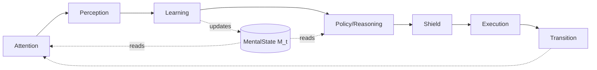

# A-P-L-R-E-T Architecture with Stage Dispatcher Pattern

**Production-Ready Agent Architecture for callagent Framework**

TODO: define recordUsage method

---

> **👥 Audience**: Agent developers using callagent  
> **🎯 Purpose**: Learn how to build production-ready agents with A-P-L-R-E-T architecture  
> **🔧 For framework maintainers**: See [Framework Changes](./framework-changes-for-aplret.md)  

---

## Overview

This document describes a **reusable, production-ready agent architecture** that combines:

1. **Brain-inspired cognitive loop** (A-P-L-R-E-T): Attention → Perception → Learning → Reasoning/Policy → Shield → Execution → Transition
2. **Typed intent system**: Policy emits discriminated unions, Dispatcher handles exhaustively
3. **Stage dispatcher pattern**: Explicit control flow using typed stages and handler maps
4. **Separation of concerns**: MentalState (M) for cognition, control via loop env (pending/inbox/control snapshot)
5. **Effect safety**: Budget-aware, timeout-protected, retryable effects
6. **Future-proof design**: Clear upgrade path to pattern matching (ts-pattern) or statecharts (XState)

### Key Benefits

- **Visibility**: Explicit stages and typed intents make control flow scannable
- **Safety**: Effect budgets, timeouts, retries, and shield checks built-in
- **Maintainability**: Adding new intents/stages = extending discriminated unions
- **Testability**: Pure functions for cognition, isolated effects with golden path tests
- **Type safety**: Exhaustive pattern matching prevents runtime errors
- **Scalability**: Clean path from simple dispatcher → exhaustive matching → statecharts

### Effect → Observation Pipeline

- **Execution always returns `{ action, result }`** where `result` is an `ExecResult<Data>` (you control `Data`) containing status, typed `data`/`error`, provenance (`ts` plus any correlation metadata), and optional receipts.
- **Transition packages that `ExecResult<Data>` into one or more normalized `Observation<Payload>` objects** (you control `Payload`) and returns them via `TurnOutcome.observations` together with the control signal (`continue`, `await_*`, etc.).
- **Runtime handoff:** The loop runner appends every observation to `env.inbox.all` and stages the batch on `env.inbox.current` before the next turn begins. Perception reads the staged slice; history remains in `all` for replay/debugging.
- **Environment exposes `{ inbox: { current, all } }`** to the next turn. `current` holds only the observations for the upcoming turn; `all` keeps the ordered log. Perception treats `current` as read-only, validates each entry, then the runtime clears it when the turn ends. Use `env.inbox.user()` / `.tool()` / `.child()` to grab the first current observation of that source with type narrowing (e.g., `const caseId = env.inbox.user()?.payload.value.caseId;`).
- **ALL inputs flow through inbox:** Initial CLI inputs and resumed inputs (from `requestInput`, tool completions, child completions) are converted to observations in `env.inbox.current` with `source: 'user'` and `kind: 'input.provided'`. Perception should ONLY read from inbox.
- **Turn _t+1_ – Perception: Perception validates and annotates inbox entries** (plus any ambient world state). At the start of the next turn, Perception drains the inbox (append-only queue), validates each observation, and hands Learning a structured observation payload. Learning then updates the mental state, making the effects from turn _t_ available to Policy on turn _t+1_.
- **Learning remains the single writer of MentalState (M)**; all effect outputs must flow via `Observation → Learning → M`, not through ad-hoc state writes.
- **Continue outcomes always carry `observations: Observation[]`** so downstream tooling/tests can assert what effects occurred, even when the loop stays active.

---

## Design Checklist

**Checklist** an LLM should follow when **designing and debugging** agents in  A-P-L-R-E-T framework.  

# APLRET Design & Debugging Checklist

## 0) First principles (turns + MDP thinking)

* [ ] Treat each step as a **turn**: any effect result is only available **next turn** after it flows Perception → Learning → M. Don't "see the future." 
* [ ] Keep the classic loop: **observe → update belief → choose action** (Policy is pure on M). 

## 1) Module responsibilities (use this mapping every time)

* [ ] **Attention**: pick focus/filters; no decisions, no effects.
* [ ] **Perception**: **normalize & validate** inputs (schema/units/ranges), label event type (input/tool/child); no effects. (This is the observation step.) 
* [ ] **Learning**: the **only** place to immutably update **M** (belief/world model, goals, reward). No effects. (Belief update.) 
* [ ] **Policy**: choose **typed Intent** purely from **M** (π(M) → Intent). No env/ctx reads here.
* [ ] **Shield**: enforce constraints/budgets/PII; **pass/transform/defer/veto** before acting. (Constrained MDP + shielding.) 
* [ ] **Execution**: implement **HOW** (effects only). Use timeouts/retries + **idempotency keys**. Control is managed via loop env/pending/inbox. 
* [ ] **Transition**: emit `continue | await_* | complete | fail`; bookkeeping only.

## 2) State separation (never mix these)

* [ ] **Cognitive & persistent** → **M** via Learning (user intent/entities, validated tool results to be reasoned on).
* [ ] **Control & ephemeral** → **loop env** (pending tokens, awaiting, budgets) + **inbox** observations.
* [ ] Never write to **M** outside Learning; never persist cognition in control surfaces. (Mirrors belief vs. control in POMDP/state patterns.) 

## 3) Typed safety (prevent drift at compile time)

* [ ] Keep **Intents** and **Stages** as **closed unions**; handle them **exhaustively** (ts-pattern or exhaustive switch). Build fails if a case is missing. ([GitHub][4])
* [ ] Enforce **intent → allowed stages** mapping (typestate) and **stage invariants** at runtime (require/forbid keys).
* [ ] For complex flows, promote to **statecharts** (guards, timeouts, parallel states, visualization). 

## 4) Turn templates (how to "think in turns")

* [ ] **Gather data via tool**

  * Turn N: Policy(Intent=fetch) → Shield → Execution(call tool, return token) → Transition(`await_tool`).
  * Turn N+1: Perception(validates tool result) → Learning(write to M) → Policy(decide next).
* [ ] **User input**

  * Turn N: Execution(`requestInput` with `setStage='awaiting_input'`) → Transition(`await_input`).
  * Turn N+1: Perception(validate input) → Learning(update M) → Policy(next Intent).
    (Enforces observe→update→decide rhythm.) 

## 5) Effect safety & budgets

* [ ] Wrap external calls with **timeouts + bounded retries**; attach **idempotency keys** to get exactly-once semantics across resumes. 
* [ ] Always pass intents through **Shield** before external effects; allow **transform/defer/veto** when over budget or unsafe. (Shielding in safe RL.)  
* [ ] Record usage/cost per effect; include estimate in Shield checks (constrained MDP mindset). 

## 6) Logging & observability (make debugging easy)

* [ ] Log **{turn, stage, intent, token, shield_action, effect_cost, latency}** every turn.
* [ ] On invariant/typestate failures, include **required/forbidden keys** and current control snapshot (pending/inbox/awaiting).
* [ ] For each effect, log **idempotency key** and retry count.

## 7) Debugging playbook (quick triage → deep fix)

**A. Fast checks**

* [ ] Did Policy read env/ctx instead of M? If yes, fix: route via Perception→Learning first. 
* [ ] Did a handler violate **stage invariants** (e.g., awaiting_input without token)? Add invariant asserts.
* [ ] Missing handler case? Turn on **exhaustive matching** (ts-pattern or exhaustive switch). 

**B. Resume errors**

* [ ] After `await_*`, is the resume event first validated in **Perception** and stored to **M** in **Learning**? If not, fix.
* [ ] Double calls on resume? Ensure **idempotency keys** are used and checked. 

**C. Safety issues**

* [ ] Did Shield run and log a decision for the intent? If not, treat as a bug.  
* [ ] Are cost/budget constraints encoded as Shield guards (defer/veto) rather than ad-hoc checks? (Constrained MDP.) 

**D. Control vs cognition mix-ups**

* [ ] Cognitive facts in control surfaces? Move to **M** via Learning.
* [ ] Control flags in M? Move to **env.pending/control/inbox**.

**E. Complex branching**

* [ ] If the dispatcher is growing brittle, migrate the flow to **statecharts** with **guards** and **timeouts** to clarify transitions and avoid if-pyramids. 

**F. Security/supply-chain sanity (bonus)**

* [ ] When generating tool/package names or commands, add a **validation step** (Perception) to avoid "package hallucination/slopsquatting" hazards. 

## 8) Test strategy (must-haves)

* [ ] **Golden path** E2E: prompt → await → respond → complete (assert stages, tokens, Policy purity).
* [ ] **Resume paths**: tool and child completion; ensure data only appears **after** resume via P→L→M.
* [ ] **Failure paths**: Shield veto/defer, timeouts, retries, idempotency collisions.
* [ ] **Exhaustiveness**: add a compile-time test (ts-pattern `.exhaustive()` or never-type trick in switch). 


---

## Hard rules to follow

You are an A-P-L-R-E-T agent operating in discrete TURNS. Follow these hard rules:

1) TURN DISCIPLINE (POMDP mindset)
- You NEVER read "future" data. Any effect result is only available on the NEXT turn.
- Route all environment or resume events through Perception → Learning → MentalState (M) before Policy reasons on them.
- Policy is a PURE function of M. Policy must NOT read env, ctx, or perform side effects.

2) MODULE RESPONSIBILITIES
* **Attention (A) — what to look at**
  * **Purpose:** Prioritize/focus inputs so downstream work is cheaper and more relevant.
  * **Focus on:** simple, explainable filters (e.g., "only tool events", "DOM region X").
  * **Inputs → Output:** (M_{t-1}, s_t) → **α_t** (focus mask/priority list).
  * **Do:** cut noise; save tokens/compute.
  * **Don't:** infer intent, call tools, or modify state.

* **Perception (P) — make inputs usable**
  * **Purpose:** Normalize and validate raw inputs into a clean **observation**.
  * **Focus on:** types, ranges, schemas, units, timestamps, provenance; **structured errors**.
  * **Inputs → Output:** (s_t, α_t) (+ inbox events) → **o_t** with `source` (user/tool/child/env) and `kind` (taxonomy label).
  * **Do:** annotate provenance; emit `o_t.error` instead of throwing.
  * **Don't:** write memory, guess goals/intent, or perform effects.

* **Learning (L) — update the mind (only writer of M)**
  * **Purpose:** Turn the new observation into a better **mental state (M_t)**.
  * **Focus on:** immutable update (return a new M), provenance, safe online changes.
  * **Inputs → Output:** (M_{t-1}, a_{t-1}, o_t) (opt. (r_{t-1})) → **M_t** | **Promise<M_t>**.
  * **Do:** write episodic/semantic/procedural memory; refine world model; adjust goals, reward weights, and affect.
  * **Don't:** choose external actions.
  * **Async Policy:** Learning is primarily synchronous/pure. Async is PERMITTED only for lazy-loading Artifacts (data offloaded to DB) required for the mental state update.

* **Policy / Reasoning (R) — what to do next**
  * **Purpose:** Decide **WHAT** to do based on the current mind.
  * **Focus on:** clear, typed intentions (and short plans when needed).
  * **Inputs → Output:** (M_t) → **Intent** *(or small Plan)*.
  * **Do:** stick to simple intent types: AskUser, UseTool, Navigate, Reflect, Delegate.
  * **Don't:** perform effects or mutate M.

* **Shield (S) — safety, compliance, budgets**
  * **Purpose:** Enforce constraints before anything runs.
  * **Focus on:** explicit outcomes: **pass / transform / defer / veto**.
  * **Inputs → Output:** Intent/Plan, (M_t) → guarded Intent/Plan or block.
  * **Do:**
    * **transform** (edit to safe form) with a short note,
    * **defer** (state what approval/info is needed),
    * **veto** (clear human-friendly reason).
  * **Don't:** run effects or change M.

* **Execution (E) — how to do it (effects happen here)**
  * **Purpose:** Ground the intent into real actions (APIs/tools/robotics) with retries/timeouts.
  * **Focus on:** idempotency keys, correlation IDs, timeouts, clean receipts/results.
  * **Inputs → Output:** Intent/Plan → **exec result** (data/status/receipts).
  * **Do:** update only **control state** (ids, retries, timers); feed outputs back as observations.
  * **Don't:** stash semantic knowledge (Learning will write M).

* **Transition (T) — advance the loop**
  * **Purpose:** Apply effects to the environment model and steer control flow.
  * **Focus on:** produce next env state, extrinsic reward, and post-action signals.
  * **Inputs → Output:** env_t + exec result → **next env**, **r_ext**, **observations**, **control**.
  * **Control signals:** `continue | await_input | await_tool | await_child | complete | fail`.
  * **Don't:** modify M or intents.

* **Design rules**
  * **Single-writer:** Only **Learning** updates (M).
  * **Effect boundary:** Only **Execution** causes side effects.
  * **Typed intentions:** Policy emits clear intent types (or a short plan).
  * **Graceful errors:** Perception emits structured error observations; no cross-module throws.
  * **Provenance everywhere:** timestamps, ids, sources on observations and memory writes.
  * **Short feedback loop:** keep online updates small/safe; do heavy optimization offline.

* **What to measure**
  * **Attention:** token/compute saved w/o hurting success.
  * **Perception:** schema error rate, latency.
  * **Learning:** memory hit@k, world-model prediction error.
  * **Policy:** chain success rate, think time.
  * **Shield:** block/transform rates, reasons.
  * **Execution:** exec success %, retries, cost.
  * **Transition:** time in await states, completion rate.

3) STATE SEPARATION
- Put mechanical/control state in env.pending/control (tokens, awaiting flags) and inbox observations.
- Put cognitive facts in M via Learning (user intent, belief/estimates, tool results to reason about).
- Never write to M outside Learning. Never persist cognition in control surfaces.

4) STAGE & TYPE SAFETY
- Always maintain the current stage and obey stage invariants.
- Enforce intent→allowed-stages typestate; error if an Intent is not valid for the current stage.
- Handle Intents EXHAUSTIVELY. If a new Intent or Stage appears, add explicit handling.

5) EFFECT SAFETY
- Wrap external calls with timeouts and bounded retries; attach idempotency keys for exactly-once semantics across resumes.
- Call Shield BEFORE executing external tools/requests. Abort or defer if over budget or violating constraints.
- Log {turn, stage, intent, token, shield_action, effect_cost, latency} for traceability.

6) HOW TO THINK (TURN TEMPLATES)
- If you need data from a tool/API:
  Turn N: Policy→Intent(fetch), Shield, Execution→invoke tool, Transition→await_tool(exec.action.token).
  Turn N+1: Perception validates tool result from inbox; Learning writes validated result to M; Policy chooses next Intent (e.g., fetch more if invalid/incomplete; otherwise proceed).
- For user input:
  Turn N: prompt + requestInput → await_input(exec.action.token).
  Turn N+1: Perception validates input; Learning updates M; Policy decides next step.
- For sub-agent delegation:
  Turn N: Execution→`handle = sendTaskToAgent(agent, input, {awaitCompletion:false})`, extract `token = handle.token` immediately, return token in exec result, Transition→`await_child(token)`. Parent loop pauses; pending state tracked in env.pending/control.
  Turn N+1: Child completion auto-injected into env.inbox.current; Perception validates child observation; Learning writes result to M; Policy decides next Intent.
  (With awaitCompletion:true, result arrives immediately in same turn—use for tool-like blocking calls.)

7) I/O CONTRACTS (examples)
- Perception must produce normalized observation objects (e.g., {text, eventType, resumeToken?, meta?}).
- Learning must return a NEW M (immutable update) that includes everything Policy will need next turn.
- Execution returns either ask_user/tool/subagent/internal and may include tokens in exec.action/result; control is tracked via env.pending/env.control. Execution never mutates M.

8) WHEN IN DOUBT
- Prefer gathering/validating in a FUTURE TURN rather than mixing steps.
- Prefer explicit failure with actionable messages over silent assumption.

9) OUTPUT STYLE
- Be explicit about which module is doing what (e.g., "Perception validated …", "Learning updated M …", "Policy emitted ProposedAction …").
- If stage/typestate would be violated, refuse and explain.

Follow this minimal recipe every turn:
A) Attention: pick focus flags.
B) Perception: normalize+validate env input → observation {…}.
C) Learning: M' = f(M, observation) (immutable).
D) Policy: ProposedAction = π(M').
E) Shield: gate = pass/transform/defer/veto. If not pass, stop.
F) Execution: handle Intent respecting current control state; produce outcome (tokens, receipts).
G) Transition: emit await_* or complete or continue using exec tokens and env.pending/inbox.

Your single source of truth for cognition is M. Your single source of truth for control is env.pending/control/inbox. Effects are only in Execution. Data needed later must flow Perception→Learning→M first.


---

## Quick Start

**New to A-P-L-R-E-T?** Start here with a minimal loop-aligned agent (control via env/pending/inbox, cognition in M, durable writes via Learning/writer): 

```typescript
import { createAgent } from '@a2arium/callagent-core';
import type {
  TaskContext,
  MentalState,
  AttentionSignal,
  ExecErrorPayload,
  TurnOutcome
} from '@a2arium/callagent-core';

type Sensory = { current?: string };
type Obs = { text?: string; eventType: 'user_message' | 'idle' };

type ObservationConfig = {
  user: string | { text: string };
  tool: unknown;
  child: unknown;
};

// Create agent with loop modules
export const agent = createAgent<Sensory, Obs, AttentionSignal, unknown, ExecErrorPayload, ObservationConfig>({
  manifest: 'agent.json',
  llmConfig: { provider: 'openai', modelAliasOrName: 'fast' },

  attention: (_m, env) => {
    const hasUserObservation = env.inbox.current.some(o => o.source === 'user');
    return { wantPrompt: !hasUserObservation };
  },

  perception: (env): Obs => {
    const latestInput = env.inbox.current.find(o => o.source === 'user');
    if (latestInput) {
      const value = latestInput.payload.value;
      const text = typeof value === 'string' ? value : value?.text;
      return { text, eventType: 'user_message' };
    }
    return { eventType: 'idle' };
  },

  learning: (prev, _action, obs): MentalState<Sensory> => ({
    ...prev,
    memory: {
      ...prev.memory,
      sensory: { current: obs.text ?? prev.memory?.sensory?.current }
    }
  }),

  policy: (m) => {
    const userText = m.memory?.sensory?.current;
    return userText
      ? ({ kind: 'answer_with_llm', query: userText } as const)
      : ({ kind: 'prompt_user' } as const);
  },

  shield: (_m, intent) => ({ action: 'pass', intent }),

  execution: async (intent, ctx) => {
    if (intent.kind === 'prompt_user') {
      const handle = await ctx.requestInput('Your message');
      return { action: { kind: 'ask_user', token: handle.token }, result: { status: 'ok', toolId: 'user' } };
    }
    if (intent.kind === 'answer_with_llm') {
      const res = await ctx.llm.call(intent.query);
      await ctx.reply(res[0]?.content ?? 'Ok.');
      return { action: { kind: 'internal', done: true }, result: { status: 'ok', toolId: 'language' } };
    }
    return { action: { kind: 'internal', done: true }, result: { status: 'ok', toolId: 'internal' } };
  },

  transition: (_env, exec): TurnOutcome<ObservationConfig> => {
    if (exec.action.kind === 'ask_user') return { kind: 'await_input', token: exec.action.token };
    return { kind: 'complete', result: { ok: true } };
  }
}, import.meta.url);
```

**Best Practices Included:**

✅ Cognition in M; control via exec tokens + env.pending/inbox  
✅ Durable writes go through Learning; Policy/Shield/Execution are read-only on memory  
✅ Transition uses exec action to signal await/complete  
✅ Perception reads only inbox (typed by ObservationConfig)  


## Manifest Structure

The agent manifest defines metadata and configuration for your agent. You can provide the manifest in two ways:

1. **Inline object**: Pass a manifest object directly to `createAgent()`
2. **JSON file**: Reference an external `agent.json` file (recommended for production)

### Manifest Fields

```typescript
{
  // Required fields
  "name": "my-agent",           // Agent identifier
  "version": "1.0.0",           // Agent version (semver)
  
  // Optional: Agent description
  "description": "My production agent",
  
  // Optional: Execution mode ('loop' or 'legacy')
  "runMode": "loop",
  
  // Optional: Loop budgets (defaults from framework if not set)
  "budgets": {
    "maxTurns": 10,             // Maximum loop iterations
    "latencyMs": 30000          // Maximum total latency in milliseconds
  },
  
  // Optional: Human-in-the-loop level
  "hitl": "consent",            // 'advise' | 'consent' | 'guardrails'
  
  // Optional: Safety configuration
  "safety": {
    "sanitize": true,           // Enable default perception sanitization
    "costLimit": 10.0,          // Cost threshold in USD
    "piiPatterns": ["\\b\\d{3}-\\d{2}-\\d{4}\\b"]  // Regex patterns for sensitive data
  },

  // Optional: Agent dependencies
  "dependencies": {
    "agents": ["weather-agent", "calculator-agent"] // List of other agents this agent depends on
  },
  
  // Optional: Agent result caching
  "cache": {
    "enabled": true,            // Enable caching for this agent
    "ttlSeconds": 300,          // Cache TTL (default: 5 minutes)
    "excludePaths": ["timestamp", "session.id"]  // Exclude fields from cache key
  },
  
  // Optional: Runtime configuration (NEW!)
  "config": {
    "enableValidation": true,
    "validationCoverageThreshold": 95,
    "customFeatureFlags": {
      "useExperimentalParser": false
    }
  }
}
```

### Using Manifest Configuration at Runtime

The `config` field in your manifest is available throughout your agent implementation:

**In Policy, Shield, and Execution modules** (via `ctx.config.manifestConfig`):

```typescript
policy: (m, ctx) => {
  const cfg = ctx.config.manifestConfig as { enableValidation?: boolean };
  
  if (cfg?.enableValidation) {
    // Use validation logic
    return { kind: 'validate_input' };
  }
  
  return { kind: 'process_input' };
}
```

**In Perception, Learning, and Transition modules** (via `env.config`):

```typescript
perception: (env) => {
  const cfg = env.config as { validationCoverageThreshold?: number };
  const threshold = cfg?.validationCoverageThreshold ?? 80;
  
  // Use configuration in perception logic
  return observations.filter(o => o.confidence >= threshold / 100);
}
```

### Configuration for A2A Child Agents

When one agent invokes another via `ctx.sendTaskToAgent()`, each agent receives its own manifest configuration. The child agent's `config` field is automatically propagated through the same mechanisms (`ctx.config.manifestConfig` and `env.config`).

This allows you to configure agent behavior without hardcoded constants, making agents more flexible and easier to test with different configurations.

## Per-call Cache Overrides

Agents can adjust result caching on a per-dispatch basis without touching the target manifest. Use the `cache` option to toggle caching or override TTL/exclude paths for a specific call while inheriting unspecified values from the manifest.

```typescript
await ctx.sendTaskToAgent('pricing-agent', payload, {
  cache: {
    enabled: true,          // force cache even if manifest disabled it
    ttlSeconds: 120,        // optional override; falls back to manifest when omitted
    excludePaths: ['time']  // optional override for cache key generation
  }
});

await ctx.sendTaskToAgent('live-agent', payload, {
  cache: { enabled: false }  // bypass cache for this invocation only
});
```


## Table of Contents

- [1. Architecture Philosophy](#1-architecture-philosophy)
- [2. Core Concepts](#2-core-concepts)
- [3. Typed Intent System](#3-typed-intent-system)
- [4. Module Contracts](#4-module-contracts)
- [4.1. Logging in APLRET Modules](#41-logging-in-aplret-modules)
- [5. Stage Dispatcher Pattern](#5-stage-dispatcher-pattern)
- [6. State Management Strategy](#6-state-management-strategy)
- [7. Effect Safety and Budgets](#7-effect-safety-and-budgets)
- [8. Resume Contract](#8-resume-contract)
- [9. Testing Strategy](#9-testing-strategy)
- [10. Upgrade Path](#10-upgrade-path)
- [11. Common Patterns](#11-common-patterns)
- [12. Best Practices](#12-best-practices)
- [13. Troubleshooting](#13-troubleshooting)
- [14. See Also](#14-see-also)
- [Appendix A: Complete Implementation Example](#appendix-a-complete-implementation-example)

---

## 1. Architecture Philosophy

### Brain-Inspired Loop (A-P-L-R-E-T)

The architecture mirrors cognitive science research on brain-inspired intelligence, with **six cognitive modules** plus **Shield** as a pre-execution guard:



**Why this matters:**

**Six cognitive modules (A-P-L-R-E-T):**
- **Attention (α_t)**: Goal and affect-guided focus (what matters now?)
- **Perception (o_t)**: Normalize multimodal environment into compact observation
- **Learning (M_t)**: Pure, immutable updates to mental state (memory, world model, goals, emotion, reward)
- **Reasoning/Policy (π)**: Decide what Intent to emit based on current mental state (pure function of M)
- **Execution (E)**: Perform effects (reply, requestInput, LLM calls, tool invocations) with safety
- **Transition (T)**: Control loop flow (continue | await_input | await_tool | await_child | complete | fail)

**Shield (S): Pre-execution guard (not a cognitive module):**
- Safety checks, budget enforcement, PII detection, HITL consent
- Runs between Policy and Execution: `intent ← policy(M) → intent' ← shield(intent') → execution(intent')`
- Can pass, transform, veto, or defer to user

### Typed Intent System

**Key Decision: Policy emits typed Intent, Dispatcher handles exhaustively**

```typescript
// Policy is the "brain" (reasoning)
type Intent =
  | { kind: 'prompt_user' }
  | { kind: 'answer_with_llm'; query: string }
  | { kind: 'plan_and_execute'; goal: string }
  | { kind: 'wait' };

policy: (m: MentalState) => Intent

// Execution is the "hands" (effects)
execution: (intent: ProposedAction, ctx: TaskContext) => Promise<ExecutableAction>
```

This prevents drift between Policy and Dispatcher—Policy decides WHAT to do, Dispatcher decides HOW to do it.

### State Pattern for Control Flow

Use the **State pattern** via a dispatcher map to avoid if-pyramids:

## 2. Core Concepts

### MentalState (M_t) - The Cognitive Brain

`MentalState` represents the agent's **cognitive state** at turn `t`. It should be treated as **immutable** and updated only through the Learning module.

```typescript
type MentalState = {
  memory: {
    sensory: unknown;
    thoughts?: ThoughtEntry[];
    decisions?: Record<string, DecisionEntry>;
    scratch?: unknown;   // Optional ephemeral working set (Learning-owned)
    window?: unknown;    // Optional ephemeral working set (Learning-owned)
    longTerm: {
      episodic: EpisodicEvent[];
      semantic: { concepts: SemanticConcept[] };
      procedural: { skills: Skill[] };
    };
  };
  worldModel: WorldModel;           // Beliefs about the environment
  goalState: GoalState;             // Current goals and priorities
  emotion: EmotionState;            // Affective state (M_emo in survey)
  reward: RewardState;              // Reward tracking (M_rew in survey)
  policyParams?: PolicyParams;      // Policy sampling config
};
```

**Key principles:**

- **Read-only in most modules**: Only Learning should update M
- **Pure cognition**: Derived features, beliefs, goals live here
- **Persistent**: Saved at turn boundaries, restored on resume
- **Control is outside M**: tokens/pending/awaiting live in env.pending/env.control/inbox, not in M

### Control surface (env)

- Use `exec.action.token` / `exec.result.correlationId` for tokens produced this turn.
- Use `env.pending` / `env.control?.pendingSnapshot` for pending inputs/children/tools/groups; use `env.inbox.current` for staged/resumed observations.
- `tokenPath` writes into `env.pending.controlVars` (never `ctx.vars`). Prefer `handle.token` or `env.pending.children` as the source of truth.
- Use `env.control?.lastExec` if a module needs to inspect the last execution result.
- Helper (optional):
```typescript
import { getPendingToken } from '@a2arium/callagent-core';
const childToken = getPendingToken(env, 'children', 'child-id');
```

## 3. Typed Intent System

### Intent Discriminated Union

Define a **closed set of intents** that Policy can emit:

```typescript
type Intent =
  | { kind: 'prompt_user' }
  | { kind: 'answer_with_llm'; query: string; context?: string }
  | { kind: 'plan_and_execute'; goal: string; constraints?: string[] }
  | { kind: 'call_tool'; toolName: string; args: Record<string, unknown> }
  | { kind: 'delegate_to_child'; childAgentId: string; input: unknown }
  | { kind: 'wait' }
  | { kind: 'complete'; result: unknown };
```

### Policy Emits Intent

```typescript
policy: (m: MentalState): ProposedAction => {
  const userIntent = m.worldModel.lastUserIntent;
  const userText = m.memory.sensory.current;
  const sentiment = m.worldModel.userSentiment;
  
  // Reasoning based on cognition
  if (userIntent === 'question' && userText) {
    return { kind: 'answer_with_llm', query: userText };
  }
  
  if (userIntent === 'command' && sentiment === 'urgent') {
    return { kind: 'plan_and_execute', goal: userText };
  }
  
  if (!userIntent) {
    return { kind: 'prompt_user' };
  }
  
  return { kind: 'wait' };
}
```

### Dispatcher Handles Intent Exhaustively

Use **ts-pattern** for exhaustive matching (compile-time safety) — optional upgrade when branching grows:

```typescript
import { match } from 'ts-pattern';

execution: async (intent: ProposedAction, ctx: TaskContext, m: MentalState): Promise<ExecutableAction> => {
  const stage = V.stage(ctx);
  
  return match(intent)
    .with({ kind: 'prompt_user' }, async () => {
      await ctx.reply('How can I help you?');
      V.setPrompted(ctx, true);

      // ✅ NEW: Input-first approach with automatic token and stage management
      const handle = await ctx.requestInput('Your message', {
        setStage: 'awaiting_input'  // Automatically sets stage and token
      });
      const token = handle.token;

      return { kind: 'ask_user', token };
    })
    .with({ kind: 'answer_with_llm' }, async ({ query }) => {
      const result = await ctx.llm.call(query);
      await ctx.reply(result[0]?.content);
      ctx.complete(100, 'completed');
      V.setCompleteCalled(ctx, true);
      V.setStage(ctx, 'completed');
      return { kind: 'internal', done: true };
    })
    .with({ kind: 'plan_and_execute' }, async ({ goal }) => {
      // Generate plan
      V.setStage(ctx, 'planning');
      return { kind: 'internal', done: true };
    })
    .with({ kind: 'wait' }, async () => {
      return { kind: 'internal', done: true };
    })
    .exhaustive();  // ✅ Compile error if Intent case is missing
}
```

---

## 4. Module Contracts

### Per‑Agent Typing (Observation Config)

Instead of passing a loose union of payloads, pass an **Observation Config Map**. This map keys the observation source to the specific data type you expect.

```typescript
// 1. Define the Config Map
type ObservationConfig = {
  user: string | { text: string };  // Payload value for source: 'user'
  tool: { summary: string };        // Payload result for source: 'tool'
  child: { outcome: unknown };      // Payload result for source: 'child'
};

// 2. Pass Config to createAgent (6th generic)
export const agent = createAgent<Sensory, Obs, AttentionSignal, unknown, ExecErrorPayload, ObservationConfig>({
  // ...
});
```

The framework automatically wraps your data types into the standard observation envelope:
- `user` → `{ token: string; value: T }`
- `tool` → `{ token: string; result: T; tool: string }`
- `child` → `{ token: string; result: T; agentId?: string; childTaskId?: string; executionMetadata?: { timings?: unknown; rewards?: unknown; state?: string; timestamp?: string; } }`

This gives you **automatic type narrowing** in Perception:

```typescript
perception: (env: EnvironmentState<ObservationConfig>) => {
  // Access the strictly typed inbox
  const obs = env.inbox.current[0];
  
  if (obs.source === 'user') {
    // TypeScript KNOWS:
    // 1. obs.kind is 'input.provided'
    // 2. obs.payload is { token: string; value: string | { text: string } }
    console.log(obs.payload.value); // Safe access!
  }
  
  if (obs.source === 'tool') {
    // TypeScript KNOWS:
    // 1. obs.kind is 'tool.completed'
    // 2. obs.payload is { token: string; result: { summary: string }; tool: string }
    console.log(obs.payload.result.summary); // Safe access!
  }

  if (obs.source === 'child') {
    // TypeScript KNOWS:
    // 1. obs.kind is 'child.completed'
    // 2. obs.payload contains: token, result, agentId, childTaskId, and optional executionMetadata
    console.log(obs.payload.result); // Clean result data (no nested TaskEntity structure)
    console.log(obs.payload.childTaskId); // Child task identifier
    console.log(obs.payload.executionMetadata?.state); // Execution state metadata

    if (obs.payload.executionMetadata?.timings) {
      console.log(`Duration: ${obs.payload.executionMetadata.timings.end - obs.payload.executionMetadata.timings.start}ms`);
    }
  }
}
```

> **Legacy Support:** You can still pass a union type (e.g., `MyPayload | OtherPayload`) as the 6th generic. The framework detects this and falls back to loose typing (`Observation<MyPayload | OtherPayload>`), but the Config Map pattern is strongly recommended for type safety.

### Attention

```typescript
type AttentionSignal = {
  wantPrompt?: boolean;
  filters?: string[];
  priority?: 'low' | 'normal' | 'high';
};

attention: (
  prevMentalState: MentalState<Sensory>,
  env: EnvironmentState<ObservationConfig>
) => AttentionSignal
```

**Purpose**: Goal/affect-guided focus; optionally nudges prompting or filters for Perception.

**Example**:
```typescript
attention: (m, env) => {
const hasInput = env.inbox.current.length > 0;
  const goalUrgency = m.goalState.priority;
  const emotionalState = m.emotion.valence;
  
  return {
    wantPrompt: !hasInput && goalUrgency === 'high',
    filters: emotionalState > 0.5 ? ['positive_signals'] : ['all'],
    priority: goalUrgency
  };
}
```

### Perception

```typescript
type Observation = {
  text?: string;
  meta?: Record<string, unknown>;
  eventType?: string;
  resumeToken?: string;
};

// Define your source map
type MyConfig = {
  user: string;
  tool: { status: string };
};

perception: (env: EnvironmentState<MyConfig>, alpha: AttentionSignal) => Observation
```

**Purpose**: Normalize multimodal environment into compact observation.

**Example**:
```typescript
perception: (env: EnvironmentState<MyConfig>, alpha) => {
  // 1. Find user input
  const inputObs = env.inbox.current.find(o => o.source === 'user');
  
  if (inputObs) {
    // inputObs.payload is { token: string; value: string }
    return { 
      text: inputObs.payload.value, 
      eventType: 'user_message', 
      resumeToken: inputObs.payload.token 
    };
  }
  
  // 2. Find tool result
  const toolObs = env.inbox.current.find(o => o.source === 'tool');
  if (toolObs) {
    // toolObs.payload is { token: string; result: { status: string }; tool: string }
    return {
      meta: { status: toolObs.payload.result.status },
      eventType: 'tool_done',
      resumeToken: toolObs.payload.token
    };
  }

  if (alpha.wantPrompt) {
    return { meta: { needsPrompt: true }, eventType: 'internal' };
  }
  
  return {};
}
```

### Learning

```typescript
learning: (
  prevMentalState: MentalState, 
  prevAction: ProposedAction | undefined, 
  obs: Observation,
  rPrev?: number
) => MentalState | Promise<MentalState>
```

**Purpose**: Pure, immutable updates to MentalState. **This is the ONLY place to update M.**

**Example**:
```typescript
learning: (prev, prevAction, obs, rPrev) => {
  // ✅ Derive cognitive features immutably
  if (obs.text) {
    const intent = extractIntent(obs.text);
    const sentiment = analyzeSentiment(obs.text);
    const entities = extractEntities(obs.text);

    return {
      ...prev,
      memory: {
        ...prev.memory,
        sensory: { current: obs.text },
        longTerm: {
          ...prev.memory.longTerm,
          episodic: [
            ...prev.memory.longTerm.episodic,
            {
              t: Date.now(),
              obs,
              act: prevAction,
              rew: rPrev
            }
          ]
        }
      },
      worldModel: {
        ...prev.worldModel,
        lastUserIntent: intent,
        userSentiment: sentiment,
        entities: [...prev.worldModel.entities, ...entities]
      },
      memory: {
        ...prev.memory,
        longTerm: {
          ...prev.memory.longTerm,
          episodic: [
            ...prev.memory.longTerm.episodic,
            {
              t: Date.now(),
              obs,
              act: prevAction,
              rew: rPrev
            }
          ]
        }
      },
      reward: {
        ...prev.reward,
        total: (prev.reward.total || 0) + (rPrev || 0)
      }
    };
  }

  // ✅ Process child task results with clean result extraction
  if (obs.eventType === 'child_completed' && obs.childResult) {
    // childResult is already extracted from TaskEntity wrapper
    const { result, childTaskId, executionMetadata } = obs.childResult;

    return {
      ...prev,
      memory: {
        ...prev.memory,
        longTerm: {
          ...prev.memory.longTerm,
          episodic: [
            ...prev.memory.longTerm.episodic,
            {
              t: Date.now(),
              obs: {
                ...obs,
                childTaskId,
                childExecutionState: executionMetadata?.state,
                childTimings: executionMetadata?.timings
              },
              act: prevAction,
              rew: rPrev
            }
          ]
        }
      },
      worldModel: {
        ...prev.worldModel,
        // Store child result data without nested TaskEntity structure
        childOutcomes: {
          ...(prev.worldModel.childOutcomes || {}),
          [childTaskId]: {
            result,  // Clean result data
            completedAt: executionMetadata?.timestamp,
            executionState: executionMetadata?.state
          }
        }
      }
    };
  }

  // ❌ NEVER do this:
  // prev.memory.vars.userText = obs.text;  // Mutation!
  // prev.vars.stage = 'idle';  // Control in cognition!

  return prev;
}
```

### Policy (Reasoning)

```typescript
policy: (m: MentalState) => Intent
```

**Purpose**: Decide what Intent to emit based on current mental state. This is the "reasoning" step.

**Example**:
```typescript
policy: (m) => {
  const userIntent = m.worldModel.lastUserIntent;
  const userText = m.memory.sensory.current;
  const sentiment = m.worldModel.userSentiment;
  const goals = m.goalState.priority;
  const budget = m.reward.budget;
  
  // Decision logic based on cognition
  if (!userIntent) {
    return { kind: 'prompt_user' };
  }
  
  if (userIntent === 'question' && budget > 100) {
    return {
      kind: 'answer_with_llm',
      query: userText || '',
      context: JSON.stringify(m.worldModel.entities)
    };
  }
  
  if (userIntent === 'command' && goals === 'execute') {
    return {
      kind: 'plan_and_execute',
      goal: userText || '',
      constraints: sentiment < 0 ? ['careful'] : []
    };
  }
  
  if (userIntent === 'complex_task') {
    return {
      kind: 'delegate_to_child',
      childAgentId: 'specialist-agent',
      input: { task: userText }
    };
  }
  
  return { kind: 'wait' };
}
```

### Shield (Safety)

```typescript
type ShieldOutcome =
  | { action: 'pass'; intent: ProposedAction }
  | { action: 'transform'; intent: ProposedAction }
  | { action: 'veto'; reason: string }
  | { action: 'defer'; askUser: string };

shield: (m: MentalState, intent: ProposedAction) => ShieldOutcome
```

**Purpose**: Safety, constraints, budget checks. Can pass, transform, veto, or defer to user.

**Example**:
```typescript
shield: (m, intent) => {
  // Budget check
  const costEstimate = estimateCost(intent);
  if (costEstimate > m.reward.budget) {
    return {
      action: 'defer',
      askUser: `Action costs ${costEstimate} tokens. Budget: ${m.reward.budget}. Proceed?`
    };
  }
  
  // PII check
  if (containsPII(intent)) {
    console.warn('[shield] Vetoed intent containing PII');
    return {
      action: 'veto',
      reason: 'PII_DETECTED'
    };
  }
  
  // HITL consent for tools
  if (intent.kind === 'call_tool' && m.goalState.hitlLevel === 'consent') {
    return {
      action: 'defer',
      askUser: `Approve tool call: ${intent.toolName}?`
    };
  }
  
  // Transform for safety
  if (intent.kind === 'answer_with_llm' && !intent.context) {
    return {
      action: 'transform',
      intent: { ...intent, context: 'safe_mode' }
    };
  }
  
  // Pass through
  return { action: 'pass', intent };
}
```

**Shield Semantics (Constrained MDP + Shielding):**

Note: Examples below assume the upcoming `ShieldOutcome` API (pass/transform/veto/defer). Current API is pass-through: `shield(m, intent) => intent | null`.

1. **Order**: `intent ← policy(M) → intent' ← shield(M, intent) → execution(intent')`
   - Shield runs **after** Policy, **before** Execution
   - Shield receives the original intent and mental state
   
2. **Outcomes**: Four mutually exclusive actions
   - `pass`: Allow intent unchanged
   - `transform`: Modify intent (e.g., sanitize, add context)
   - `veto`: Block intent entirely (log reason)
   - `defer`: Escalate to user for approval
   
3. **Logging**: Always log shield decisions (orchestrator logs the outcome)
  ```typescript
  // In the loop, after calling shield(m, intent)
  const outcome = shield(m, intent);
   logger.info('shield_decision', {
    module: 'shield',
    action: outcome.action,
    originalIntent: intent.kind,
    reason: outcome.action === 'veto' ? outcome.reason : undefined,
    transformed: outcome.action === 'transform'
  });
  ```

4. **Transform Precedence**: If multiple checks apply, run all and combine:
   - If any veto → veto wins
   - If any defer → defer wins
   - If multiple transforms → apply in sequence

**References**: Constrained MDP (Altman 1999), Shielding (Alshiekh et al. 2018)

### Execution

```typescript
execution: (intent: ProposedAction, ctx: TaskContext, m: MentalState) => Promise<ExecutableAction>
```

**Purpose**: Map intents to effects using the **stage dispatcher** and **runEffect()** for safety.

See [Appendix A: Complete Implementation Example](#appendix-a-complete-implementation-example) for full code.

### Transition

```typescript
transition: (env: EnvironmentState, exec: ExecutableAction, m: MentalState) => TurnOutcome
```

**Purpose**: Control loop flow based on execution result.

**Example**:
```typescript
// Example with Config Map
type MyConfig = {
  internal: { value: string };
};

transition: (env: EnvironmentState<MyConfig>, exec, m): TurnOutcome<MyConfig> => {
  // Await outcomes
  if (exec.kind === 'ask_user') {
    return { kind: 'await_input', token: exec.token };
  }
  if (exec.kind === 'tool' && exec.token) {
    return { kind: 'await_tool', token: exec.token };
  }
  if (exec.kind === 'subagent' && exec.token) {
    return { kind: 'await_child', token: exec.token };
  }
  
  // Terminal outcomes
  const stage = (env.pending?.controlVars as any)?.stage
    ?? (env.control?.pendingSnapshot?.controlVars as any)?.stage
    ?? 'idle';
  if (stage === 'completed') {
    return { kind: 'complete', result: { ok: true } };
  }
  
  // Continue loop with observation
  return { 
    kind: 'continue', 
    observations: [{
      source: 'internal',
      kind: 'stage_change',
      // Framework enforces payload structure based on MyConfig['internal']
      payload: { value: 'new_stage' } 
    }] 
  };
}
```

---

## 7.5 Handling Large Data (Artifacts)

When an agent needs to handle large payloads (e.g., long HTML, base64 images, big JSONs), storing them directly in `MentalState` or `inbox` can cause snapshot failures (`LIMIT_WM_SNAPSHOT_TOO_LARGE`) and memory bloating.

**Solution: Transparent Offloading (Artifact.create)**

Artifacts are lightweight handles (`Artifact<T>`) that transparently offload data to the `AgentResultCache` (DB/Blob Storage). You can work with them as values in memory, and the framework automatically offloads them when saving the snapshot.

### Usage in Agents

Use the static `Artifact.create(value)` helper. It does NOT require `ctx`.

#### Example: Async Learning for Lazy Loading

The Learning module supports `async` execution specifically to allow lazy-loading of artifacts when needed for cognitive updates.

```typescript
learning: async (prev, _, obs) => {
    const next = { ...prev };

    // 1. Store the handle (fast, synchronous logic)
    if (obs.newDoc) {
        next.memory.docHandle = obs.newDoc; 
    }

    // 2. Lazy-load content IF needed for immediate cognition
    // (e.g. to extract keywords for the World Model)
    if (obs.newDoc && !next.worldModel.docKeywords) {
        const content = await obs.newDoc; // Lazy load from DB
        next.worldModel.docKeywords = extractKeywords(content);
    }
    
    return next;
},
```

**Best Practice:**
1. **Store Handles:** Prefer storing the `Artifact<T>` handle in `M.memory` rather than the raw data.
2. **Load on Demand:** Only `await` the artifact in Learning if you need its content *immediately* to update the World Model or Goal State.
3. **Execution Loading:** If the content is only needed for an action (e.g., sending to an LLM), let Policy pick the intent and have Execution await the artifact.

#### Example: Offloading a Result

**Producer (Any Agent Logic):**
```typescript
import { Artifact } from '@a2arium/callagent-core';

execution: async (intent, ctx) => {
    const hugeHtml = "<html>... 10MB ...</html>";
    
    // Wrap the large value. 
    // In memory, this is just a wrapper holding the string.
    // When saving the snapshot, the framework detects it and offloads it to DB.
    const artifact = Artifact.create(hugeHtml, { mimeType: 'text/html' });
    
    return { 
        kind: 'done', 
        result: { 
            page: artifact // Pass the wrapper
        } 
    };
}
```

**Consumer (Parent Agent):**
```typescript
perception: (env) => {
    const childObs = env.inbox.current.find(o => o.source === 'child');
    if (childObs) {
        // The artifact is automatically rehydrated by the framework
        return {
            pageHandle: childObs.payload.result.page 
        };
    }
    return {};
},

learning: async (prev, _, obs) => {
    // Store the handle in M (it's small!)
    return { ...prev, memory: { ...prev.memory, lastPage: obs.pageHandle } };
},

policy: async (m) => {
    // Load content ONLY when needed
    if (m.memory.lastPage) {
        // Artifact<T> is a PromiseLike, so you can await it
        const html = await m.memory.lastPage; 
        // ...
    }
}
```

### Automatic Safety Net (Pruning)

The framework enforces a size limit (default 50KB) on inline strings in the snapshot to prevent RAM overuse.

If an agent attempts to save a larger string inline (without wrapping it in `Artifact.create`):
1.  The framework **TRUNCATES** the string in the snapshot.
2.  It logs a **LOUD WARNING**: `[PRUNE] Truncated field...`.
3.  The agent continues execution, but the data is lost.

**Rule:** If you see `[PRUNE]` warnings, wrap that field with `Artifact.create()`.

---

## Child Task Observation Pattern

When working with child agents through `ctx.sendTaskToAgent()`, the framework provides a clean, structured way to handle child task results in observations. This eliminates the confusing nested TaskEntity wrapper structures and provides direct access to result data and execution metadata.

### Clean Result Structure

Child observations automatically include:

- **`result`**: The clean result data from the child task (no TaskEntity wrapper)
- **`childTaskId`**: Unique identifier for the child task
- **`agentId`**: ID of the child agent that executed the task
- **`executionMetadata`**: Optional execution information including:
  - `timings`: Start/end timestamps for performance analysis
  - `rewards`: Reward signals from the child execution
  - `state`: Final execution state of the child task
  - `timestamp`: Completion timestamp

### TaskHandle API and Token Extraction

When calling `ctx.sendTaskToAgent()` with `awaitCompletion: false`, the function returns a `TaskHandle` object:

```typescript
import type { TaskHandle } from '@a2arium/callagent-core';

const handle: TaskHandle = await ctx.sendTaskToAgent('child-agent', input, {
  awaitCompletion: false
});

// ✅ CORRECT: Access token via getter property
const token = handle.token;  // TypeScript knows this exists!

// ❌ WRONG: Don't pass handle directly - token is lost on serialization
return {
  action: { kind: 'subagent', token: handle.token },  // Works here
  result: { status: 'ok', data: { handle } }  // ❌ Token lost!
};
```

**TaskHandle has a `.token` getter** that returns the internal `childToken` property. Always extract it immediately as a primitive string:

```typescript
// ✅ CORRECT PATTERN
const handle = await ctx.sendTaskToAgent('fetch-webpage', { url }, {
  awaitCompletion: false,
  tokenPath: 'fetch.token'  // Optional: stores token in env.pending.controlVars
});

const token = handle.token;  // Extract immediately

return {
  action: { kind: 'subagent', token },
  result: { status: 'ok', data: { kind: 'fetch_requested', token } }
};
```

**Why this matters:**
- `handle.token` is a **getter property** (maps to internal `childToken`)
- TypeScript now properly types the return value based on `awaitCompletion`
- No need for `as any` casts - proper types are exported
- Extracting immediately ensures the token survives serialization
- The token is needed in `transition` to return `{ kind: 'await_child', token }`

**Type Safety:**
```typescript
import type { TaskHandle } from '@a2arium/callagent-core';

// TypeScript knows this returns TaskHandle
const handle = await ctx.sendTaskToAgent('agent', input, {
  awaitCompletion: false  // TypeScript enforces this returns TaskHandle
});

handle.token;  // ✅ TypeScript knows this property exists

// With awaitCompletion: true (or default)
const result = await ctx.sendTaskToAgent('agent', input);
// TypeScript knows this returns InteractiveTaskResult | unknown
```

**Flow:**
1. Execution: extract `token = handle.token` and return it in result data
2. Transition: read token from `exec.result.data.token` and return `{ kind: 'await_child', token }`
3. Parent loop **pauses** (no CPU usage while waiting)
4. Child completes → `handleChildCompleted` auto-injects into parent inbox
5. Parent **resumes** with result in `env.inbox.current`


### Pattern: End-to-End Child Task Handling

```typescript
// 1. Define your observation config to include child results
type ObservationConfig = {
  user: string;
  tool: { status: string; data?: unknown };
  child: {
    result: unknown;           // Clean result data
    childTaskId: string;       // Child task identifier
    executionMetadata?: {      // Optional execution details
      timings?: unknown;
      rewards?: unknown;
      state?: string;
      timestamp?: string;
    };
  };
};

// 2. Delegate work to child agent in Execution
execution: async (intent, ctx) => {
  if (intent.kind === 'delegate_to_child') {
    const handle = await ctx.sendTaskToAgent(intent.childAgentId, intent.input, {
      awaitCompletion: false  // Async execution - parent will pause
    });

    // Extract token immediately - it's a getter property on TaskHandle
    const token = handle.token;

    return {
      action: { kind: 'subagent', token },
      result: { status: 'ok', data: { kind: 'child_requested', token } }
    };
  }
}

// 3. Pause parent loop until child completes
transition: (env, exec) => {
  const result = exec.result;
  
  // Pause parent - child will auto-inject completion into inbox when done
  if (result.status === 'ok' && result.data?.kind === 'child_requested') {
    return { kind: 'await_child', token: result.data.token };
  }
  
  // Other transitions...
  return { kind: 'continue', observations: [] };
}

// 4. Handle child completion in Perception with clean structure
perception: (env) => {
  const childObs = env.inbox.current.find(o => o.source === 'child');
  if (childObs) {
    // ✅ Direct access to clean result data
    const { result, childTaskId, executionMetadata } = childObs.payload;

    return {
      eventType: 'child_completed',
      childResult: {
        result,                    // Clean result (no TaskEntity wrapper)
        childTaskId,              // Task identifier
        agentId: childObs.payload.agentId,
        executionMetadata         // Timing, state, reward info
      }
    };
  }

  return {};
}

// 5. Store child outcomes in Learning for policy reasoning
learning: (prev, _, obs) => {
  if (obs.eventType === 'child_completed' && obs.childResult) {
    const { result, childTaskId, executionMetadata } = obs.childResult;

    return {
      ...prev,
      worldModel: {
        ...prev.worldModel,
        // Store clean child results for policy access
        childOutcomes: {
          ...(prev.worldModel.childOutcomes || {}),
          [childTaskId]: {
            result,                    // Direct result data
            completedAt: executionMetadata?.timestamp,
            executionState: executionMetadata?.state,
            agentId: obs.childResult.agentId
          }
        }
      },
      memory: {
        ...prev.memory,
        longTerm: {
          ...prev.memory.longTerm,
          episodic: [
            ...prev.memory.longTerm.episodic,
            {
              t: Date.now(),
              obs: {
                ...obs,
                childTaskId,
                executionState: executionMetadata?.state,
                executionTimings: executionMetadata?.timings
              },
              act: undefined, // Will be set by framework
              rew: executionMetadata?.rewards
            }
          ]
        }
      }
    };
  }

  return prev;
}

// 5. Make decisions based on child results in Policy
policy: (m) => {
  const childOutcomes = m.worldModel.childOutcomes || {};

  // Analyze completed child tasks
  const completedTasks = Object.entries(childOutcomes)
    .filter(([_, outcome]) =>
      outcome.executionState === 'completed' ||
      outcome.executionState === 'success'
    );

  if (completedTasks.length > 0) {
    // ✅ Direct access to clean result data
    const analysis = completedTasks.reduce((acc, [taskId, outcome]) => {
      return {
        ...acc,
        [taskId]: {
          data: outcome.result,        // Clean result, no wrapper
          agent: outcome.agentId,
          completedAt: outcome.completedAt
        }
      };
    }, {});

    return {
      kind: 'process_child_results',
      analysis
    };
  }

  // Check for failed child tasks
  const failedTasks = Object.entries(childOutcomes)
    .filter(([_, outcome]) =>
      outcome.executionState === 'failed' ||
      outcome.executionState === 'error'
    );

  if (failedTasks.length > 0) {
    return {
      kind: 'handle_child_failures',
      failedTasks: failedTasks.map(([id]) => id)
    };
  }

  return { kind: 'wait_for_children' };
}
```

### Benefits of Clean Child Observations

1. **No Nested Wrapper Confusion**: Direct access to result data without navigating `result.status.metadata.result` structures
2. **Rich Execution Context**: Built-in access to timing, state, and reward information
3. **Type Safety**: Automatic TypeScript narrowing for child observation payloads
4. **Consistent Structure**: Standardized format across all child agent interactions
5. **Performance Tracking**: Built-in timing information for optimizing child task execution

### Error Handling with Clean Structure

```typescript
perception: (env) => {
  const childObs = env.inbox.current.find(o => o.source === 'child');
  if (childObs) {
    const { result, childTaskId, executionMetadata } = childObs.payload;

    // Handle execution failures gracefully
    if (executionMetadata?.state === 'failed' || executionMetadata?.state === 'error') {
      return {
        eventType: 'child_failed',
        childResult: {
          result,                    // May contain error details
          childTaskId,
          error: true,
          executionMetadata
        }
      };
    }

    return {
      eventType: 'child_completed',
      childResult: { result, childTaskId, executionMetadata }
    };
  }

  return {};
}
```

### Performance Analysis Example

```typescript
learning: (prev, _, obs) => {
  if (obs.eventType === 'child_completed' && obs.childResult?.executionMetadata?.timings) {
    const { childTaskId, executionMetadata } = obs.childResult;
    const { timings } = executionMetadata;

    // Calculate performance metrics
    const duration = timings.end - timings.start;

    return {
      ...prev,
      worldModel: {
        ...prev.worldModel,
        performanceMetrics: {
          ...(prev.worldModel.performanceMetrics || {}),
          [childTaskId]: {
            duration,
            completedAt: executionMetadata.timestamp,
            rewards: executionMetadata.rewards
          }
        }
      }
    };
  }

  return prev;
}
```

This pattern provides a robust foundation for building sophisticated multi-agent systems with clean observation handling, rich execution metadata, and seamless integration with the A-P-L-R-E-T cognitive architecture.
