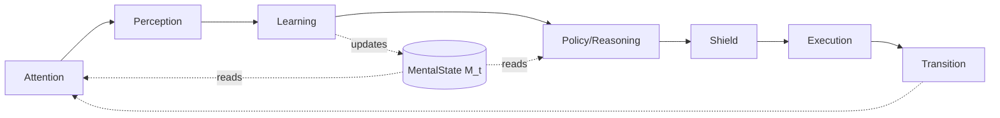
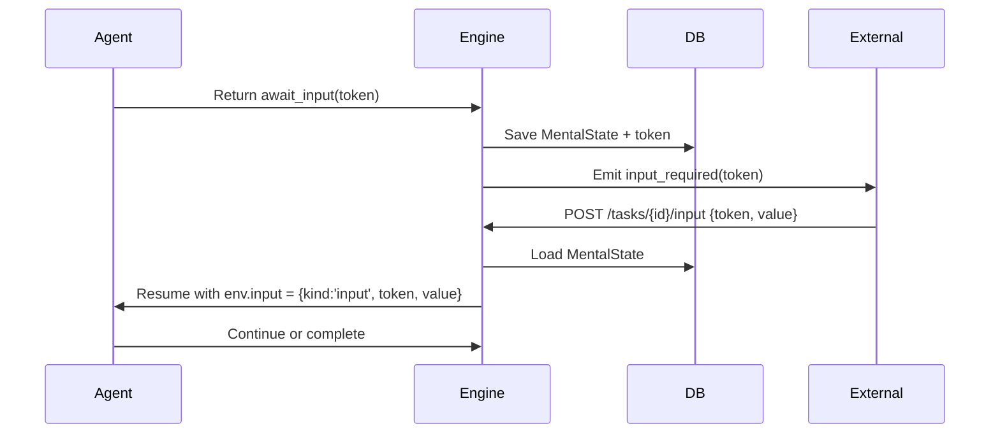

# A-P-L-R-E-T Architecture with Stage Dispatcher Pattern

**Production-Ready Agent Architecture for callagent Framework**

---

> **👥 Audience**: Agent developers using callagent  
> **🎯 Purpose**: Learn how to build production-ready agents with A-P-L-R-E-T architecture  
> **🔧 For framework maintainers**: See [Framework Changes](./framework-changes-for-aplret.md)  

---

## Overview

This document describes a **reusable, production-ready agent architecture** that combines:

1. **Brain-inspired cognitive loop** (A-P-L-R-E-T): Attention → Perception → Learning → Reasoning/Policy → Shield → Execution → Transition
2. **Typed intent system**: Policy emits discriminated unions, Dispatcher handles exhaustively
3. **Stage dispatcher pattern**: Explicit control flow using typed stages and handler maps
4. **Separation of concerns**: MentalState (M) for cognition, `ctx.vars` for control state
5. **Effect safety**: Budget-aware, timeout-protected, retryable effects
6. **Future-proof design**: Clear upgrade path to pattern matching (ts-pattern) or statecharts (XState)

### Key Benefits

- **Visibility**: Explicit stages and typed intents make control flow scannable
- **Safety**: Effect budgets, timeouts, retries, and shield checks built-in
- **Maintainability**: Adding new intents/stages = extending discriminated unions
- **Testability**: Pure functions for cognition, isolated effects with golden path tests
- **Type safety**: Exhaustive pattern matching prevents runtime errors
- **Scalability**: Clean path from simple dispatcher → exhaustive matching → statecharts

---

## Design Checklist

Before implementing an A-P-L-R-E-T agent, ensure:

- [ ] **Intents defined**: Closed discriminated union with exhaustive handling (via switch/handlers now; consider `.exhaustive()` later)
- [ ] **Stage invariants**: Runtime validation for required/forbidden `ctx.vars` keys
- [ ] **Shield active**: Budget checks, PII detection, policy constraints implemented
- [ ] **Budgets configured**: Cost caps in `m.reward.budget`, tracked per effect
- [ ] **Resume tokens**: Stored in `ctx.vars` for `await_input`, `await_tool`, `await_child`
- [ ] **Idempotency keys**: Attached to critical effects to prevent double-execution
- [ ] **Policy pure**: `policy(m)` reads only from M, env events routed through Learning
- [ ] **Trace logging**: Shield decisions, effect costs, stage transitions logged
- [ ] **Golden path test**: End-to-end test covering prompt → await → respond → complete

---

## Quick Start

**New to A-P-L-R-E-T?** Start here with a minimal but production-ready agent:

```typescript
import { createAgent } from '@a2arium/callagent-core';
import type { TaskContext, MentalState, ExecutableAction } from '@a2arium/callagent-core';

// 1. Define typed stages for explicit control flow
type Stage = 'idle' | 'awaiting_input' | 'completed';

// 2. Define typed intents (Policy decides WHAT to do)
type Intent =
  | { kind: 'prompt_user' }
  | { kind: 'answer_with_llm'; query: string };

// 3. Minimal, reusable stage helpers
import { createStageFacade } from '@a2arium/callagent-core';

const Stage = createStageFacade<Stage>({
  initial: 'idle',
  invariants: {
    awaiting_input: { require: ['token'], forbid: ['completed.called'] },
    completed: { require: ['completed.called'] }
  },
  // Optional: automatically mark flags when entering a stage
  autoMarks: {
    completed: { 'completed.called': true }
  }
});

// 4. Stage dispatcher (Execution decides HOW to do it)
const handlers: Record<Stage, (ctx: TaskContext, m: MentalState) => Promise<ExecutableAction>> = {
  idle: async (ctx, m) => {
    await ctx.reply('How can I help you today?');

    // ✅ NEW: Input-first approach with automatic token and stage management
    const handle = await ctx.requestInput('Your message', {
      setStage: 'awaiting_input'  // Automatically sets stage and token
    });
    const token = handle.token;
  
    return { kind: 'ask_user', token };
  },
  
  awaiting_input: async (ctx, m) => {
    // Read cognitive state from M (not from env!)
    const userText = m.memory?.sensory?.current;
    if (!userText) return { kind: 'internal', done: true };
    
    // Call LLM (framework method - already safe)
    const result = await ctx.llm.call(userText);
    await ctx.reply(result[0].content);
    
    // Mark complete (set completion flag before stage transition for invariant check)
    ctx.vars.set('completed.called', true);
    Stage.setStage(ctx, 'completed'); // autoMarks sets 'completed.called'
    
    return { kind: 'internal', done: true };
  },
  
  completed: async () => {
    return { kind: 'internal', done: true };
  }
};

// 5. Create agent with all modules
export const agent = createAgent({
  manifest: 'agent.json',
  llmConfig: { provider: 'openai', modelAliasOrName: 'fast' },

  // A - Attention: What to focus on
  attention: (m, env) => ({ 
    wantPrompt: !env.input 
  }),

  // P - Perception: Normalize input
  perception: (env) => ({ 
    text: env.input as string,
    eventType: env.input ? 'user_message' : 'idle'
  }),

  // L - Learning: Update M (immutable, pure)
  learning: (prev, _action, obs) => ({
    ...prev,
    memory: {
      ...prev.memory,
      sensory: { current: obs.text ?? prev.memory?.sensory?.current }
    }
  }),

  // R - Policy: Decide WHAT to do (pure function of M - NO control state!)
  policy: (m): Intent => {
    // Policy reads ONLY cognitive state, not control state (stage)
    const userText = m.memory?.sensory?.current;
    
    // Decision based on cognition
    if (userText) {
      return { kind: 'answer_with_llm', query: userText };
    }
    
    return { kind: 'prompt_user' };
  },

  // S - Shield: Safety checks (required)
  shield: (m, intent) => {
    // Basic pass-through (add budget/PII checks in production)
    return { action: 'pass', intent };
  },

  // E - Execution: Dispatch to stage handlers (respect stage AND intent)
  execution: async (intent, ctx, m) => {
    const stage = V.stage(ctx);
    
    if (stage === 'idle' && intent.kind === 'prompt_user') {
      return handlers.idle(ctx, m);
    }
    if (stage === 'awaiting_input' && intent.kind === 'answer_with_llm') {
      return handlers.awaiting_input(ctx, m);
    }
    if (stage === 'completed') {
      return handlers.completed(ctx, m as any);
    }
    
    // Fallback: do nothing
    return { kind: 'internal', done: true };
  },

  // T - Transition: Control loop flow (based on control state)
  transition: (_env, exec, ctx) => {
    if (exec.kind === 'ask_user') {
      return { kind: 'await_input', token: exec.token } as TurnOutcome;
    }
    if (V.completeCalled(ctx as TaskContext)) {
      return { kind: 'complete', result: { ok: true } } as TurnOutcome;
    }
    return { kind: 'continue' } as TurnOutcome;
  }
}, import.meta.url);
```

**Best Practices Included:**

✅ **Typed stages** - Explicit control flow states  
✅ **Typed intents** - Policy outputs are type-safe  
✅ **Typed façade (V)** - Type-safe access to `ctx.vars`  
✅ **Stage dispatcher** - Clean separation: Policy → Intent → Handler  
✅ **Pure Policy** - Reads only from M, not from env  
✅ **Immutable Learning** - Uses spread operators, no mutation  
✅ **State separation** - M for cognition, ctx.vars for control  

**What's happening:**

1. **Policy** (R) reads M and decides to `prompt_user` or `answer`
2. **Execution** (E) uses dispatcher to delegate to stage handlers
3. **Handlers** perform effects and update control state (V.setStage, V.setToken)
4. **Learning** (L) keeps M immutable - only updates worldModel
5. **Transition** (T) manages async flow (await_input) and completion

**Next steps:**

- Add stage invariants ([Section 5](#5-stage-dispatcher-pattern))
- Add exhaustive intent matching with ts-pattern ([Section 3](#3-typed-intent-system))
- Wrap external calls with `runEffect()` ([Section 7](#7-effect-safety-and-budgets))
- Write golden path test ([Section 9](#9-testing-strategy))

**Budget wiring (example):**

```typescript
// During execution after an effect completes
const effectCost = 120; // from the platform/tooling
ctx.vars.set('turnCost', (ctx.vars.get('turnCost') as number ?? 0) + effectCost);

// In Learning on the next turn, roll up spent
learning: (prev, _prevAction, obs) => ({
  ...prev,
  reward: {
    ...prev.reward,
    spent: (prev.reward?.spent ?? 0) + (prev.memory??.vars?.turnCost ?? 0)
  }
})
```

---

## Table of Contents

- [1. Architecture Philosophy](#1-architecture-philosophy)
- [2. Core Concepts](#2-core-concepts)
- [3. Typed Intent System](#3-typed-intent-system)
- [4. Module Contracts](#4-module-contracts)
- [5. Stage Dispatcher Pattern](#5-stage-dispatcher-pattern)
- [6. State Management Strategy](#6-state-management-strategy)
- [7. Effect Safety and Budgets](#7-effect-safety-and-budgets)
- [8. Resume Contract](#8-resume-contract)
- [9. Testing Strategy](#9-testing-strategy)
- [10. Upgrade Path](#10-upgrade-path)
- [11. Common Patterns](#11-common-patterns)
- [12. Best Practices](#12-best-practices)
- [13. Troubleshooting](#13-troubleshooting)
- [14. See Also](#14-see-also)
- [Appendix A: Complete Implementation Example](#appendix-a-complete-implementation-example)

---

## 1. Architecture Philosophy

### Brain-Inspired Loop (A-P-L-R-E-T)

The architecture mirrors cognitive science research on brain-inspired intelligence, with **six cognitive modules** plus **Shield** as a pre-execution guard:



**Why this matters:**

**Six cognitive modules (A-P-L-R-E-T):**
- **Attention (α_t)**: Goal and affect-guided focus (what matters now?)
- **Perception (o_t)**: Normalize multimodal environment into compact observation
- **Learning (M_t)**: Pure, immutable updates to mental state (memory, world model, goals, emotion, reward)
- **Reasoning/Policy (π)**: Decide what Intent to emit based on current mental state (pure function of M)
- **Execution (E)**: Perform effects (reply, requestInput, LLM calls, tool invocations) with safety
- **Transition (T)**: Control loop flow (continue | await_input | await_tool | await_child | complete | fail)

**Shield (S): Pre-execution guard (not a cognitive module):**
- Safety checks, budget enforcement, PII detection, HITL consent
- Runs between Policy and Execution: `intent ← policy(M) → intent' ← shield(intent') → execution(intent')`
- Can pass, transform, veto, or defer to user

### Typed Intent System

**Key Decision: Policy emits typed Intent, Dispatcher handles exhaustively**

```typescript
// Policy is the "brain" (reasoning)
type Intent =
  | { kind: 'prompt_user' }
  | { kind: 'answer_with_llm'; query: string }
  | { kind: 'plan_and_execute'; goal: string }
  | { kind: 'wait' };

policy: (m: MentalState) => Intent

// Execution is the "hands" (effects)
execution: (intent: Intent, ctx: TaskContext) => Promise<ExecutableAction>
```

This prevents drift between Policy and Dispatcher—Policy decides WHAT to do, Dispatcher decides HOW to do it.

### State Pattern for Control Flow

Use the **State pattern** via a dispatcher map to avoid if-pyramids:

```typescript
type Stage = 'idle' | 'awaiting_input' | 'planning' | 'executing' | 'completed';

const handlers: Record<Stage, (ctx: TaskContext, m: MentalState) => Promise<ExecutableAction>> = {
  idle: async (ctx, m) => { /* ... */ },
  awaiting_input: async (ctx, m) => { /* ... */ },
  planning: async (ctx, m) => { /* ... */ },
  executing: async (ctx, m) => { /* ... */ },
  completed: async (ctx, m) => ({ kind: 'internal', done: true })
};
```

---

## 2. Core Concepts

### MentalState (M_t) - The Cognitive Brain

`MentalState` represents the agent's **cognitive state** at turn `t`. It should be treated as **immutable** and updated only through the Learning module.

```typescript
type MentalState = {
  // NOTE: vars? is a read-only alias to memory.vars
  // ALWAYS use ctx.vars for writes; treat M.vars as framework-internal
  vars?: Record<string, unknown>;
  
  memory: {
    sensory: unknown;
    vars: Record<string, unknown>;
    thoughts?: ThoughtEntry[];
    decisions?: Record<string, DecisionEntry>;
    scratch?: unknown;
    window?: unknown;
    longTerm: {
      episodic: EpisodicEvent[];
      semantic: { concepts: SemanticConcept[] };
      procedural: { skills: Skill[] };
    };
  };
  worldModel: WorldModel;           // Beliefs about the environment
  goalState: GoalState;             // Current goals and priorities
  emotion: EmotionState;            // Affective state (M_emo in survey)
  reward: RewardState;              // Reward tracking (M_rew in survey)
  policyParams?: PolicyParams;      // Policy sampling config
};
```

**Key principles:**

- **Read-only in most modules**: Only Learning should update M
- **Pure cognition**: Derived features, beliefs, goals live here
- **Persistent**: Saved at turn boundaries, restored on resume
- **M.vars is read-only**: Framework internal; always use `ctx.vars` for writes

### ctx.vars - The Control State

`ctx.vars` is a **writable cache** for ephemeral control state (current stage, pending tokens, flags).

```typescript
// ✅ Use ctx.vars for control state
ctx.vars.set('stage', 'awaiting_input');
ctx.vars.set('token', handle.token);
ctx.vars.set('prompted', true);

// ❌ Never write to M directly (except in Learning)
m.memory.vars.stage = 'awaiting_input';  // Violates immutability

// ⚠️ M.vars is read-only convenience; prefer ctx.vars always
const stage = m.vars?.stage;  // OK to read
m.vars.stage = 'idle';        // ❌ Don't write to M.vars
```

**Why separate?**

- M is cognitive; vars is mechanical
- M persists across sessions; vars is ephemeral per turn
- Keeps Learning pure and testable

### Nested Path Support

`ctx.vars` supports automatic nested path creation for complex control state:

```typescript
// Alternative approaches for structured control state

// Approach 1: Build nested structure step by step
ctx.vars.set('workflow.stage', 'data_processing');
ctx.vars.set('workflow.currentStep', 3);
ctx.vars.set('workflow.errors', []);
ctx.vars.set('user.session.id', 'sess_123');
ctx.vars.set('user.session.preferences', { theme: 'dark' });

// Approach 2: Set complete nested objects directly
ctx.vars.set('workflow', {
    stage: 'data_processing',
    currentStep: 3,
    errors: []
});

ctx.vars.set('user', {
    session: {
        id: 'sess_123',
        preferences: { theme: 'dark' }
    }
});

// Both approaches create the same nested structure:
// {
//   workflow: { stage: 'data_processing', currentStep: 3, errors: [] },
//   user: { session: { id: 'sess_123', preferences: { theme: 'dark' } } }
// }

// Update with access to current value
ctx.vars.update('workflow.currentStep', (current) => (current || 0) + 1);

// Access nested values (same for both approaches)
const currentStage = ctx.vars.get('workflow.stage');
const stepNumber = ctx.vars.get('workflow.currentStep');
const userId = ctx.vars.get('user.session.id');

// Check if nested path exists
if (ctx.vars.has('workflow.errors')) {
    // Handle workflow errors
}

// Delete nested property
ctx.vars.delete('user.session.preferences');
```

#### **Key Methods:**

| Method | Description | Use Case |
|--------|-------------|----------|
| `set('path.to.prop', value)` | Direct assignment, creates nested structure | Setting control state |
| `update('path.to.prop', fn)` | Update with access to current value | Conditional state updates |
| `get('path.to.prop')` | Get nested value | Reading control state |
| `has('path.to.prop')` | Check if nested path exists | State validation |
| `delete('path.to.prop')` | Delete nested property | Cleanup control state |
| `merge(patch)` | Merge objects (dots are keys, not paths) | Batch updates |

**Best Practice:** Use nested paths to organize related control state logically, keeping the same separation between cognitive data (M) and control data (ctx.vars).

---

## 3. Typed Intent System

### Intent Discriminated Union

Define a **closed set of intents** that Policy can emit:

```typescript
type Intent =
  | { kind: 'prompt_user' }
  | { kind: 'answer_with_llm'; query: string; context?: string }
  | { kind: 'plan_and_execute'; goal: string; constraints?: string[] }
  | { kind: 'call_tool'; toolName: string; args: Record<string, unknown> }
  | { kind: 'delegate_to_child'; childAgentId: string; input: unknown }
  | { kind: 'wait' }
  | { kind: 'complete'; result: unknown };
```

### Policy Emits Intent

```typescript
policy: (m: MentalState): Intent => {
  const userIntent = m.worldModel.lastUserIntent;
  const userText = m.memory.sensory.current;
  const sentiment = m.worldModel.userSentiment;
  
  // Reasoning based on cognition
  if (userIntent === 'question' && userText) {
    return { kind: 'answer_with_llm', query: userText };
  }
  
  if (userIntent === 'command' && sentiment === 'urgent') {
    return { kind: 'plan_and_execute', goal: userText };
  }
  
  if (!userIntent) {
    return { kind: 'prompt_user' };
  }
  
  return { kind: 'wait' };
}
```

### Dispatcher Handles Intent Exhaustively

Use **ts-pattern** for exhaustive matching (compile-time safety) — optional upgrade when branching grows:

```typescript
import { match } from 'ts-pattern';

execution: async (intent: Intent, ctx: TaskContext, m: MentalState): Promise<ExecutableAction> => {
  const stage = V.stage(ctx);
  
  return match(intent)
    .with({ kind: 'prompt_user' }, async () => {
      await ctx.reply('How can I help you?');
      V.setPrompted(ctx, true);

      // ✅ NEW: Input-first approach with automatic token and stage management
      const handle = await ctx.requestInput('Your message', {
        setStage: 'awaiting_input'  // Automatically sets stage and token
      });
      const token = handle.token;

      return { kind: 'ask_user', token };
    })
    .with({ kind: 'answer_with_llm' }, async ({ query }) => {
      const result = await ctx.llm.call(query);
      await ctx.reply(result[0]?.content);
      ctx.complete(100, 'completed');
      V.setCompleteCalled(ctx, true);
      V.setStage(ctx, 'completed');
      return { kind: 'internal', done: true };
    })
    .with({ kind: 'plan_and_execute' }, async ({ goal }) => {
      // Generate plan
      V.setStage(ctx, 'planning');
      return { kind: 'internal', done: true };
    })
    .with({ kind: 'wait' }, async () => {
      return { kind: 'internal', done: true };
    })
    .exhaustive();  // ✅ Compile error if Intent case is missing
}
```

---

## 4. Module Contracts

### Per‑Agent Typing (Sensory, Obs)

Define explicit `Sensory` and `Obs` types and pass them to `createAgent<Sensory, Obs>`. This is the only acceptable pattern.

```typescript
type Sensory = { current?: string };
type Obs = { text?: string };

export const agent = createAgent<Sensory, Obs>({
  // perception returns Obs
  perception: (env): Obs => {
    const input = env?.input;
    const text = typeof input === 'string' ? input : (input && typeof input === 'object' ? (input as any).text : undefined);
    return { text };
  },

  // learning updates M<Sensory> immutably
  learning: (prev, _prevAction, obs): MentalState<Sensory> => ({
    ...prev,
    memory: {
      ...prev.memory,
      sensory: { current: obs.text }
    }
  }),

  // policy reads only M, emits Intent/ProposedAction
  policy: (m) => {
    const q = m.memory.sensory.current?.trim();
    return q
      ? { kind: 'internal', intent: 'answer_with_llm', data: { query: q } }
      : { kind: 'ask_user', prompt: 'Please type your message' };
  },
  // ...shield/execution/transition
}, import.meta.url);
```

Do not omit generics or rely on implicit `unknown`—define `Sensory` and `Obs` per agent to keep Perception/Learning/Policy contracts explicit and testable.

### Attention

```typescript
type AttentionSignal = {
  wantPrompt?: boolean;
  filters?: string[];
  priority?: 'low' | 'normal' | 'high';
};

attention: (prevMentalState: MentalState, env: EnvironmentState) => AttentionSignal
```

**Purpose**: Goal/affect-guided focus; optionally nudges prompting or filters for Perception.

**Example**:
```typescript
attention: (m, env) => {
  const hasInput = Boolean(env.input);
  const goalUrgency = m.goalState.priority;
  const emotionalState = m.emotion.valence;
  
  return {
    wantPrompt: !hasInput && goalUrgency === 'high',
    filters: emotionalState > 0.5 ? ['positive_signals'] : ['all'],
    priority: goalUrgency
  };
}
```

### Perception

```typescript
type Observation = {
  text?: string;
  meta?: Record<string, unknown>;
  eventType?: string;
};

perception: (env: EnvironmentState, alpha: AttentionSignal) => Observation
```

**Purpose**: Normalize multimodal environment into compact observation.

**Example**:
```typescript
perception: (env, alpha) => {
  const input = env.input;
  
  if (typeof input === 'string') {
    return { text: input, eventType: 'user_message' };
  }
  
  if (input && typeof input === 'object') {
    const event = input as { kind?: string; text?: string };
    return {
      text: event.text,
      meta: input,
      eventType: event.kind
    };
  }
  
  if (alpha.wantPrompt) {
    return { meta: { needsPrompt: true }, eventType: 'internal' };
  }
  
  return {};
}
```

### Learning

```typescript
learning: (
  prevMentalState: MentalState, 
  prevAction: ProposedAction | undefined, 
  obs: Observation,
  rPrev?: number
) => MentalState
```

**Purpose**: Pure, immutable updates to MentalState. **This is the ONLY place to update M.**

**Example**:
```typescript
learning: (prev, prevAction, obs, rPrev) => {
  // ✅ Derive cognitive features immutably
  if (obs.text) {
    const intent = extractIntent(obs.text);
    const sentiment = analyzeSentiment(obs.text);
    const entities = extractEntities(obs.text);
    
    return {
      ...prev,
      memory: {
        ...prev.memory,
        sensory: { current: obs.text },
        longTerm: {
          ...prev.memory.longTerm,
          episodic: [
            ...prev.memory.longTerm.episodic,
            {
              t: Date.now(),
              obs,
              act: prevAction,
              rew: rPrev
            }
          ]
        }
      },
      worldModel: {
        ...prev.worldModel,
        lastUserIntent: intent,
        userSentiment: sentiment,
        entities: [...prev.worldModel.entities, ...entities]
      },
      memory: {
        ...prev.memory,
        longTerm: {
          ...prev.memory.longTerm,
          episodic: [
            ...prev.memory.longTerm.episodic,
            {
              t: Date.now(),
              obs,
              act: prevAction,
              rew: rPrev
            }
          ]
        }
      },
      reward: {
        ...prev.reward,
        total: (prev.reward.total || 0) + (rPrev || 0)
      }
    };
  }
  
  // ❌ NEVER do this:
  // prev.memory.vars.userText = obs.text;  // Mutation!
  // prev.vars.stage = 'idle';  // Control in cognition!
  
  return prev;
}
```

### Policy (Reasoning)

```typescript
policy: (m: MentalState) => Intent
```

**Purpose**: Decide what Intent to emit based on current mental state. This is the "reasoning" step.

**Example**:
```typescript
policy: (m) => {
  const userIntent = m.worldModel.lastUserIntent;
  const userText = m.memory.sensory.current;
  const sentiment = m.worldModel.userSentiment;
  const goals = m.goalState.priority;
  const budget = m.reward.budget;
  
  // Decision logic based on cognition
  if (!userIntent) {
    return { kind: 'prompt_user' };
  }
  
  if (userIntent === 'question' && budget > 100) {
    return {
      kind: 'answer_with_llm',
      query: userText || '',
      context: JSON.stringify(m.worldModel.entities)
    };
  }
  
  if (userIntent === 'command' && goals === 'execute') {
    return {
      kind: 'plan_and_execute',
      goal: userText || '',
      constraints: sentiment < 0 ? ['careful'] : []
    };
  }
  
  if (userIntent === 'complex_task') {
    return {
      kind: 'delegate_to_child',
      childAgentId: 'specialist-agent',
      input: { task: userText }
    };
  }
  
  return { kind: 'wait' };
}
```

### Shield (Safety)

```typescript
type ShieldOutcome =
  | { action: 'pass'; intent: Intent }
  | { action: 'transform'; intent: Intent }
  | { action: 'veto'; reason: string }
  | { action: 'defer'; askUser: string };

shield: (m: MentalState, intent: Intent) => ShieldOutcome
```

**Purpose**: Safety, constraints, budget checks. Can pass, transform, veto, or defer to user.

**Example**:
```typescript
shield: (m, intent) => {
  // Budget check
  const costEstimate = estimateCost(intent);
  if (costEstimate > m.reward.budget) {
    return {
      action: 'defer',
      askUser: `Action costs ${costEstimate} tokens. Budget: ${m.reward.budget}. Proceed?`
    };
  }
  
  // PII check
  if (containsPII(intent)) {
    console.warn('[shield] Vetoed intent containing PII');
    return {
      action: 'veto',
      reason: 'PII_DETECTED'
    };
  }
  
  // HITL consent for tools
  if (intent.kind === 'call_tool' && m.goalState.hitlLevel === 'consent') {
    return {
      action: 'defer',
      askUser: `Approve tool call: ${intent.toolName}?`
    };
  }
  
  // Transform for safety
  if (intent.kind === 'answer_with_llm' && !intent.context) {
    return {
      action: 'transform',
      intent: { ...intent, context: 'safe_mode' }
    };
  }
  
  // Pass through
  return { action: 'pass', intent };
}
```

**Shield Semantics (Constrained MDP + Shielding):**

Note: Examples below assume the upcoming `ShieldOutcome` API (pass/transform/veto/defer). Current API is pass-through: `shield(m, intent) => intent | null`.

1. **Order**: `intent ← policy(M) → intent' ← shield(M, intent) → execution(intent')`
   - Shield runs **after** Policy, **before** Execution
   - Shield receives the original intent and mental state
   
2. **Outcomes**: Four mutually exclusive actions
   - `pass`: Allow intent unchanged
   - `transform`: Modify intent (e.g., sanitize, add context)
   - `veto`: Block intent entirely (log reason)
   - `defer`: Escalate to user for approval
   
3. **Logging**: Always log shield decisions (orchestrator logs the outcome)
  ```typescript
  // In the loop, after calling shield(m, intent)
  const outcome = shield(m, intent);
  ctx.log.info('shield_decision', {
    module: 'shield',
    action: outcome.action,
    originalIntent: intent.kind,
    reason: outcome.action === 'veto' ? outcome.reason : undefined,
    transformed: outcome.action === 'transform'
  });
  ```

4. **Transform Precedence**: If multiple checks apply, run all and combine:
   - If any veto → veto wins
   - If any defer → defer wins
   - If multiple transforms → apply in sequence

**References**: Constrained MDP (Altman 1999), Shielding (Alshiekh et al. 2018)

### Execution

```typescript
execution: (intent: Intent, ctx: TaskContext, m: MentalState) => Promise<ExecutableAction>
```

**Purpose**: Map intents to effects using the **stage dispatcher** and **runEffect()** for safety.

See [Appendix A: Complete Implementation Example](#appendix-a-complete-implementation-example) for full code.

### Transition

```typescript
transition: (env: EnvironmentState, exec: ExecutableAction, m: MentalState) => TurnOutcome
```

**Purpose**: Control loop flow based on execution result.

**Example**:
```typescript
transition: (env, exec, m) => {
  // Await outcomes
  if (exec.kind === 'ask_user') {
    return { kind: 'await_input', token: exec.token };
  }
  if (exec.kind === 'tool' && exec.token) {
    return { kind: 'await_tool', token: exec.token };
  }
  if (exec.kind === 'subagent' && exec.token) {
    return { kind: 'await_child', token: exec.token };
  }
  
  // Terminal outcomes
  const stage = (m.vars?.stage as Stage) || 'idle';
  if (stage === 'completed') {
    return { kind: 'complete', result: { ok: true } };
  }
  
  // Continue loop
  return { kind: 'continue' };
}
```

---

## 5. Stage Dispatcher Pattern

### Typed Stages

Define explicit stages for your agent's workflow:

```typescript
type Stage = 
  | 'idle'            // Initial state, decide what to do
  | 'awaiting_input'  // Waiting for user input
  | 'planning'        // Planning multi-step action
  | 'executing'       // Running tool chain
  | 'awaiting_tool'   // Waiting on tool callback
  | 'awaiting_child'  // Waiting on child agent
  | 'completed';      // Terminal state
```

### Stage Invariants (Enforce at Runtime)

Each stage has **invariants** that must hold:

| Stage | Required in ctx.vars | Forbidden | Notes |
|-------|---------------------|-----------|-------|
| `idle` | - | `token`, `completeCalled` | Clean slate |
| `awaiting_input` | `token: string` | `completeCalled` | Waiting for user |
| `planning` | `planSteps?: string[]` | `completeCalled` | Optional plan |
| `executing` | `planSteps?: string[]` | - | Running tasks |
| `awaiting_tool` | `token: string` | `completeCalled` | Waiting for tool callback |
| `awaiting_child` | `token: string` | `completeCalled` | Waiting for child agent |
| `completed` | `completeCalled: true` | - | Terminal |

**Enforce with runtime asserts (implement all rows):**

```typescript
// Prefer the framework helper for stage invariants and entry marks
import { createStageFacade } from '@a2arium/callagent-core';

type Stage =
  | 'idle'
  | 'awaiting_input'
  | 'planning'
  | 'executing'
  | 'awaiting_tool'
  | 'awaiting_child'
  | 'completed';

const Stage = createStageFacade<Stage>({
  initial: 'idle',
  invariants: {
    idle: { forbid: ['token', 'completeCalled'] },
    awaiting_input: { require: ['token'], forbid: ['completeCalled'] },
    planning: { forbid: ['completeCalled'] },
    executing: {},
    awaiting_tool: { require: ['token'], forbid: ['completeCalled'] },
    awaiting_child: { require: ['token'], forbid: ['completeCalled'] },
    completed: { require: ['completeCalled'] }
  },
  // Optional: auto-mark flags on entry
  autoMarks: {
    completed: { completeCalled: true }
  }
});

// Usage
// await ctx.requestInput('Your message', { setStage: 'awaiting_input' });
// const s = Stage.getStage(ctx);
```

### Typed Façade for ctx.vars

Create a helper object to access/mutate `ctx.vars` in a type-safe way:

```typescript
type Vars = {
  stage: Stage;
  prompted?: boolean;
  userText?: string;
  token?: string;
  planSteps?: string[];
  completeCalled?: boolean;
};

// Use createStageFacade for stage get/set and invariant checks.
// This façade focuses on non-stage convenience accessors.
const V = {
  // Flags
  prompted: (ctx: TaskContext) => 
    Boolean(ctx.vars.get('prompted')),
  setPrompted: (ctx: TaskContext, v: boolean) => 
    ctx.vars.set('prompted', v),
  
  // User text
  userText: (ctx: TaskContext) => 
    ctx.vars.get('userText') as string | undefined,
  setUserText: (ctx: TaskContext, t?: string) => 
    ctx.vars.set('userText', t),
  
  // Token tracking
  token: (ctx: TaskContext) => 
    ctx.vars.get('token') as string | undefined,
  setToken: (ctx: TaskContext, t?: string) => 
    ctx.vars.set('token', t),
  
  // Plan steps
  planSteps: (ctx: TaskContext) => 
    ctx.vars.get('planSteps') as string[] | undefined,
  setPlanSteps: (ctx: TaskContext, steps?: string[]) => 
    ctx.vars.set('planSteps', steps),
  
  // Current subtask index (used in child coordination pattern)
  currentSubtaskIndex: (ctx: TaskContext) => 
    ctx.vars.get('currentSubtaskIndex') as number | undefined,
  setCurrentSubtaskIndex: (ctx: TaskContext, i?: number) => 
    ctx.vars.set('currentSubtaskIndex', i),
  
  // Complete tracking
  completeCalled: (ctx: TaskContext) => 
    Boolean(ctx.vars.get('completeCalled')),
  setCompleteCalled: (ctx: TaskContext, v: boolean) => 
    ctx.vars.set('completeCalled', v)
};
```

### Intent→Stage Typestate (Prevent Drift)

To enforce that **Policy decides WHAT, Dispatcher decides HOW**, add compile-time and runtime checks:

**1. Closed Intent Union (exhaustive handling recommended; ts-pattern `.exhaustive()` optional):**

```typescript
type Intent =
  | { kind: 'prompt_user' }
  | { kind: 'answer_with_llm'; query: string }
  | { kind: 'plan_and_execute'; goal: string }
  | { kind: 'wait' }
  | { kind: 'complete'; result: unknown };
```

**2. Intent→Allowed Stages Map (typestate):**

```typescript
// 1) Declare allowed (intent → stages) typestate map
const INTENT_ALLOWED_STAGES: Record<Intent['kind'], Stage[]> = {
  prompt_user: ['idle'],
  answer_with_llm: ['awaiting_input', 'executing'],
  plan_and_execute: ['awaiting_input', 'planning'],
  delegate_to_child: ['planning', 'executing'],
  call_tool: ['executing'],
  wait: ['idle', 'executing', 'awaiting_tool', 'awaiting_child'],
  complete: ['executing', 'completed']
};

// 2) Assertion function
function assertIntentAllowedInStage(intent: Intent, stage: Stage): void {
  const allowed = INTENT_ALLOWED_STAGES[intent.kind];
  if (!allowed.includes(stage)) {
    throw new Error(
      `[typestate] Intent '${intent.kind}' not allowed in stage '${stage}'. ` +
      `Allowed stages: ${allowed.join(', ')}`
    );
  }
}

// 3) Helper composed with createStageFacade
function assertIntentAllowedHere(ctx: TaskContext, intent: Intent): void {
  const stage = Stage.getStage(ctx);  // from createStageFacade
  assertIntentAllowedInStage(intent, stage);
}
```

**3. Use in Execution Dispatcher:**

```typescript
execution: async (intent, ctx, m) => {
  // Runtime typestate check using Stage facade
  assertIntentAllowedHere(ctx, intent);
  
  // Now dispatch safely
  return match(intent)
    .with({ kind: 'prompt_user' }, async () => {
      // Only runs if current stage ∈ INTENT_ALLOWED_STAGES['prompt_user']
      // ...
    })
    .exhaustive();
}
```

Note: `createStageFacade` enforces per-stage invariants and auto-marks; typestate (intent → allowed stages) is a separate concern. The recommended pattern is to compose both: use the facade to read/validate the current stage and a small assertion to enforce intent-stage compatibility.

> Prefer exhaustive matching: When feasible, use `ts-pattern` on `{ stage, intent }` with `.exhaustive()` to get compile-time guarantees that all combinations you care about are handled. Keep the typestate assertion as a lightweight runtime guard and documentation aid for medium/large flows or when handler reachability could drift.

**Benefits:**
- Catches intent/stage mismatches early (fail-fast)
- Documents allowed state transitions
- Prevents "prompt_user inside executing" bugs
- Makes policy→execution contract explicit

---

## 6. State Management Strategy

### M (MentalState) - Cognitive Features

**Use for:**
- User intent, sentiment, goals
- World beliefs, entity tracking
- Long-term episodic memory
- Skills, semantic concepts
- Reward/emotion state

**Update only in Learning:**
```typescript
learning: (prev, prevAction, obs) => ({
  ...prev,
  worldModel: {
    ...prev.worldModel,
    lastUserIntent: extractIntent(obs.text),
    entities: updateEntities(prev.worldModel.entities, obs)
  },
  goalState: {
    ...prev.goalState,
    priority: computePriority(prev.goalState, obs)
  }
})
```

### ctx.vars - Control State

**Use for:**
- Current stage in workflow
- Pending tokens (input/tool/child)
- Flags (prompted, initialized, etc.)
- Temporary plan steps
- Completion tracking

**Update anywhere except Learning:**
```typescript
execution: async (intent, ctx, m) => {
  V.setStage(ctx, 'awaiting_input');
  V.setToken(ctx, handle.token);
  V.setPrompted(ctx, true);
}
```

### Decision Matrix

| State Type | Where to Store | Updated By | Persisted | Example |
|------------|---------------|------------|-----------|---------|
| User intent | M.worldModel | Learning | Yes | `lastUserIntent: 'question'` |
| Current stage | ctx.vars | Execution | No | `stage: 'awaiting_input'` |
| Episodic memory | M.memory.longTerm | Learning | Yes | `[{t:123, obs, act, rew}]` |
| Pending token | ctx.vars | Execution | No | `token: 'abc123'` |
| User sentiment | M.worldModel | Learning | Yes | `userSentiment: 0.8` |
| Plan steps | ctx.vars | Execution | No | `planSteps: ['step1']` |
| Budget | M.reward | Learning | Yes | `budget: 1000` |
| Completion flag | ctx.vars | Execution | No | `completeCalled: true` |

---

## 7. Effect Safety and Budgets

### Three-Tier Safety Approach

**Framework safety philosophy:**

1. **LLM calls** (`ctx.llm.call`) → Already safe (calllm library handles timeouts/retries internally)
2. **Framework methods** (`ctx.reply`, `ctx.tools`) → Safe by default (internal safety wrapper)
3. **External calls** (fetch, database, custom APIs) → Opt-in safety via `runEffect()`

**Practical example:**

```typescript
execution: async (intent, ctx, m) => {
  // ✅ Tier 1: LLM calls - use directly
  const llmResult = await ctx.llm.call('What is AI?');
  
  // ✅ Tier 2: Framework methods - use directly
  await ctx.reply(llmResult[0]?.content);
  await ctx.tools.invoke('calculator', { expr: '2+2' });
  
  // ✅ Tier 3: External calls - wrap any async function
  const apiData = await runEffect(
    () => fetch('https://api.example.com/data').then(r => r.json()),
    { timeoutMs: 10000, maxRetries: 3 }
  );
  
  const processed = await runEffect(
    () => externalService.process(apiData),
    { timeoutMs: 30000, maxRetries: 2 }
  );
  
  return { kind: 'internal', done: true };
}
```

### runEffect() - Simple Function Wrapper

**For agent's own external calls**, use `runEffect()` to wrap any async function:

```typescript
export type EffectOptions = {
  timeoutMs?: number;       // Default: 30000
  maxRetries?: number;      // Default: 2
  retryDelayMs?: number;    // Default: 1000
  retryableErrors?: string[];  // Custom patterns
};
```

**Key insight**: No Effect envelope needed! Just wrap your async function.

### runEffect() Import

Use the provided helper from the framework:

```typescript
import { runEffect } from '@a2arium/callagent-core/loop/effects';
```

### Using runEffect for External Calls (with jittered backoff)

```typescript
execution: async (intent, ctx, m) => {
  return match(intent)
    .with({ kind: 'answer_with_llm' }, async ({ query }) => {
      // ✅ Framework methods - use directly (already safe)
      const llmResult = await ctx.llm.call(query);
      await ctx.reply(llmResult[0]?.content);
      
      ctx.complete(100, 'completed');
      V.setCompleteCalled(ctx, true);
      V.setStage(ctx, 'completed');
      return { kind: 'internal', done: true };
    })
    
    .with({ kind: 'fetch_external_data' }, async ({ apiUrl }) => {
      try {
        // ✅ External API - wrap any async function
        const data = await runEffect(
          () => fetch(apiUrl).then(r => r.json()),
          { timeoutMs: 10000, maxRetries: 3 }
        );
        
        await ctx.reply(`Data fetched: ${JSON.stringify(data)}`);
        return { kind: 'internal', done: true };
        
      } catch (error) {
        await ctx.reply(`Fetch error: ${(error as Error).message}`);
        return { kind: 'internal', done: true, error };
      }
    })
    
    .with({ kind: 'process_with_external_service' }, async ({ data }) => {
      try {
        // ✅ Third-party SDK - wrap the call
        const result = await runEffect(
          () => externalService.process(data),
          { timeoutMs: 30000, maxRetries: 2 }
        );
        
        // ✅ Multiple steps in one runEffect
        const enriched = await runEffect(
          async () => {
            const step1 = await externalAPI.enrich(result);
            const step2 = await externalAPI.validate(step1);
            return step2;
          },
          { timeoutMs: 45000 }
        );
        
        await ctx.reply(`Processed: ${enriched}`);
        return { kind: 'internal', done: true };
        
      } catch (error) {
        await ctx.reply(`Processing error: ${(error as Error).message}`);
        return { kind: 'internal', done: true, error };
      }
    })
    
    .exhaustive();
}
```

---

## 8. Resume Contract

When the agent produces `await_*` outcomes, the framework must resume after external events. Here's the **resume contract**:

### Await Outcomes

```typescript
type TurnOutcome =
  | { kind: 'continue' }
  | { kind: 'await_input'; token: string }
  | { kind: 'await_tool'; token: string }
  | { kind: 'await_child'; token: string }
  | { kind: 'complete'; result?: unknown }
  | { kind: 'fail'; reason: string };
```

### Resume Flow



### Resume Event Payloads

When the agent resumes, `env.input` contains the event:

```typescript
type ResumeEvent = 
  | { kind: 'input'; token: string; value: string }
  | { kind: 'tool'; token: string; result: unknown }
  | { kind: 'child'; token: string; output: unknown }
  | { kind: 'external'; token: string; payload: unknown };
```

### Environment Input Helper Guards (Recommended)

To reliably interpret `env.input` in Perception and Execution, use the framework-provided type guards. They help you branch on canonical resume/input events safely without ad‑hoc checks.

```typescript
import { isDirectInput, isToolCompletionInput, isChildCompletionInput, isExternalEventInput } from '@a2arium/callagent-core';

perception: (env) => {
  const input = env.input;
  if (isDirectInput(input)) {
    // Human input resumed via token
    const v = input.value;
    const text = typeof v === 'string' ? v : (v && typeof v === 'object' ? (v as any).text : undefined);
    return { text, eventType: 'input', resumeToken: input.token };
  }

  if (isToolCompletionInput(input)) {
    return { meta: { result: input.result }, eventType: 'tool', resumeToken: input.token };
  }

  if (isChildCompletionInput(input)) {
    return { meta: { output: input.output }, eventType: 'child', resumeToken: input.token } as any;
  }

  if (isExternalEventInput(input)) {
    return { meta: { event: input.event }, eventType: 'external' };
  }

  return {};
}
```

Helper guard cheatsheet:
- `isDirectInput(x)`: true for `{ kind: 'input'; value; token }`
- `isToolCompletionInput(x)`: true for `{ kind: 'tool'; result; token }`
- `isChildCompletionInput(x)`: true for `{ kind: 'child'; output; token }`
- `isExternalEventInput(x)`: true for `{ kind: 'external'; event }`

Using these ensures Perception remains small and consistent, and keeps Policy pure by routing all environment changes through Learning → M.

### Handling Resume in Policy (Pure Approach)

**Policy is pure: `policy(m)` reads only from M.** Resume events flow through **Perception → Learning → M** first.

**Step 1: Perception normalizes resume event**

```typescript
perception: (env, alpha) => {
  const input = env.input;
  
  if (input && typeof input === 'object') {
    const event = input as ResumeEvent;
    return {
      eventType: event.kind,  // 'input', 'tool', 'child'
      text: event.kind === 'input' ? event.value : undefined,
      meta: event,
      resumeToken: event.token
    };
  }
  
  return {};
}
```

**Step 2: Learning updates M with resume data**

```typescript
learning: (prev, prevAction, obs) => {
  if (obs.eventType === 'input' && obs.text) {
    return {
      ...prev,
      memory: { ...prev.memory, sensory: { current: obs.text } },
      worldModel: { ...prev.worldModel, lastUserIntent: extractIntent(obs.text), resumedFrom: 'input' }
    };
  }
  
  if (obs.eventType === 'tool' && obs.meta) {
    return {
      ...prev,
      worldModel: {
        ...prev.worldModel,
        lastToolResult: (obs.meta as any).result,
        resumedFrom: 'tool'
      }
    };
  }
  
  return prev;
}
```

**Step 3: Policy reads from M (pure)**

```typescript
policy: (m) => {  // Pure - only reads M
  const resumedFrom = m.worldModel.resumedFrom;
  
  // Handle resumed input
  if (resumedFrom === 'input' && m.memory.sensory.current) {
    return {
      kind: 'answer_with_llm',
      query: m.memory.sensory.current
    };
  }
  
  // Handle resumed tool result
  if (resumedFrom === 'tool' && m.worldModel.lastToolResult) {
    return {
      kind: 'process_tool_result',
      result: m.worldModel.lastToolResult
    };
  }
  
  // Normal flow
  if (!m.worldModel.lastUserIntent) {
    return { kind: 'prompt_user' };
  }
  
  return { kind: 'wait' };
}
```

**Benefits of pure policy:**
- Easier to test (no env dependency)
- All state flows through M
- Clear separation: env → Perception → Learning → M → Policy
- No bypassing the cognitive loop

### Resume Guarantees

1. **Token validation**: Engine validates token matches pending operation
2. **State restoration**: MentalState is loaded from DB before resume
3. **Exactly-once**: Idempotency keys prevent duplicate processing
4. **Turn boundaries**: Resume always starts a new turn (not mid-turn)

---

## 9. Testing Strategy

```typescript
import { createAgent, isDirectInput } from '@a2arium/callagent-core';
import type {
  EnvironmentState,
  MentalState,
  ProposedAction,
  ExecutableAction,
  TurnOutcome,
  TaskContext
} from '@a2arium/callagent-core';
import { match } from 'ts-pattern';

// === Types ===
type Stage = 'idle' | 'awaiting_input' | 'planning' | 'executing' | 'completed';

type Intent =
  | { kind: 'prompt_user' }
  | { kind: 'answer_with_llm'; query: string }
  | { kind: 'plan_and_execute'; goal: string }
  | { kind: 'wait' }
  | { kind: 'complete'; result: unknown };

type ResumeEvent = 
  | { kind: 'input'; token: string; value: string }
  | { kind: 'tool'; token: string; result: unknown }
  | { kind: 'child'; token: string; output: unknown };

// === Typed façade for ctx.vars ===
const V = {
  stage: (ctx: TaskContext): Stage => (ctx.vars.get('stage') as Stage) ?? 'idle',
  setStage: (ctx: TaskContext, s: Stage) => ctx.vars.set('stage', s),
  
  prompted: (ctx: TaskContext) => Boolean(ctx.vars.get('prompted')),
  setPrompted: (ctx: TaskContext, v: boolean) => ctx.vars.set('prompted', v),
  
  userText: (ctx: TaskContext) => ctx.vars.get('userText') as string | undefined,
  setUserText: (ctx: TaskContext, t?: string) => ctx.vars.set('userText', t),
  
  token: (ctx: TaskContext) => ctx.vars.get('token') as string | undefined,
  setToken: (ctx: TaskContext, t?: string) => ctx.vars.set('token', t),
  
  completeCalled: (ctx: TaskContext) => Boolean(ctx.vars.get('completeCalled')),
  setCompleteCalled: (ctx: TaskContext, v: boolean) => ctx.vars.set('completeCalled', v)
};

// === Helpers ===
const extractText = (val: unknown): string => {
  if (typeof val === 'string') return val.trim();
  if (val && typeof val === 'object') {
    return (val as { text?: string }).text?.trim() || '';
  }
  return '';
};

const extractIntent = (text: string): string => {
  if (text.includes('?')) return 'question';
  if (text.startsWith('please') || text.startsWith('can you')) return 'request';
  return 'statement';
};

// === Agent ===
export const agent = createAgent({
  manifest: 'agent.json',
  llmConfig: {
    provider: 'openai',
    modelAliasOrName: 'fast',
    systemPrompt: 'You are a helpful AI assistant using structured thinking.'
  },

  // === A - Attention ===
  attention: (m, env) => {
    const hasInput = Boolean(env.input);
    const goalUrgency = m.goalState?.priority || 'normal';
    
    return {
      wantPrompt: !hasInput && goalUrgency === 'high'
    };
  },

  // === P - Perception ===
  perception: (env, alpha) => {
    const input = env.input;
    
    if (typeof input === 'string') {
      return { text: input, eventType: 'user_message' };
    }
    
    if (input && typeof input === 'object') {
      return {
        text: (input as { text?: string; value?: string }).text || (input as { value?: string }).value,
        meta: input,
        eventType: (input as { kind?: string }).kind
      };
    }
    
    if (alpha.wantPrompt) {
      return { meta: { needsPrompt: true }, eventType: 'internal' };
    }
    
    return {};
  },

  // === L - Learning (pure, immutable) ===
  learning: (prev, _prevAction, obs, rPrev) => {
    if (isDirectInput(obs)) {
      const text = extractText(obs.value);
      const intent = extractIntent(text);
      
      return {
        ...prev,
        worldModel: {
          ...prev.worldModel,
          lastUserText: text,
          lastUserIntent: intent
        },
        memory: {
          ...prev.memory,
          longTerm: {
            ...prev.memory.longTerm,
            episodic: [
              ...prev.memory.longTerm.episodic,
              {
                t: Date.now(),
                obs,
                act: _prevAction,
                rew: rPrev
              }
            ]
          }
        },
        reward: {
          ...prev.reward,
          total: (prev.reward?.total || 0) + (rPrev || 0)
        }
      };
    }
    
    // Handle resume events
    if (obs && typeof obs === 'object') {
      const event = obs as { kind?: string; value?: string };
      if (event.kind === 'input' && event.value) {
        const text = event.value;
        const intent = extractIntent(text);
        
    return {
      ...prev,
      memory: { ...prev.memory, sensory: { current: text } },
      worldModel: { ...prev.worldModel, lastUserIntent: intent }
    };
      }
    }
    
    return prev;
  },

  // === R - Policy (reasoning) ===
  policy: (m): Intent => {
    const userIntent = m.worldModel?.lastUserIntent;
    const userText = m.worldModel?.lastUserText;
    
    // Handle resumed input
    if (userIntent === 'question' && userText) {
      return { kind: 'answer_with_llm', query: userText };
    }
    
    if (userIntent === 'request' && userText) {
      return { kind: 'plan_and_execute', goal: userText };
    }
    
    // No input yet
    if (!userIntent) {
      return { kind: 'prompt_user' };
    }
    
    return { kind: 'wait' };
  },

  // === Shield (safety) ===
  shield: (_m, a) => a,  // Pass-through for now; add budget/PII checks as needed

  // === E - Execution (stage dispatcher with exhaustive matching) ===
  execution: async (intent: Intent, ctx: TaskContext, m: MentalState): Promise<ExecutableAction> => {
    // Use ts-pattern for exhaustive intent handling
    return match(intent)
      .with({ kind: 'prompt_user' }, async () => {
        if (!V.prompted(ctx)) {
          await ctx.reply('How can I help you today?');
          V.setPrompted(ctx, true);

          // ✅ NEW: Input-first approach with automatic token and stage management
          const handle = await ctx.requestInput('Your message', {
            setStage: 'awaiting_input',  // Automatically sets stage and token
            onProvided: '__onUserAnswer'
          });
          const token = handle.token;

          return { kind: 'ask_user', token };
        }
        return { kind: 'internal', done: true };
      })
      
      .with({ kind: 'answer_with_llm' }, async ({ query }) => {
        await ctx.reply(`Thinking about: "${query}"`);
        
        try {
          const res = await ctx.llm.call(query);
          const llmText = (res as { content?: string }[])?.[0]?.content || 'Done.';
          
          await ctx.reply({ type: 'text', text: llmText });
          
          ctx.complete(100, 'completed');
          V.setCompleteCalled(ctx, true);
          V.setStage(ctx, 'completed');
          
          return { kind: 'internal', done: true };
        } catch (e) {
          await ctx.reply(`Error: ${(e as Error).message}`);
          return { kind: 'internal', done: true, error: e };
        }
      })
      
      .with({ kind: 'plan_and_execute' }, async ({ goal }) => {
        await ctx.reply(`Planning how to: "${goal}"`);
        V.setStage(ctx, 'planning');
        return { kind: 'internal', done: true };
      })
      
      .with({ kind: 'wait' }, async () => {
        return { kind: 'internal', done: true };
      })
      
      .with({ kind: 'complete' }, async ({ result }) => {
        ctx.complete(100, 'completed');
        V.setCompleteCalled(ctx, true);
        V.setStage(ctx, 'completed');
        return { kind: 'internal', done: true };
      })
      
      .exhaustive();  // ✅ Compile error if Intent case is missing
  },

  // === T - Transition ===
  transition: (_env, exec, ctx) => {
    // Await outcomes
    if ((exec as { kind?: string }).kind === 'ask_user') {
      return { kind: 'await_input', token: (exec as { token?: string }).token } as TurnOutcome;
    }
    
    // Terminal outcomes
    const stage = V.stage(ctx as TaskContext);
    if (stage === 'completed') {
      return { kind: 'complete', result: { ok: true } } as TurnOutcome;
    }
    
    // Continue loop
    return { kind: 'continue' } as TurnOutcome;
  }
}, import.meta.url);
```

---

## 10. Upgrade Path

### Golden Path Test

End-to-end test covering the happy path:

```typescript
import { describe, it, expect, beforeEach } from '@jest/globals';
import { createTestContext, runAgent } from '@a2arium/callagent-test-utils';

describe('Agent Golden Path', () => {
  let ctx: TestContext;
  
  beforeEach(() => {
    ctx = createTestContext();
  });
  
  it('prompt → await → respond → complete', async () => {
    // Turn 1: Agent prompts user
    await runAgent(ctx, { input: null });
    
    expect(V.stage(ctx)).toBe('awaiting_input');
    expect(ctx.replies).toContainEqual(expect.stringContaining('How can I help'));
    expect(V.prompted(ctx)).toBe(true);
    expect(V.token(ctx)).toBeDefined();
    
    // Turn 2: User responds
    ctx.input = { kind: 'input', token: V.token(ctx), value: 'What is 2+2?' };
    await runAgent(ctx);
    
    expect(V.stage(ctx)).toBe('completed');
    expect(ctx.replies).toContainEqual(expect.stringContaining('4'));
    expect(V.completeCalled(ctx)).toBe(true);
  });
});
```

### Tool Await Test (advanced)

Test asynchronous tool invocation:

```typescript
describe('Tool Await Flow', () => {
  it('call tool → await → process result → complete', async () => {
    const ctx = createTestContext({ input: 'Calculate 5 * 7' });
    
    // Turn 1: Agent calls tool
    await runAgent(ctx);
    
    expect(V.stage(ctx)).toBe('awaiting_tool');  // requires Stage to include 'awaiting_tool'
    expect(V.token(ctx)).toBeDefined();
    
    // Turn 2: Tool completes
    ctx.input = { kind: 'tool', token: V.token(ctx), result: 35 };
    await runAgent(ctx);
    
    expect(V.stage(ctx)).toBe('completed');
    expect(ctx.replies).toContainEqual(expect.stringContaining('35'));
  });
});
```

### Unit Tests for Modules

Test each module in isolation:

```typescript
describe('Learning module', () => {
  it('extracts user intent from observation', () => {
    const prev = createEmptyMentalState();
    const obs = { value: 'What is the weather?' };
    
    const next = agent.learning(prev, undefined, obs);
    
    expect(next.worldModel.lastUserIntent).toBe('question');
    expect(next.memory.sensory.current).toBe('What is the weather?');
  });
  
  it('does not mutate previous state', () => {
    const prev = createEmptyMentalState();
    const obs = { value: 'Hello' };
    
    const next = agent.learning(prev, undefined, obs);
    
    expect(prev).not.toBe(next);
    expect(prev.worldModel).not.toBe(next.worldModel);
  });
});

describe('Policy module', () => {
  it('emits answer_with_llm intent for questions', () => {
    const m = {
      ...createEmptyMentalState(),
      worldModel: { lastUserIntent: 'question' },
      memory: { sensory: { current: 'What is AI?' } }
    };
    
    const intent = agent.policy(m);
    
    expect(intent).toEqual({
      kind: 'answer_with_llm',
      query: 'What is AI?'
    });
  });
  
  it('emits prompt_user intent when no input', () => {
    const m = createEmptyMentalState();
    
    const intent = agent.policy(m);
    
    expect(intent).toEqual({ kind: 'prompt_user' });
  });
});
```

### Integration Tests for Handlers

Test stage transitions:

```typescript
describe('Execution handlers', () => {
  it('transitions from idle to awaiting_input after prompt', async () => {
    const ctx = createTestContext();
    V.setStage(ctx, 'idle');
    
    const intent: Intent = { kind: 'prompt_user' };
    await agent.execution(intent, ctx, createEmptyMentalState());
    
    expect(V.stage(ctx)).toBe('awaiting_input');
    expect(V.prompted(ctx)).toBe(true);
    expect(V.token(ctx)).toBeDefined();
  });
  
  it('enforces stage invariants', async () => {
    const ctx = createTestContext();
    
    // Should throw if awaiting_input without token
    expect(() => {
      V.setStage(ctx, 'awaiting_input');
    }).toThrow('awaiting_input requires token');
  });
});
```

---


### Stage 1: Simple Dispatcher (Start Here)

Use handler maps for clarity:

```typescript
const handlers: Record<Stage, Handler> = {
  idle: async (ctx, m) => { /* ... */ },
  awaiting_input: async (ctx, m) => { /* ... */ }
};

execution: async (intent, ctx, m) => {
  const stage = V.stage(ctx);
  return handlers[stage](ctx, m);
}
```

**When to use:** Simple agents with 3-5 stages, linear flows

### Stage 2: Pattern Matching (When Branching Grows)

Use **ts-pattern** for exhaustive matching:

```typescript
import { match, P } from 'ts-pattern';

execution: async (intent, ctx, m) => {
  const stage = V.stage(ctx);
  
  return match({ stage, intent })
    .with({ stage: 'idle', intent: { kind: 'prompt_user' } }, async () => {
      // Handle prompt
    })
    .with({ stage: 'idle', intent: { kind: P._ } }, async () => {
      // Handle other idle cases
    })
    .with({ stage: 'awaiting_input' }, async () => {
      // Handle awaiting_input
    })
    .with({ stage: 'planning', intent: { kind: 'plan_and_execute' } }, async () => {
      // Handle planning
    })
    .exhaustive();  // ✅ Compile-time check for missing cases
}
```

**Benefits:**
- Compile-time exhaustiveness checking
- Pattern matching on nested structures
- Guards for conditional logic

**When to use:** 5-10 stages, branching based on (stage, intent) pairs

### Stage 3: Statecharts (When Flows Get Complex)

Use **XState** for complex workflows:

```typescript
import { createMachine, interpret, assign } from 'xstate';

const agentMachine = createMachine({
  id: 'agent',
  initial: 'idle',
  context: {
    userText: '',
    token: '',
    planSteps: []
  },
  states: {
    idle: {
      on: {
        PROMPT: 'prompting',
        INPUT_RECEIVED: {
          target: 'planning',
          actions: assign({ userText: (ctx, evt) => evt.value })
        }
      }
    },
    
    prompting: {
      invoke: {
        src: 'promptUser',
        onDone: {
          target: 'awaiting_input',
          actions: assign({ token: (ctx, evt) => evt.data.token })
        },
        onError: 'error'
      },
      after: {
        30000: 'timeout'  // ✅ Built-in timeout
      }
    },
    
    awaiting_input: {
      on: {
        INPUT_RECEIVED: {
          target: 'planning',
          actions: assign({ userText: (ctx, evt) => evt.value })
        }
      }
    },
    
    planning: {
      type: 'parallel',  // ✅ Parallel substates
      states: {
        analyzing: {
          initial: 'idle',
          states: {
            idle: { on: { START: 'analyzing' } },
            analyzing: { invoke: { src: 'analyzeIntent', onDone: 'done' } },
            done: { type: 'final' }
          }
        },
        fetching: {
          initial: 'idle',
          states: {
            idle: { on: { START: 'fetching' } },
            fetching: { invoke: { src: 'fetchContext', onDone: 'done' } },
            done: { type: 'final' }
          }
        }
      },
      onDone: 'executing'
    },
    
    executing: {
      invoke: {
        src: 'executeSteps',
        onDone: 'completed',
        onError: 'error'
      }
    },
    
    completed: {
      type: 'final'
    },
    
    error: {
      on: {
        RETRY: 'idle'
      }
    },
    
    timeout: {
      on: {
        RETRY: 'idle'
      }
    }
  }
}, {
  services: {
    promptUser: async (ctx) => {
      // Implement prompt logic
      return { token: 'abc123' };
    },
    analyzeIntent: async (ctx) => {
      // Analyze user intent
    },
    fetchContext: async (ctx) => {
      // Fetch relevant context
    },
    executeSteps: async (ctx) => {
      // Execute plan steps
    }
  }
});

// Use in agent
const service = interpret(agentMachine).start();

execution: async (intent, ctx, m) => {
  service.send({ type: intent.kind.toUpperCase(), ...intent });
  // ... handle state transitions
}
```

**Benefits:**
- Visual designer at stately.ai
- Built-in timers, guards, parallel states
- State history and persistence
- Type-safe events and context

**When to use:** 10+ states, timeouts, parallel flows, child agents, human approvals

### Migration Strategy

1. **Start simple**: Use dispatcher map with explicit stages (Stage 1)
2. **Add exhaustiveness**: When branching grows, upgrade to ts-pattern (Stage 2)
3. **Graduate to statecharts**: When you need timers, parallel flows, or visualization (Stage 3)

**XState Resources:**
- [XState Docs](https://stately.ai/docs/xstate)
- [Visualizer](https://stately.ai/viz)
- [States, Events, Guards, Timers](https://stately.ai/docs/xstate/basics/states-and-transitions)

---

## 12. Common Patterns

### Pattern 1: Prompt → Wait → Respond

```typescript
const handlers: Record<Stage, Handler> = {
  idle: async (ctx, m) => {
    if (!V.prompted(ctx)) {
      await ctx.reply('How can I help?');
      V.setPrompted(ctx, true);

      // ✅ NEW: Input-first approach with automatic token and stage management
      const handle = await ctx.requestInput('Message', {
        setStage: 'awaiting_input'  // Automatically sets stage and token
      });
      const token = handle.token;

      return { kind: 'ask_user', token };
    }
    return { kind: 'internal', done: true };
  },
  
  awaiting_input: async (ctx, m) => {
    const text = m.worldModel?.lastUserText;
    if (!text) return { kind: 'internal', done: true };
    
    await ctx.reply(`You said: ${text}`);
    const res = await ctx.llm.call(text);
    await ctx.reply(res[0]?.content);
    
    ctx.complete(100, 'completed');
    V.setCompleteCalled(ctx, true);
    V.setStage(ctx, 'completed');
    return { kind: 'internal', done: true };
  },
  
  completed: async () => ({ kind: 'internal', done: true })
};
```

### Pattern 2: Multi-Step Tool Chain (pseudocode helpers)

```typescript
const handlers: Record<Stage, Handler> = {
  planning: async (ctx, m) => {
    const userText = m.worldModel?.lastUserText;
    // Pseudocode helper - select tools for the plan
    const tools = selectTools(userText); // implement per project
    V.setPlanSteps(ctx, tools.map(t => t.name));
    V.setStage(ctx, 'executing');
    return { kind: 'internal', done: true };
  },
  
  executing: async (ctx, m) => {
    const steps = V.planSteps(ctx) || [];
    const results: unknown[] = [];
    
    for (const toolName of steps) {
      await ctx.reply(`Running ${toolName}...`);
      
      try {
        // ✅ Framework method - use directly (already safe)
        const result = await ctx.tools.invoke(toolName, {});
        results.push(result);
      } catch (error) {
        await ctx.reply(`Tool ${toolName} failed: ${(error as Error).message}`);
        break;
      }
    }
    
    await ctx.reply(`Completed ${results.length}/${steps.length} steps.`);
    ctx.complete(100, 'completed');
    V.setCompleteCalled(ctx, true);
    V.setStage(ctx, 'completed');
    return { kind: 'internal', done: true };
  }
};
```

### Pattern 3: Child Agent Coordination

```typescript
const handlers: Record<Stage, Handler> = {
  planning: async (ctx, m) => {
    const subtasks = breakDownTask(m.worldModel?.lastUserText);
    V.setPlanSteps(ctx, subtasks.map(t => t.id));
    V.setCurrentSubtaskIndex(ctx, 0);
    V.setStage(ctx, 'executing');
    return { kind: 'internal', done: true };
  },
  
  executing: async (ctx, m) => {
    const subtasks = V.planSteps(ctx) || [];
    const currentIndex = V.currentSubtaskIndex(ctx) || 0;
    
    if (currentIndex >= subtasks.length) {
      // All subtasks completed
      await ctx.reply('All subtasks completed!');
      ctx.complete(100, 'completed');
      V.setCompleteCalled(ctx, true);
      V.setStage(ctx, 'completed');
      return { kind: 'internal', done: true };
    }
    
    // Delegate current subtask to child
    const subtaskId = subtasks[currentIndex];
    await ctx.reply(`Delegating subtask ${currentIndex + 1}/${subtasks.length}: ${subtaskId}`);
    
    const handle = await ctx.sendTaskToAgent({
      agentId: 'child-agent',
      input: { subtaskId }
    });
    
    V.setToken(ctx, handle.token);
    V.setStage(ctx, 'awaiting_child');
    return { kind: 'subagent', token: handle.token };
  },
  
  awaiting_child: async (ctx, m, env) => {
    // Check if child result is available
    const childEvent = env?.input as ResumeEvent | undefined;
    
    if (childEvent?.kind === 'child') {
      const result = childEvent.output;
      await ctx.reply(`Subtask completed: ${JSON.stringify(result)}`);
      
      // Move to next subtask
      const currentIndex = V.currentSubtaskIndex(ctx) || 0;
      V.setCurrentSubtaskIndex(ctx, currentIndex + 1);
      V.setStage(ctx, 'executing');
      return { kind: 'internal', done: true };
    }
    
    // Still waiting
    return { kind: 'internal', done: true };
  }
};
```

---

## 13. Troubleshooting

### Problem: "Stage invariant violation"

**Symptom**: Error like `[invariant] awaiting_input requires token`

**Cause**: Transitioning to a stage without satisfying its requirements

**Fix**:
```typescript
// ❌ Old way: Multiple separate operations
const handle = await ctx.requestInput('Message');
const token = handle.token;
ctx.vars.set('token', token);
Stage.setStage(ctx, 'awaiting_input');

// ✅ New way: Input-first approach with automatic token and stage management
const handle = await ctx.requestInput('Message', {
  setStage: 'awaiting_input'  // Automatically sets stage and token
});
const token = handle.token;
```

### Problem: "Policy returning different intents in same situation"

**Symptom**: Inconsistent behavior, hard to debug

**Cause**: Policy reading from `env` instead of `M`

**Fix**:
```typescript
// ❌ Wrong: Policy depends on env (not pure)
policy: (m, env) => {
  if (env.input) return { kind: 'answer' };
}

// ✅ Right: Route env through Perception → Learning → M
perception: (env) => ({ text: env.input }),
learning: (prev, _, obs) => ({
  ...prev,
  worldModel: { ...prev.worldModel, lastUserText: obs.text }
}),
policy: (m) => {
  if (m.worldModel.lastUserText) return { kind: 'answer_with_llm', query: m.worldModel.lastUserText };
}
```

### Problem: "State not persisting across turns"

**Symptom**: Agent "forgets" previous interactions

**Cause**: Storing state in `ctx.vars` instead of `M`

**Fix**:
```typescript
// ❌ Wrong: Cognitive data in ctx.vars (ephemeral)
execution: async (intent, ctx) => {
  ctx.vars.set('userIntent', 'question');  // Lost on next turn!
}

// ✅ Right: Cognitive data in M (persisted)
learning: (prev, _, obs) => ({
  ...prev,
  worldModel: {
    ...prev.worldModel,
    lastUserIntent: extractIntent(obs.text)  // Persisted!
  }
})
```

### Problem: "Intent not allowed in stage" typestate error

**Symptom**: `[typestate] Intent 'answer_with_llm' not allowed in stage 'idle'`

**Cause**: Policy emitting wrong intent for current stage

**Fix**: Check the `INTENT_ALLOWED_STAGES` map and ensure Policy only emits valid intents:
```typescript
// Enforce typestate at execution time (not in policy)
execution: async (intent, ctx, m) => {
  assertIntentAllowedInStage(intent, V.stage(ctx));
  // ... dispatch
}
```

### Problem: "Effect timeout" or "Effect failed"

**Symptom**: External calls failing intermittently

**Cause**: Not wrapping external calls with `runEffect()`

**Fix**:
```typescript
// ❌ Wrong: No timeout/retry protection
const data = await fetch('https://api.example.com/data').then(r => r.json());

// ✅ Right: Wrapped with runEffect()
const data = await runEffect(
  () => fetch('https://api.example.com/data').then(r => r.json()),
  { timeoutMs: 10000, maxRetries: 3, retryDelayMs: 1000 }
); // recommend adding jitter in framework
```

### Problem: "Memory leaks" or "vars growing unbounded"

**Symptom**: `ctx.vars` accumulating keys, performance degrading

**Cause**: Not cleaning up ephemeral state

**Fix**:
```typescript
execution: async (intent, ctx) => {
  // Clean up when done
  if (intent.kind === 'complete') {
    V.setToken(ctx, undefined);  // Clear token
    V.setPlanSteps(ctx, undefined);  // Clear plan
    V.setStage(ctx, 'completed');
  }
}
```

---

## 13. Best Practices

### DO ✅

1. **Policy emits typed Intent, Execution handles exhaustively**
   ```typescript
   policy: (m): Intent => ({ kind: 'answer_with_llm', query: m.memory.sensory.current })
   execution: async (intent, ctx, m) => match(intent).with(...).exhaustive()
   ```

2. **Use typed façades** for ctx.vars access
   ```typescript
   const stage = V.stage(ctx);  // ✅ Type-safe
   ```

3. **Keep Learning pure** - no writes to M elsewhere
   ```typescript
   learning: (prev, _, obs) => ({ ...prev, /* immutable updates */ })
   ```

4. **Read from M in Policy** for cognitive decisions
   ```typescript
   policy: (m) => {
     const intent = m.worldModel.lastUserIntent;  // ✅ Cognition
     if (intent === 'question') return { kind: 'answer_with_llm' };
   }
   ```

5. **Write to ctx.vars in Execution** for control state
   ```typescript
   execution: async (intent, ctx, m) => {
     V.setStage(ctx, 'executing');  // ✅ Control state
   }
   ```

6. **Use framework methods directly** (already safe)
   ```typescript
   // ✅ Framework methods - safe by default
   await ctx.llm.call(query);
   await ctx.reply(text);
   await ctx.tools.invoke(toolName, args);
   
   // ✅ External calls - wrap any async function
   const data = await runEffect(
     () => fetch('https://api.example.com/data').then(r => r.json()),
     { timeoutMs: 10000, maxRetries: 3 }
   );
   
   // ✅ Third-party SDKs
   const result = await runEffect(
     () => stripe.charges.create({ amount: 1000, currency: 'usd' }),
     { timeoutMs: 15000 }
   );
   ```

7. **Enforce stage invariants** with runtime asserts
   ```typescript
   function assertStageInvariants(ctx: TaskContext, stage: Stage): void { /* ... */ }
   ```

8. **Log effects for traceability**
   ```typescript
   function logEffect(event: { kind: EffectKind; success: boolean; latencyMs: number }): void { /* ... */ }
   ```

9. **Test golden path end-to-end**
   ```typescript
   it('prompt → await → respond → complete', async () => { /* ... */ })
   ```

10. **Use emotion/reward naming** consistent with survey
    ```typescript
    m.emotion.valence  // Not m.emotionState.mood
    m.reward.total     // Not m.rewardState.sum
    ```

### DON'T ❌

1. **Don't write to M outside Learning**
   ```typescript
   execution: async (intent, ctx, m) => {
     m.memory.vars.stage = 'idle';  // ❌ Mutation!
   }
   ```

2. **Don't use magic strings for intents**
   ```typescript
   if (intent === 'answer-with-llm') { /* ... */ }  // ❌ Typo-prone
   // Use: intent.kind === 'answer_with_llm'
   ```

3. **Don't mix cognition and control in M**
   ```typescript
   m.worldModel.currentStage = 'executing';  // ❌ Control in cognition
   ```

4. **Don't nest handlers deeply**
   ```typescript
   execution: async (intent, ctx, m) => {
     if (stage === 'idle') {
       if (intent.kind === 'prompt') {
         if (!prompted) {  // ❌ Nested if-pyramid
   ```

5. **Don't make Policy trivial**
   ```typescript
   policy: () => ({ kind: 'tick' });  // ❌ No reasoning
   ```

6. **Don't wrap framework methods in runEffect**
   ```typescript
   // ❌ Unnecessary - ctx.llm is already safe
   const result = await runEffect(
     () => ctx.llm.call(query),  // Don't do this!
     opts
   );
   
   // ✅ Use directly - calllm handles safety
   const result = await ctx.llm.call(query);
   
   // ✅ Only wrap external calls
   const data = await runEffect(
     () => fetch(url).then(r => r.json()),
     { timeoutMs: 10000 }
   );
   
   // ✅ Third-party SDKs
   const payment = await runEffect(
     () => stripe.charges.create(params),
     { timeoutMs: 15000 }
   );
   ```

7. **Don't ignore Shield**
   ```typescript
   shield: (_m, a) => a;  // ⚠️ Add budget/PII checks
   ```

8. **Don't forget resume handling in Policy**
   ```typescript
   policy: (m) => {
     // ❌ Missing: check env.input for resume events
     if (m.worldModel.lastUserIntent) return { kind: 'answer' };
   }
   ```

---

## Appendix A: Complete Implementation Example

Here's a full production-ready agent using all patterns:

**Note**: This is a complete reference implementation. Start with simpler patterns from sections 1-13, then consult this appendix for integration details.

### Related Documentation

- [Loop Overview](./overview.md) - Core loop architecture and auto-resume
- [Loop Modules](./modules.md) - Module contracts and defaults
- [A2A Architecture](../a2a/architecture.md) - Agent-to-agent communication
- [Working Memory](../memory/working-memory.md) - Memory management
- [Memory Lifecycle Orchestrator](../memory/mlo-architecture.md) - MLO system

### External References

- [Brain-Inspired Foundation Agents Survey](https://arxiv.org/abs/2504.01990) - Academic foundation for A-P-L-R-E-T
- [State Pattern](https://en.wikipedia.org/wiki/State_pattern) - Design pattern reference
- [ts-pattern](https://github.com/gvergnaud/ts-pattern) - Exhaustive pattern matching library
- [XState](https://stately.ai/docs/xstate) - Statechart library with visual designer
- [POMDP](https://web.stanford.edu/class/psych209/Readings/SuttonBartoIPRLBook2ndEd.pdf) - Reinforcement learning theory (Sutton & Barto)

### Migration Guides

- [From Current Pattern to Stage Dispatcher](#comparison-with-current-patterns)
- [From Dispatcher to Pattern Matching](#stage-2-pattern-matching-when-branching-grows)
- [From Pattern Matching to Statecharts](#stage-3-statecharts-when-flows-get-complex)

---

## Summary

The **A-P-L-R-E-T + Typed Intent + Stage Dispatcher** architecture provides:

1. **Brain-inspired structure**: Six explicit cognitive modules
2. **Typed intent system**: Policy reasons, Dispatcher executes
3. **Visible control flow**: Typed stages and handler maps
4. **Clean separation**: M for cognition, ctx.vars for control
5. **Effect safety**: Budgets, timeouts, retries, idempotency
6. **Resume contract**: Clear guarantees for async operations
7. **Extensibility**: Easy to add intents/stages with exhaustive checking
8. **Future-proof**: Clean upgrade path to advanced patterns

This architecture is **production-ready** today while providing a clean runway to **pattern matching** (ts-pattern) or **statecharts** (XState) as complexity grows.

---

**Implementation Checklist:**

- [ ] Define Intent discriminated union
- [ ] Create typed façade (V) for ctx.vars
- [ ] Implement stage invariant asserts
- [ ] Add runEffect() with EffectOptions
- [ ] Policy emits Intent, Execution uses match().exhaustive()
- [ ] Document resume contract for tools/children
- [ ] Write golden path test
- [ ] Write tool-await test
- [ ] Add effect logging for traceability
- [ ] Review and apply best practices

For questions or contributions, see the main [documentation index](../DOCUMENTATION_INDEX.md).

