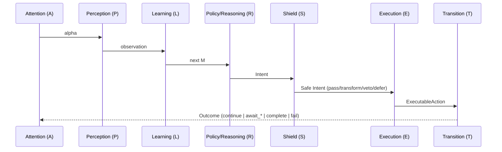

# Loop Modules: Contracts & Rules (A-P-L-R-E-T)

This page defines the **contracts, purity rules, and data responsibilities** for each loop module:

**Attention → Perception → Learning → Policy → Shield → Execution → Transition**

* **MentalState (`M`)** is the cognitive state. It’s **immutable** during a turn and **may only be updated by Learning**.
* **`ctx.vars`** holds **ephemeral control state** (stage, tokens, flags) and may be updated by Execution/Transition.
* **Policy emits typed `Intent`** (what to do), **Execution performs effects** (how to do it).
* Use the **Stage Dispatcher** (see that doc) to map `(stage, intent)` → handler, with runtime typestate checks.

---

## High-level flow



---

## Data flow

```mermaid
flowchart TD
  subgraph M[MentalState (M_t)]
    WM[worldModel]
    MEMS[memory]
    MEML[memory.longTerm]
    GOALS[goalState]
    EMO[emotion]
    REW[reward]
  end

  ENV[EnvironmentState]
  A[Attention] --> P[Perception]
  P --> L[Learning]
  L --> R[Policy]
  R --> S[Shield]
  S --> E[Execution]
  E --> T[Transition]
  M --> A
  M --> R
```

---

## Type contracts (TypeScript)

### Core types

```ts
// Observation normalized by Perception (shape is app-specific, keep it compact)
type Observation = {
  text?: string;
  eventType?: 'user' | 'input' | 'tool' | 'child' | 'internal';
  meta?: unknown;
};

// WHAT to do (pure decision)
type Intent =
  | { kind: 'prompt_user' }
  | { kind: 'answer_with_llm'; query: string; context?: string }
  | { kind: 'plan_and_execute'; goal: string }
  | { kind: 'call_tool'; toolName: string; args: Record<string, unknown> }
  | { kind: 'delegate_to_child'; childAgentId: string; input: unknown }
  | { kind: 'wait' }
  | { kind: 'complete'; result?: unknown };

// Result of doing (side effects performed)
type ExecutableAction =
  | { kind: 'ask_user'; token: string }
  | { kind: 'tool'; token?: string; result?: unknown }
  | { kind: 'subagent'; token?: string; result?: unknown }
  | { kind: 'internal'; done: boolean };

// Loop outcome
type TurnOutcome =
  | { kind: 'continue' }
  | { kind: 'await_input'; token: string }
  | { kind: 'await_tool'; token: string }
  | { kind: 'await_child'; token: string }
  | { kind: 'complete'; result?: unknown }
  | { kind: 'fail'; reason: string };
```

### Modules interface

```ts
type Modules = {
  attention:  (prev: MentalState, env: EnvironmentState) => unknown;            // "alpha"
  perception: (env: EnvironmentState, alpha: unknown) => Observation;           // normalize env
  learning:   (prev: MentalState, prevExec: ExecutableAction | undefined,
               obs: Observation, rPrev?: number) => MentalState;                // ONLY writer of M
  policy:     (m: MentalState) => Intent;                                       // pure
  shield:     (m: MentalState, intent: Intent) =>
                | { action: 'pass'; intent: Intent }
                | { action: 'transform'; intent: Intent }
                | { action: 'veto'; reason: string }
                | { action: 'defer'; askUser: string };
  execution:  (intent: Intent, ctx: TaskContext, m: MentalState) => Promise<ExecutableAction>;
  transition: (env: EnvironmentState, exec: ExecutableAction, ctx: TaskContext) => TurnOutcome;

  // Optional reward hooks: compute scalars; Learning appends them onto last episode.
  extrinsicReward?: (m: MentalState, exec: ExecutableAction, outcome: TurnOutcome) => number;
  intrinsicReward?: (m: MentalState, obs: Observation) => number;
};
```

---

## Rules of engagement (per module)

### Attention (A)

* **Purpose:** lightweight signal that can bias Perception (e.g., focus, urgency).
* **Must not:** mutate `M` or perform effects.
* **May:** pass-through or compute tiny hints from `M` + `env`.

### Perception (P)

* **Purpose:** normalize `env` into a compact `Observation` (text, type, meta).
* **Must not:** perform effects or write to `M`.
* **May:** sanitize/validate input (respect manifest safety flags).
* **Tip:** keep `Observation` small; heavy parsing belongs in tools or Execution.

### Learning (L)

* **Purpose:** **the only place** that updates `M`. Treat prior `M` as immutable; always **return a new `M`**.
* **Must:** write cognitive facts (lastUserText, derived intent, entities, beliefs, reward tallies, episodic events).
* **Must not:** touch `ctx.vars` or do side effects.
* **Pattern:** `next = { ...prev, worldModel: {...}, memory: {...}, reward: {...} }`.

> This “pure learning, effectful execution” split mirrors the functional-core / imperative-shell approach and makes tests trivial.

### Policy / Reasoning (R)

* **Purpose:** choose **Intent** (WHAT), a pure function of `M`.
* **Must:** be deterministic given `M` (stochasticity allowed if driven by `m.policyParams`).
* **Must not:** read `env` directly or use `ctx.vars`. All inputs must reach Policy via **Perception→Learning→M**.
* **Why:** keeps reasoning predictable and testable (and aligns with exhaustive intent matching). For complex intent matching, prefer ts-pattern with `.exhaustive()` to guarantee coverage. ([GitHub][1])

### Shield (S)

* **Purpose:** enforce safety, cost, PII, and HITL. Runs **between** Policy and Execution.
* **Outcomes:** `pass` | `transform` | `veto` | `defer` (ask the user).
* **Must:** log decisions; combine multiple checks deterministically (veto > defer > transform > pass).
* **Why:** this follows “shielding” ideas in safe RL: constrain actions before execution. ([incompleteideas.net][2])

### Execution (E)

* **Purpose:** perform effects and update **control state** via `ctx.vars` (stage, tokens, flags).
* **Must:** never mutate `M` (that’s Learning’s job).
* **May:** call `ctx.llm`, `ctx.reply`, `ctx.tools`, `ctx.requestInput`, external APIs (wrap customs with `runEffect` for timeouts/retries).
* **Pattern:** use the **Stage Dispatcher** to map `(stage, intent)` → handler; keep handlers tiny and idempotent.

### Transition (T)

* **Purpose:** map `ExecutableAction` → `{continue | await_* | complete | fail}` and advance the control loop.
* **Must:** emit `await_*` with tokens for resumable effects; set completion only after terminal handler runs.
* **Must:** treat `ctx.vars` as the source of truth for control-flow flags (e.g., `completeCalled`).

---

## Immutability & state separation

| Concern                      | Store in…                        | Who writes           | Lifetime   |
| ---------------------------- | -------------------------------- | -------------------- | ---------- |
| User text/intent/sentiment   | `M.worldModel`                   | Learning             | Persistent |
| Episodic events & rewards    | `M.memory.longTerm` / `M.reward` | Learning             | Persistent |
| Current stage, tokens, flags | `ctx.vars`                       | Execution/Transition | Ephemeral  |
| Plans / temporary steps      | `ctx.vars`                       | Execution            | Ephemeral  |

**Golden rule:** **Only Learning writes `M`**. Everything else reads `M` and, if needed, writes `ctx.vars`.

---

## Defaults & delegation

If the framework exposes defaults (e.g., `ctx.defaults.execution`), you may **override minimally** and delegate back for common cases. Keep overrides thin and observable (log inputs/outputs, respect budgets).

---

## Resume contract (await_*)

* `Execution` returns `ask_user/tool/subagent` with a `token`.
* `Transition` converts that into `await_input/await_tool/await_child`.
* The engine persists `M` + durable control state, and on resume, Perception normalizes the resume event; Learning records it; then Policy decides next **Intent** purely from `M`.

---

## Rewards (optional)

* `intrinsicReward(M, obs)` and `extrinsicReward(M, exec, outcome)` return scalars.
* Learning appends/rolls them up on the next write (e.g., attach `rew` to last episodic event).
* Keep shaping sparse and interpretable; don’t bake business logic into rewards.

---

## Examples (minimal)

### Perception (resume-aware)

```ts
perception: (env) => {
  const i = env.input;
  if (!i) return {};
  if (typeof i === 'string') return { text: i, eventType: 'user' };

  // Resume events
  if (typeof i === 'object' && 'kind' in i) {
    const k = (i as any).kind;
    return {
      text: k === 'input' ? (i as any).value : undefined,
      eventType: k,
      meta: i
    };
  }
  return {};
}
```

### Learning (pure, immutable)

```ts
learning: (prev, _prevExec, obs) => {
  if (!obs || (!obs.text && !obs.eventType)) return prev;

  const next: MentalState = {
    ...prev,
    worldModel: {
      ...prev.worldModel,
      lastUserText: obs.text ?? prev.worldModel?.lastUserText,
      lastEventType: obs.eventType ?? prev.worldModel?.lastEventType
    },
    memory: {
      ...prev.memory,
      longTerm: {
        ...prev.memory.longTerm,
        episodic: [
          ...(prev.memory.longTerm.episodic ?? []),
          { t: Date.now(), obs }
        ]
      }
    }
  };
  return next;
}
```

### Policy (pure Intent)

```ts
policy: (m) => {
  const t = m.worldModel?.lastUserText;
  if (!t) return { kind: 'prompt_user' };
  if (t.includes('?')) return { kind: 'answer_with_llm', query: t };
  return { kind: 'plan_and_execute', goal: t };
}
```

> For complex branching, prefer exhaustive pattern matching; libraries like **ts-pattern** provide compile-time guarantees via `.exhaustive()`. ([GitHub][1])

### Shield (budget/PII/HITL sketch)

```ts
shield: (m, intent) => {
  // budget check, pii detection, hitl level...
  // order: if any veto → veto; else if any defer → defer; else if any transforms → apply; else pass
  return { action: 'pass', intent };
}
```

### Execution + Transition (dispatcher hooks)

* Execution uses **handlers per stage** and updates `ctx.vars` (e.g., `token`, `completeCalled`).
* Transition maps `ask_user/tool/subagent` → `await_*` and ends with `complete` when `completed` stage is reached.
* For complex flows, consider statecharts (e.g., **XState**) to model timers/parallelism/guards when the dispatcher becomes unwieldy. ([incompleteideas.net][3])

---

## Testing checklist

* **Unit tests:** Learning (immutability), Policy (pure mapping M→Intent), Shield decisions.
* **Integration:** prompt → await_input → respond → complete (golden path).
* **Typestate:** assert `(intent, stage)` pairs are allowed; fail fast on invalid combos.
* **Idempotency:** re-running Execution after a crash should be safe (use idempotency keys on critical effects).

---

## Compatibility note (legacy ProposedAction)

If you have legacy code where **Policy emits `ProposedAction`** (an already-executable shape), migrate in two steps:

1. **Introduce `Intent`** and map **Intent→ProposedAction** in Execution behind the dispatcher.
2. Replace direct `ProposedAction` emissions with `Intent` emissions, and remove the mapper.

This restores the clean separation (WHAT vs. HOW) and enables **exhaustive Intent handling** and **typestate** checks with minimal churn. ([GitHub][1])

---

## Why this aligns

* **Purity & immutability:** Only Learning writes `M`; Policy is pure; Execution is effectful & uses `ctx.vars`.
* **Dispatcher-first Execution:** `(stage, intent)` routing stays explicit, visible, and testable.
* **Safety before effects:** Shield mediates all Intents pre-Execution, consistent with safe RL “shielding.” ([incompleteideas.net][2])
* **Scalable branching:** Prefer exhaustive match for small/medium complexity; move to statecharts when concurrency/timeout/parallel states appear. ([incompleteideas.net][3])

---

### Pointers

* **ts-pattern** for exhaustive, type-safe pattern matching in TypeScript. ([GitHub][1])
* **XState** for statecharts when flows outgrow the dispatcher. ([incompleteideas.net][3])
* **Shielding in RL** for the conceptual grounding of pre-execution safety constraints. ([incompleteideas.net][2])

