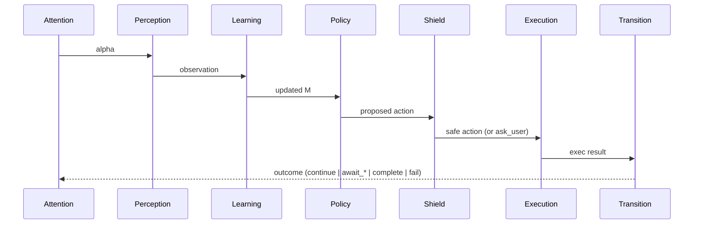
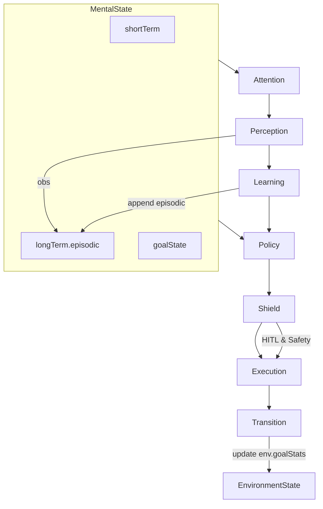

## Loop Modules: Contracts and Examples

This page defines the core loop modules and shows how to override them. The default loop executes:

Attention → Perception → Learning → Policy → Shield → Execution → Transition (with Reward hooks)

All state lives in `snapshot.M` (MentalState). Agents can override any module and delegate back to defaults via `ctx.defaults.*`.

### High-level flow (sequence)


### Data flow (modules and state)


### Module Contracts (TypeScript)

```ts
type AttentionSignal = unknown;
type Observation = unknown;

type ProposedAction =
  | { kind: 'ask_user'; prompt: string; schema?: unknown }
  | { kind: 'subagent'; target: string; input: unknown; awaitCompletion?: boolean }
  | { kind: 'tool'; name: string; args: unknown; awaitCallback?: boolean }
  | { kind: 'language'; content: string }
  | { kind: 'internal'; intent: string; data?: unknown };

type ExecutableAction =
  | { kind: 'ask_user'; token: string }
  | { kind: 'subagent'; token?: string; result?: unknown }
  | { kind: 'tool'; token?: string; result?: unknown }
  | { kind: 'language'; echoed: boolean }
  | { kind: 'internal'; done: boolean };

type TurnOutcome =
  | { kind: 'continue' }
  | { kind: 'await_input'; token: string }
  | { kind: 'await_child'; token: string }
  | { kind: 'await_tool'; token: string }
  | { kind: 'complete'; result?: unknown }
  | { kind: 'fail'; reason: string };

type Modules = {
  attention: (prev: MentalState, env: EnvironmentState) => AttentionSignal;
  perception: (env: EnvironmentState, alpha: AttentionSignal) => Observation;
  learning: (prev: MentalState, prevAction: ProposedAction | undefined, o: Observation, rPrev?: number) => MentalState;
  policy: (m: MentalState) => ProposedAction | Array<{ action: ProposedAction; prob: number }>;
  shield: (m: MentalState, a: ProposedAction) => ProposedAction | null;
  execution: (a: ProposedAction, ctx: TaskContext, m: MentalState) => Promise<ExecutableAction>;
  transition: (env: EnvironmentState, exec: ExecutableAction, m: MentalState) => TurnOutcome;
  // Reward hooks (optional)
  extrinsicReward?: (m: MentalState, a: ProposedAction, exec: ExecutableAction, outcome: TurnOutcome) => number;
  intrinsicReward?: (m: MentalState, o: Observation) => number;
}
```

### Default Behaviors (summary)
- attention: pass-through signal
- perception: `{ input, time, pending }`; can sanitize input (configurable via `manifest.safety.sanitize`)
- learning: appends an episodic event `{ t, obs, act?, rew? }`
- policy: chooses a `ProposedAction`; supports distributions (stochastic, temperature, epsilon)
- shield: HITL (advise/consent/guardrails), cost/PII checks; may convert to `ask_user`
- execution: maps Proposed → Engine APIs (requestInput, sendTaskToAgent, tools.invoke, reply)
- transition: maps to `await_*`/`continue`/terminal outcomes
- rewards: `extrinsicReward` + `intrinsicReward` combined per turn; stored on last episodic event as `rew`

### Declaring Loop Modules

Agents declare their modules directly in `createAgent` using the `loop.modules` property:

```ts
export default createAgent({
  manifest: { name: 'my-agent', runMode: 'loop' },
  loop: {
    modules: {
      policy: (M, env) => {
        // Process auto-resumed events
        if (env.input?.kind === 'input') {
          return { kind: 'language', content: `Received: ${env.input.value}` };
        }
        
        // Stochastic policy example
        return [
          { action: { kind: 'tool', name: 'search', args: { q: 'hello' } }, prob: 0.7 },
          { action: { kind: 'language', content: 'Ok.' }, prob: 0.3 }
        ];
      },
      
      // Use default execution with small augmentation
      execution: async (a, ctx, M) => {
        if (a.kind === 'language') {
          const augmented = { ...a, content: a.content + ' [via override]' };
          await ctx.reply(augmented.content);
          return { kind: 'language', echoed: true };
        }
        // Delegate to built-in execution for other actions
        return await ctx.defaults.execution(a, ctx, M);
      }
    }
  },
  async handleTask(ctx) { return; }
}, import.meta.url);
```

### Deeper examples

#### Attention with goal gating
```ts
loop: {
  modules: {
    attention: (M, env) => {
      const roots = (M.goalState?.hierarchy?.roots || []) as string[];
      return { focus: roots[0] ?? null, time: env.time };
    }
  }
}
```

#### Perception with custom parsing and sanitization off
```ts
// In manifest: safety: { sanitize: false }
loop: {
  modules: {
    perception: (env, alpha) => {
      const input = typeof env.input === 'string' ? JSON.parse(env.input) : env.input;
      return { input, focus: (alpha as any)?.focus };
    }
  }
}
```

#### Learning: append compact episodic event
```ts
loop: {
  modules: {
    learning: (prev, prevAction, obs) => {
      const e = (prev.memory.longTerm.episodic || []) as any[];
      e.push({ t: Date.now(), obs: { k: 'summary' }, act: prevAction });
      (prev.memory.longTerm as any).episodic = e;
      return prev;
    }
  }
}
```

#### Policy with ReAct patterns and auto-resume
```ts
loop: {
  modules: {
    policy: (M, env) => {
      // Handle resumed events first
      if (env.input?.kind === 'input') {
        return { kind: 'language', content: `Processing: ${env.input.value}` };
      }
      if (env.input?.kind === 'tool') {
        return { kind: 'language', content: `Tool result: ${JSON.stringify(env.input.result)}` };
      }
      
      // ReAct pattern for initial turns
      const last = (M.memory.sensory as any)?.lastObservation as string | undefined;
      if (last?.match(/search for (.+)/i)) {
        const q = last.match(/search for (.+)/i)![1];
        return { kind: 'tool', name: 'search', args: { q } };
      }
      return { kind: 'language', content: 'What should I do next?' };
    }
  }
}
```

#### Shield: cost and PII checks
```ts
// manifest.safety = { costLimit: 20, piiPatterns: ['\\b\d{3}-\d{2}-\d{4}\\b'] }
```

#### Execution and Transition overrides
```ts
loop: {
  modules: {
    execution: async (a, ctx, M) => {
      if (a.kind === 'tool' && a.name === 'expensive') {
        // retry with backoff or route differently
        console.log('Handling expensive tool call...');
      }
      return ctx.defaults.execution(a, ctx, M);
    },
    
    transition: (env, exec, M) => {
      // Complete when goals are done
      if (exec.kind === 'language' && (env.goalStats?.doneCount ?? 0) > 0) {
        return { kind: 'complete', result: 'goals done' };
      }
      
      // Auto-resume handling
      if (exec.kind === 'ask_user') return { kind: 'await_input', token: exec.token };
      if (exec.kind === 'tool' && exec.token) return { kind: 'await_tool', token: exec.token };
      if (exec.kind === 'subagent' && exec.token) return { kind: 'await_child', token: exec.token };
      
      return { kind: 'continue' };
    }
  }
}
```

### HITL and Safety in Shield
- `manifest.hitl`: `'advise' | 'consent' | 'guardrails'`
  - consent/guardrails: convert tool/subagent actions to `ask_user` prompts
  - advise: pass-through with tagging for observability
- Safety checks (configurable via `manifest.safety`):
  - `costLimit`: if `args.cost` exceeds limit → `ask_user`
  - `piiPatterns`: regex strings to flag PII in action args → `ask_user`

### Perception Sanitization
- Controlled by `manifest.safety.sanitize` (default true). Defaults scrub basic script/style tags, data URLs and control characters.
- Override `perception` for domain-specific parsing/validation.

### Rewards and Metrics
- `extrinsicReward` and `intrinsicReward` hooks can be overridden. Defaults: 0 + a minimal novelty intrinsic.
- Status metadata (buffered mode): per-turn arrays `timings`/`rewards` and aggregates `timingsAgg`/`rewardsAgg`.

#### Goal-progress reward (default)
- Default `extrinsicReward` grants +1 when the number of goals with `status: 'done'` increases between turns.
- You can override `extrinsicReward` to implement a different shaping (e.g., partial credit on status changes).

### Outcomes and Interrupts
- `await_input`/`await_child`/`await_tool` return tokens; engine persists `M` and durable maps.
- Resume paths validate tokens and invoke durable handlers (`resumeInput`, child completion, tool completion) and may re-enter the loop.
- External events: `ctx.registerExternalEvent(type, data, { onOccurred })` stores a durable token; acknowledge via `taskEngine.handleExternalEventOccurred`.

### Examples
- Consent prompt: set `manifest.hitl = 'consent'` and propose a tool action; Shield converts to `ask_user` with tool metadata.
- Temperature-aware policy: set `M.policyParams = { stochastic: true, temperature: 0.7, explorationEpsilon: 0.05 }` before the loop.

#### ReAct-style planner (feature flag)
- Enable simple pattern-based tool selection:
```ts
M.policyParams = {
  ...M.policyParams,
  reactPlanner: { enabled: true, patterns: [{ regex: 'search for (.+)', tool: 'search', argKey: 'q' }] }
}
```
- The default policy inspects `M.memory.sensory.lastObservation` and, on match, proposes the configured tool with extracted args.

#### Multi-step ReAct with retrieval and tool result context
- The default Learning stores lastObservation; Execution stores `shortTerm.scratch.react.lastResult`.
- With `reactPlanner.enabled`, Policy merges `lastResult` into tool args as `context` for the next step.
```ts
// Step 1: observation matches → tool('search', { q })
// Step 2: Policy sees react.lastResult and calls tool again with refined args { q, context }
```

### Troubleshooting
- No consent prompt? Ensure `manifest.hitl = 'consent'` and your proposed action is a tool or subagent.
- No rewards? Verify goal `status` transitions and that `extrinsicReward` is not overridden.
- Metrics missing? Use buffered mode and check `status.metadata.timings` / `rewards`.
- Sanitization issues? Set `manifest.safety.sanitize = false` or override `perception`.

### End-to-end example (compact)
```ts
export default createAgent({
  // 1) Configure manifest
  manifest: { 
    name: 'search-agent', 
    runMode: 'loop', 
    hitl: 'consent', 
    safety: { sanitize: true } 
  },
  
  loop: {
    modules: {
      // 2) Policy with ReAct planner and auto-resume
      policy: (M, env) => {
        // Handle auto-resumed events
        if (env.input?.kind === 'input') {
          return { kind: 'language', content: `User approved: ${env.input.value}` };
        }
        if (env.input?.kind === 'tool') {
          return { kind: 'language', content: `Search results: ${JSON.stringify(env.input.result)}` };
        }
        
        // Initial ReAct pattern
        const lastObs = M.memory.sensory?.lastObservation;
        if (typeof lastObs === 'string' && lastObs.match(/search for (.+)/i)) {
          const q = lastObs.match(/search for (.+)/i)![1];
          return { kind: 'tool', name: 'search', args: { q } };
        }
        
        return { kind: 'ask_user', prompt: 'What would you like to search for?' };
      },
      
      // 3) Standard execution and transition with auto-resume
      execution: async (a, ctx, M) => ctx.defaults.execution(a, ctx, M),
      
      transition: (env, exec, M) => {
        if (exec.kind === 'ask_user') return { kind: 'await_input', token: exec.token };
        if (exec.kind === 'tool' && exec.token) return { kind: 'await_tool', token: exec.token };
        if (exec.kind === 'language') return { kind: 'complete' };
        return { kind: 'continue' };
      }
    }
  },
  
  async handleTask(ctx) {
    // 4) Set initial state
    const M = ctx.mentalState;
    M.policyParams = { 
      stochastic: true, 
      temperature: 0.7, 
      explorationEpsilon: 0.05,
      reactPlanner: { 
        enabled: true, 
        patterns: [{ regex: 'search for (.+)', tool: 'search', argKey: 'q' }] 
      } 
    };
    M.memory.sensory = { 
      ...(M.memory.sensory || {}), 
      lastObservation: 'search for cat cafes' 
    };
    
    // Loop handles the rest with auto-resume
    return;
  }
}, import.meta.url);

// Flow: Policy picks search → Shield (consent) converts to ask_user → await_input
// → User provides input → Auto-resume with env.input → Policy processes approval
```


