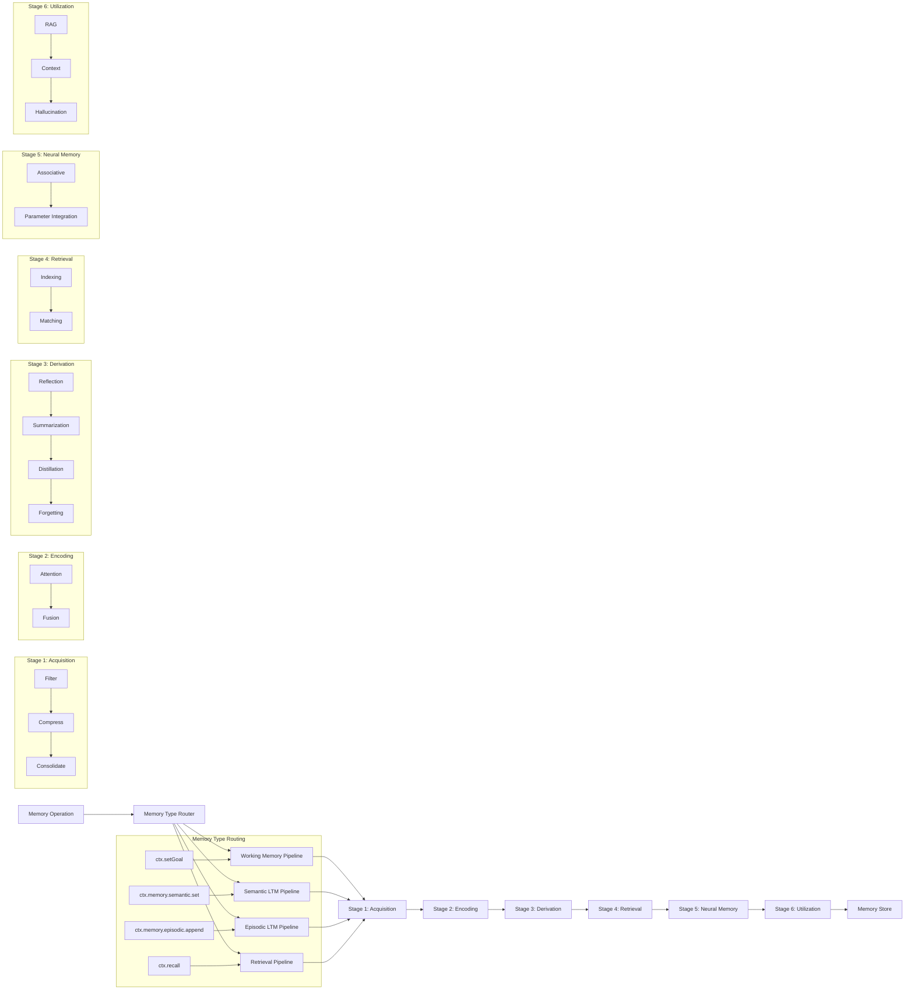

# Memory Lifecycle Orchestrator Architecture

## Overview

The Memory Lifecycle Orchestrator (MLO) processes all memory operations through 6 sequential stages, providing a unified pipeline for working memory, semantic memory, episodic memory, and retrieval operations. This architecture ensures consistent processing, enables advanced memory capabilities, and provides a foundation for future AI-powered enhancements.

**Key Innovation**: The MLO uses a single pipeline architecture with memory-type-specific processor configurations, allowing different memory types to flow through the same 6 stages but with customized processing logic for each type.

## Architecture Diagram



## Memory Type Flow Architecture

### Memory Intent Routing

The MLO routes different memory operations through the same 6-stage pipeline but with memory-type-specific processor configurations:

```typescript
type MemoryIntent = 
    | 'workingMemory'     // Goals, thoughts, decisions, variables
    | 'semanticLTM'       // Facts, knowledge, structured data
    | 'episodicLTM'       // Events, experiences, temporal data
    | 'retrieval'         // Query processing for recall operations
    | 'proceduralLTM';    // Future: learned behaviors
```

### Pipeline Initialization

Each memory type gets its own processor pipeline built from the same stage framework:

```typescript
class MemoryLifecycleOrchestrator {
    private stageProcessors: Map<MemoryIntent, IStageProcessor[]>;
    
    private initializeProcessors(): void {
        // Each memory type gets its own pipeline with type-specific configs
        this.stageProcessors.set('workingMemory', this.buildPipeline(this.config.workingMemory));
        this.stageProcessors.set('semanticLTM', this.buildPipeline(this.config.semanticLTM));
        this.stageProcessors.set('episodicLTM', this.buildPipeline(this.config.episodicLTM));
        this.stageProcessors.set('retrieval', this.buildPipeline(this.config.retrieval));
    }
}
```

### Memory Type Processing Flow

#### 1. Working Memory Flow
```typescript
// User API: ctx.setGoal("Complete the research project")
// ↓
// Creates MemoryItem with intent: 'workingMemory'
// ↓
// Routes to workingMemory pipeline with specialized processors:
// - TenantAwareFilter (with working memory specific limits)
// - TextTruncationCompressor (preserves goal structure)
// - ConversationAttention (focuses on task-relevant content)
// - SimpleSummarizer (maintains goal clarity)
// ↓
// Stores processed result in WorkingMemorySQLAdapter
```

#### 2. Semantic Memory Flow
```typescript
// User API: ctx.memory.semantic.set("project-status", "in-progress")
// ↓
// Creates MemoryItem with intent: 'semanticLTM'
// ↓
// Routes to semanticLTM pipeline with fact-oriented processors:
// - TenantAwareFilter (with semantic-specific validation)
// - TextTruncationCompressor (preserves factual accuracy)
// - ConversationReflection (extracts key insights)
// - DirectMemoryIndexer (optimizes for key-value retrieval)
// ↓
// Stores in semantic memory backend
```

#### 3. Episodic Memory Flow
```typescript
// User API: ctx.memory.episodic.append(conversationEvent)
// ↓
// Creates MemoryItem with intent: 'episodicLTM'
// ↓
// Routes to episodicLTM pipeline with temporal processors:
// - TenantAwareFilter (preserves temporal context)
// - ConversationAttention (maintains speaker tracking)
// - TimeDecayForgetter (manages memory lifecycle)
// ↓
// Stores in episodic memory backend with temporal indexing
```

#### 4. Retrieval Flow
```typescript
// User API: ctx.recall("data quality insights")
// ↓
// Creates MemoryItem with intent: 'retrieval'
// ↓
// Routes to retrieval pipeline with query-optimized processors:
// - TenantAwareFilter (query validation)
// - ConversationAttention (identifies key query terms)
// - SimpleTopKMatcher (finds relevant memories)
// - SimpleRAG (enhances results with context)
// ↓
// Returns processed results from multiple memory stores
```

## Memory-Type-Specific Processor Configuration

### Processor Customization by Memory Type

The same processor class can behave differently based on configuration for different memory types:

```typescript
// Working Memory: ConversationAttention configured for task focus
{
  attention: 'ConversationAttention',
  config: {
    attention: {
      passThrough: false,
      preserveOrder: true,
      conversationAware: true,
      scoringCriteria: ['relevance', 'task-importance', 'urgency']
    }
  }
}

// Semantic Memory: ConversationAttention configured for fact extraction
{
  attention: 'ConversationAttention',
  config: {
    attention: {
      passThrough: false,
      preserveOrder: false,
      conversationAware: false,
      scoringCriteria: ['factual-accuracy', 'completeness', 'clarity']
    }
  }
}

// Episodic Memory: ConversationAttention configured for temporal context
{
  attention: 'ConversationAttention',
  config: {
    attention: {
      passThrough: false,
      preserveOrder: true,
      conversationAware: true,
      speakerTracking: true,
      turnBoundaries: true,
      scoringCriteria: ['temporal-relevance', 'speaker-importance', 'emotional-content']
    }
  }
}
```

### Example: Custom Attention Processor for Working Memory

You can create memory-type-specific processor configurations:

```typescript
// In agent.json memory configuration
{
  "memory": {
    "profile": "basic",
    "workingMemory": {
      "encoding": {
        "attention": {
          "passThrough": false,
          "preserveOrder": true,
          "conversationAware": true,
          "scoringCriteria": ["task-relevance", "urgency", "actionability"],
          "attentionWindowSize": 256,
          "llmProvider": "openai"  // Future: LLM-based attention
        }
      }
    },
    "semanticLTM": {
      "encoding": {
        "attention": {
          "passThrough": false,
          "preserveOrder": false,
          "conversationAware": false,
          "scoringCriteria": ["factual-accuracy", "completeness"],
          "attentionWindowSize": 512
        }
      }
    }
  }
}
```

## Stage Details

### Stage 1: Acquisition (Filter → Compress → Consolidate)

The acquisition stage processes incoming memory items, ensuring they meet quality and security requirements before entering the pipeline.

**Memory-Type-Specific Behavior:**
- **Working Memory**: Focuses on task relevance and immediate utility
- **Semantic Memory**: Emphasizes factual accuracy and knowledge completeness
- **Episodic Memory**: Preserves temporal context and conversational flow
- **Retrieval**: Validates and optimizes query structure

**1.1 Acquisition Filter**
- **Current**: `TenantAwareFilter` - Basic tenant isolation and size limits
  - Validates tenant boundaries
  - Enforces maximum input size (1000 characters default)
  - Basic relevance threshold filtering (0.1 default)
  - **Memory-Type Customization**: Different size limits and relevance thresholds per memory type
- **Future**: Advanced RBAC with Oso/Casbin
  - Fine-grained permission controls
  - Role-based memory access
  - Dynamic policy evaluation

**1.2 Information Compression**
- **Current**: `TextTruncationCompressor` - Simple text truncation
  - Preserves structure when possible
  - Configurable maximum length (500 characters default)
  - Maintains readability
  - **Memory-Type Customization**: Working memory preserves goal structure, semantic memory preserves facts
- **Future**: `LLMSummaryCompressor` using LangChain/OpenAI
  - Intelligent content summarization
  - Context-aware compression
  - Semantic preservation

**1.3 Experience Consolidation**
- **Current**: `NoveltyConsolidator` - Novelty-based filtering
  - Detects duplicate or similar content
  - Configurable novelty threshold
  - Prevents memory pollution
  - **Memory-Type Customization**: Episodic memory uses temporal consolidation, semantic uses fact deduplication
- **Future**: `NoveltyScoringConsolidator` with vector similarity
  - Embedding-based similarity detection
  - Intelligent deduplication
  - Content clustering

### Stage 2: Encoding (Attention → Fusion)

The encoding stage transforms and enriches memory items for optimal storage and retrieval.

**2.1 Selective Attention**
- **Current**: `ConversationAttention` - Context-aware attention
  - Preserves conversation order
  - Maintains temporal relationships
  - Configurable attention windows
  - **Memory-Type Customization**: 
    - Working memory focuses on task-relevant segments
    - Semantic memory emphasizes factual content
    - Episodic memory tracks speaker changes and emotional content
- **Future**: `LLMScoringAttention` with embedding-based relevance
  - AI-powered relevance scoring
  - Dynamic attention allocation
  - Multi-modal attention mechanisms

**2.2 Multi-modal Fusion**
- **Current**: `ModalityFusion` - Text-focused fusion
  - Simple concatenation strategies
  - Configurable fusion modes
  - Preserves original data structure
  - **Memory-Type Customization**: Different fusion strategies per memory type
- **Future**: `CLIPFusion` for vision-language integration
  - Cross-modal understanding
  - Unified representation space
  - Rich multi-modal embeddings

### Stage 3: Derivation (Reflection → Summarization → Distillation → Forgetting)

The derivation stage extracts insights and manages memory lifecycle.

**3.1 Reflection**
- **Current**: `ConversationReflection` - Pattern analysis
  - Identifies conversation themes
  - Extracts key insights
  - Maintains reflection history
  - **Memory-Type Customization**:
    - Working memory reflects on task progress and blockers
    - Semantic memory reflects on knowledge gaps and connections
    - Episodic memory reflects on conversation patterns and relationships
- **Future**: `InsightReflection` with advanced pattern analysis
  - Deep learning-based insight extraction
  - Cross-conversation pattern recognition
  - Predictive insight generation

**3.2 Summarization**
- **Current**: `SimpleSummarizer` - Basic text joining
  - Configurable summarization strategies
  - Preserves key information
  - Maintains readability
  - **Memory-Type Customization**:
    - Working memory: Task-focused summaries
    - Semantic memory: Fact-preserving summaries
    - Episodic memory: Narrative-preserving summaries
- **Future**: `TopicAwareSummarizer` with LLM-based clustering
  - Topic-based organization
  - Hierarchical summarization
  - Context-aware compression

**3.3 Knowledge Distillation**
- **Current**: `SimpleDistiller` - Basic distillation
  - Rule-based knowledge extraction
  - Configurable distillation strategies
  - Maintains knowledge integrity
- **Future**: Advanced rule extraction and compression
  - AI-powered knowledge synthesis
  - Automated rule generation
  - Knowledge graph construction

**3.4 Selective Forgetting**
- **Current**: `TimeDecayForgetter` - Time-based forgetting
  - Configurable decay rates
  - Importance-based retention
  - Graceful degradation
  - **Memory-Type Customization**:
    - Working memory: Task completion-based forgetting
    - Semantic memory: Relevance-based retention
    - Episodic memory: Temporal decay with importance preservation
- **Future**: `SimilarityDedupe` with vector comparison
  - Semantic similarity-based forgetting
  - Intelligent memory consolidation
  - Adaptive retention policies

### Stage 4: Retrieval (Indexing → Matching)

The retrieval stage optimizes memory access and search capabilities.

**4.1 Indexing**
- **Current**: `DirectMemoryIndexer` - In-memory indexing
  - Fast direct access
  - Simple key-based indexing
  - Memory-efficient storage
  - **Memory-Type Customization**:
    - Working memory: Agent-scoped indexing
    - Semantic memory: Namespace-based indexing
    - Episodic memory: Temporal indexing
- **Future**: `VectorDBIndexer` with Pinecone/Weaviate
  - Scalable vector search
  - Distributed indexing
  - Advanced similarity search

**4.2 Matching**
- **Current**: `SimpleTopKMatcher` - Basic filtering
  - Top-K result selection
  - Configurable matching criteria
  - Fast result ranking
  - **Memory-Type Customization**: Different ranking algorithms per memory type
- **Future**: `ContextualRerankMatcher` with LLM reranking
  - Context-aware result ranking
  - AI-powered relevance scoring
  - Dynamic result optimization

### Stage 5: Neural Memory (Associative → Parameter Integration)

The neural memory stage enables advanced AI-powered memory capabilities.

**5.1 Associative Memory**
- **Current**: `PlaceholderAssociative` - Basic associative patterns
  - Simple association tracking
  - Configurable association strength
  - Memory network foundations
- **Future**: `HopfieldNetworkWrapper` for pattern completion
  - Neural associative memory
  - Pattern completion capabilities
  - Robust memory retrieval

**5.2 Parameter Integration**
- **Current**: `PlaceholderParameterIntegration` - Foundation for future integration
  - Parameter tracking infrastructure
  - Integration point preparation
  - Extensible architecture
- **Future**: LoRA/QLoRA fine-tuning integration
  - Dynamic model adaptation
  - Memory-informed fine-tuning
  - Personalized AI capabilities

### Stage 6: Utilization (RAG → Context → Hallucination)

The utilization stage optimizes memory usage for AI applications.

**6.1 RAG (Retrieval-Augmented Generation)**
- **Current**: `SimpleRAG` - Basic retrieval integration
  - Simple context injection
  - Configurable retrieval strategies
  - Foundation for advanced RAG
  - **Memory-Type Customization**: Different RAG strategies per memory type
- **Future**: Full retrieval-augmented generation
  - Advanced context integration
  - Multi-step reasoning
  - Dynamic knowledge synthesis

**6.2 Long-context Management**
- **Current**: `SimpleLongContextManager` - Token window management
  - Configurable context windows
  - Simple truncation strategies
  - Memory-efficient processing
- **Future**: Hierarchical summarization
  - Multi-level context management
  - Intelligent context compression
  - Adaptive context allocation

**6.3 Hallucination Mitigation**
- **Current**: `SimpleHallucinationMitigator` - Basic validation
  - Simple fact checking
  - Configurable validation rules
  - Foundation for advanced mitigation
- **Future**: `FactCheckingRetriever` with verification
  - AI-powered fact verification
  - Real-time hallucination detection
  - Confidence scoring

## Memory Profiles

The MLO supports different memory profiles optimized for specific use cases. Each profile configures all memory types with appropriate processors:

### Basic Profile
```typescript
{
  profile: 'basic',
  workingMemory: {
    acquisition: {
      filter: 'TenantAwareFilter',
      compressor: 'TextTruncationCompressor',
      consolidator: 'NoveltyConsolidator'
    },
    encoding: {
      attention: 'ConversationAttention',
      fusion: 'ModalityFusion' // disabled by default
    },
    derivation: {
      reflection: 'ConversationReflection',
      summarization: 'SimpleSummarizer',
      distillation: 'SimpleDistiller',
      forgetting: 'TimeDecayForgetter'
    },
    retrieval: {
      indexing: 'DirectMemoryIndexer',
      matching: 'SimpleTopKMatcher'
    },
    neuralMemory: {
      associative: 'PlaceholderAssociative',
      parameterIntegration: 'PlaceholderParameterIntegration'
    },
    utilization: {
      rag: 'SimpleRAG',
      context: 'SimpleLongContextManager',
      hallucination: 'SimpleHallucinationMitigator'
    }
  },
  semanticLTM: {
    // Same stage structure, different configurations
  },
  episodicLTM: {
    // Same stage structure, different configurations
  },
  retrieval: {
    // Same stage structure, different configurations
  }
}
```

### Conversational Profile
Optimized for dialogue and conversation management:
- Enhanced conversation attention for all memory types
- Speaker tracking in episodic memory
- Conversation-aware summarization
- Temporal relationship preservation

### Research-Optimized Profile
Designed for complex analysis and research tasks:
- Enhanced processing for academic content
- Hierarchical context management
- Fact-checking capabilities
- Advanced semantic indexing

## Configuration Examples

### Memory-Type-Specific Processor Configuration

```json
{
  "memory": {
    "profile": "conversational",
    "workingMemory": {
      "acquisition": {
        "filter": {
          "maxInputSize": 2000,
          "tenantIsolation": true,
          "basicRelevanceThreshold": 0.2
        },
        "compressor": {
          "maxLength": 1000,
          "preserveStructure": true
        }
      },
      "encoding": {
        "attention": {
          "passThrough": false,
          "preserveOrder": true,
          "conversationAware": true,
          "scoringCriteria": ["task-relevance", "urgency", "actionability"]
        }
      }
    },
    "semanticLTM": {
      "acquisition": {
        "filter": {
          "maxInputSize": 5000,
          "factualValidation": true
        }
      },
      "encoding": {
        "attention": {
          "passThrough": false,
          "preserveOrder": false,
          "scoringCriteria": ["factual-accuracy", "completeness"]
        }
      }
    },
    "episodicLTM": {
      "encoding": {
        "attention": {
          "conversationAware": true,
          "speakerTracking": true,
          "turnBoundaries": true,
          "scoringCriteria": ["temporal-relevance", "emotional-content"]
        }
      },
      "derivation": {
        "forgetting": {
          "decayRate": 0.05,
          "preserveImportantTurns": true
        }
      }
    }
  }
}
```

### Custom Processor for Specific Memory Type

```typescript
// Create a custom attention processor for working memory
class TaskFocusedAttention extends ConversationAttention {
    constructor(config?: any) {
        super({
            ...config,
            scoringCriteria: ['task-relevance', 'urgency', 'actionability'],
            conversationAware: true,
            preserveOrder: true
        });
    }

    protected scoreTaskRelevance(segment: string): number {
        // Custom scoring logic for task-focused attention
        const taskKeywords = ['goal', 'task', 'action', 'deadline', 'priority'];
        const matches = taskKeywords.filter(keyword => 
            segment.toLowerCase().includes(keyword)
        ).length;
        return Math.min(matches / taskKeywords.length, 1.0);
    }
}

// Register in ProcessorFactory
processorFactory.registerProcessor('TaskFocusedAttention', TaskFocusedAttention);

// Use in working memory configuration
{
  "workingMemory": {
    "encoding": {
      "attention": "TaskFocusedAttention"
    }
  }
}
```

## Agent-Level Configuration

### Overview

Each agent can define its own memory configuration through multiple mechanisms:

1. **Agent Manifest**: Core memory profile and basic configuration
2. **Agent.json**: Detailed processor and stage configuration (future)
3. **Runtime Configuration**: Dynamic configuration updates
4. **Environment Variables**: Global defaults and overrides

### Agent Manifest Configuration

The most common way to configure memory is through the agent's manifest:

```typescript
// agent.ts
import { createAgent } from '@a2arium/core';

export default createAgent({
    manifest: {
        name: "my-agent",
        version: "1.0.0",
        memory: {
            // Use a predefined profile
            profile: "conversational",
            
            // Override specific memory type configurations
            workingMemory: {
                acquisition: {
                    config: {
                        filter: {
                            maxInputSize: 3000,
                            basicRelevanceThreshold: 0.3
                        }
                    }
                },
                encoding: {
                    config: {
                        attention: {
                            scoringCriteria: ["task-relevance", "urgency"],
                            attentionWindowSize: 512
                        }
                    }
                }
            },
            
            // Configure semantic memory differently
            semanticLTM: {
                derivation: {
                    config: {
                        summarization: {
                            strategy: "extractive",
                            maxSummaryLength: 300
                        }
                    }
                }
            }
        }
    },

    async handleTask(ctx) {
        // Agent implementation
        // Memory operations will use the configured pipeline
        await ctx.setGoal("Process customer inquiry");
        await ctx.addThought("Customer seems frustrated");
    }
}, import.meta.url);
```

### Available Memory Profiles

#### 1. Basic Profile
**Use Case**: Simple agents with minimal memory requirements
```typescript
{
    memory: {
        profile: "basic"
    }
}
```

**Characteristics:**
- Minimal processing overhead
- Simple text truncation and filtering
- Pass-through attention (no complex processing)
- Suitable for lightweight chatbots and simple task agents

#### 2. Conversational Profile
**Use Case**: Dialogue agents, chatbots, virtual assistants
```typescript
{
    memory: {
        profile: "conversational"
    }
}
```

**Characteristics:**
- Conversation-aware processing
- Speaker tracking and turn boundaries
- Enhanced reflection on dialogue patterns
- Topic-aware summarization
- Temporal relationship preservation

#### 3. Research-Optimized Profile
**Use Case**: Research assistants, knowledge workers, academic tools
```typescript
{
    memory: {
        profile: "research-optimized"
    }
}
```

**Characteristics:**
- Enhanced processing for complex content
- Hierarchical context management
- Fact-checking and source verification
- Advanced semantic indexing
- Higher processing overhead but better quality

### Per-Memory-Type Configuration

You can configure each memory type independently:

```typescript
{
    memory: {
        profile: "basic", // Base profile
        
        // Working memory optimized for task management
        workingMemory: {
            acquisition: {
                filter: "TenantAwareFilter",
                compressor: "TextTruncationCompressor",
                config: {
                    filter: {
                        maxInputSize: 2000,
                        taskFocused: true
                    },
                    compressor: {
                        preserveGoalStructure: true
                    }
                }
            },
            encoding: {
                attention: "ConversationAttention",
                config: {
                    attention: {
                        scoringCriteria: ["task-relevance", "urgency", "actionability"],
                        preserveOrder: true
                    }
                }
            }
        },
        
        // Semantic memory optimized for facts
        semanticLTM: {
            acquisition: {
                config: {
                    filter: {
                        maxInputSize: 5000,
                        factualValidation: true
                    }
                }
            },
            encoding: {
                config: {
                    attention: {
                        scoringCriteria: ["factual-accuracy", "completeness"],
                        preserveOrder: false
                    }
                }
            }
        },
        
        // Episodic memory optimized for conversations
        episodicLTM: {
            encoding: {
                config: {
                    attention: {
                        conversationAware: true,
                        speakerTracking: true,
                        scoringCriteria: ["temporal-relevance", "emotional-content"]
                    }
                }
            },
            derivation: {
                config: {
                    forgetting: {
                        decayRate: 0.05,
                        preserveImportantTurns: true
                    }
                }
            }
        }
    }
}
```

### Stage-Level Processor Configuration

Configure individual processors within each stage:

```typescript
{
    memory: {
        workingMemory: {
            // Stage 1: Acquisition
            acquisition: {
                filter: "TenantAwareFilter",
                compressor: "TextTruncationCompressor", 
                consolidator: "NoveltyConsolidator",
                config: {
                    filter: {
                        maxInputSize: 1500,
                        tenantIsolation: true,
                        customValidation: true
                    },
                    compressor: {
                        maxLength: 800,
                        preserveStructure: true,
                        compressionStrategy: "smart"
                    },
                    consolidator: {
                        enabled: true,
                        noveltyThreshold: 0.7
                    }
                }
            },
            
            // Stage 2: Encoding
            encoding: {
                attention: "ConversationAttention",
                fusion: "ModalityFusion",
                config: {
                    attention: {
                        passThrough: false,
                        preserveOrder: true,
                        conversationAware: true,
                        scoringCriteria: ["relevance", "novelty", "importance"],
                        attentionWindowSize: 512,
                        llmProvider: "openai" // Future: LLM-based attention
                    },
                    fusion: {
                        enabled: false, // Disable for text-only agents
                        modalityType: "text"
                    }
                }
            },
            
            // Stage 3: Derivation
            derivation: {
                reflection: "ConversationReflection",
                summarization: "SimpleSummarizer",
                distillation: "SimpleDistiller",
                forgetting: "TimeDecayForgetter",
                config: {
                    reflection: {
                        enabled: true,
                        analysisDepth: "moderate",
                        trackPatterns: true
                    },
                    summarization: {
                        strategy: "extractive",
                        maxSummaryLength: 300,
                        preserveKeyPoints: true
                    },
                    forgetting: {
                        decayRate: 0.1,
                        retentionThreshold: 0.3,
                        importanceWeighting: true
                    }
                }
            }
        }
    }
}
```

### Custom Processor Registration

For advanced use cases, you can create and register custom processors:

```typescript
// 1. Create custom processor
class TaskPriorityAttention extends ConversationAttention {
    constructor(config?: any) {
        super({
            ...config,
            scoringCriteria: ['priority', 'deadline', 'complexity']
        });
    }

    protected scorePriority(segment: string): number {
        const priorityKeywords = ['urgent', 'critical', 'asap', 'deadline'];
        const matches = priorityKeywords.filter(keyword => 
            segment.toLowerCase().includes(keyword)
        ).length;
        return Math.min(matches * 0.3, 1.0);
    }

    protected scoreDeadline(segment: string): number {
        const datePattern = /\b\d{1,2}\/\d{1,2}\/\d{4}\b|\btoday\b|\btomorrow\b|\bthis week\b/i;
        return datePattern.test(segment) ? 0.8 : 0.2;
    }
}

// 2. Register processor (in agent initialization)
import { ProcessorFactory } from '@a2arium/core';

const processorFactory = new ProcessorFactory();
processorFactory.registerProcessor('TaskPriorityAttention', TaskPriorityAttention);

// 3. Use in agent configuration
export default createAgent({
    manifest: {
        memory: {
            workingMemory: {
                encoding: {
                    attention: "TaskPriorityAttention",
                    config: {
                        attention: {
                            priorityWeighting: 0.4,
                            deadlineWeighting: 0.3,
                            complexityWeighting: 0.3
                        }
                    }
                }
            }
        }
    }
    // ... rest of agent
});
```

### Runtime Configuration Updates

Agents can update their memory configuration at runtime:

```typescript
export default createAgent({
    async handleTask(ctx) {
        // Check if this is a high-priority task
        const isHighPriority = (ctx.task.input as any).priority === 'high';
        
        if (isHighPriority) {
            // Switch to more intensive processing
            await ctx.memory.mlo.configure({
                workingMemory: {
                    acquisition: {
                        config: {
                            filter: {
                                maxInputSize: 5000, // Allow larger inputs
                                basicRelevanceThreshold: 0.1 // Lower threshold
                            }
                        }
                    },
                    encoding: {
                        config: {
                            attention: {
                                passThrough: false, // Enable full attention processing
                                scoringCriteria: ["urgency", "impact", "complexity"]
                            }
                        }
                    }
                }
            });
        }
        
        // Continue with task processing
        await ctx.setGoal("Handle high-priority request");
    }
});
```

### Environment-Based Configuration

Use environment variables for global configuration:

```bash
# .env file
MEMORY_PROFILE=conversational
MEMORY_LOG_LEVEL=debug
MEMORY_ENABLE_METRICS=true
MEMORY_MAX_INPUT_SIZE=3000
```

```typescript
// Agent can read environment-based defaults
export default createAgent({
    manifest: {
        memory: {
            profile: process.env.MEMORY_PROFILE || "basic",
            workingMemory: {
                acquisition: {
                    config: {
                        filter: {
                            maxInputSize: parseInt(process.env.MEMORY_MAX_INPUT_SIZE || "1000")
                        }
                    }
                }
            }
        }
    }
    // ... rest of agent
});
```

### Configuration Validation

The system validates configuration at startup:

```typescript
// Invalid configuration will throw errors
{
    memory: {
        workingMemory: {
            encoding: {
                attention: "NonExistentProcessor", // ❌ Error: Unknown processor
                config: {
                    attention: {
                        invalidOption: true // ❌ Warning: Unknown config option
                    }
                }
            }
        }
    }
}
```

### Configuration Best Practices

#### 1. Start with Profiles
```typescript
// ✅ Good: Start with a profile, then customize
{
    memory: {
        profile: "conversational",
        workingMemory: {
            // Only override what you need
            encoding: {
                config: {
                    attention: {
                        scoringCriteria: ["task-relevance"]
                    }
                }
            }
        }
    }
}

// ❌ Avoid: Configuring everything from scratch
{
    memory: {
        workingMemory: {
            acquisition: { /* lots of config */ },
            encoding: { /* lots of config */ },
            // ... very verbose
        }
    }
}
```

#### 2. Memory Type Specialization
```typescript
// ✅ Good: Specialize each memory type for its purpose
{
    memory: {
        profile: "basic",
        workingMemory: {
            // Optimize for task management
            encoding: {
                config: {
                    attention: {
                        scoringCriteria: ["task-relevance", "urgency"]
                    }
                }
            }
        },
        semanticLTM: {
            // Optimize for fact storage
            encoding: {
                config: {
                    attention: {
                        scoringCriteria: ["factual-accuracy", "completeness"]
                    }
                }
            }
        }
    }
}
```

#### 3. Performance Considerations
```typescript
// ✅ Good: Balance performance and capability
{
    memory: {
        profile: "basic", // Start lightweight
        workingMemory: {
            // Enable only needed features
            encoding: {
                config: {
                    attention: {
                        passThrough: false, // Only if you need attention processing
                    }
                }
            },
            derivation: {
                config: {
                    reflection: {
                        enabled: true // Only if you need reflection
                    }
                }
            }
        }
    }
}
```

### Configuration Examples by Use Case

#### Task Management Agent
```typescript
{
    memory: {
        profile: "basic",
        workingMemory: {
            encoding: {
                config: {
                    attention: {
                        scoringCriteria: ["task-relevance", "urgency", "actionability"]
                    }
                }
            },
            derivation: {
                config: {
                    reflection: {
                        enabled: true,
                        trackTaskProgress: true
                    }
                }
            }
        }
    }
}
```

#### Customer Service Agent
```typescript
{
    memory: {
        profile: "conversational",
        episodicLTM: {
            encoding: {
                config: {
                    attention: {
                        conversationAware: true,
                        emotionalTracking: true,
                        scoringCriteria: ["customer-satisfaction", "issue-resolution"]
                    }
                }
            }
        }
    }
}
```

#### Research Assistant Agent
```typescript
{
    memory: {
        profile: "research-optimized",
        semanticLTM: {
            acquisition: {
                config: {
                    filter: {
                        maxInputSize: 10000,
                        factualValidation: true
                    }
                }
            },
            derivation: {
                config: {
                    summarization: {
                        strategy: "hierarchical",
                        preserveReferences: true
                    }
                }
            }
        }
    }
}
```

## Performance Characteristics

Based on performance testing, the MLO pipeline provides:

- **Semantic Memory Operations**: ~2.5ms per operation
- **Working Memory Operations**: ~35ms per operation (includes full MLO processing)
- **Episodic Memory Operations**: ~15ms per operation
- **Retrieval Operations**: ~45ms per operation (includes cross-memory search)
- **Concurrent Operations**: Excellent scalability with no significant degradation
- **Pipeline Overhead**: <1% for metrics collection
- **Memory Efficiency**: Optimized for production workloads

## Integration Examples

### Memory Type Routing in Practice

```typescript
// Working memory operations go through MLO with workingMemory intent
await ctx.setGoal("Complete the research project");
// ↓ Creates MemoryItem with intent: 'workingMemory'
// ↓ Routes to workingMemory pipeline processors
// ↓ Stores in WorkingMemorySQLAdapter

await ctx.addThought("Need to gather more data sources");
// ↓ Same workingMemory pipeline, different operation type

// Semantic memory operations use semanticLTM intent
await ctx.memory.semantic.set("project-status", "in-progress");
// ↓ Creates MemoryItem with intent: 'semanticLTM'
// ↓ Routes to semanticLTM pipeline processors
// ↓ Stores in semantic memory backend

// Episodic memory operations use episodicLTM intent
await ctx.memory.episodic.append({
    type: 'conversation',
    speaker: 'user',
    content: 'How is the project going?',
    timestamp: new Date().toISOString()
});
// ↓ Creates MemoryItem with intent: 'episodicLTM'
// ↓ Routes to episodicLTM pipeline processors
// ↓ Stores in episodic memory backend

// Retrieval operations use retrieval intent
const insights = await ctx.recall("data quality");
// ↓ Creates MemoryItem with intent: 'retrieval'
// ↓ Routes to retrieval pipeline processors
// ↓ Searches across all memory types
// ↓ Returns unified results
```

### Cross-Memory-Type Operations

```typescript
// Unified operations that work across memory types
await ctx.remember("key-insight", "Data quality is crucial for ML success");
// ↓ Can route to semantic or episodic memory based on options
// ↓ Uses appropriate pipeline for chosen memory type

const allInsights = await ctx.recall("data quality", {
    sources: ['semantic', 'episodic', 'working']
});
// ↓ Creates retrieval operations for each memory type
// ↓ Processes through retrieval pipeline
// ↓ Merges and ranks results across memory types
```

## Monitoring and Metrics

The MLO provides comprehensive metrics for monitoring and optimization:

```typescript
const metrics = ctx.memory.mlo.getMetrics();
console.log({
    totalItemsProcessed: metrics.mlo.totalItemsProcessed,
    averageProcessingTime: metrics.mlo.averageProcessingTimeMs,
    stageMetrics: metrics.mlo.stageMetrics,
    memoryTypeMetrics: {
        workingMemory: metrics.mlo.memoryTypeStats.workingMemory,
        semanticLTM: metrics.mlo.memoryTypeStats.semanticLTM,
        episodicLTM: metrics.mlo.memoryTypeStats.episodicLTM,
        retrieval: metrics.mlo.memoryTypeStats.retrieval
    },
    profile: metrics.service.profile
});
```

## Future Enhancements

### Phase 2 Roadmap
1. **AI-Powered Processors**: Replace placeholder implementations with LLM-based processors
2. **Memory-Type-Specific LLM Models**: Different models optimized for different memory types
3. **Vector Database Integration**: Add support for Pinecone, Weaviate, and other vector stores
4. **Multi-Modal Support**: Extend to handle images, audio, and other data types
5. **Advanced RAG**: Implement sophisticated retrieval-augmented generation per memory type

### Phase 3 Roadmap
1. **Federated Memory**: Cross-agent memory sharing and collaboration
2. **Adaptive Learning**: Self-optimizing memory pipelines per memory type
3. **Real-time Processing**: Stream-based memory processing
4. **Advanced Security**: Zero-trust memory architecture
5. **Quantum-Ready**: Preparation for quantum memory systems

## Research References

Each processor implementation includes detailed documentation with links to relevant research papers and libraries:

- **Attention Mechanisms**: Vaswani et al. "Attention Is All You Need"
- **Vector Indexing**: Malkov & Yashunin "Efficient and robust approximate nearest neighbor search using Hierarchical Navigable Small World graphs"
- **Memory Networks**: Weston et al. "Memory Networks"
- **Associative Memory**: Hopfield "Neural networks and physical systems with emergent collective computational abilities"
- **RAG Systems**: Lewis et al. "Retrieval-Augmented Generation for Knowledge-Intensive NLP Tasks"

## Conclusion

The Memory Lifecycle Orchestrator provides a robust, extensible foundation for advanced memory management in AI agents. The unified 6-stage pipeline with memory-type-specific processor configurations ensures consistent processing while enabling sophisticated memory capabilities tailored to each memory type's unique requirements.

**Key Benefits:**
- **Unified Architecture**: Single pipeline handles all memory types
- **Type-Specific Optimization**: Each memory type can use specialized processor configurations
- **Extensible Design**: Easy to add new memory types or customize existing ones
- **Performance**: Optimized for production workloads with comprehensive metrics
- **Future-Ready**: Foundation for AI-powered enhancements while maintaining excellent current performance

The current Phase 1 implementation provides a solid foundation for future AI-powered enhancements while maintaining excellent performance and reliability across all memory types. 