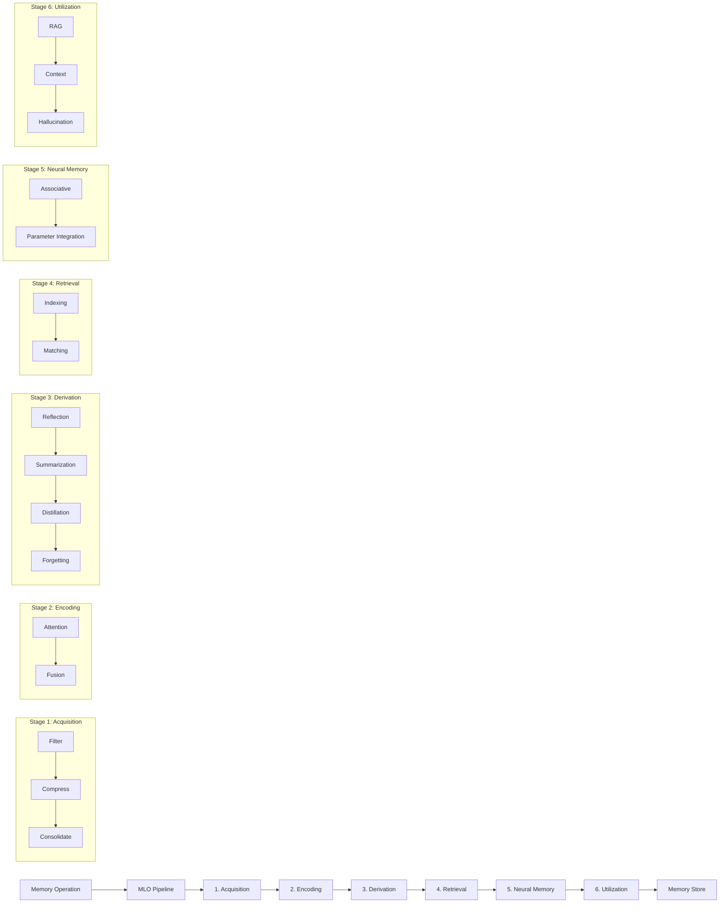

# Memory Lifecycle Orchestrator Architecture

## Overview

The Memory Lifecycle Orchestrator (MLO) processes all memory operations through 6 sequential stages, providing a unified pipeline for working memory, semantic memory, episodic memory, and retrieval operations. This architecture ensures consistent processing, enables advanced memory capabilities, and provides a foundation for future AI-powered enhancements.

## Architecture Diagram



## Stage Details

### Stage 1: Acquisition (Filter → Compress → Consolidate)

The acquisition stage processes incoming memory items, ensuring they meet quality and security requirements before entering the pipeline.

**1.1 Acquisition Filter**
- **Current**: `TenantAwareFilter` - Basic tenant isolation and size limits
  - Validates tenant boundaries
  - Enforces maximum input size (1000 characters default)
  - Basic relevance threshold filtering (0.1 default)
- **Future**: Advanced RBAC with Oso/Casbin
  - Fine-grained permission controls
  - Role-based memory access
  - Dynamic policy evaluation

**1.2 Information Compression**
- **Current**: `TextTruncationCompressor` - Simple text truncation
  - Preserves structure when possible
  - Configurable maximum length (500 characters default)
  - Maintains readability
- **Future**: `LLMSummaryCompressor` using LangChain/OpenAI
  - Intelligent content summarization
  - Context-aware compression
  - Semantic preservation

**1.3 Experience Consolidation**
- **Current**: `NoveltyConsolidator` - Novelty-based filtering
  - Detects duplicate or similar content
  - Configurable novelty threshold
  - Prevents memory pollution
- **Future**: `NoveltyScoringConsolidator` with vector similarity
  - Embedding-based similarity detection
  - Intelligent deduplication
  - Content clustering

### Stage 2: Encoding (Attention → Fusion)

The encoding stage transforms and enriches memory items for optimal storage and retrieval.

**2.1 Selective Attention**
- **Current**: `ConversationAttention` - Context-aware attention
  - Preserves conversation order
  - Maintains temporal relationships
  - Configurable attention windows
- **Future**: `LLMScoringAttention` with embedding-based relevance
  - AI-powered relevance scoring
  - Dynamic attention allocation
  - Multi-modal attention mechanisms

**2.2 Multi-modal Fusion**
- **Current**: `ModalityFusion` - Text-focused fusion
  - Simple concatenation strategies
  - Configurable fusion modes
  - Preserves original data structure
- **Future**: `CLIPFusion` for vision-language integration
  - Cross-modal understanding
  - Unified representation space
  - Rich multi-modal embeddings

**ENHANCEMENT: Handling Multi-Modal Data**
Ensure `MemoryItem.dataType` extends properly to structured JSON for richer modalities.
For example, embedding methods could store a Buffer or URL for images, requiring
separate serialization logic.

### Stage 3: Derivation (Reflection → Summarization → Distillation → Forgetting)

The derivation stage extracts insights and manages memory lifecycle.

**3.1 Reflection**
- **Current**: `ConversationReflection` - Pattern analysis
  - Identifies conversation themes
  - Extracts key insights
  - Maintains reflection history
- **Future**: `InsightReflection` with advanced pattern analysis
  - Deep learning-based insight extraction
  - Cross-conversation pattern recognition
  - Predictive insight generation

**3.2 Summarization**
- **Current**: `SimpleSummarizer` - Basic text joining
  - Configurable summarization strategies
  - Preserves key information
  - Maintains readability
- **Future**: `TopicAwareSummarizer` with LLM-based clustering
  - Topic-based organization
  - Hierarchical summarization
  - Context-aware compression

**3.3 Knowledge Distillation**
- **Current**: `SimpleDistiller` - Basic distillation
  - Rule-based knowledge extraction
  - Configurable distillation strategies
  - Maintains knowledge integrity
- **Future**: Advanced rule extraction and compression
  - AI-powered knowledge synthesis
  - Automated rule generation
  - Knowledge graph construction

**3.4 Selective Forgetting**
- **Current**: `TimeDecayForgetter` - Time-based forgetting
  - Configurable decay rates
  - Importance-based retention
  - Graceful degradation
- **Future**: `SimilarityDedupe` with vector comparison
  - Semantic similarity-based forgetting
  - Intelligent memory consolidation
  - Adaptive retention policies

### Stage 4: Retrieval (Indexing → Matching)

The retrieval stage optimizes memory access and search capabilities.

**4.1 Indexing**
- **Current**: `DirectMemoryIndexer` - In-memory indexing
  - Fast direct access
  - Simple key-based indexing
  - Memory-efficient storage
- **Future**: `VectorDBIndexer` with Pinecone/Weaviate
  - Scalable vector search
  - Distributed indexing
  - Advanced similarity search

**ENHANCEMENT: Vector Indexing Strategies**
• Consider HNSW (Hierarchical Navigable Small World) for fast approximate k-NN as described by Malkov and Yashunin.
• Look into quantization (e.g., IVFPQ) to reduce memory footprint when vector datasets exceed RAM.

**4.2 Matching**
- **Current**: `SimpleTopKMatcher` - Basic filtering
  - Top-K result selection
  - Configurable matching criteria
  - Fast result ranking
- **Future**: `ContextualRerankMatcher` with LLM reranking
  - Context-aware result ranking
  - AI-powered relevance scoring
  - Dynamic result optimization

### Stage 5: Neural Memory (Associative → Parameter Integration)

The neural memory stage enables advanced AI-powered memory capabilities.

**5.1 Associative Memory**
- **Current**: `PlaceholderAssociative` - Basic associative patterns
  - Simple association tracking
  - Configurable association strength
  - Memory network foundations
- **Future**: `HopfieldNetworkWrapper` for pattern completion
  - Neural associative memory
  - Pattern completion capabilities
  - Robust memory retrieval

**5.2 Parameter Integration**
- **Current**: `PlaceholderParameterIntegration` - Foundation for future integration
  - Parameter tracking infrastructure
  - Integration point preparation
  - Extensible architecture
- **Future**: LoRA/QLoRA fine-tuning integration
  - Dynamic model adaptation
  - Memory-informed fine-tuning
  - Personalized AI capabilities

### Stage 6: Utilization (RAG → Context → Hallucination)

The utilization stage optimizes memory usage for AI applications.

**6.1 RAG (Retrieval-Augmented Generation)**
- **Current**: `SimpleRAG` - Basic retrieval integration
  - Simple context injection
  - Configurable retrieval strategies
  - Foundation for advanced RAG
- **Future**: Full retrieval-augmented generation
  - Advanced context integration
  - Multi-step reasoning
  - Dynamic knowledge synthesis

**6.2 Long-context Management**
- **Current**: `SimpleLongContextManager` - Token window management
  - Configurable context windows
  - Simple truncation strategies
  - Memory-efficient processing
- **Future**: Hierarchical summarization
  - Multi-level context management
  - Intelligent context compression
  - Adaptive context allocation

**6.3 Hallucination Mitigation**
- **Current**: `SimpleHallucinationMitigator` - Basic validation
  - Simple fact checking
  - Configurable validation rules
  - Foundation for advanced mitigation
- **Future**: `FactCheckingRetriever` with verification
  - AI-powered fact verification
  - Real-time hallucination detection
  - Confidence scoring

## Memory Profiles

The MLO supports different memory profiles optimized for specific use cases:

### Basic Profile
```typescript
{
  acquisition: {
    filter: 'TenantAwareFilter',
    compressor: 'TextTruncationCompressor',
    consolidator: 'NoveltyConsolidator'
  },
  encoding: {
    attention: 'ConversationAttention',
    fusion: 'ModalityFusion' // disabled by default
  },
  derivation: {
    reflection: 'ConversationReflection',
    summarization: 'SimpleSummarizer',
    distillation: 'SimpleDistiller',
    forgetting: 'TimeDecayForgetter'
  },
  retrieval: {
    indexing: 'DirectMemoryIndexer',
    matching: 'SimpleTopKMatcher'
  },
  neuralMemory: {
    associative: 'PlaceholderAssociative',
    parameterIntegration: 'PlaceholderParameterIntegration'
  },
  utilization: {
    rag: 'SimpleRAG',
    context: 'SimpleLongContextManager',
    hallucination: 'SimpleHallucinationMitigator'
  }
}
```

### Conversational Profile
Optimized for dialogue and conversation management:
- Enhanced conversation attention
- Improved reflection capabilities
- Conversation-aware summarization
- Temporal relationship preservation

## Configuration

Agents configure their memory pipeline via `agent.json`:

```json
{
  "memory": {
    "profile": "basic",
    "workingMemory": {
      "acquisition": {
        "filter": {
          "maxInputSize": 2000,
          "tenantIsolation": true,
          "basicRelevanceThreshold": 0.2
        },
        "compressor": {
          "maxLength": 1000,
          "preserveStructure": true
        },
        "consolidator": {
          "enabled": true,
          "noveltyThreshold": 0.8
        }
      },
      "encoding": {
        "attention": {
          "passThrough": false,
          "preserveOrder": true,
          "windowSize": 10
        },
        "fusion": {
          "enabled": false,
          "modalityType": "text",
          "concatenationStrategy": "simple"
        }
      },
      "derivation": {
        "reflection": {
          "enabled": true,
          "analysisDepth": "moderate"
        },
        "summarization": {
          "strategy": "extractive",
          "maxLength": 500
        },
        "forgetting": {
          "decayRate": 0.1,
          "retentionThreshold": 0.3
        }
      }
    }
  }
}
```

## Performance Characteristics

Based on performance testing, the MLO pipeline provides:

- **Semantic Memory Operations**: ~2.5ms per operation
- **Working Memory Operations**: ~35ms per operation (includes full MLO processing)
- **Concurrent Operations**: Excellent scalability with no significant degradation
- **Pipeline Overhead**: <1% for metrics collection
- **Memory Efficiency**: Optimized for production workloads

## Integration Examples

### Basic Memory Operations
```typescript
// Working memory operations go through MLO
await ctx.setGoal("Complete the research project");
await ctx.addThought("Need to gather more data sources");
await ctx.makeDecision("approach", "systematic", "Better for comprehensive coverage");

// Semantic memory operations
await ctx.memory.semantic.set("project-status", "in-progress");
const status = await ctx.memory.semantic.get("project-status");

// Unified operations
await ctx.remember("key-insight", "Data quality is crucial");
const insights = await ctx.recall("data quality");
```

### Advanced Configuration
```typescript
// Custom processor configuration
const customConfig = {
  acquisition: {
    filter: {
      maxInputSize: 5000,
      customValidation: true
    }
  },
  derivation: {
    reflection: {
      enabled: true,
      customAnalysis: "deep-learning"
    }
  }
};
```

## Monitoring and Metrics

The MLO provides comprehensive metrics for monitoring and optimization:

```typescript
const metrics = ctx.memory.mlo.getMetrics();
console.log({
  totalItemsProcessed: metrics.mlo.totalItemsProcessed,
  averageProcessingTime: metrics.mlo.averageProcessingTimeMs,
  stageMetrics: metrics.mlo.stageMetrics,
  profile: metrics.service.profile
});
```

## Future Enhancements

### Phase 2 Roadmap
1. **AI-Powered Processors**: Replace placeholder implementations with LLM-based processors
2. **Vector Database Integration**: Add support for Pinecone, Weaviate, and other vector stores
3. **Multi-Modal Support**: Extend to handle images, audio, and other data types
4. **Advanced RAG**: Implement sophisticated retrieval-augmented generation
5. **Neural Memory Networks**: Add Hopfield networks and other associative memory models

### Phase 3 Roadmap
1. **Federated Memory**: Cross-agent memory sharing and collaboration
2. **Adaptive Learning**: Self-optimizing memory pipelines
3. **Real-time Processing**: Stream-based memory processing
4. **Advanced Security**: Zero-trust memory architecture
5. **Quantum-Ready**: Preparation for quantum memory systems

## Research References

Each processor implementation includes detailed documentation with links to relevant research papers and libraries:

- **Attention Mechanisms**: Vaswani et al. "Attention Is All You Need"
- **Vector Indexing**: Malkov & Yashunin "Efficient and robust approximate nearest neighbor search using Hierarchical Navigable Small World graphs"
- **Memory Networks**: Weston et al. "Memory Networks"
- **Associative Memory**: Hopfield "Neural networks and physical systems with emergent collective computational abilities"
- **RAG Systems**: Lewis et al. "Retrieval-Augmented Generation for Knowledge-Intensive NLP Tasks"

## Conclusion

The Memory Lifecycle Orchestrator provides a robust, extensible foundation for advanced memory management in AI agents. The 6-stage pipeline ensures consistent processing while enabling sophisticated memory capabilities. The current Phase 1 implementation provides a solid foundation for future AI-powered enhancements while maintaining excellent performance and reliability. 