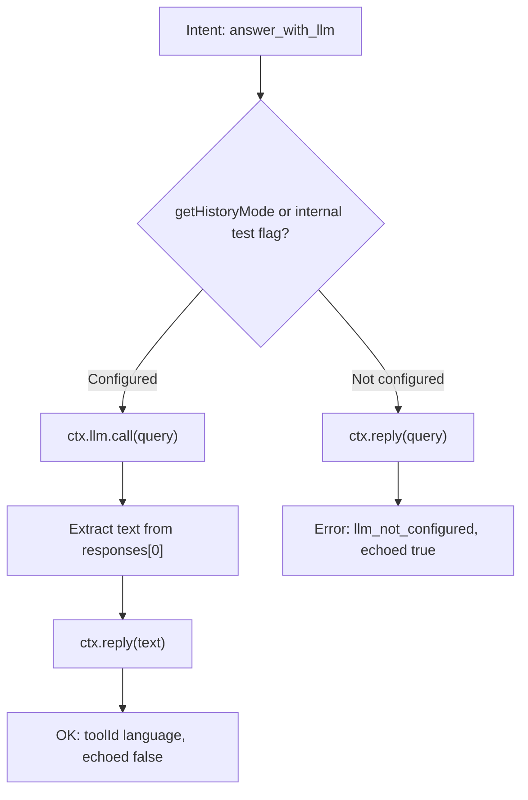

# Migration guide: LLM output contracts and typed execution (v3.6)

This guide helps you migrate agents, tests, and A2A integrations after the **3.6** work on canonical LLM output contracts, typed `ILLMCaller` options, `ExecOutcome` shapes, default `answer_with_llm` behavior, and TurnTrace metadata for structured outputs.

There is **no backward compatibility** guarantee for the items below: plan a normal upgrade pass (bump package, fix compile errors, adjust tests).

**Related docs:** [How to use LLM in APLRET](../10-how_to_use_llm_in_aplret.md) · [How to debug with TurnTrace](../12-how_to_debug_with_turn_trace.md) · [APLRET contracts](../0-aplret_contracts.md) · [Specification (framework)](../todo/3.6-llm-output-contracts.md)

---

## Overview

### Who is affected

| You… | Action |
|------|--------|
| Call `ctx.llm.call` / `.stream` with loose option bags | Align with `LLMCallOptions` (extra keys still allowed via schema `.passthrough()`). |
| Implement or mock `ILLMCaller` | Update signatures; for object literals prefer **`satisfies ILLMCaller`**; classes may keep **`implements ILLMCaller`** if TypeScript accepts it. |
| Import `ExecResult` from deep paths | Prefer package exports; canonical definitions live in `types/execOutcome`. |
| Rely on default **`answer_with_llm`** echoing without a real LLM | Expect a real `ctx.llm.call()` when the runtime considers the LLM configured; otherwise a structured error and `validation.failed`. |
| Match on **observation** kinds in perception / learning | Handle `internal` + `llm.responded` and `internal` + `validation.failed` from the default transition. |
| Assert exact **`TurnTrace.llmCalls`** shapes | Allow new optional contract fields on each `LLMCallTrace`. |
| Build **`MinimalSourceTaskContext`** for A2A | Type `llm` / `tools` as `ILLMCaller` and the documented `invoke` shape; tighten `unknown` handling for `recall` results. |

---

## 1. `ILLMCaller.call()` / `.stream()` — `LLMCallOptions`

**Before:** Options were effectively untyped (`Record<string, any>`-style usage was common).

**After:** Options are **`LLMCallOptions`**: typed fields such as `temperature`, `seed`, `data`, `jsonSchema`, `schema`, `telemetryNodeId`, plus **unknown keys allowed** via Zod `.passthrough()` on the schema.

```ts
import type { LLMCallOptions } from '@a2arium/callagent-core';

const options: LLMCallOptions = {
  temperature: 0,
  seed: 1,
  customFlag: true, // OK: passthrough
};

await ctx.llm.call(prompt, options);
```

Use **`LLMCallOptionsSchema`** when validating options at runtime (for example in tools or adapters).

---

## 2. `ILLMCaller` is a `type`, not an `interface`

`ILLMCaller` is now a **`type`** alias (not an `interface`), mainly so the framework follows the “`type` not `interface`” API rule. **Declaration merging** on `ILLMCaller` is no longer possible—extend your own types instead.

**Classes:** `class MyCaller implements ILLMCaller` remains valid TypeScript when `ILLMCaller` is an object-shaped type. You still must **update method signatures** to use `LLMMessage`, `LLMCallOptions`, and `LLMSettings`.

**Object literals (mocks, adapters):** use **`satisfies ILLMCaller`** so excess-property checks and inference stay strict:

```ts
import type { ILLMCaller, LLMCallOptions, LLMSettings } from '@a2arium/callagent-core';

const myCaller = {
  async call(message, options?: LLMCallOptions) {
    /* ... */
    return [];
  },
  async *stream(message, options?: LLMCallOptions) {
    /* ... */
  },
  addToolResult(id: string, result: string, name: string) {},
  updateSettings(settings: LLMSettings) {},
} satisfies ILLMCaller;
```

Update **tests** so every mock matches **`ILLMCaller`** (including optional methods you stub).

---

## 3. `LLMConfig.defaultSettings` and `updateSettings()`

Both now use **`LLMSettings`** (typed core fields + `.passthrough()` for provider-specific keys). Replace ad hoc `Record<string, any>` bags with `LLMSettings` or literals assignable to it.

**Search:** `defaultSettings:`, `updateSettings(`.

---

## 4. `ExecResult`, `ExecOutcome`, and imports

- **`ExecResult`** and **`ExecOutcome`** are defined in **`types/execOutcome.ts`** and exported from **`@a2arium/callagent-core`**.
- **`ExecOutcomeSchema`** / **`ExecResultSchema`** are available for runtime validation.
- **`Modules.execution`** is typed to return **`Promise<ExecOutcome<...>>`**. Existing `{ action, result }` shapes remain structurally compatible; you only need changes if you imported types from obsolete paths or used brittle inline types.

**Prefer:**

```ts
import type { ExecResult, ExecOutcome } from '@a2arium/callagent-core';
import { ExecOutcomeSchema, ExecResultSchema } from '@a2arium/callagent-core';
```

Avoid deep imports into `loop/oneTurn` or `types/*` unless you have a special reason (monorepo internals).

---

## 5. Structured output: `jsonSchema`, `LLMOutputContract`, `contentObject`

- **`jsonSchema`** on `LLMCallOptions` expects a value matching **`LLMOutputContract`**: `{ name: string; schema: ZodType | Record<string, unknown> }` (see **`LLMOutputContractSchema`**).
- You may also pass **`schema`** on options (Zod instance or JSON-schema-like record) per `LLMCallOptionsSchema`.
- Call shape at the agent layer is unchanged; the difference is **static typing** and validation at the schema boundary.

**`contentObject`:** Parsed structured output may appear on **`callllm`**’s **`UniversalChatResponse`** as a convenience field. It is **not** a separate framework-owned type. For details, see [How to use LLM in APLRET](../10-how_to_use_llm_in_aplret.md).

---

## 6. Default `answer_with_llm` execution

This section describes the **stock** `modules.execution` branch for intents shaped like **`{ kind: 'answer_with_llm', query: string, contextKey?: string }`**. If you supply your own **`execution`** module, none of this runs unless you copy the pattern.

### 6.1 What changed vs older behavior

**Before:** In typical runs with a **stub** `ctx.llm` (no real adapter), default execution could behave like an echo path without clearly separating “model answered” from “no model.”

**After:** The default module **always** tries to do the right thing for end users:

- With a **realistic** caller (`getHistoryMode` present, as on **`LLMCallerAdapter`**), it **invokes the model** with `ctx.llm.call(query)`, then **`ctx.reply`s** the first assistant **`content`** string (or `'No LLM response.'` if missing).
- With an **obviously unconfigured** stub (no `getHistoryMode`), it still **`reply`s the raw `query`** so the user sees something, but the **`ExecOutcome` is an error** with **`llm_not_configured`** so policies, tests, and transition logic can tell configuration failed.

### 6.2 When the framework treats the LLM as “configured”

Default execution computes:

```ts
const llmConfigured =
  internalCtx.__llmConfigured === true || typeof ctx.llm?.getHistoryMode === 'function';
```

- **Production:** Use the normal **`LLMCallerAdapter`**, which implements **`getHistoryMode()`**. That alone counts as configured.
- **Tests / fakes:** Any mock that must exercise the **call** path should define **`getHistoryMode`** (returning `'stateless' | 'dynamic' | 'full'`). Omit it to force the **`llm_not_configured`** path.
- **`__llmConfigured`** exists on the internal task context for **framework tests**; agent code should **not** depend on it.

### 6.3 Call shape (default path only)

The default implementation calls **`await ctx.llm.call(a.query)`** — the **query string only**. It does **not** pass **`LLMCallOptions`** (no temperature, `jsonSchema`, etc.). If you need options or structured output for Q&A, **override `modules.execution`** for `answer_with_llm` or route through a custom intent that passes options.

### 6.4 Outcome shapes (success)

On success, **`ExecOutcome`** looks like:

```text
action: { kind: 'answer_with_llm', echoed: false }
result: {
  status: 'ok',
  toolId: 'language',
  data: { echoed: false, query: '<original query>', text: '<first response content or fallback>' },
  ... // correlation / timing fields as usual
}
```

Side effects (in order): **`ctx.llm.call(query)`**, then **`ctx.reply(text)`** with **`text`** derived from **`responses[0]?.content`**.

### 6.5 Outcome shapes (LLM not configured)

When **`llmConfigured`** is false:

```text
action: { kind: 'answer_with_llm', echoed: true }
result: {
  status: 'error',
  toolId: 'language',
  error: {
    code: 'llm_not_configured',
    message: 'No LLM configured; echoed query as fallback.'
  },
  data: { echoed: true, query: '<original query>', text: '<same as query>' },
  ...
}
```

Side effects: **`ctx.reply(query)`** (echo), then return the error **`ExecOutcome`**. Downstream, default **transition** maps this to **`validation.failed`** (see §7).

### 6.6 Example: mock LLM for tests (configured)

```ts
import type { ILLMCaller, LLMCallOptions, LLMSettings } from '@a2arium/callagent-core';

export function createConfiguredLlmStub(reply: string): ILLMCaller {
  return {
    async call(_message: string | Record<string, unknown>, _options?: LLMCallOptions) {
      // Default execution only reads responses[0]?.content as a string.
      return [{ content: reply }];
    },
    async *stream(_message: string | Record<string, unknown>, _options?: LLMCallOptions) {
      yield { content: reply, isComplete: true };
    },
    addToolResult() {},
    updateSettings(_settings: LLMSettings) {},
    getHistoryMode: () => 'stateless' as const,
  };
}
```

With this on **`ctx.llm`**, default **`answer_with_llm`** hits the **success** branch and your tests should expect **`ctx.llm.call`** (and **`ctx.reply`**) accordingly.

### 6.7 Example: stub without `getHistoryMode` (unconfigured)

```ts
const bareStub: ILLMCaller = {
  async call() {
    return [];
  },
  async *stream() {},
  addToolResult() {},
  updateSettings() {},
  // deliberate: no getHistoryMode → llm_not_configured path
};
```

Expect **`result.status === 'error'`**, **`result.error?.code === 'llm_not_configured'`**, and default transition **`validation.failed`** (§7).

### 6.8 Override

If you need different prompts, options, streaming, or error handling, provide **`modules.execution`** and handle **`intent.kind === 'answer_with_llm'`** yourself; the snippets above document **framework defaults** only.



---

## 7. Default transition: observations and `continue`

For successful **`toolId === 'language'`** results, the default transition emits:

- **`{ source: 'internal', kind: 'llm.responded', payload }`** where **`payload`** is a **`LLMRespondedPayload`** (optional fields such as `contentSummary`, `hasStructuredOutput`, etc.).

For execution errors with **`error.code`** in **`schema_mismatch`**, **`contract_failed`**, or **`llm_not_configured`**, the default transition returns:

- **`{ kind: 'continue', observations: [{ source: 'internal', kind: 'validation.failed', payload }] }`**
- **`payload`** matches **`ValidationFailedPayload`** (e.g. **`reason`**, optional **`schemaName`**, **`error`**, **`zodError`**).

**Important:** This path uses **`continue`**, not **`await_child`**. Tests or policies that assumed a child wait after default `answer_with_llm` must be updated. Custom **`modules.transition`** is unchanged by these defaults unless you delegate to them.

Narrow observations in code with the exported types:

```ts
import type { LLMRespondedPayload, ValidationFailedPayload } from '@a2arium/callagent-core';
```

---

## 8. `LLMCallTrace` — contract metadata (additive)

Each entry in **`TurnTrace.llmCalls`** may include optional fields:

- **`hasOutputContract`**
- **`outputContractName`**
- **`outputContractStatus`**

They are **optional**. Tests or serializers that assume a fixed key set should allow these keys or use **`LLMCallTraceSchema`** / TurnTrace parsing so extra fields do not fail equality checks.

See [How to debug with TurnTrace](../12-how_to_debug_with_turn_trace.md).

---

## 9. A2A: `MinimalSourceTaskContext`

**`llm`** is now **`ILLMCaller | undefined`**. **`tools`** is an object with **`invoke(name, args): Promise<unknown>`**. **`recall`** remains **`Promise<unknown[]>`** — narrow elements before reading `id`, `type`, `data`, etc.

Any code that builds this context (or copies it for child tasks) must use **typed mocks** for `llm` if present, matching **`ILLMCaller`**.

---

## 10. Search patterns

Use your editor to find migration hotspots:

| Pattern | Why |
|---------|-----|
| `Record<string, any>` near LLM / options | Replace with `LLMCallOptions` / `LLMSettings`. |
| `implements ILLMCaller` on **object literals** | Invalid; use `satisfies` or a `class`. |
| `interface ILLMCaller` (local duplicate) | Delete; import from core. |
| `defaultSettings:` | Type as `LLMSettings`. |
| `updateSettings(` | Second argument `LLMSettings`. |
| `answer_with_llm` | Re-read execution + transition expectations. |
| `trace.llmCalls` / `LLMCallTrace` | Allow new optional contract fields. |
| `ExecResult` from `oneTurn` or deep paths | Import from `@a2arium/callagent-core`. |
| `await_child` in tests right after default LLM answer | Prefer `continue` + `llm.responded` where applicable. |
| `MinimalSourceTaskContext` / `llm:` mocks | Match `ILLMCaller`. |

---

## 11. Test and tooling checklist

- [ ] Update **LLM stubs** to **`ILLMCaller`** signatures (`LLMMessage`, `LLMCallOptions`, `LLMSettings`).
- [ ] Default **`answer_with_llm`**: mock **`ctx.llm.call`** when you expect a model path; assert **`continue`** and **`llm.responded`** for successful language completion where appropriate.
- [ ] For **stub / unconfigured** LLM scenarios, expect **`validation.failed`** (or error result) and **`reason`** / **`error`** consistent with **`ValidationFailedPayload`**.
- [ ] Extend **TurnTrace** assertions with optional **`hasOutputContract`**, **`outputContractName`**, **`outputContractStatus`** when testing structured output.
- [ ] Run **`yarn tsd`** on packages that include type tests (for example `tests/llmContracts.types.test-d.ts` in core) after upgrading **`callllm`** — declaration emit issues in older **`callllm`** releases broke strict resolution; use a **`callllm`** version that ships **`dist/esm/core/streaming/types.js`** and **`.js`** specifiers in emitted `.d.ts`.

---

## 12. Breaking changes (summary list)

1. **`ILLMCaller.call()` / `.stream()`** — **`LLMCallOptions`** instead of untyped bags.
2. **`ILLMCaller`** — **`type`**, not **`interface`** (no declaration merging; object literals → **`satisfies ILLMCaller`**).
3. **`LLMConfig.defaultSettings`** — **`LLMSettings`**.
4. **`updateSettings()`** — **`LLMSettings`**.
5. **`ExecResult`** — canonical **`types/execOutcome`**, exported from the package root.
6. **`ExecOutcome`** — first-class type + **`ExecOutcomeSchema`**.
7. **Default `answer_with_llm`** — calls **`ctx.llm.call()`** when configured; structured error when not.
8. **Default transition** — **`internal` / `llm.responded`** on success for language tool results.
9. **Default transition** — **`internal` / `validation.failed`** for contract / config errors (**`continue`**).
10. **`LLMCallTrace`** — optional **`hasOutputContract`**, **`outputContractName`**, **`outputContractStatus`**.
11. **`MinimalSourceTaskContext`** — stricter **`ILLMCaller`** / tools / **`unknown`** recall rows (A2A and serializers).
