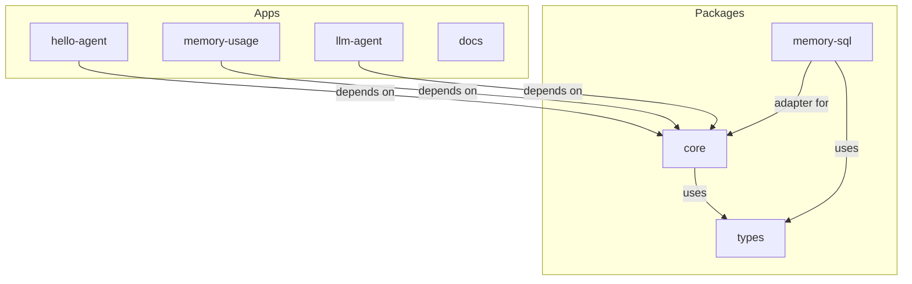

# Monorepo Overview

This project uses a modern, modular monorepo structure powered by Turborepo and Yarn workspaces. All core packages, adapters, and shared libraries live under `packages/`, while example agents and documentation live under `apps/`.

## Architecture Diagram


## Directory Layout
- `packages/` — Core framework, adapters (e.g., memory-sql), shared types, utilities
- `apps/` — Example agents, documentation site, integration demos

## Migration Rationale
- **Modularity:** Each package is independently versioned and tested.
- **Reusability:** Adapters and types can be reused across projects.
- **Community:** Clear structure for contributors and external users.

## Workspace Structure
```
callagent/
  packages/
    core/
    memory-sql/
    types/
  apps/
    examples/
      hello-agent/
      memory-usage/
      llm-agent/
    docs/
```

## Development Workflow
- Install all dependencies: `yarn install`
- Build all packages/apps: `turbo run build`
- Run all tests: `turbo run test`
- Add new packages in `packages/`, new apps in `apps/`

## See Also
- [MemorySQL Adapter](./memory-sql-adapter.md)
- [Usage Tracking](../../docs/usage-tracking.md) 