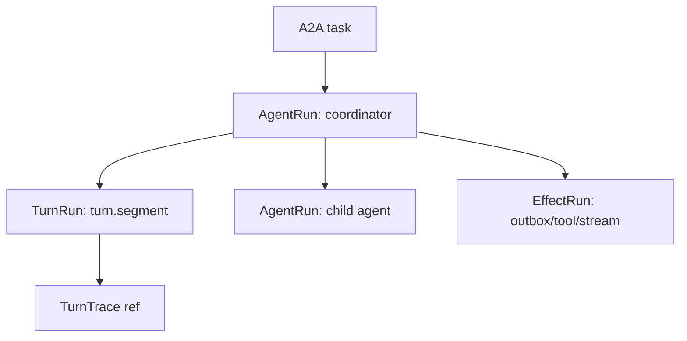

# Operator Run Graph

## Status

Reference for the operator-facing agent DAG.

The product-level unit is an **Agent Run**, not a Hatchet workflow. Hatchet remains an execution backend. The callAgent API exposes a semantic graph that answers what users actually need to know:

- which agent ran
- what task/input it received
- what it output
- which child agents it called
- which turn/effect failed
- where to find TurnTrace and raw backend IDs for debugging

The current implementation exposes this as a projection over `driver_runs`,
`wm_events`, snapshots, and available trace/span references. The durable target is
normalized graph persistence so the operator view does not depend on JSON
archaeology.

## Model



### `AgentRun`

One user-facing agent execution for a task.

Important fields:

- `agentId`
- `rootTaskId`
- `taskId`
- `parentTaskId` for child nodes
- `status`
- `inputPreview`
- `outputPreview`
- `traceId`
- `providerRunId` for raw Hatchet debugging

### `AgentRunEdge`

A semantic parent-to-child agent call.

Important fields:

- `parentTaskId`
- `childTaskId`
- `parentAgentId`
- `childAgentId`
- `token`
- `edgeToken`
- `edgeKind`
- `status`
- `resultPreview`
- `error`

### `TurnRun`

One APLRET cognition segment. This is debug detail under an agent node, not a top-level product concept.

Important fields:

- `operation: "turn.segment"`
- `turnSeq`
- `traceId`
- `spanId`
- `idempotencyKey`
- `turnTraceRef`
- `providerRunId`

### `EffectRun`

Effect delivery such as outbox dispatch. Effects are hidden by default and shown in debug views.

Important fields:

- `operation`, for example `effect.outbox.dispatch`
- `status`
- `token`
- `traceId`
- `providerRunId`
- `outboxRowId`
- `hiddenByDefault: true`

### `AgentRunEvent`

Normalized event/log entries used to group task history without exposing raw
runtime primitives as the default UI.

Important fields:

- `type`
- `visibility`
- `group.taskId`
- `group.agentId`
- `group.traceId`
- `group.spanId`
- `group.turnId`
- `group.token`

## API

The runtime host exposes:

```bash
curl http://127.0.0.1:8790/tasks/<taskId>/run-graph \
  -H 'x-tenant-id: <tenantId>'
```

The response is an `AgentRunGraph`:

- `root`: the root `AgentRun`
- `nodes`: root and child agent nodes
- `edges`: child-agent calls
- `turns`: turn details with TurnTrace references
- `effects`: debug effect runs
- `events`: normalized event/log entries grouped by task, agent, trace, span, and token
- `debug.driverRuns`: normalized raw driver rows

## Hatchet Naming

Hatchet workflow names are backend/debug vocabulary:

- `agent.<agentId>` for known registered parent agents when available
- `aplret.task` as fallback parent workflow
- `aplret.segment` for turn execution
- `aplret.outbox.dispatch` for effect delivery

Do not ask operators to interpret `aplret.*` names as the product model. They should use the run graph as the semantic source of truth and open Hatchet only for backend debugging.

## Persistence Direction

The projection API is the first contract. The durable end state should persist
enough normalized data to answer operator questions without parsing arbitrary JSON:

- `agent_runs`
- `agent_run_edges`
- `turn_runs`
- `effect_runs`
- optionally `agent_run_events`

`driver_runs` should remain the provider index and deep-link table. It should not
be stretched into the product model.

## Acceptance

Phase 2 orchestration is acceptable when a single root task can render as one root `AgentRun` with child agent edges, turn trace references, grouped events/logs, input/output previews, and raw Hatchet IDs available only as debug detail.
