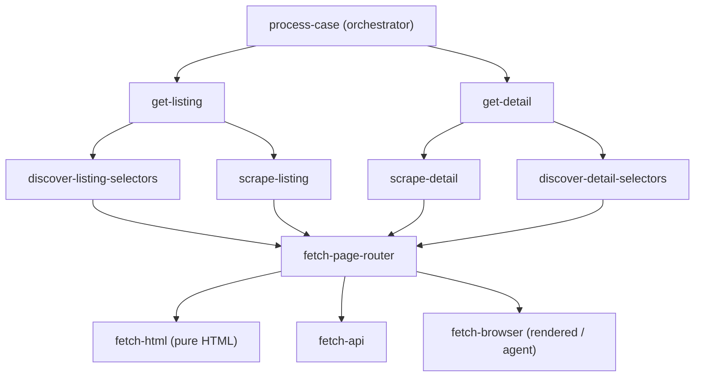

# Operator Dashboard — Product Requirements (Pre-UI)

## Status

Product requirements document (PRD). This is a **pre-UI** document: it describes
who the dashboard is for, how they think, what they need to accomplish, and which
information the product must expose. It deliberately does **not** prescribe screen
layouts, components, or visual design. UI specs build on top of this.

Companion documents:

- [Operator Run Graph](./operator-run-graph.md) — the semantic data contract the
  dashboard reads from.
- [APLRET Contracts](./0-aplret_contracts.md) — what an agent run actually is.
- [How-to: Debug with TurnTrace](./12-how_to_debug_with_turn_trace.md) — the
  per-turn debugging model the dashboard makes visual.
- [specs/operator-viewer.md](./orchestrator-harness/specs/operator-viewer.md) —
  the technical implementation spec (data sources, endpoints, SPA).

Scope note: this product targets the **non-legacy loop runtime** only
(`runMode` loop / APLRET turns). Legacy run modes are out of scope.

---

## 1. What this is

### 1.1 The framework, in one paragraph

callAgent is a framework for building **A2A-compliant, turn-based agents**. Each
agent runs as a strict APLRET loop (Attention → Perception → Learning → Policy →
Shield → Execution → Transition). Agents are **composable**: an agent can delegate
work to child agents, call tools, call LLMs, request user input, and read/write
durable memory. Work is **durable**: a single user task can fan out into a deep
tree of agent runs spanning many turns, suspend on `await_input` / `await_tool` /
`await_child`, and resume later. Every turn emits a structured `TurnTrace`.

### 1.2 The problem this dashboard solves

The framework is excellent at *running* agents and *recording* what happened. It is
poor at letting a human **see and understand** what happened. Today the truth is
spread across:

- compact `TurnTrace` and operator events,
- Hatchet workflow runs (`aplret.task`, `aplret.segment`, `aplret.outbox.dispatch`)
  named in execution vocabulary, not product vocabulary,
- `driver_runs` / `wm_events` / snapshots in SQL,
- console logs.

To answer a simple question — *"this customer's job failed overnight, why, and how
much did it cost?"* — an operator must stitch together database rows, Hatchet's raw
run names, and trace exports. That is slow, requires deep framework knowledge, and
does not scale to **thousands of concurrent agent runs**.

The Operator Dashboard is the **single semantic surface** that answers operator
questions about agent runs without forcing them to learn the execution backend. Its
product unit is the **Agent Run**, not the Hatchet workflow.

### 1.3 What "good" looks like

A user can, in minutes and without reading code:

1. Find the run they care about among thousands (by agent, status, time, customer/task).
2. Understand the **shape** of the run — which agents called which, and where it is now.
3. Locate the **first thing that went wrong** (a failed turn, a vetoed action, a
   bad LLM extraction, a missing memory write).
4. See **what it cost** (tokens, money, latency) and where the cost concentrated.
5. Inspect **cognition** — what the agent perceived, decided, and why.
6. Inspect **memory** — what it read and wrote, and whether a cache hit/miss
   changed the outcome.
7. Jump to backend detail (Hatchet for infra, local trace/span ids for correlation) only when
   they truly need raw detail.

---

## 2. The running example (concrete use case)

Throughout this document we use a real callAgent application as the canonical
example: a **web data-extraction pipeline** (the `itupdated` project). It is
representative of the hardest, most valuable case — a **deep, recursive,
LLM-heavy multi-agent system**.

Its agent topology:

What actually happens during a job:

- `process-case` orchestrates scraping one customer "case" (e.g. a set of source
  websites to monitor for new listings).
- For each site, `get-listing` first needs CSS selectors. If none are cached, it
  delegates to `discover-listing-selectors`, which **fetches a page via a child
  agent**, runs **LLM extraction** to guess selectors, **refines up to 4 times**
  with more LLM calls, then **validates against a second page**, then **writes the
  selectors to semantic memory** so the next run is cheap.
- `fetch-page-router` decides per-site whether the page is pure HTML, rendered, or
  needs a browser agent — and whether a captcha blocks it.
- Failures are everywhere and real: fetch timeouts, captchas, LLM returning
  non-conforming selectors, validation mismatches, budget exhaustion (`maxTurns`),
  retries with `cacheBypass`.

This single example exercises **every** thing operators care about: recursion,
LLM cost, memory caching, partial failure deep in a child, budgets, and retries.
If the dashboard serves this case, it serves the simpler ones for free.

---

## 3. Ideal Customer Profile (who this is for)

The dashboard serves several personas. They share one trait: they need to
**understand agent behavior they did not personally watch run**.

### 3.1 Primary persona — Agent Developer / Builder ("Maya")

- Builds and maintains the agents (writes Policy, Execution, prompts, contracts).
- Lives in TurnTrace mentally; the dashboard should feel like a visual TurnTrace.
- **Cares about:** *why did Policy pick that intent? why did the LLM extraction
  fail the contract? which turn is the first wrong turn? did Learning actually
  write the fact?* Cost matters, but correctness matters more.
- **Frustrations today:** has to add `console.log`, re-run locally, or dig through
  low-level telemetry/logs to reconstruct a turn story. Cannot easily see the whole agent tree.
- **Success:** finds the first wrong turn and the responsible module
  (Perception / Learning / Policy / Shield / Execution / Transition) in minutes.

### 3.2 Primary persona — Operator / On-call ("Sam")

- Runs the system in production. Does **not** necessarily know every agent's code.
- Watches fleets of runs; reacts to failures, stuck runs, and cost spikes.
- **Cares about:** *what's failing right now? how many? is it one site or all? is
  anything stuck waiting? are we burning money? which customer is affected?*
- **Frustrations today:** Hatchet shows `aplret.segment` runs with no product
  meaning; no fleet-level view keyed by agent/customer; no cost rollup.
- **Success:** triages an incident — scope it, find the common cause, decide
  retry vs escalate — without reading agent source.

### 3.3 Secondary persona — Product / Domain Owner ("Priya")

- Owns the outcome the agents produce (e.g. "are we capturing new listings
  correctly across all monitored sites?").
- Semi-technical; thinks in **cases, sites, outcomes, and quality**, not turns.
- **Cares about:** *which sites are healthy vs degraded? success rate over time?
  is selector discovery drifting? what's the cost per case?*
- **Success:** trusts a health/quality read without asking an engineer.

### 3.4 Secondary persona — Cost / FinOps owner ("Dev")

- Accountable for LLM spend.
- **Cares about:** *spend by agent, by model, by customer, over time; which runs
  are the expensive outliers; is refinement-loop cost exploding?*
- **Success:** attributes spend to a cause and a owner.

### 3.5 Anti-persona (not the audience)

- End users of the agent (the people the agent serves) — they get the agent's
  reply, not this dashboard.
- Framework maintainers debugging the runtime kernel itself — they use Hatchet,
  raw `driver_runs`, and code. The dashboard treats those as **deep-link escape
  hatches**, not primary surfaces.

---

## 4. How users think (mental models)

The product must speak the user's language, not the runtime's. These are the mental
models the dashboard must honor.

### 4.1 "A run is a tree of agents, not a list of workflows"

Users picture a **root agent** that spawns **child agents**, recursively. They do
not picture `aplret.task` / `aplret.segment` rows. The product unit is the
**Agent Run**; turns are detail *inside* an agent node; Hatchet workflow names are
backend vocabulary that must never be the primary surface.

### 4.2 "Find the first wrong turn"

The canonical debugging instinct (straight from the TurnTrace how-to) is: walk
forward in time and find the **first turn that deviated from expectation**. The
first wrong turn is usually the real bug. The dashboard must make this walk fast
and obvious.

### 4.3 "Failure is usually deep and partial"

In a recursive system, the root often "fails" because something **three levels
down** failed (a captcha in `fetch-browser`, a contract violation in an LLM
extraction). Users think top-down ("the case failed") but need to drill to the
**actual leaf failure** quickly. Error causes must **propagate visibly up the tree**.

### 4.4 "Cause lives in the gap between perceived, decided, and done"

When a decision looks wrong, users reason in three layers:
- what did the agent **perceive** (inbox / Perception)?
- what did it **know** afterward (Learning → MentalState)?
- what did it **decide** (Policy intent) and did Shield change it?
- what did it **do** (Execution) and what came back (Transition)?

The dashboard must let users move across these layers for any single turn.

### 4.5 "Memory is state that explains behavior"

Especially in this example: a cached selector in semantic memory means a cheap,
fast run; a cache miss triggers an expensive discovery+refinement loop. Users
think *"did it read the cache? did it write a new fact? is the wrong fact cached?"*
Memory reads/writes are first-class explanatory signals, not infra trivia.

### 4.6 "Cost is a property of behavior"

Users do not think about tokens in the abstract. They think *"this refinement loop
ran 4 times and that's why this run cost 5× the others."* Cost must be attributable
to the **agent, turn, model, and decision** that caused it.

### 4.7 "Stuck is different from failed"

An agent on `await_input` / `await_tool` / `await_child` is **suspended, not
broken** — but a suspend that never resumes is an incident. Users need to
distinguish *running*, *waiting (healthy)*, *waiting (stuck/overdue)*, *completed*,
and *failed*.

---

## 5. What users care about (the data, by importance)

Expressed as information needs, not widgets. Ordered roughly by how often it is the
thing a user is actually looking for.

1. **Status & lifecycle** — is this run/agent running, waiting, completed, failed,
   cancelled? If waiting, on what (input/tool/child) and for how long?
2. **Topology** — the recursive agent tree: who called whom, with what input, and
   what came back. Where the failure is in that tree.
3. **The failure** — error code/message, the responsible module, the turn it
   happened on, and whether it propagated from a child.
4. **Cognition per turn** — perception summary, the intent Policy chose, Shield
   outcome, stage transition, and enough to answer "why this decision".
5. **LLM activity** — per call: model/provider, input/output tokens, cost,
   latency, whether a structured output contract was used and whether it passed.
   Roll up to turn, agent, run, and fleet.
6. **Memory activity** — read/write/delete operations with keys touched, backend,
   and the turn/agent that did it. Cache hit vs miss as an explanatory signal.
   (Keys and metadata, **not** raw values inline.)
7. **Cost & latency rollups** — by run, by agent, by model, by customer/case, over
   time. Outlier detection ("this run cost 5× median").
8. **Inputs & outputs** — the task input preview and the agent output preview at
   each node.
9. **Timeline** — the turn sequence within an agent, and the time span of the run.
10. **Provenance & config** — which Agent Card / Runtime Manifest (source + hash)
    produced this behavior, to catch config drift between environments.
11. **Debug escape hatches** — Hatchet for raw infra runs, plus copyable
    trace/span identifiers for correlation when summaries are not enough.

### Explicitly **not** stored/shown by default (and why)

- **Raw LLM prompts/responses inline** — large and sensitive. Show compact
  metadata in callagent; full prompt/response capture belongs to callllm or
  application telemetry, not the operator SQL projection.
- **Raw memory values inline** — only keys/metadata; values can be huge or
  sensitive. (See [Operator Run Graph](./operator-run-graph.md): memory events do
  not store raw values.)
- **Raw page HTML / artifacts inline** — artifacts are handles; show metadata and
  size, never the 10MB body.
- **New database tables / write-path overhead** — the dashboard reads from existing
  `driver_runs` + compact `wm_events` + snapshots. It must not slow down or
  re-architect the hot execution path.

---

## 6. Typical scenarios (jobs to be done)

Each scenario states the trigger, the user, what they need, and what "done" means.

### S1 — Fleet triage during an incident (Sam, operator)
- **Trigger:** alert / overnight batch — "lots of failures."
- **Needs:** see all runs filtered by `status=failed` in a time window, grouped by
  agent and by customer/case; spot whether it's one agent (e.g. `fetch-browser`)
  or systemic; see counts and trend.
- **Done:** scope identified ("only sites needing browser fetch, captcha spike"),
  decision made (retry / disable site / escalate).

### S2 — "Why did this specific job fail?" (Sam → Maya)
- **Trigger:** a customer reports their case produced no new listings.
- **Needs:** open that case's run; see the tree; the root shows failed; drill down
  to the leaf that actually failed; read the error and the turn around it.
- **Done:** root cause located (e.g. `discover-listing-selectors` exhausted its
  refinement budget because the LLM kept returning selectors that failed the
  output contract on this site's new layout).

### S3 — "Why did the agent make this decision?" (Maya, developer)
- **Trigger:** the agent extracted the wrong field / chose the wrong path.
- **Needs:** find the turn; compare inbox → perception → mental-state change →
  intent → shield → execution → transition; confirm whether the fact Policy needed
  was actually written by Learning.
- **Done:** identified the first wrong turn and the responsible module; knows what
  to fix and where.

### S4 — Cost investigation (Dev / Priya)
- **Trigger:** LLM bill jumped this week.
- **Needs:** spend rolled up by agent/model/customer over time; the expensive
  outlier runs surfaced; ability to open an outlier and see *which turns/calls*
  drove the cost (e.g. repeated refinement loops).
- **Done:** cause attributed ("Site X changed layout → discovery re-ran on every
  case instead of hitting cache") and owner identified.

### S5 — Memory / cache correctness (Maya)
- **Trigger:** suspect a stale or wrong cached selector.
- **Needs:** for a given site/case, see memory reads (did it hit the selector
  cache?) and writes (did discovery overwrite it?); see the keys and which agent/turn.
- **Done:** confirmed whether behavior was cache-driven; knows whether to
  invalidate/repair the cached fact.

### S6 — Stuck-run detection (Sam)
- **Trigger:** throughput dropped.
- **Needs:** find runs that are **waiting** (await_*) past an expected threshold;
  see what they're waiting on (a child that never completed? input never provided?).
- **Done:** stuck runs identified and unblocked or cancelled.

### S7 — Quality / health monitoring (Priya)
- **Trigger:** weekly review.
- **Needs:** per-site/per-agent success rate, cost-per-case, discovery re-run rate,
  trend over time.
- **Done:** confident health read; flags the 2–3 sites degrading.

### S8 — Cancellation / intervention (Sam)
- **Trigger:** a runaway or no-longer-needed run.
- **Needs:** identify it and cancel it (and understand the blast radius — does
  cancelling the root cancel the children?).
- **Done:** run stopped cleanly; children handled correctly.

---

## 7. User journeys (end-to-end)

### Journey A — Operator incident triage (S1 → S2 → S8)

1. Sam lands on a **fleet view** scoped to the last few hours, `status=failed`.
2. Groups/sorts by agent → sees `fetch-browser` failures dominate; cost is normal,
   so it's a correctness/availability issue, not a spend issue.
3. Filters to one affected customer to confirm scope.
4. Opens one failed run → sees the **agent tree**; the root `process-case` is red,
   the red path leads down through `fetch-page-router` → `fetch-browser`.
5. Reads the leaf failure: captcha challenge. Propagated cause is visible at the root.
6. Decides: this is a known site; cancels the in-flight retries (S8) and flags the
   site. Hands the recurring pattern to Maya with a deep-link.

**Friction to avoid:** Sam should never need to read `process-case` source or
decode `aplret.segment` to reach this conclusion.

### Journey B — Developer root-cause (S2 → S3 → S5)

1. Maya opens the run Sam linked. Tree shows `discover-listing-selectors` failed
   with budget exhaustion.
2. Opens that agent → sees its **turn timeline**; turns 3–6 are repeated `refine`
   intents.
3. Opens turn 6 → perception normalized fine, but the **LLM call** shows the
   structured-output contract status = failed (selectors didn't validate).
4. Checks **memory** for this site → confirms there *was* a cached selector, but a
   prior write overwrote it with a bad one after a layout change.
5. Conclusion: the validation step accepted a bad selector and cached it. Fix is in
   Learning/validation. Maya uses the copied trace/span ids to correlate with
   application-level LLM telemetry if full prompt/response inspection is needed.

**Friction to avoid:** moving between "the decision", "the LLM call behind it", and
"the memory state that explains it" must be a couple of steps, not a database query.

### Journey C — Cost owner (S4)

1. Dev opens a **cost view**, last 7 days, grouped by agent and model.
2. Sees `discover-*-selectors` spend doubled; drills by customer → concentrated in
   one customer's cases.
3. Opens a representative expensive run → cost concentrated in refinement turns.
4. Cross-references memory: cache-miss rate for that customer's sites spiked.
5. Conclusion: a layout change is forcing rediscovery every run; attributes spend
   to that cause and routes the fix.

---

## 8. Typical debug scenarios (the framework-native ones)

These map the [TurnTrace debug routine](./12-how_to_debug_with_turn_trace.md) onto
product needs. The dashboard must make each answerable visually.

| Question users ask | What the dashboard must surface |
|---|---|
| "What is the first wrong turn?" | Turn timeline per agent with status; fast forward-scan; deviation visible. |
| "Did the expected event reach the inbox?" | Per-turn inbox summary (source / kind / token). |
| "Did Perception normalize it?" | Per-turn perception summary; validation-failure signal. |
| "Did Learning write the fact?" | Mental-state-changed signal (before/after hash); memory write events. |
| "Why did Policy choose X?" | Intent + the perception/mental-state context for that turn. |
| "Did Shield change/block it?" | Shield outcome (pass / transform / defer / veto) per turn. |
| "Why did we await?" | Transition outcome + awaited token category, matched to the action token. |
| "Why did we double-call?" | Correlation id across calls; retry/idempotency signals; LLM/tool/child call lists. |
| "Did the LLM output break its contract?" | LLM call contract status (hasOutputContract / status). |
| "Is this config drift?" | Agent Card / Runtime Manifest source + hash per run. |
| "Where did the cost go?" | Per-turn and per-call token/cost/latency, rolled up. |
| "Did the cache help or hurt?" | Memory read/write keys and hit/miss per turn/agent. |
| "Where's the real failure in the tree?" | Failure propagation from leaf agent to root. |

For raw, full-fidelity detail (full prompts, full payloads, kernel-level infra),
the answer is **Hatchet** for infra runs plus trace/span correlation to
application-level telemetry, not inline rendering.

---

## 9. Product requirements (capabilities)

Stated as capabilities and acceptance, not UI. "Must" = MVP; "Should" = strong
follow-up; "Could" = later.

### 9.1 Fleet / list capability
- **Must** list agent runs across the tenant, filterable by agent, status, time
  window, and customer/task identifier, with keyset pagination that holds at
  **thousands of runs**.
- **Must** show per-row: agent, status (incl. waiting vs stuck), start/age,
  input preview, and a cost indicator.
- **Should** group/aggregate by agent and by customer/case with counts and
  success-rate.
- **Should** surface "stuck" runs (waiting past a threshold) and outliers
  (cost/latency) as filters.

### 9.2 Run topology capability
- **Must** render the **recursive Agent Run tree** for a task: nodes = agent runs,
  edges = delegations, with status and input/output previews per node.
- **Must** support large/deep trees via lazy expansion (don't render thousands of
  nodes at once).
- **Must** make failure **propagation** visible (leaf cause traceable to root).
- **Should** distinguish edge kinds (delegate vs other effects) and let effects be
  hidden by default (debug-only).

### 9.3 Turn / cognition capability
- **Must** show, per agent, the **turn timeline** with status and stage transitions.
- **Must** show per-turn cognition: inbox summary, perception summary, intent,
  shield outcome, transition outcome, pending/await token, timings.
- **Must** indicate whether mental state changed (Learning wrote something).
- **Should** make the "first wrong turn" scan fast (visual status per turn).

### 9.4 LLM capability
- **Must** show per-turn LLM calls with model/provider, input/output tokens, cost,
  latency, and output-contract status.
- **Must** roll up LLM cost/tokens to turn, agent, run, and fleet.
- **Should** support spend grouping by model and by customer over time.
- **Must not** render raw prompts/responses inline; expose compact metadata and
  copyable trace/span ids instead.

### 9.5 Memory capability
- **Must** show memory operations (read / write / delete) with keys, key count,
  backend, and the agent/turn that did it.
- **Should** express cache hit/miss as a derived, explanatory signal.
- **Must not** render raw memory values inline.

### 9.6 Cost & latency capability
- **Must** attribute cost to run, agent, turn, model.
- **Should** provide time-series rollups by agent/model/customer and outlier
  highlighting.

### 9.7 Provenance & deep-link capability
- **Must** show Agent Card / Runtime Manifest source + hash per run (config-drift).
- **Must** deep-link each node/turn to its Hatchet infra run where references
  exist and expose copyable trace/span ids where captured.

### 9.8 Intervention capability
- **Should** allow cancelling a run and clearly communicate child blast radius.
- **Could** allow retry / resume actions where the runtime supports them.

### 9.9 Cross-cutting requirements
- **Must** be **read-mostly** and impose **no new write-path overhead** on the hot
  execution path (reuse `driver_runs` + compact `wm_events` + snapshots).
- **Must** be **tenant-scoped** and safe (no leaking another tenant's runs).
- **Must** speak **product vocabulary** (Agent Run, turn, decision, memory, cost) —
  never force operators to interpret `aplret.*` backend names.
- **Must** scale visually and in queries to **thousands of concurrent runs** and
  **deep trees**.
- **Should** degrade gracefully when optional data (TurnTrace capture, LLM telemetry) is
  disabled — core status/topology/cost still work.

---

## 10. Non-goals

- Not a replacement for Hatchet (infra/execution control) or application-level
  prompt/response telemetry. It is the **semantic operator layer** above them.
- Not an agent **authoring / editing** tool. It observes; it does not build agents.
- Not a general APM/log aggregator. It is scoped to **agent-run semantics**.
- Not a billing system. It attributes cost; it does not invoice.
- Not a place to read full prompts, full responses, or raw memory/artifact bodies.

---

## 11. Success metrics (how we know it works)

- **Time-to-root-cause** for a failed run drops from "tens of minutes across tools"
  to **a few minutes in one surface**.
- **Incident triage** (scope + cause + decision) is done **without reading agent
  source** for common failures.
- **Cost attribution**: any spend spike can be traced to an agent + cause + owner.
- **Scale**: fleet and tree views stay responsive at thousands of runs / deep trees.
- **Self-service**: non-developer personas (operator, product, FinOps) answer their
  top questions without pinging an engineer.

---

## 12. Open questions (for follow-up)

- **Customer/case identity:** the running example keys work by `caseId`. The
  dashboard needs a first-class, generic notion of "the business entity a run
  belongs to" for grouping (S1, S4, S7). What is the canonical field/source?
- **Stuck thresholds:** what defines "waiting too long" per await type, and is it
  per-agent configurable?
- **Cancellation semantics:** exact child blast-radius behavior to communicate (S8).
- **Retention:** how far back do fleet/cost/trend views go, and where does older
  data live (SQL vs trace backend)?
- **Quality signals:** S7 implies a notion of "correct output" beyond status —
  where does ground truth for quality come from?
