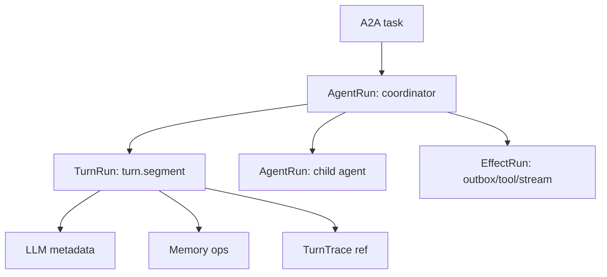

# Operator Run Graph

## Status

Reference for the operator-facing agent DAG.

Live progress is task-scoped in `run_progress`, tenant isolated, and atomically
fenced against the working-memory turn coordinator. It is read separately from
topology through `/tasks/:taskId/progress`; progress polling never relayouts the
graph. Terminal rows preserve the last truthful report.

The product-level unit is an **Agent Run**, not a Hatchet workflow. Hatchet remains an execution backend. The callAgent API exposes a semantic graph that answers what users actually need to know:

- which agent ran
- what task/input it received
- what it output
- which child agents it called
- which turn/effect failed
- which decision/stage/transition occurred inside each turn
- which LLM calls and memory keys were touched
- where to find TurnTrace references and raw backend IDs for debugging

The current implementation exposes this as a projection over `driver_runs`,
`wm_events`, snapshots, and available trace/span references. Phase 2 persists the
key graph fields directly on `driver_runs` as a lean durable index. The Operator
Experience track adds compact cognition and memory events to `wm_events`, still
without adding normalized graph tables.

## Model



### `AgentRun`

One user-facing agent execution for a task.

Important fields:

- `agentId`
- `rootTaskId`
- `taskId`
- `parentTaskId` for child nodes
- `status`
- `inputPreview`
- `outputPreview`
- `traceId`
- `providerRunId` for raw Hatchet debugging

### `AgentRunEdge`

A semantic parent-to-child agent call.

Important fields:

- `parentTaskId`
- `childTaskId`
- `parentAgentId`
- `childAgentId`
- `token`
- `edgeToken`
- `edgeKind`
- `status`
- `resultPreview`
- `error`

### Turn identity vocabulary

- `cognitiveTurnSeq`: one internal APLRET reasoning iteration.
- `turnSeq`: one durable segment, which may contain several cognitive turns.
- `generation`: accepted durable demand consumed by a segment.
- `attemptSeq`, `claimId`, and `fence`: provider polling, retry, and takeover identity.

A retry or lease takeover of the same generation remains part of the same `turnSeq`.
Only the snapshot coordinator authorizes execution; Operator rows are repairable read
models and never establish ownership.

When an active lease expires, coordination changes to `recovering` immediately.
After the recovery CAS is committed, Operator shows **Recovering after lease
expiry** with the preserved generation and turn number. The expired attempt is
`superseded` with reason `lease_expired`; its replacement is another attempt
under the same `turnSeq`, not another business turn. Late events from the expired
claim cannot restore ownership.

### `TurnRun`

One durable segment. This is debug detail under an agent node, not a top-level product concept.

Important fields:

- `operation: "turn.segment"`
- `turnSeq`
- `traceId`
- `spanId`
- `idempotencyKey`
- `turnTraceRef`
- `cognition` with compact stage/decision/transition/timing/usage data
- `llmCalls` with model/provider/token/cost/latency metadata only
- `memoryOps` with memory operation keys touched during the turn
- `providerRunId`
- `attempts`, including queued, executed, and superseded provider attempts
- `cognitiveTurns`, containing committed or provisional APLRET iterations

`AgentRun.turnCount` counts committed cognitive turns only. A provisional
`turn.observed` may be shown for live diagnosis, but it does not advance the aggregate.

### `MemoryOperationRun`

One compact memory operation captured from existing task execution paths.

Important fields:

- `op: "read" | "write" | "delete"`
- `keys` and `keyCount`
- `backend`
- `turnSeq`
- `agentId`
- `traceId`
- `spanId`

Memory operation events do not store raw memory values.

### `EffectRun`

Effect delivery such as outbox dispatch or best-effort post-commit artifact projection.
Effects are hidden by default and shown in debug views.

Important fields:

- `operation`, for example `effect.outbox.dispatch`
- `status`
- `token`
- `traceId`
- `providerRunId`
- `outboxRowId`
- `hiddenByDefault: true`

### `AgentRunEvent`

Normalized event/log entries used to group task history without exposing raw
runtime primitives as the default UI.

Important fields:

- `type`
- `visibility`
- `group.taskId`
- `group.agentId`
- `group.traceId`
- `group.spanId`
- `group.turnId`
- `group.token`

## API

The runtime host exposes:

```bash
curl "http://127.0.0.1:8790/agent-runs?status=failed&limit=50" \
  -H 'x-tenant-id: <tenantId>'
```

`GET /agent-runs` returns a paginated fleet list over existing `driver_runs`
root rows. Supported filters: `agentId`, `status`, `since`, `cursor`, `limit`.

```bash
curl http://127.0.0.1:8790/tasks/<taskId>/run-graph \
  -H 'x-tenant-id: <tenantId>'
```

The response is an `AgentRunGraph` schema version 4. It is a bounded polling
summary, rather than a dump of every historical event:

- `root`: the root `AgentRun`
- `nodes`: root and child agent nodes
- `edges`: child-agent calls
- `turns`: active turns plus at most 20 recent logical-turn summaries
- `summary`: complete collection counts before page truncation
- `omissions`: explicit history/payload omissions and their reason
- `responseBudget`: configured and measured response bytes

`caps.truncated` applies only to topology limits. It never means that history
or a large payload was omitted; those cases are listed in `omissions` and do
not create a failed effect or change the agent's outcome.

Additional read-only detail endpoints:

```bash
curl http://127.0.0.1:8790/tasks/<taskId>/turns/<turnSeq> \
  -H 'x-tenant-id: <tenantId>'

curl http://127.0.0.1:8790/tasks/<taskId>/memory \
  -H 'x-tenant-id: <tenantId>'
```

For long histories, use keyset-paginated endpoints (`cursor`, default `limit=50`,
maximum `100`) instead of asking the graph endpoint to inline detail:

```text
GET /tasks/:taskId/turns
GET /tasks/:taskId/turns/:turnSeq/attempts
GET /tasks/:taskId/turns/:turnSeq/cognitive-turns
GET /tasks/:taskId/effects
GET /tasks/:taskId/events
GET /tasks/:taskId/memory-operations
GET /tasks/:taskId/driver-runs
```

Each returns `{ items, nextCursor?, pageInfo, summary }`. Cursors are opaque and
tenant-scoped; callers must not construct them. A direct turn lookup does not
rebuild the complete graph.

To run a completed root again, Operator loads its original accepted input only
when the operator invokes the action: `GET /tasks/:taskId/replay-input`. This
operator/admin-only endpoint is tenant-scoped and intentionally separate from
the bounded graph response. It returns the original agent ID and launch payload,
or `409 REPLAY_INPUT_UNAVAILABLE` for historical runs that did not retain a
replayable object input.

## Read mode and response budget

`CALLAGENT_OPERATOR_PROJECTION_READ` accepts `auto`, `semantic`, `bridge`, or
`compare`. Its default is `auto`: semantic facts are preferred when the root
projection is ready; otherwise CallAgent returns a bounded bridge shell marked
`projection.partial=true`. `bridge` remains an explicit rollback mode, and
`compare` is for migration diagnostics.

`CALLAGENT_OPERATOR_RAW_PAYLOAD_MAX_BYTES` defaults to 1 MiB and must be at
least 16 KiB. A value below that minimum stops runtime readiness with a clear
configuration error. The graph builder preserves the root and topology first,
then strips optional previews/history until the serialized response fits.

The operator SPA lives in `apps/operator-viewer`. In development it runs on Vite
with a proxy to `runtime-host`. In production/local host mode, `runtime-host`
serves the built app at `/operator` when `apps/operator-viewer/dist/index.html`
or `OPERATOR_VIEWER_DIST` exists.

## Hatchet Naming

Hatchet workflow names are backend/debug vocabulary:

- `agent.<agentId>` for known registered parent agents when available
- `aplret.task` as fallback parent workflow
- `aplret.segment` for turn execution
- `aplret.outbox.dispatch` for effect delivery

Do not ask operators to interpret `aplret.*` names as the product model. They should use the run graph as the semantic source of truth and open Hatchet only for backend debugging.

## Persistence Direction

The projection API is the first contract. Phase 2 already persists graph-critical
fields on `driver_runs`: `rootTaskId`, parent/child task and agent ids, edge
tokens/kinds, turn sequence, boundary kind, and TurnTrace ids where available.
The Operator Experience track reuses `wm_events` for compact `turn.completed`
and `memory.*` events; full prompts/responses and raw memory values are deferred
to application-level telemetry outside callagent.

The durable end state should persist enough normalized data to answer operator
questions without parsing arbitrary JSON:

- `agent_runs`
- `agent_run_edges`
- `turn_runs`
- `effect_runs`
- optionally `agent_run_events`

`driver_runs` remains the provider index and deep-link table. The Phase 2 columns
are a hardening bridge, not the long-term product graph schema.

## Phase 2 Signoff

The parent-child DAG path is manually signed off with `phase2-parent-agent`
delegating to `phase2-loop-agent` in Hatchet mode.

Expected graph shape:

- `root.agentId`: `phase2-parent-agent`
- one child node with `agentId: "phase2-loop-agent"`
- one `delegates_to` edge with `status: "completed"`
- operator events `task.child_started` and `task.child_completed`
- debug turn/effect rows available without exposing `aplret.*` as the product UI

## Acceptance

Phase 2 orchestration is acceptable when a single root task can render as one root `AgentRun` with child agent edges, turn trace references, grouped events/logs, input/output previews, and raw Hatchet IDs available only as debug detail.
