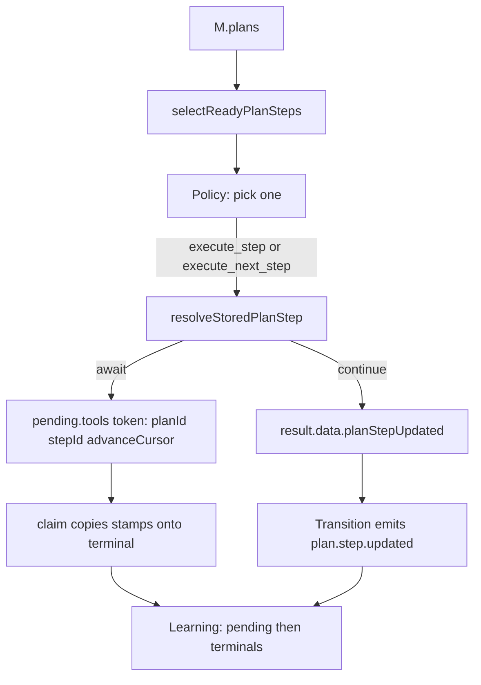

# Spec: execute_step Intent (Phase 4)

## Status

Implemented after Phases 1–2.
`adr/0005-execute-step-names-a-step.md` is **Accepted**.

Phase 3 fields are not required. DAG Policy may ignore `validation`
unless it passes the Phase 3 flag.

## Goal

Let Policy name **one** ready plan step for this turn, without turning
the loop into a DAG scheduler and without putting planning intents on
the step.

Core owns dispatch **and** the token↔step correlation so the step does
not stay `pending` after the effect finishes.

Originating request: DAG execution via dependencies. It proposed
`scheduling` + optional `cursor`. We already rejected that (ADR 0002).
This spec is the missing **intent** plus the default loop wiring.

## Why this shape

| Request want | Phase 4 answer |
|---|---|
| Run a dependency-ready step, not only `cursor` | `execute_step { planId, stepId }` |
| `scheduling` mode on `Plan` | **No** |
| Parallel Policy intents for two ready steps | **No.** One intent. Fan-out is Execution (`pending.*`) |
| Store `execute_step` on `PlanStep.intent` | **No.** Planning intent, like `execute_next_step` |
| Default Policy becomes a scheduler | **No.** Default stays `execute_next_step` |
| Core dispatches but agent patches status | **No.** That double-fires. Core stamps pending / `planStepUpdated`; default Learning writes status |

## APLRET ownership

| Concern | Owner |
|---|---|
| Choose `planId` + `stepId` (or cursor) | Policy (sync, `M` only; MAY call graph helpers) |
| Dispatch `step.intent`; stamp pending | Execution (does not write `M`) |
| Emit `plan.proposed` / `planStepUpdated` on continue | Transition (already maps `result.data.planStepUpdated`) |
| Write step `status` / optional cursor advance | Default Learning, from `plan.step.updated` or token correlation |
| Walk remaining ready steps this turn | **Nobody in the loop.** Next turn’s Policy |



## Normative schema

Home: `packages/core/src/types/intent.ts` (Phase 1 already splits
`ExecutableStepIntentSchema` vs `PlanningIntentSchema`).

```ts
export const ExecuteStepIntentSchema = z.object({
  kind: z.literal('execute_step'),
  planId: z.string().min(1),
  stepId: z.string().min(1),
}).strict();
```

`PlanningIntentSchema` becomes:

```text
create_plan | execute_next_step | execute_step | repair_plan
```

`IntentSchema` includes `ExecuteStepIntentSchema`.

`ExecutableStepIntentSchema` MUST NOT include it. Phase 1 type tests
already reject `create_plan` on a step; add `execute_step` to that list.

### memory-engine scaffold

See Phase 1. Add `execute_step` to
`packages/memory-engine/src/types/external/intent.ts` in **this** PR.
`packages/core/tests/intent.kind-parity.test.ts` extracts
`kind: z.literal('…')` from both files and asserts equal member sets.

## Shared dispatcher

Default Execution used to no-op `execute_next_step`. Phase 4 wires both
planning intents through `resolveStoredPlanStep`. `create_plan` still
proposes a plan via `result.data.planProposed`.

Phase 4 MUST add one lookup helper (`resolveStoredPlanStep` in
`packages/core/src/plans/dispatchStoredPlanStep.ts`) used by **both**
planning intents. `dispatchStoredPlanStep` MAY remain a named alias of
that lookup. It does **not** run tools; default Execution calls the
existing `requestTool` / `requestInput` / `sendTaskToAgent` handlers
after resolve and passes stamps in those opts.

| Policy intent | Step id |
|---|---|
| `execute_step { planId, stepId }` | `stepId` |
| `execute_next_step { planId }` | `plan.steps[plan.cursor].id` (fail `PLAN_STEP_NOT_FOUND` if `cursor >= steps.length`) |

Lookup and fail (structured `ExecResult.error.code`, no thrown strings):

| `errorCode` | Condition |
|---|---|
| `PLAN_NOT_FOUND` | `planId` missing from `M.plans` |
| `PLAN_NOT_EXECUTABLE` | plan `cancelled` / `completed` / `stale` |
| `PLAN_STEP_NOT_FOUND` | `stepId` missing, or cursor past the last step |
| `PLAN_STEP_NOT_PENDING` | status ≠ `pending` |
| `PLAN_STEP_NO_INTENT` | no `step.intent` |

Then dispatch using the **existing** default handlers for that stored
intent (`call_tool`, `delegate_to_child`, `answer_with_llm`,
`prompt_user`, `wait`, `complete`, `internal`).

Invariants:

- Do **not** select another ready step. Do **not** mutate `M`.
- Do **not** walk `dependsOn`. Do **not** read `validation`. A **pending
  but blocked** step **will run** if Policy names it. That is a Policy
  bug, not an Execution gate. Test this so nobody “fixes” it later.
- `execute_step` does **not** advance `cursor`. `execute_next_step` may,
  via Learning (`advanceCursor` below).
- Reuse `ExecErrorPayload.code` (`z.string()` today). Do not invent a
  second error channel.

Default Policy: unchanged (no planner Policy in core).

This **replaces** the `execute_next_step` no-op stub. Agents with a
**custom** Execution are unchanged. Phase 1 tests that the stub no-ops
must be updated in this PR.

## Token ↔ step correlation

Execution cannot write `M`. Status writes stay Learning-owned.

### Await effects (`call_tool`, `delegate_to_child`, `prompt_user`)

When the default handler registers a pending token, stamp on that
pending record (optional fields on today’s `PendingTool` / child / input
objects — not a new Zod Plan field):

```ts
planId: string
stepId: string
advanceCursor: boolean  // true iff Policy intent was execute_next_step
```

Do this **before** Transition returns `await_tool` / `await_child` /
`await_input`. Pass the stamps in `requestTool` / `requestInput` /
`sendTaskToAgent` opts so they land in the **same mutate** that
registers pending. Default Transition already returns await when a token is
present; it does not emit `plan.step.updated` on that path. That is
fine: Policy does not run while awaiting, so a still-`pending` step
cannot double-fire mid-await.

Engine claim MUST copy those stamps onto the matching terminal
(`PendingToolTerminal` / child / input tombstones) before deleting the
pending record. Double-delivery protection stays; do not delay claim.

Default Learning (loopRunner default, which already closes over `env`)
on `source: 'tool' | 'child' | 'user'` terminal observations
(`*.completed` / `*.failed`):

1. Read `token` from the envelope.
2. Look up `env.pending.tools[token]` / `children[token]` / `inputs[token]`.
3. If that pending record is gone, look up the matching **terminal** bag
   for the same token. Correlate if `planId` / `stepId` are present on
   either record.
4. If `planId` and `stepId` are present, `writer.plans.updateStep` with
   `status: 'completed'` or `'failed'`.
5. If `advanceCursor` is true and `plan.cursor` still indexes that
   `stepId`, set `cursor` to `min(cursor + 1, steps.length)` via
   `writer.plans.update`.

Pending deleted on engine claim is **not** a dropped correlation when
tombstones keep `planId` / `stepId` / `advanceCursor`. Learning reads
pending **then** terminals.

Do not invent `running` on the await path. `pending` → terminal status
on resume is enough (Policy does not run during await).

### Continue effects (`answer_with_llm`, `wait`, `complete`, `internal`)

Default Transition already emits `internal/plan.step.updated` when
`result.data.planStepUpdated` is set (same as `planProposed` today).

After a successful continue dispatch, Execution MUST set:

```ts
data: {
  planStepUpdated: {
    planId,
    stepId,
    patch: { status: 'completed' },  // or 'failed' on exec error
    advanceCursor?: boolean,         // true iff execute_next_step
  }
}
```

Phase 1 `PlanStepUpdatedPayloadSchema` is
`{ planId, stepId, patch }`. Phase 4 MUST add optional
`advanceCursor: z.boolean().optional()` on that payload (`.strict()`).
Default Learning already applies `patch` (Phase 1). Extend it to honor
`advanceCursor` with the same cursor rule as above.

Do not skip `running` on this path either; next-turn Learning runs
before Policy, so `completed` is visible before the next decision.

## Policy arrays

If Policy returns `Array<{ action, prob }>`, the loop samples **one**
intent (`oneTurn.ts` stochastic path). That array is not parallel
`execute_step`s. Tests MUST NOT treat two array entries as two steps in
one turn.

## Shield / HITL

Treat `execute_step` like `execute_next_step` / `repair_plan`. Search
`execute_next_step` in core and operator/HITL kind lists; add
`execute_step` next to it. Do not broaden to `z.string()` kinds.

## Tests

### Schema / types

- `Intent` accepts `{ kind: 'execute_step', planId, stepId }`;
- rejects extra fields (`.strict()`);
- `PlanStep['intent']` does **not** accept `execute_step`;
- `PlanStepUpdatedPayload` accepts optional `advanceCursor`;
- kind-parity test: core vs memory-engine scaffold.

### Default Execution + Learning (harness)

New `packages/core/tests/planning.execute-step.test.ts`:

1. Seed `M.plans` with two pending independent steps `A` and `B`, each
   with `intent: { kind: 'call_tool', toolName: 't' }`.
2. Policy returns `execute_step` for `A`.
3. Assert TurnTrace `intent.kind === 'execute_step'`.
4. Assert the tool stub was called for `A`’s tool, not `B`.
5. Assert `pending.tools[token]` has `planId` / `stepId` / `advanceCursor:
   false`.
6. Inject `tool.completed` for that token; **default** Learning (not a
   custom module) marks `A` `completed`; `B` still `pending`. After
   engine claim, pending may be gone — Learning still correlates via
   terminals that carry the stamps.
7. Next turn `selectReadyPlanSteps` includes `B`, not `A`.
8. `cursor` unchanged.

Also:

- missing `stepId` → `PLAN_STEP_NOT_FOUND`; `M.plans` unchanged;
- step without `intent` → `PLAN_STEP_NO_INTENT`;
- **blocked pending step:** `C` depends on incomplete `A`; Policy
  `execute_step(C)` **does** dispatch `C` (Execution does not check the
  graph). Test name must say that;
- `execute_next_step` with one pending `call_tool` step at `cursor: 0`
  dispatches that step, stamps `advanceCursor: true`, and after
  completion default Learning sets `cursor` to 1;
- Policy returning `[execute_step A, execute_step B]` with
  `stochastic: false` still executes **one** sample, not both;
- continue path: step intent `wait` → next turn step is `completed`
  via `plan.step.updated`, no pending token.

### Known regression review

| Failure | Action |
|---|---|
| Intent closed-union exhaustiveness | Add `execute_step` branch; do not reopen `Intent` to `string` |
| memory-engine scaffold kinds | Update that file + parity test; do not add a third Intent |
| HITL/manifest kind lists | Add `execute_step` next to `execute_next_step` |
| Phase 1 “execute_next_step stub no-ops” | Update: it now dispatches; that is this phase |
| Default Policy tests expect DAG | Do not change default Policy |
| Phase 1 step-intent reject list | Add `execute_step` to rejects |
| Stochastic `Math.random` flake | `policyParams.stochastic: false` in the two-entry array test |
| Pending deleted before Learning | Copy stamps onto terminals; Learning looks up pending **then** terminals. Claim deleting pending is not a dropped correlation. |
| Someone adds dependsOn checks in Execution | Revert; that test must stay green |

Run `yarn test` and `yarn test:types` in `packages/core`.

## Docs to update in the **same change set**

| Doc | What to change |
|---|---|
| `apps/docs/0-aplret_contracts.md` | Intent union includes `execute_step`. Sequential vs DAG. One intent per turn. Execution does not check `dependsOn`. Default Learning correlates tokens. |
| `apps/docs/8-spec_goals_and_plans_in_aplret.md` | DAG Policy picks one ready id. Cursor unused for readiness (ADR 0002). |
| `apps/docs/9-how_to_implement_planning_without_breaking_policy_purity.md` | helpers → one `execute_step` → dispatcher → Learning. Warn: do not emit two. Policy must not name a blocked step. |
| `apps/docs/3-how_to_keep_policy_pure.md` | Case 5: DAG variant still only reads `M`. |
| `apps/docs/11-how_to_test_aplret_agents.md` | Turn script: two ready steps, one executed, default Learning completes it. |
| `apps/docs/migration/plan-schema-one-truth.md` | New intent member; `execute_next_step` default is no longer a no-op. |

Do **not** rewrite originating request / 3.1 history.

## Out of scope

- `Plan.scheduling` / optional `cursor`
- Default Policy planner
- Checking `dependsOn` / validation in Execution
- Parallel Policy intents
- `PlanPatch`
- Marking `running` (optional later; not required)

## Acceptance

- Schema/type cases pass; step cannot store `execute_step`.
- Shared dispatcher serves both planning intents.
- Await: pending stamp + terminal tombstones; default Learning
  correlates pending then terminals; no double-fire.
- Continue: `plan.step.updated` + default Learning completion.
- Blocked-but-named step still dispatches.
- `execute_step` does not advance `cursor`; `execute_next_step` does
  after completion when `advanceCursor` is true.
- Docs agree.
- `yarn test` and `yarn test:types` in `packages/core` are green.

## Implementation order

1. Add `ExecuteStepIntentSchema`; fold into Planning + Intent; scaffold
   parity test.
2. Optional `advanceCursor` on `PlanStepUpdatedPayloadSchema`.
3. `resolveStoredPlanStep` + pending stamps on the handler’s record;
   wire both intents. `dispatchStoredPlanStep` is a lookup alias.
4. Default Learning correlation + cursor advance.
5. HITL kind lists.
6. Tests + docs.
7. Full core `yarn test` + `yarn test:types`.
