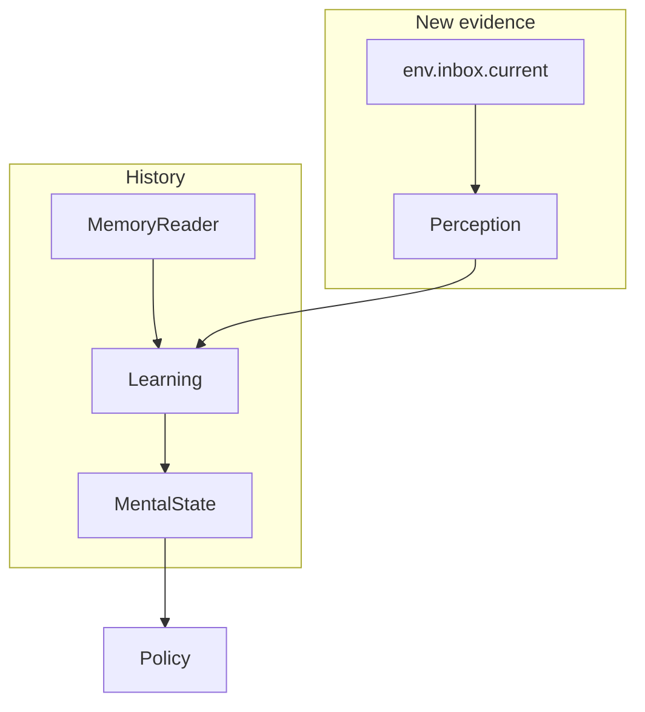

# Spec: Memory Read vs Observation (Phase 5b)

## Status

Ready for implementation (mostly documentation + a regression test).
`adr/0007-durable-memory-reads-are-not-observations.md` is **Accepted**.
Uses Phase 5a recorder only if an agent opts into a compact extension.

## Goal

Make this rule **normative and tested**:

> Reading durable memory does not itself constitute a new environment
> Observation.

Historical memory may change **cognition** (`M`) through Learning. It
must not be injected as duplicate evidence in `env.inbox.current`.

Originating request §§11–12. Telemetry already exists as operator
`memory.read`; we do not duplicate it as a first-class TurnTrace field
(ADR 0006).

## Why this shape

| Request want | Phase 5b answer |
|---|---|
| Normative inbox vs `MemoryReader` split | Yes — contracts + memory how-to |
| `TurnTrace.memoryReads[]` | **No.** Operator events already record keys/counts |
| Instrument `MemoryReader` | Already done for semantic reads in `loopRunner` (`appendOperatorMemoryEvent`) |
| Log retrieved payloads | **No** by default |
| Auto TurnTrace extension for every read | **No.** Optional agent extension; default stays operator-only |

## APLRET ownership (unchanged, now explicit)

| Path | What it is |
|---|---|
| `env.inbox.current` | New observations this turn (user, tool, child, internal/plan.*, …) |
| `mem.*` in Learning | Durable/historical read to **build** `M` |
| `writer.*` in Learning | Patches that merge into `M` and flush |
| Policy | Reads `M` (and must not treat `mem` as extra evidence) |
| Execution `ctx.memory` | Action-only loads (e.g. `contextKey` → semantic read before LLM) |
| Operator `memory.read` | Debug/audit of keys, counts, query summary — not inbox |



Illegal pattern the tests exist to catch:

```text
tool failure observed once
→ saved to memory
→ retrieved five times
→ treated as six independent inbox observations
```

## Runtime changes

**Default loop:** none, unless a test finds Perception/Learning copying
`mem` results into `inbox.current`. If found, **delete that copy**; do
not add a feature flag.

Do not:

- wrap `MemoryReader.read` results as `source: 'internal'` observations;
- add retrieved `data` onto `TurnTrace.inboxCurrent` payloads;
- add `TurnTrace.memoryReads`.

**Optional:** an agent may `recordTurnTraceExtension` with e.g.

```json
{
  "namespace": "memory.read",
  "version": "1",
  "data": {
    "backend": "semantic",
    "resultCount": 8,
    "resultIds": ["id-1", "id-2"]
  }
}
```

No document text. Core does not emit this automatically (operator events
already fire; duplicating them on every TurnTrace would bloat traces).

Reserved prefix: if core later emits one, use `aplret.memory.read`, not
the agent-facing `memory.read`. This phase does **not** add that.

## Tests

New `packages/core/tests/memory-read-not-observation.test.ts` (turn
script).

1. Default or custom Learning calls `mem.semantic.read` (seed a concept
   in `M.memory.longTerm.semantic.concepts` or the test memory backend
   so the read returns ≥1 row).
2. Policy is a no-op / `wait` / `complete` as needed to finish the turn.
3. Assert `inbox.current` after the turn does **not** contain an
   observation whose payload is that concept’s `data`.
4. Assert inbox length did not grow **because of the read** (compare to
   a control turn without the read, or snapshot inbox kinds before
   Learning if the harness allows — simplest: inject nothing; Learning
   reads; `lastTrace().inboxCurrent` has no extra `source` invented for
   the read).
5. If operator events are queryable in the harness, assert a
   `memory.read` event has `resultCount` / keys and **does not** include
   the raw `data` blob. If they are not queryable, skip that assert;
   do not build a new operator API just for this spec.

Also: retrieved content MUST NOT appear in `TurnTrace` golden-style
dumps in this test.

Existing `semanticMemoryObserver.test.ts` / `loopRunner.coverage.test.ts`
already mention `memory.read`. If they fail after doc-only changes, they
were already broken — do not weaken payload-redaction to pass a new
test.

### Known regression review

| Failure | Action |
|---|---|
| A helper injects memory rows into inbox | Stop injecting; that is the bug this spec forbids |
| Operator event missing `data` and a test expected the blob | Keep redaction; fix the test |
| Policy purity tests | Unrelated; Policy still must not await `mem` for decisions |
| Phase 5a extension tests | Optional `memory.read` namespace is agent-owned; do not auto-emit |

Run `yarn test` and `yarn test:types` in `packages/core`.

## Docs to update in the **same change set**

This phase is **mostly these docs**. They are the product.

| Doc | What to change |
|---|---|
| `apps/docs/0-aplret_contracts.md` | Planning/memory section: durable read ≠ observation. Inbox is new evidence; `MemoryReader` is history. Operator `memory.read` is telemetry. |
| `apps/docs/18-how_to_use_memory_in_aplret.md` | Dedicated subsection with the failure-replay anti-pattern. Learning hydrates `M`; does not push inbox. Point at operator events (ids/counts, no payloads). |
| `apps/docs/12-how_to_debug_with_turn_trace.md` | Do not expect retrieved chunks in `inboxCurrent`. Optional extension vs operator events. |
| `apps/docs/11-how_to_test_aplret_agents.md` | Assert no duplicate observations after a Learning read. |
| `apps/docs/9-how_to_implement_planning_without_breaking_policy_purity.md` | If the planner loads prior plans from semantic memory, that is Learning hydration, not a `plan.proposed` replay unless a **new** observation actually arrived. |

Do **not** rewrite the originating request.

## Out of scope

- First-class `TurnTrace.memoryReads`
- Auto-emitting a TurnTrace extension for every read
- Policy durable reads
- Changing `MemoryReader` shapes
- Logging payloads “for debug” behind a default-on flag

## Acceptance

- The rule is in contracts and the memory how-to with the anti-pattern.
- The turn-script test passes: read does not create inbox evidence.
- No new first-class TurnTrace field.
- Operator `memory.read` remains the default telemetry.
- `yarn test` and `yarn test:types` in `packages/core` are green.

## Implementation order

1. Write the permanent docs (this is the behavior contract).
2. Add the turn-script regression test.
3. If the test finds inbox injection, delete that path.
4. Full core `yarn test` + `yarn test:types`.
