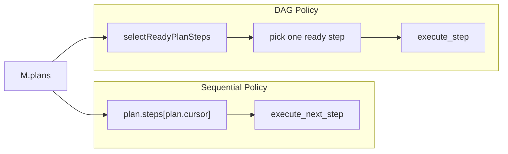

# Spec: Plan Graph Helpers (Phase 2)

## Status

Implemented after Phase 1 (`specs/plan-schema.md`).
`adr/0002-graph-helpers-ignore-cursor.md` is **Accepted**.

This spec is the implementation contract for that ADR.

## Goal

Give agents **pure, deterministic, structured** functions over a Plan graph:

- validate (structured codes, no thrown strings);
- ready / blocked pending steps;
- direct dependants and transitive ancestors / descendants.

The originating request
(`apps/docs/todo/done/improvements-planning-dependencies-etc.md` §4) wanted this
so DAG agents can see multiple ready steps, repair can see fan-out, and
tests can assert the graph. It also wanted a `scheduling` mode on `Plan` and
an optional `cursor`. We do **not** add that mode (ADR 0002).

These helpers are a library. They are not a loop phase, not a scheduler, and
not a new writer of `MentalState`.

## Why this shape

| Request want | Phase 2 answer |
|---|---|
| `validatePlanGraph` with structured codes | Yes. Wraps `PlanSchema.safeParse`; same walk as Phase 1 |
| `selectReadyPlanSteps` / `selectBlockedPlanSteps` | Yes. `dependsOn` + step `status` only |
| `getPlanDependants` / `getPlanAncestors` / `getPlanDescendants` | Yes. Missing `stepId` is `PLAN_STEP_NOT_FOUND`, not `[]` |
| `scheduling: sequential \| dependencies` | **No.** One Plan type; callers choose cursor vs helpers |
| Optional `cursor` | **No.** Cursor stays required (ADR 0001) |
| `selectRunnablePlanSteps({ requireValidatedDependencies })` | **No** until Phase 3 puts `validation` on the schema |
| Loop uses helpers as a DAG scheduler | **No.** Policy still emits one intent per turn |

## Prerequisites

Phase 1 is implemented:

- `dependsOn` on `PlanStep`;
- `PlanSchema` superRefine rejects missing / self / cycle / duplicate step
  ids using file-local `collectPlanGraphIssues`;
- error codes `PLAN_DUPLICATE_STEP_ID`, `PLAN_DEPENDENCY_MISSING`,
  `PLAN_DEPENDENCY_SELF`, `PLAN_DEPENDENCY_CYCLE`,
  `PLAN_CURSOR_OUT_OF_BOUNDS`.

Phase 2 **exports** that walk through `validatePlanGraph`. It MUST NOT copy
the cycle algorithm into a second file.

## APLRET ownership

| Concern | Owner |
|---|---|
| Graph queries | Pure helpers; anyone may call, including Policy (sync, `M` only) |
| Choose which ready step to run | Policy — one intent per turn |
| Write step status / `dependsOn` | Learning only |
| Dispatch the effect | Execution |
| `execute_step` intent | Phase 4 — **not this spec** |

Helpers never read `env`, `ctx`, stage, durable memory, or `plan.meta`.

Calling a helper from Policy is still Policy-pure: the argument is a `Plan`
already in `M.plans`. Calling a helper does not write `M`.



## Module home and exports

New file: `packages/core/src/plans/planGraph.ts`.

Named-export from `packages/core/src/index.ts` (same style as `IntentSchema`;
do not `export *`):

- functions: `validatePlanGraph`, `selectReadyPlanSteps`,
  `selectBlockedPlanSteps`, `getPlanDependants`, `getPlanAncestors`,
  `getPlanDescendants`
- schemas: `PlanGraphIssueSchema`, `PlanGraphErrorCodeSchema`
- types: `PlanGraphIssue`, `PlanGraphErrorCode`, `ValidatePlanGraphResult`,
  `PlanGraphLookup`

Keep `collectPlanGraphIssues` as the **one** walk. Either:

- leave it in `plan.ts` and import it from `planGraph.ts`, or
- move it next to the helpers and have `PlanSchema.superRefine` import it.

It MAY be a package-internal export from `plan.ts`. It MUST NOT appear on
the `@a2arium/callagent-core` public index. The public name is
`validatePlanGraph` only.

## Error codes

Closed enum, Zod-first (`types-rules.md` Rule 2):

```ts
export const PlanGraphErrorCodeSchema = z.enum([
  'PLAN_DUPLICATE_STEP_ID',
  'PLAN_DEPENDENCY_MISSING',
  'PLAN_DEPENDENCY_SELF',
  'PLAN_DEPENDENCY_CYCLE',
  'PLAN_CURSOR_OUT_OF_BOUNDS',
  'PLAN_SCHEMA_INVALID',
  'PLAN_STEP_NOT_FOUND',
]);
```

`PLAN_SCHEMA_INVALID` covers Zod failures that are not the graph codes
(missing `title`, extra `result`, bad `intent`, …).

`PLAN_ACTIVE_ID_MISSING` stays on `PlanStateSchema` only. `validatePlanGraph`
validates a **Plan**, not `PlanState`.

Do **not** add `PLAN_DEPENDENCY_DUPLICATE` here. Duplicate ids inside one
step’s `dependsOn` list are **accepted** as one edge (Phase 1 uniquify).
`validatePlanGraph` of that Plan is `ok: true`. Do not map the duplicate
list to `PLAN_SCHEMA_INVALID`.

```ts
export const PlanGraphIssueSchema = z.object({
  errorCode: PlanGraphErrorCodeSchema,
  message: z.string().min(1),
  path: z.array(z.union([z.string(), z.number()])).optional(),
  stepId: z.string().min(1).optional(),
}).strict();
```

No unstructured `throw new Error('cycle')`. Query helpers do not throw.

## `validatePlanGraph`

```ts
export type ValidatePlanGraphResult =
  | { ok: true; plan: Plan }
  | { ok: false; errors: PlanGraphIssue[] };

export function validatePlanGraph(input: unknown): ValidatePlanGraphResult
```

Behavior:

1. `PlanSchema.safeParse(input)`.
2. On success: `{ ok: true, plan }`. Graph issues cannot appear; parse
   already ran the same walk.
3. On failure: map each Zod issue to `PlanGraphIssue`:
   - if `issue.params.errorCode` is a `PlanGraphErrorCode` (other than
     `PLAN_SCHEMA_INVALID` / `PLAN_STEP_NOT_FOUND`), use it;
   - else `PLAN_SCHEMA_INVALID`.
4. `errors` is non-empty when `ok: false`. Stable order: Zod issue order.

This is the agent-facing API so Learning does not dig through `ZodError`.
Default Perception may keep calling `PlanSchema.parse` directly (Phase 1).
Both MUST agree on codes for missing / self / cycle / duplicate step id.

Do not accept a pre-parsed `Plan` overload that skips schema checks. One
function, `unknown` in. Never throw.

## Readiness (DAG, ignores cursor)

A dependency is **satisfied** iff that step’s `status === 'completed'`.

Not satisfied: `pending`, `running`, `failed`, `skipped`.

Rationale: `skipped` means the work was not done; downstream must not
silently proceed. Learning can rewrite `dependsOn` or mark downstream
`skipped` on a repair. `failed` is the same. Phase 3 may add
`validation.status === 'valid'` as an extra gate; **this phase does not**.

Duplicate ids in one step’s `dependsOn` list: treat as **one edge** for
readiness. Phase 1 **accepts** that list (`dependsOn: ['A', 'A']` parses).
Do not fail readiness because of duplicates.

Omitted `dependsOn` and `dependsOn: []` are equivalent (Phase 1).

A step is **ready** iff:

- `status === 'pending'`;
- every id in `dependsOn` (uniqued) is satisfied.

A step is **blocked** iff:

- `status === 'pending'`;
- it is not ready.

`running` / `completed` / `failed` / `skipped` are neither ready nor
blocked.

Helpers **ignore**:

- `plan.cursor`
- `plan.status` (`stale` / `cancelled` / `failed` still have a graph)
- `plan.revision`
- `plan.meta` / step `meta` / `intent` (missing intent does not block
  readiness; Execution still must not invent an intent — Phase 1)

Policy MUST check `plan.status` before executing. The helper will happily
return ready steps on a `cancelled` plan.

Query helpers take a `Plan` (already parsed). They do **not** re-run cycle
detection. If a caller mutates a plan after parse (Policy must not):

- missing / unsatisfied deps → the step is blocked, not thrown;
- ancestor / descendant walks MUST use a visited set so a cycle cannot hang.

### `selectReadyPlanSteps` / `selectBlockedPlanSteps`

```ts
export function selectReadyPlanSteps(plan: Plan): readonly PlanStep[]
export function selectBlockedPlanSteps(plan: Plan): readonly PlanStep[]
```

- Input is a `Plan`. Do not re-parse on each call.
- Return steps in **`plan.steps` array order** (stable, deterministic).
- Do not return copies with mutated status. Same object references as
  `plan.steps` entries is fine; callers must not mutate them (Policy is
  read-only anyway).
- Empty `steps` → both `[]`.
- Cursor-only plan (no `dependsOn` on any step): **every pending step is
  ready**. Sequential Policy uses `cursor`, not this helper (ADR 0002).

No `options` argument in Phase 2. Do **not** add
`requireValidatedDependencies` here. Phase 3b
(`specs/plan-validation-and-lineage.md`) extends the signature when
`validation` exists on the schema. Adding a no-op or a trap flag now is
forbidden.

Do not export `selectRunnablePlanSteps` as a second name.

### Lookups by step id

```ts
export type PlanGraphLookup<T> =
  | { ok: true; value: T }
  | { ok: false; errors: PlanGraphIssue[] };

export function getPlanDependants(plan: Plan, stepId: string): PlanGraphLookup<readonly PlanStep[]>
export function getPlanAncestors(plan: Plan, stepId: string): PlanGraphLookup<readonly PlanStep[]>
export function getPlanDescendants(plan: Plan, stepId: string): PlanGraphLookup<readonly PlanStep[]>
```

If `stepId` is not in `plan.steps`: `{ ok: false, errors: [{ errorCode:
'PLAN_STEP_NOT_FOUND', message, stepId }] }`. Include `stepId` on the issue
only when the argument is a non-empty string (`PlanGraphIssueSchema.stepId`
is `min(1)`). Do not throw. Do not return `{ ok: true, value: [] }` for a
missing id (that collides with “no dependants”).

A present step with no dependants / ancestors / descendants: `{ ok: true,
value: [] }`.

| Helper | Meaning | Includes `stepId` itself? |
|---|---|---|
| `getPlanDependants` | Direct: `dependsOn` contains `stepId` | No |
| `getPlanAncestors` | Transitive dependencies | No |
| `getPlanDescendants` | Transitive dependants | No |

Returned steps: unique, **`plan.steps` array order** (not BFS discovery
order). Diamond `A→B, A→C, B→D, C→D`: ancestors of `D` are `[A, B, C]` if
that is steps order.

## What Policy does with multiple ready steps

Returning `[A, B]` does **not** mean both run this turn.

DAG Policy is **implemented** (`execute_step` in Phase 4). Policy that
wants DAG semantics:

- calls `selectReadyPlanSteps` over `M.plans` (still only `M`);
- picks **one** ready step;
- emits `execute_step { planId, stepId }`.

Sequential Policy keeps `cursor` + `execute_next_step`. Helpers are also
fine for tests, UI, or Learning repair. One intent per turn.

Do not add a core Policy that picks `ready[0]` and mutates cursor. Do not
change default `loopRunner` Policy.

Learning MAY use descendants to decide which steps to patch on failure
(still via `writer.plans.updateStep`, still next-turn visible).

## Tests

New file: `packages/core/tests/planGraph.test.ts`. Helpers are a new module;
do not dump these cases into `planning.model.test.ts`. Follow
`.cursor/rules/jest_esm_testing.mdc`: `import { describe, it, expect } from
'@jest/globals'` and `.js` import specifiers.

Every **valid** fixture MUST be built as a plain object and passed through
`PlanSchema.parse` before query helpers. Invalid fixtures go only to
`validatePlanGraph(unknown)`.

### `validatePlanGraph`

Accept:

- empty steps;
- linear `A → B → C` (`B.dependsOn = ['A']`, …);
- two independent pending steps;
- `dependsOn: ['A', 'A']` when `A` exists (`ok: true`, one edge);
- same codes as `PlanSchema.safeParse` for missing / self / cycle /
  duplicate step id (assert `errorCode` equality, not message text).

Reject (`ok: false`):

- missing dependency → `PLAN_DEPENDENCY_MISSING`
- self dependency → `PLAN_DEPENDENCY_SELF`
- cycle `A→B→C→A` → `PLAN_DEPENDENCY_CYCLE`
- duplicate step ids → `PLAN_DUPLICATE_STEP_ID`
- leftover `description` / missing `title` → `PLAN_SCHEMA_INVALID`
- cursor out of bounds → `PLAN_CURSOR_OUT_OF_BOUNDS`

MUST NOT throw. Assert with `expect(() => validatePlanGraph(x)).not.toThrow()`
on the reject fixtures as well as the accept fixtures.

### Ready / blocked

Fixture: `A` and `B` pending, no deps; `C` pending, `dependsOn: ['A','B']`.

- ready = `[A, B]` in steps order;
- blocked = `[C]`.

Complete `A` (parse a new plan object; do not mutate):

- ready = `[B]`;
- blocked = `[C]`.

Complete `A` and `B`:

- ready = `[C]`;
- blocked = `[]`.

`C` running: ready `[]`, blocked `[]` (for `C`; `A`/`B` already completed
are neither).

`A` failed, `B` pending, `C` depends on `A`:

- `C` blocked;
- `B` ready if it has no deps.

`A` skipped: `C` still blocked.

`A` running: `C` still blocked.

Omitted `dependsOn` vs `[]` on a pending step: both ready.

Cursor-only three pending steps, no `dependsOn`, `cursor: 0`:

- ready = all three pending steps;
- blocked = `[]`.
- Test name MUST say sequential Policy still uses `cursor`.

Cancelled plan with one pending independent step: helper still returns it
ready. Test name: helpers ignore `plan.status`.

Same for `stale` / `failed` plan status.

Duplicate `dependsOn: ['A', 'A']` on `B`: `B` is ready iff `A` is
completed (one edge). Build this fixture through `PlanSchema.parse`
(Phase 1 accepts the duplicate list).

### Lookups

- dependants of `A` where `B` and `C` list `A`: `{ ok: true, value: [B, C] }`
  in steps order;
- a present step with no dependants: `{ ok: true, value: [] }`;
- ancestors of `C` in `A→B→C`: `[A, B]` in steps order;
- descendants of `A`: `[B, C]`;
- diamond uniqueness: `A→B, A→C, B→D, C→D` → ancestors of `D` unique;
- missing `stepId`: `ok: false`, `PLAN_STEP_NOT_FOUND`;
- self not included in ancestors / descendants / dependants.

### Type tests

Add cases to `packages/core/tests/plan.types.test-d.ts` (do not create a
second tsd file; Phase 1 already adds this file):

- `selectReadyPlanSteps` accepts `Plan` and returns `readonly PlanStep[]`;
- `validatePlanGraph` accepts `unknown`;
- `ValidatePlanGraphResult` is a discriminated `{ ok: true } | { ok: false }`;
- `PlanGraphLookup` is the same `ok` discriminant.

### Loop / default Policy

No new turn-script requirement in Phase 2 except: existing default
`create_plan` stub path still works (Phase 1 test). Do **not** add a core
test that default Policy calls `selectReadyPlanSteps`.

If a test fails because it imported a private `collectPlanGraphIssues`:
stop putting it on the public index; use `validatePlanGraph`.

### Known regression review

There are **no** current callers of graph helpers (they do not exist).
`packages/core/tests/planning.model.test.ts` is the only Plan fixture file
today; Phase 1 rewrites it. Phase 2 must not loosen those schema cases.

| Failure | Action |
|---|---|
| Phase 1 schema tests disagree on error codes with `validatePlanGraph` | Fix mapping; do not invent a second walk |
| `Observation` / `Plan` type changes from Phase 1 | Already owned by Phase 1; implement this spec **after** that PR, or in a follow-up on the same branch |
| Default Policy tests suddenly expect DAG | Do not change default Policy |
| Export surface / `tsd` of public index | Add new named exports; do not remove Phase 1 exports |
| Phase 1 `planning.model.test.ts` red | Fix Phase 1 first; do not skip schema tests to ship helpers |
| Unrelated red tests | Do not loosen helper semantics |

Run `yarn test` and `yarn test:types` in `packages/core`.

## Docs to update in the **same change set** as the helpers

Permanent docs still describe the **pre-Phase-1** Plan until Phase 1 lands.
When this code ships, rewrite the sentences below so helpers and cursor
coexist. If Phase 1 already shipped with “readiness helpers are Phase 2”,
replace that hedge in the same PR as the helpers.

| Doc | What to change |
|---|---|
| `apps/docs/0-aplret_contracts.md` | Planning model: sequential Policy uses `cursor`; DAG Policy uses helpers over `M.plans`. Helpers are not a new APLRET phase. One intent per turn even when several steps are ready. Invalid graphs: schema + `validatePlanGraph` codes. Keep Learning as the only plan writer. |
| `apps/docs/8-spec_goals_and_plans_in_aplret.md` | Replace “Policy MUST rely solely on the plan's `cursor` and `status` in `MentalState`.” Sequential: `cursor` + `status`. DAG: `selectReadyPlanSteps` / `selectBlockedPlanSteps` over `M.plans` (still only `M`; still not stage/`ctx`/`env`). Add the satisfied-dependency rule (`completed` only). Point at the exported helpers. Sequential exhaustion (`cursor === steps.length`) stays a sequential invariant, not a DAG one. |
| `apps/docs/9-how_to_implement_planning_without_breaking_policy_purity.md` | Show both patterns: cursor `execute_next_step` vs helper-informed Policy. Warn: cursor-only plans look “all pending ready” to the helper. Do not emit two intents. Note `execute_step` is Phase 4; until then DAG Policy cannot name a step in core Intent. `validatePlan` for Learning writes remains `PlanSchema` / `validatePlanGraph`. |
| `apps/docs/3-how_to_keep_policy_pure.md` | Case 5: Policy MAY call these helpers; they are pure functions of `M.plans`, not `ctx`/`env`/durable memory. Do not replace Case 5’s `create_plan` / `execute_next_step` example with a scheduler. |
| `apps/docs/11-how_to_test_aplret_agents.md` | One short subsection: graph helpers are unit-tested in `planGraph.test.ts` with `PlanSchema.parse` fixtures; they are not a substitute for turn scripts. |
| `apps/docs/migration/plan-schema-one-truth.md` | If Phase 1 migration already shipped, add a follow-up note that helpers ignore `cursor` and that `scheduling` was not added. If the same release, mention helpers in that file. No new dual Plan shape. |

Do **not** rewrite:

- originating request doc;
- historical 3.1 notes (`apps/docs/migration/done/3.1-planning-model-migration.md`,
  `apps/docs/todo/done/next-phase-better-readability/3.1-planning-model.md`);
- Phase 3–6 specs except to say this API has no options bag yet;
- drafts under `apps/docs/drafts/`.

## Out of scope

- `Plan.scheduling` / optional `cursor`
- `execute_step`
- `requireValidatedDependencies` / `selectRunnablePlanSteps`
- Changing default `loopRunner` Policy or `create_plan` stub
- Parallel Policy intents / Execution fan-out from the helper
- Operator UI graph (may consume helpers later)
- Mutating plans / invalidating descendants automatically
- Parsing inside `MemoryWriter`
- Inferring sequential mode from “no `dependsOn` anywhere”

## Acceptance

- `validatePlanGraph` never throws; codes match Phase 1 schema issues.
- Ready/blocked/lookup cases in Tests pass; order is `plan.steps` order.
- Helpers ignore `cursor` and `plan.status`.
- `skipped` / `failed` / `running` dependencies do not satisfy downstream.
- Default Policy still sequential.
- Listed permanent docs agree with this spec.
- `yarn test` and `yarn test:types` in `packages/core` are green.

## Implementation order

1. Share `collectPlanGraphIssues` with `validatePlanGraph` (move if needed).
2. Implement ready/blocked/lookup in `plans/planGraph.ts` (visited set on
   transitive walks).
3. Named-export from `index.ts`.
4. `planGraph.test.ts` + tsd cases in `plan.types.test-d.ts`.
5. Rewrite the permanent docs in the table above.
6. Full core `yarn test` + `yarn test:types`.
