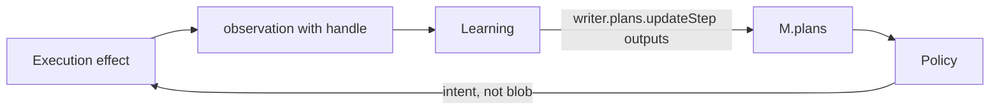

# Spec: Plan Output Refs (Phase 3a)

## Status

Implemented after Phase 1 (`specs/plan-schema.md`).
May land in the same PR as `specs/plan-validation-and-lineage.md`.
`adr/0003-step-outputs-are-references.md` is **Accepted**.

Phase 2 helpers are not a prerequisite. Output refs do not change
readiness.

## Goal

Let a completed step point at **compact handles** for what it produced,
so downstream steps, repair, and traces can follow

```text
step → output ref → artifact / memory / evidence
```

without storing the payload in `M.plans`.

This is the originating request’s §6, implemented with the artifact rule
already in `apps/docs/7-how_to_use_artifacts_correctly_aplret.md`.

## Why this shape

| Request want | Phase 3a answer |
|---|---|
| `outputs?: PlanOutputRef[]` | Yes, on `PlanStep` |
| `kind: artifact \| memory \| evidence \| value` | **No `value`.** That is a payload backdoor (`ref` would hold JSON). Tiny scalars go in `worldModel` / scratch, or behind an `evidence` / `memory` id |
| Parallel `resultRefs` / `evidenceRefs` / `artifactRefs` | **No.** One array, discriminated `kind` |
| Auto-copy tool results into the plan | **No.** Learning writes `outputs` after it knows the handle |
| Restore `PlanStep.result` | **No.** Phase 1 removed it; `.strict()` keeps it gone |

## APLRET ownership

| Concern | Owner |
|---|---|
| Schema | `PlanStepSchema` in `types/plan.ts` |
| Write `outputs` | Learning only (`updateStep` / plan replace) |
| Produce the artifact / memory row | Execution (effect) or Learning (durable write) |
| Await / hydrate a large artifact | Learning if it changes cognition; Execution if needed only to act; **never Policy** |
| Choose the next step from refs | Policy reads `M` (the refs, not the blobs) |



## Normative schema

Home: `packages/core/src/types/plan.ts` (same file as Phase 1). Types
inferred from Zod. `.strict()`.

```ts
export const PlanOutputKindSchema = z.enum([
  'artifact',
  'memory',
  'evidence',
]);

export const PlanOutputRefSchema = z.object({
  name: z.string().min(1).optional(),
  kind: PlanOutputKindSchema,
  ref: z.string().min(1),
}).strict();
```

Add to `PlanStepSchema` (optional, default omitted):

```ts
outputs: z.array(PlanOutputRefSchema).optional(),
```

| Field | Rule |
|---|---|
| `kind` | Closed. `artifact` = artifact handle id; `memory` = durable memory id (semantic/episodic/procedural as the agent defines); `evidence` = observation / correlation id that is not necessarily durable memory |
| `ref` | Non-empty string. **Not** JSON. **Not** a base64 blob. Do not constrain UUID shape — artifact ids in this repo are not one format |
| `name` | Optional local binding (`"page"`, `"summary"`). When set, unique within that step’s `outputs` |

`PlanStepSchema` superRefine (file-local, next to graph issues):

| `params.errorCode` | Condition |
|---|---|
| `PLAN_OUTPUT_NAME_DUPLICATE` | Two outputs on the same step share a non-empty `name` |

Omitted `outputs` and `[]` are equivalent.

Do not add `payload`, `bytes`, `json`, or `value` fields. `.strict()`
rejects them.

`PlanStepUpdatedPayloadSchema.patch` already uses
`PlanStepSchema.partial().omit({ id: true })`, so `outputs` patches flow
through Phase 1 without a new observation kind.

## Size and snapshots

Refs must survive JSON snapshot / resume (ISO strings, JSON meta, string
refs). A test that round-trips `PlanSchema.parse` through
`JSON.parse(JSON.stringify(plan))` MUST keep `outputs`.

Do not cap array length in Zod. Docs: keep the list small; extra
provenance belongs in an artifact sidecar, not on the step.

## Default loop behavior

- Default `create_plan` stub still has empty `steps` — no outputs.
- Default Learning does **not** invent `outputs` from tool/child
  payloads. Agents that want provenance write them.
- Default Perception still replaces invalid plan.* with
  `internal/validation.failed` (Phase 1). A leftover `result` field on a
  step remains invalid.

## Tests

Extend `packages/core/tests/planning.model.test.ts` (schema truth stays
in one file). Add tsd cases to `plan.types.test-d.ts`.

Accept:

- omitted `outputs`;
- `outputs: []`;
- `{ kind: 'artifact', ref: 'art_1' }`;
- `{ name: 'page', kind: 'artifact', ref: 'art_1' }`;
- `{ kind: 'memory', ref: 'sem:user-prefs' }`;
- `{ kind: 'evidence', ref: 'obs_turn_4' }`;
- two outputs with different names.

Reject:

- `kind: 'value'`;
- extra `payload` / `result` on the ref or the step;
- empty `ref`;
- duplicate `name` on one step;
- non-JSON in `ref` (object / array — Zod string fails).

Snapshot/resume: parse → `JSON.stringify` → parse; `outputs` equal.

Do not add a turn-script requirement that default Learning writes
outputs. If a fixture still uses `result`, **update the fixture** (Phase
1 rule); do not restore `result` because an output-ref test is easier.

### Known regression review

| Failure | Action |
|---|---|
| Phase 1 leftover-`result` tests fail | Keep rejecting `result`; this spec does not replace it with `value` |
| Observation payload narrowing | Fix call sites; do not untype plan kinds |
| Artifact tests that stuffed blobs into plans | Move to handles + `outputs` |
| Unrelated red tests | Do not loosen `.strict()` |

Run `yarn test` and `yarn test:types` in `packages/core`.

## Docs to update in the **same change set** as the schema fields

| Doc | What to change |
|---|---|
| `apps/docs/0-aplret_contracts.md` | PlanStep public type: optional `outputs`. Planning model: step results are refs, not blobs. |
| `apps/docs/8-spec_goals_and_plans_in_aplret.md` | Data model + a short “outputs are handles” note. Point at the artifact how-to. |
| `apps/docs/9-how_to_implement_planning_without_breaking_policy_purity.md` | After a tool/child completes, Learning writes `outputs` with the handle; Policy never awaits the artifact. |
| `apps/docs/7-how_to_use_artifacts_correctly_aplret.md` | One subsection: plan steps store `PlanOutputRef`, not inline tool JSON. |
| `apps/docs/migration/plan-schema-one-truth.md` | `result` was removed in Phase 1; this is the replacement. Do not put blobs in `meta`. |

Do **not** rewrite the originating request or historical 3.1 notes.

## Out of scope

- `kind: 'value'`
- `PlanStep.result`
- Validation state / lineage (sibling spec)
- `requireValidatedDependencies`
- Hydrating artifacts in Policy
- Auto-populating `outputs` in default Learning
- Operator UI graph

## Acceptance

- `PlanSchema` accepts the Accept fixtures and rejects the Reject
  fixtures.
- `JSON` round-trip preserves `outputs`.
- Permanent docs listed above agree.
- Phase 1 leftover-`result` rejects still fail.
- `yarn test` and `yarn test:types` in `packages/core` are green.

## Implementation order

1. Add `PlanOutputRefSchema`; attach `outputs` on `PlanStepSchema`.
2. Duplicate-name superRefine.
3. Export from `index.ts`.
4. Schema + tsd tests + JSON round-trip.
5. Rewrite the docs in the table.
6. Full core `yarn test` + `yarn test:types`.
